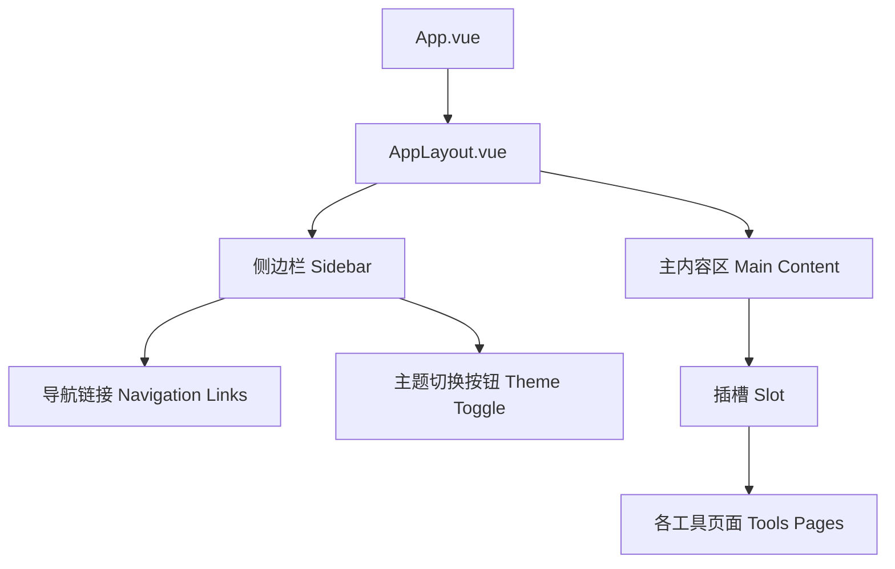
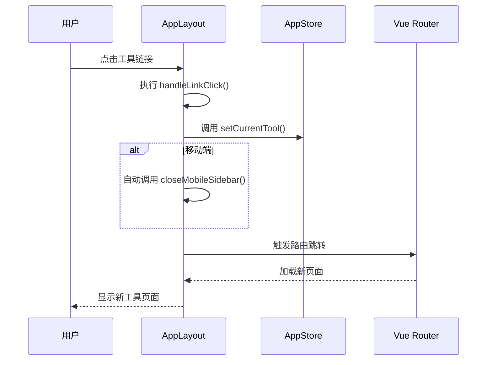
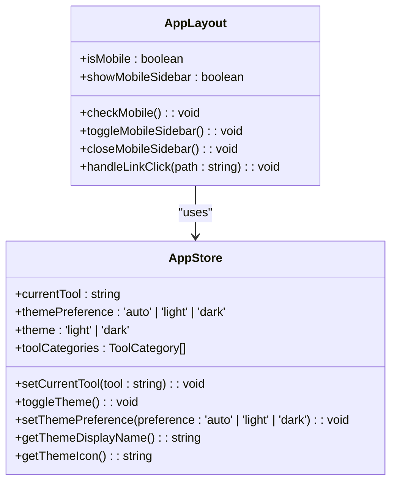
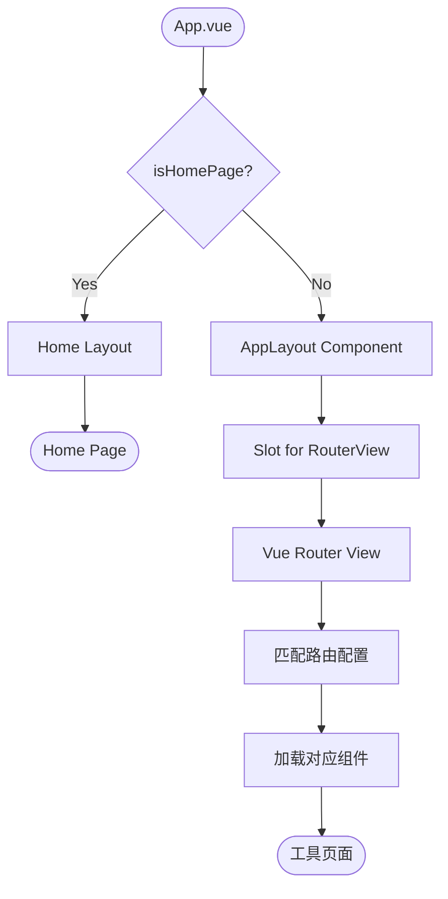

# AppLayout 主布局组件

<cite>
**Referenced Files in This Document**
- [AppLayout.vue](file://src/components/AppLayout.vue)
- [app.ts](file://src/stores/app.ts)
- [base.css](file://src/assets/base.css)
- [main.css](file://src/assets/main.css)
- [App.vue](file://src/App.vue)
- [index.ts](file://src/router/index.ts)
</cite>

## Table of Contents
1. [核心职责与架构概览](#核心职责与架构概览)
2. [侧边栏导航与响应式设计](#侧边栏导航与响应式设计)
3. [主题切换功能实现](#主题切换功能实现)
4. [全局状态管理与Pinia集成](#全局状态管理与pinia集成)
5. [CSS变量与视觉设计](#css变量与视觉设计)
6. [组件挂载与Vue Router集成](#组件挂载与vue-router集成)

## 核心职责与架构概览

`AppLayout.vue` 作为程序的主界面容器，承担着整个应用的骨架布局职责。它通过一个清晰的三部分结构（侧边栏、顶部工具栏和主内容区）为所有工具页面提供一致的用户体验。

该组件的核心职责是协调用户界面的各个组成部分，确保在不同设备上都能提供流畅的交互体验。其架构设计遵循了现代单页应用（SPA）的最佳实践，将布局逻辑与业务逻辑分离，使得各工具页面可以专注于自身的功能实现，而无需关心整体的页面结构。

**Diagram sources**
- [AppLayout.vue](file://src/components/AppLayout.vue#L1-L50)
- [App.vue](file://src/App.vue#L1-L10)

**Section sources**
- [AppLayout.vue](file://src/components/AppLayout.vue#L1-L545)

## 侧边栏导航与响应式设计

### 桌面端与移动端的不同表现

`AppLayout.vue` 组件实现了高度自适应的响应式布局，能够根据屏幕尺寸自动调整其行为模式。

在桌面端，侧边栏以固定宽度（280px）常驻于屏幕左侧，为用户提供持续可见的导航入口。而在移动端（屏幕宽度小于等于768px），侧边栏默认处于隐藏状态，仅显示一个位于左上角的菜单按钮（☰）。用户点击此按钮后，侧边栏会从左侧滑出，并伴随一个半透明的遮罩层，以防止用户误操作背景内容。

这种设计充分利用了有限的移动屏幕空间，同时保证了导航功能的可访问性。遮罩层的交互逻辑也经过精心设计：点击遮罩层即可关闭侧边栏，这符合用户的直觉操作习惯。

### 导航交互流程

侧边栏内的导航链接均使用 `RouterLink` 组件实现，确保了路由跳转的平滑性和性能。当用户点击某个工具链接时，会触发 `handleLinkClick` 方法，该方法不仅会更新当前选中的工具状态，还会在移动端环境下自动关闭侧边栏，从而完成一次完整的导航交互闭环。

**Diagram sources**
- [AppLayout.vue](file://src/components/AppLayout.vue#L150-L200)
- [app.ts](file://src/stores/app.ts#L90-L120)

**Section sources**
- [AppLayout.vue](file://src/components/AppLayout.vue#L150-L250)

## 主题切换功能实现

### 动态类名绑定

`AppLayout.vue` 组件通过 Pinia 的 `useAppStore` 实现了动态的主题切换功能。主题切换按钮绑定了 `appStore.toggleTheme` 方法，每次点击都会循环切换三种模式：跟随系统、浅色模式和深色模式。

为了支持这一功能，组件利用 CSS 类名绑定机制，在根元素上动态添加或移除 `dark` 类。当 `dark` 类存在时，应用将启用深色主题的样式规则。这种基于类名的切换方式简单高效，且易于维护。

### CSS 变量机制

主题的视觉效果主要依赖于 CSS 变量（Custom Properties）来实现。`base.css` 文件中定义了一套完整的语义化颜色变量，如 `--color-background`、`--color-text` 和 `--color-primary` 等。这些变量在不同的主题下会被赋予不同的实际值。

例如，在浅色模式下，`--color-background` 的值为 `var(--vt-c-white)`，即白色；而在深色模式下，它被重新定义为 `var(--vt-c-black)`，即黑色。这种方式使得主题切换只需更改少数几个变量的值，就能全局性地改变整个应用的外观。

**Diagram sources**
- [AppLayout.vue](file://src/components/AppLayout.vue#L100-L150)
- [app.ts](file://src/stores/app.ts#L90-L305)

**Section sources**
- [AppLayout.vue](file://src/components/AppLayout.vue#L100-L150)
- [app.ts](file://src/stores/app.ts#L90-L305)

## 全局状态管理与Pinia集成

### AppStore 状态管理

`AppLayout.vue` 组件通过 `useAppStore()` 钩子函数与 Pinia 的 `app` store 建立连接，实现了对全局状态的集中管理。`AppStore` 中维护了多个关键状态：

- **当前选中工具 (`currentTool`)**：记录用户当前正在使用的工具，用于高亮对应的导航项。
- **主题偏好 (`themePreference`)**：存储用户选择的主题模式（自动、浅色、深色）。
- **工具分类列表 (`toolCategories`)**：包含所有可用工具的元数据，如名称、路径和描述，供侧边栏动态渲染。

这些状态的变更会自动触发视图的更新，确保了UI与数据的一致性。

### 状态持久化

`AppStore` 还实现了状态的本地持久化。用户的主题偏好会被保存到 `localStorage` 中，键名为 `developer-tools-theme-preference`。这意味着即使用户刷新页面或关闭浏览器，其选择的主题设置也能得以保留，提升了用户体验。

此外，`AppStore` 还监听了系统的暗色模式变化（通过 `window.matchMedia('(prefers-color-scheme: dark)')`），当用户选择“跟随系统”模式时，应用会自动同步系统主题，实现了无缝的跨平台体验。

**Section sources**
- [app.ts](file://src/stores/app.ts#L1-L305)

## CSS变量与视觉设计

### base.css 与 main.css 的协同工作

项目的视觉设计由 `base.css` 和 `main.css` 两个文件共同构建。`base.css` 作为基础样式文件，定义了项目的核心设计语言，包括：

- **现代化配色方案**：通过 `:root` 定义了一系列基础颜色变量（如 `--vt-c-green`）和语义化颜色变量（如 `--color-primary`）。
- **间距与圆角**：统一了 `--spacing-*` 和 `--radius-*` 系列变量，确保了UI元素间的一致性。
- **阴影效果**：提供了从 `--shadow-sm` 到 `--shadow-xl` 的多级阴影，增强了界面的层次感。

`main.css` 则在此基础上引入了 `base.css`，并定义了具体的UI组件样式，如按钮（`.btn`）、输入框（`.input`）和卡片（`.card`）等。这种分层设计使得样式表结构清晰，易于扩展和维护。

### BEM命名规范的应用

在 `main.css` 中，广泛采用了BEM（Block Element Modifier）命名规范。例如，`.btn` 是块（Block），`.btn-primary` 是修饰符（Modifier），表示主要按钮的变体。这种命名方式避免了样式冲突，提高了代码的可读性和可维护性。

同时，`AppLayout.vue` 的模板中也体现了类似的命名思想，如 `.sidebar-header`、`.tool-link` 和 `.link-arrow` 等类名，都清晰地表达了其在组件中的角色和层级关系。

**Section sources**
- [base.css](file://src/assets/base.css#L1-L253)
- [main.css](file://src/assets/main.css#L1-L326)

## 组件挂载与Vue Router集成

### 在 App.vue 中的挂载方式

`AppLayout.vue` 并非在所有页面都直接使用。在 `App.vue` 中，通过一个计算属性 `isHomePage` 来判断当前是否为首页。如果是首页，则使用一个简化的 `home-layout`；否则，将所有其他页面的内容包裹在 `<AppLayout>` 组件内。

这种设计允许首页拥有独特的全屏布局，而其他工具页面则共享统一的侧边栏导航结构，既保证了灵活性，又维持了整体一致性。

### 与 Vue Router 的集成

`AppLayout.vue` 与 Vue Router 的集成非常紧密。侧边栏中的每一个 `RouterLink` 都对应着 `router/index.ts` 文件中定义的一个路由。当用户点击链接时，Vue Router 会负责加载相应的组件，并将其插入到 `<slot />` 插槽中。

`router/index.ts` 文件中定义了所有工具页面的路由配置，每个路由都包含了路径、名称、组件和元信息（meta）。元信息中的 `title` 字段会在路由守卫中被用来动态更新页面标题，这对于SEO和用户体验都至关重要。

**Diagram sources**
- [App.vue](file://src/App.vue#L1-L35)
- [index.ts](file://src/router/index.ts#L1-L146)

**Section sources**
- [App.vue](file://src/App.vue#L1-L35)
- [index.ts](file://src/router/index.ts#L1-L146)