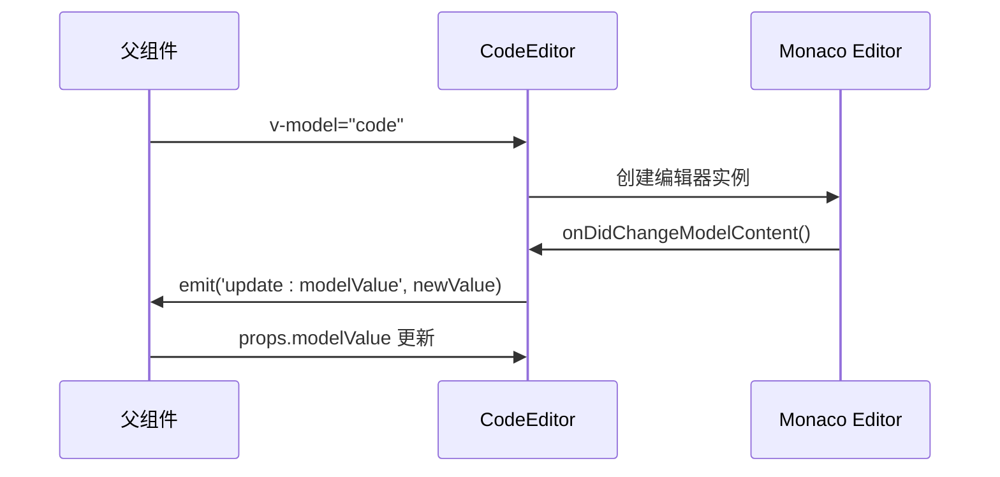
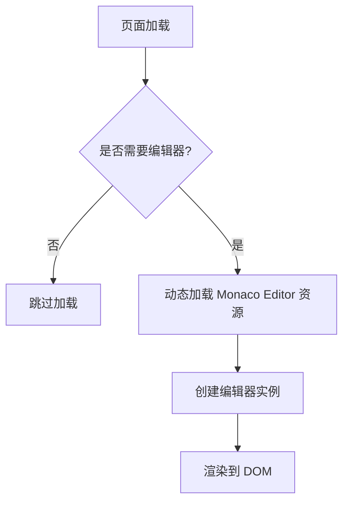
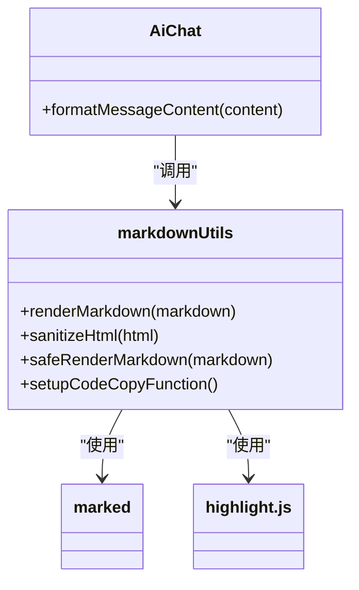
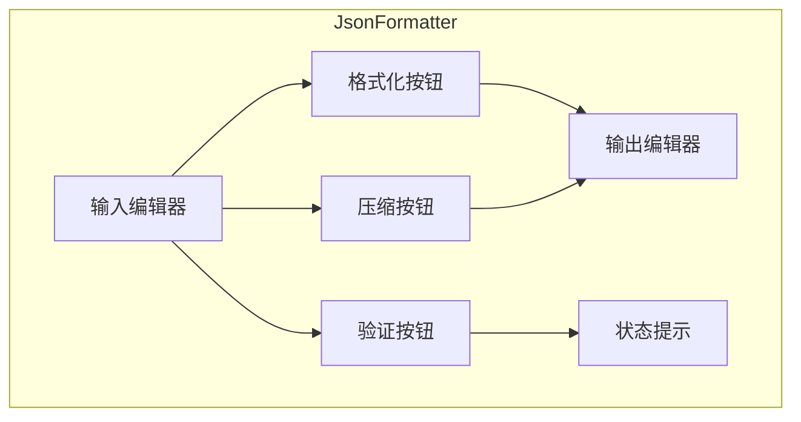

# CodeEditor 代码编辑器组件

<cite>
**本文档引用的文件**   
- [CodeEditor.vue](file://src/components/CodeEditor.vue)
- [markdownUtils.ts](file://src/utils/markdownUtils.ts)
- [vite.config.ts](file://vite.config.ts)
- [AiChat.vue](file://src/views/ai/AiChat.vue)
- [JsonFormatter.vue](file://src/views/json/JsonFormatter.vue)
</cite>

## 目录
1. [简介](#简介)
2. [核心封装策略](#核心封装策略)
3. [属性与事件机制](#属性与事件机制)
4. [资源按需加载与性能优化](#资源按需加载与性能优化)
5. [基础编辑功能配置](#基础编辑功能配置)
6. [Markdown 渲染支持](#markdown-渲染支持)
7. [Vite 构建协作](#vite-构建协作)
8. [实际集成用例](#实际集成用例)
9. [自定义主题与字体调节](#自定义主题与字体调节)
10. [总结](#总结)

## 简介
`CodeEditor.vue` 是一个基于 Monaco Editor 的 Vue 组件，为项目提供强大的代码编辑能力。该组件通过合理的封装策略，实现了灵活的配置、高效的性能和良好的用户体验。它不仅支持基本的代码编辑功能，还集成了 Markdown 渲染、AI 对话等高级特性，是整个工具平台中不可或缺的核心组件。

## 核心封装策略
`CodeEditor.vue` 采用组合式 API（Composition API）对 Monaco Editor 进行了深度封装。其核心策略包括：

- **响应式集成**：利用 `ref` 和 `watch` 实现与父组件的数据双向绑定。
- **生命周期管理**：在 `onMounted` 中创建编辑器实例，在 `onUnmounted` 中正确销毁以避免内存泄漏。
- **状态同步**：通过监听 `props` 变化，动态更新编辑器的语言模式、主题和内容。

**Section sources**
- [CodeEditor.vue](file://src/components/CodeEditor.vue#L58-L109)
- [CodeEditor.vue](file://src/components/CodeEditor.vue#L111-L191)

## 属性与事件机制
组件通过 `props` 接收外部配置，并通过事件向父组件回传数据。

### Props 定义
组件接收以下属性：
- `modelValue`: 编辑器的代码值，使用 `v-model` 进行双向绑定。
- `language`: 代码语言模式，默认为 'json'。
- `readonly`: 是否只读状态。
- `height`: 编辑器高度。
- `title`: 编辑器标题。
- `showHeader`, `showCopy`, `showClear`: 控制头部和操作按钮的显示。

### 事件机制
组件通过 `defineEmits` 定义事件，当编辑内容发生变化时，触发 `'update:modelValue'` 事件，将最新内容回传给父组件。

**Diagram sources **
- [CodeEditor.vue](file://src/components/CodeEditor.vue#L58-L109)
- [CodeEditor.vue](file://src/components/CodeEditor.vue#L111-L191)

**Section sources**
- [CodeEditor.vue](file://src/components/CodeEditor.vue#L0-L56)
- [CodeEditor.vue](file://src/components/CodeEditor.vue#L58-L109)

## 资源按需加载与性能优化
为了优化首屏性能，组件在 `onMounted` 钩子中才异步创建 Monaco Editor 实例。这避免了在页面初始化时加载庞大的编辑器资源。

此外，`vite.config.ts` 中通过 `manualChunks` 配置将 `monaco-editor` 单独打包，实现资源分包加载，进一步提升加载效率。

**Diagram sources **
- [vite.config.ts](file://vite.config.ts#L0-L37)
- [CodeEditor.vue](file://src/components/CodeEditor.vue#L58-L109)

**Section sources**
- [vite.config.ts](file://vite.config.ts#L0-L37)
- [CodeEditor.vue](file://src/components/CodeEditor.vue#L58-L109)

## 基础编辑功能配置
组件在创建 Monaco Editor 实例时，配置了丰富的基础编辑功能：

- **语法高亮**：通过 `language` 属性自动启用对应语言的语法高亮。
- **自动缩进**：`automaticLayout: true` 确保编辑器自动调整布局。
- **行号显示**：`lineNumbers: 'on'` 启用行号。
- **代码折叠**：`folding: true` 支持代码折叠。
- **单词换行**：`wordWrap: 'on'` 启用自动换行。
- **滚动条优化**：针对移动端进行了滚动条样式和行为的优化。

**Section sources**
- [CodeEditor.vue](file://src/components/CodeEditor.vue#L58-L109)

## Markdown 渲染支持
在 AI 对话场景中，`CodeEditor.vue` 与 `markdownUtils.ts` 协同工作，实现 Markdown 内容的渲染。

`markdownUtils.ts` 使用 `marked` 库解析 Markdown，并结合 `highlight.js` 实现代码高亮。同时，为代码块添加了复制功能，并对表格、链接等元素进行样式增强。

**Diagram sources **
- [markdownUtils.ts](file://src/utils/markdownUtils.ts#L0-L45)
- [AiChat.vue](file://src/views/ai/AiChat.vue#L714-L759)

**Section sources**
- [markdownUtils.ts](file://src/utils/markdownUtils.ts#L0-L86)
- [AiChat.vue](file://src/views/ai/AiChat.vue#L714-L759)

## Vite 构建协作
`vite.config.ts` 文件中的配置确保了开发环境与生产环境的一致性。

- **别名配置**：`@` 指向 `src` 目录，简化模块导入。
- **分包策略**：`manualChunks` 将 `vue`、`pinia` 等核心库打包到 `vendor`，将 `monaco-editor` 单独打包，优化加载性能。
- **压缩配置**：使用 `esbuild` 进行代码压缩，提高构建速度。

**Section sources**
- [vite.config.ts](file://vite.config.ts#L0-L37)

## 实际集成用例
### 在 AiChat.vue 中的集成
`AiChat.vue` 使用 `CodeEditor.vue` 作为输入区域，用户可以输入问题，AI 助手返回的答案通过 `safeRenderMarkdown` 函数渲染后展示，支持代码块的语法高亮和复制。

### 在 JsonFormatter.vue 中的集成
`JsonFormatter.vue` 使用两个 `CodeEditor` 实例，分别用于输入原始 JSON 数据和显示格式化后的结果。提供了“格式化”、“压缩”、“验证”等操作按钮。

**Diagram sources **
- [JsonFormatter.vue](file://src/views/json/JsonFormatter.vue#L184-L188)
- [JsonFormatter.vue](file://src/views/json/JsonFormatter.vue#L191-L194)

**Section sources**
- [AiChat.vue](file://src/views/ai/AiChat.vue#L212-L240)
- [JsonFormatter.vue](file://src/views/json/JsonFormatter.vue#L18-L359)

## 自定义主题与字体调节
组件通过 `useAppStore()` 获取全局主题状态，并监听其变化，动态调用 `monaco.editor.setTheme()` 切换编辑器主题。

虽然当前代码中字体大小固定为 14px，但可以通过扩展 `props` 添加 `fontSize` 属性，并在创建编辑器时将其传递给 `fontSize` 配置项来实现字体大小调节功能。

**Section sources**
- [CodeEditor.vue](file://src/components/CodeEditor.vue#L111-L191)

## 总结
`CodeEditor.vue` 组件通过精心的设计和封装，成功地将功能强大的 Monaco Editor 集成到 Vue 应用中。它不仅提供了基础的代码编辑能力，还通过与 `markdownUtils.ts` 和 Vite 构建系统的协作，实现了高性能、可扩展的解决方案。在 `AiChat.vue` 和 `JsonFormatter.vue` 中的成功应用，证明了其稳定性和实用性。