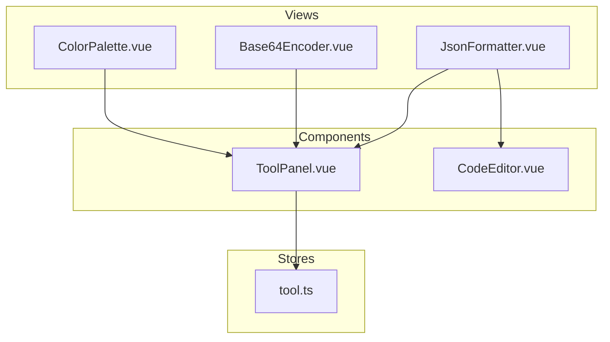
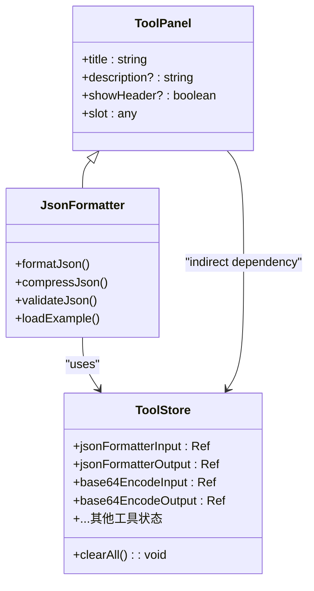
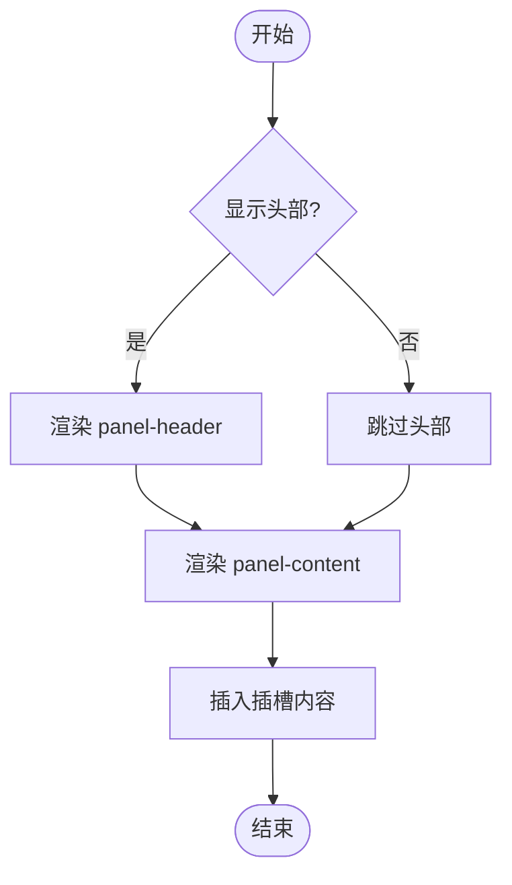
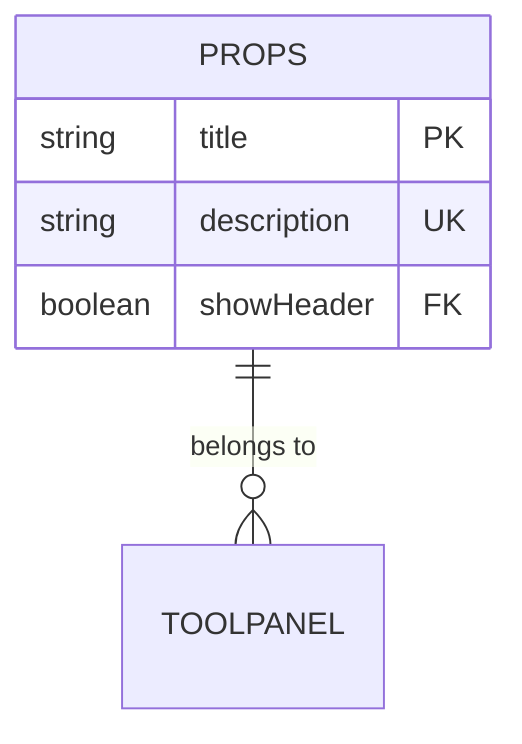
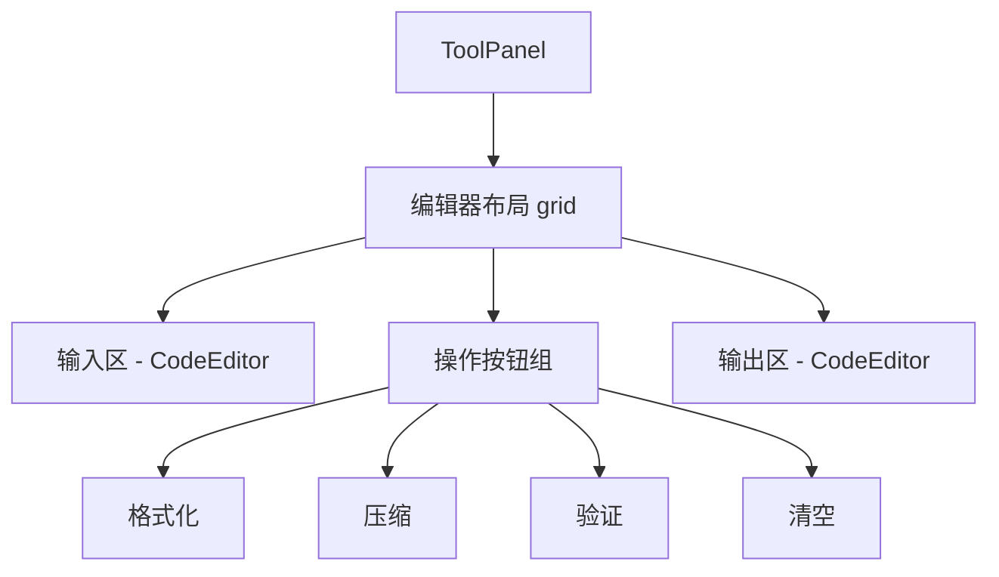
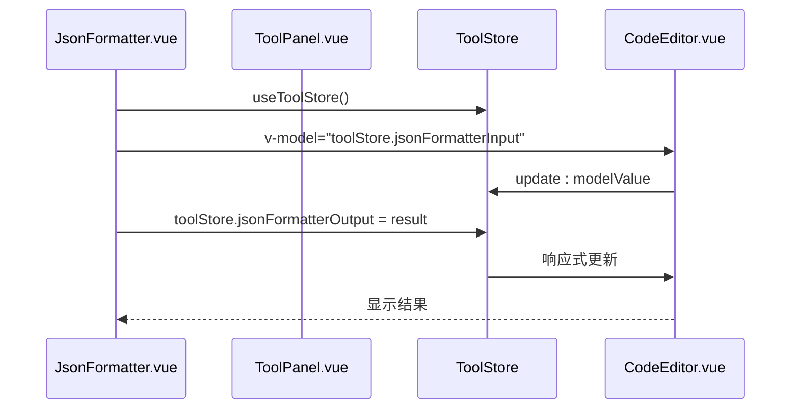
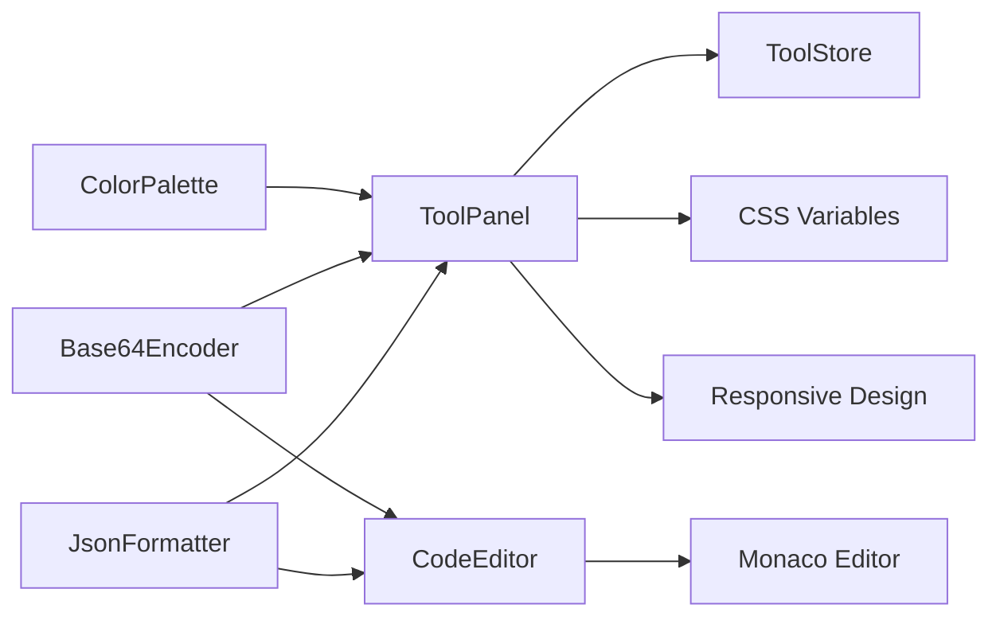

# ToolPanel 工具面板组件

<cite>
**本文档引用文件**
- [ToolPanel.vue](file://src/components/ToolPanel.vue)
- [tool.ts](file://src/stores/tool.ts)
- [JsonFormatter.vue](file://src/views/json/JsonFormatter.vue)
- [CodeEditor.vue](file://src/components/CodeEditor.vue)
</cite>

## 目录
1. [简介](#简介)
2. [项目结构](#项目结构)
3. [核心组件](#核心组件)
4. [架构概述](#架构概述)
5. [详细组件分析](#详细组件分析)
6. [依赖分析](#依赖分析)
7. [性能考虑](#性能考虑)
8. [故障排除指南](#故障排除指南)
9. [结论](#结论)

## 简介
`ToolPanel` 是一个为所有工具页面提供统一外壳的 Vue 组件，旨在实现标准化布局与功能复用。该组件通过三段式结构（输入区、操作按钮组、输出区）和插槽机制，灵活适配不同工具的功能需求。它与 `ToolStore` 协同工作，管理各工具的历史记录与用户偏好设置，并支持一键复制、清空输入等通用操作。同时，组件具备响应式设计，在小屏幕设备上仍保持良好可用性。

## 项目结构
本项目采用模块化组织方式，主要包含以下目录：
- `src/components`: 存放可复用的 UI 组件，如 `ToolPanel.vue` 和 `CodeEditor.vue`
- `src/stores`: Pinia 状态管理模块，其中 `tool.ts` 定义了全局工具状态
- `src/views`: 各具体工具视图，均基于 `ToolPanel` 构建
- `src/utils`: 工具函数库，供各组件调用
- `src/assets`: 样式资源文件

**图表来源**
- [ToolPanel.vue](file://src/components/ToolPanel.vue)
- [tool.ts](file://src/stores/tool.ts)
- [JsonFormatter.vue](file://src/views/json/JsonFormatter.vue)

## 核心组件
`ToolPanel` 作为所有工具页面的基础容器，提供了统一的外观风格与交互逻辑。其核心特性包括：头部渐变背景与装饰元素、淡入动画效果、标题文字渐变样式以及响应式断点配置。通过插槽机制，允许子组件注入自定义内容，从而实现高度灵活性。

**章节来源**
- [ToolPanel.vue](file://src/components/ToolPanel.vue#L0-L195)
- [UI_OPTIMIZATION_SUMMARY.md](file://UI_OPTIMIZATION_SUMMARY.md#L20-L25)

## 架构概述
整个工具系统的架构围绕 `ToolPanel` 和 `ToolStore` 展开。`ToolPanel` 提供视觉框架与基础交互，而 `ToolStore` 负责集中管理所有工具的状态数据。各个具体工具视图（如 JSON格式化、Base64编码）通过使用 `ToolPanel` 并绑定到 `ToolStore` 的相应字段来实现功能。

**图表来源**
- [ToolPanel.vue](file://src/components/ToolPanel.vue#L0-L195)
- [tool.ts](file://src/stores/tool.ts#L14-L367)
- [JsonFormatter.vue](file://src/views/json/JsonFormatter.vue#L0-L359)

## 详细组件分析

### ToolPanel 分析
`ToolPanel` 组件采用简洁的模板结构，包含条件渲染的头部区域和内容区域。头部展示标题与描述信息，并配有动态脉冲效果的装饰圆点。内容区域通过 `<slot />` 实现内容分发，使子组件能够自由填充具体内容。

#### 模板结构

**图表来源**
- [ToolPanel.vue](file://src/components/ToolPanel.vue#L0-L195)

#### 属性定义

**图表来源**
- [ToolPanel.vue](file://src/components/ToolPanel.vue#L10-L14)

### JsonFormatter 使用示例分析
`JsonFormatter.vue` 是 `ToolPanel` 的典型应用实例，展示了如何利用该组件构建具体工具页面。

#### 布局结构

**图表来源**
- [JsonFormatter.vue](file://src/views/json/JsonFormatter.vue#L0-L359)

#### 状态同步机制

**图表来源**
- [JsonFormatter.vue](file://src/views/json/JsonFormatter.vue#L0-L359)
- [tool.ts](file://src/stores/tool.ts#L14-L367)
- [CodeEditor.vue](file://src/components/CodeEditor.vue#L0-L342)

**章节来源**
- [ToolPanel.vue](file://src/components/ToolPanel.vue#L0-L195)
- [tool.ts](file://src/stores/tool.ts#L14-L367)
- [JsonFormatter.vue](file://src/views/json/JsonFormatter.vue#L0-L359)
- [CodeEditor.vue](file://src/components/CodeEditor.vue#L0-L342)

## 依赖分析
`ToolPanel` 组件本身不直接依赖外部库，但其功能实现依赖于项目内的多个模块协同工作。

**图表来源**
- [ToolPanel.vue](file://src/components/ToolPanel.vue#L0-L195)
- [tool.ts](file://src/stores/tool.ts#L14-L367)
- [JsonFormatter.vue](file://src/views/json/JsonFormatter.vue#L0-L359)

**章节来源**
- [ToolPanel.vue](file://src/components/ToolPanel.vue#L0-L195)
- [tool.ts](file://src/stores/tool.ts#L14-L367)

## 性能考虑
`ToolPanel` 作为一个轻量级容器组件，对性能影响极小。其主要性能优势体现在：
- 使用 `v-if` 条件渲染减少不必要的 DOM 元素
- 动画效果经过优化，避免重排重绘
- 通过插槽机制实现按需渲染，避免一次性加载过多内容
- 响应式断点仅在关键尺寸处设置，减少媒体查询开销

此外，配合 `CodeEditor` 组件的虚拟滚动与懒加载机制，即使处理大型数据也能保持流畅体验。

## 故障排除指南
当遇到 `ToolPanel` 相关问题时，可参考以下排查步骤：

1. **检查插槽内容是否正确传递**
   - 确保子组件正确使用 `<template #default>` 或直接嵌套内容
   - 验证父组件未意外覆盖插槽

2. **验证状态绑定是否正常**
   - 检查是否正确导入并使用 `useToolStore`
   - 确认 `v-model` 绑定路径准确无误

3. **响应式失效问题**
   - 确保修改的是 `ref.value` 而非 `ref` 本身
   - 避免直接替换响应式对象，应逐属性赋值

4. **样式冲突排查**
   - 查看是否有全局样式覆盖组件 scoped CSS
   - 检查 CSS 变量是否正确定义

**章节来源**
- [ToolPanel.vue](file://src/components/ToolPanel.vue#L0-L195)
- [tool.ts](file://src/stores/tool.ts#L14-L367)
- [JsonFormatter.vue](file://src/views/json/JsonFormatter.vue#L0-L359)

## 结论
`ToolPanel` 组件成功实现了工具页面的标准化与模块化设计目标。通过清晰的三段式布局、灵活的插槽机制和集中的状态管理，大幅提升了开发效率与用户体验一致性。其响应式设计确保了跨设备兼容性，而与 `ToolStore` 的深度集成则实现了数据持久化与历史记录功能。未来可进一步扩展插槽类型，支持更多定制化需求。