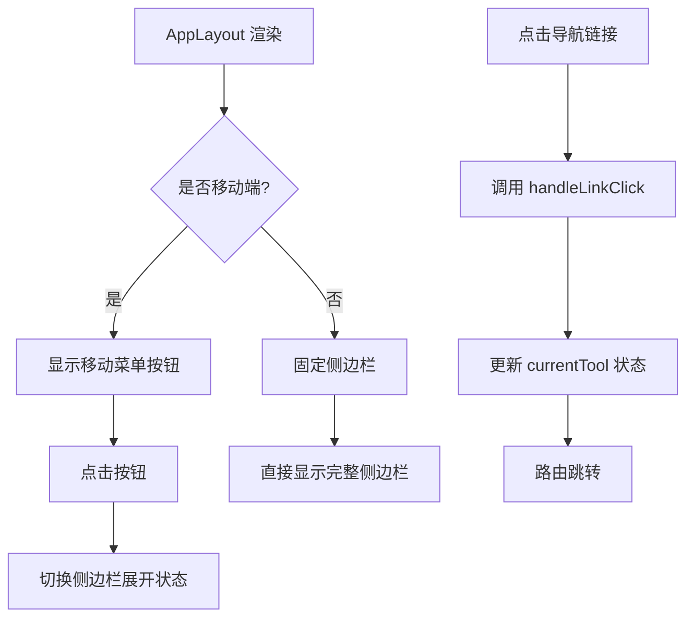
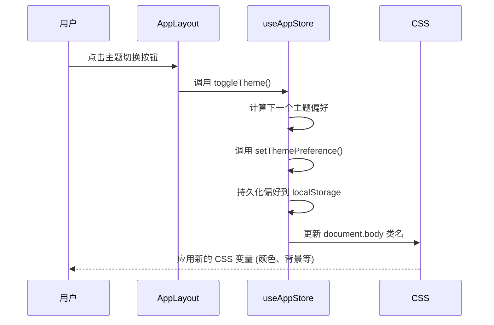
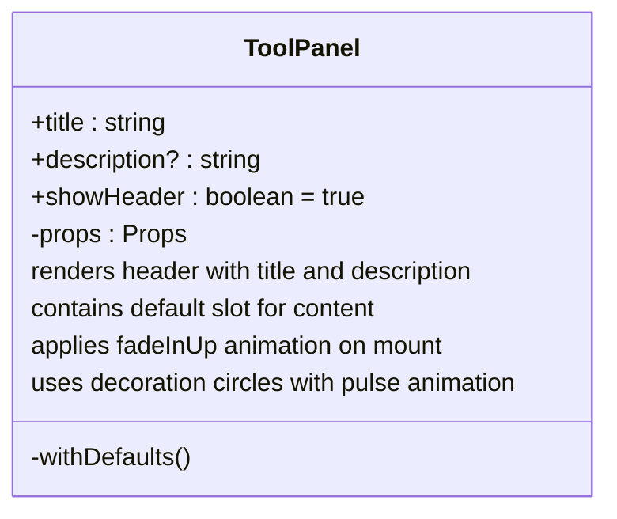
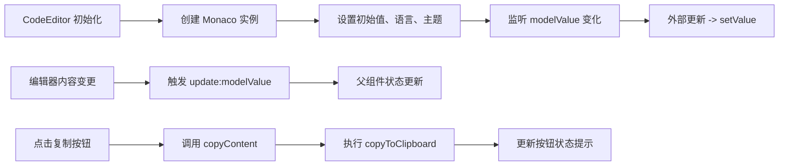

# UI组件架构

<cite>
**本文档中引用的文件**   
- [AppLayout.vue](file://src/components/AppLayout.vue)
- [ToolPanel.vue](file://src/components/ToolPanel.vue)
- [CodeEditor.vue](file://src/components/CodeEditor.vue)
- [base.css](file://src/assets/base.css)
- [main.css](file://src/assets/main.css)
</cite>

## 目录
1. [简介](#简介)
2. [核心UI组件体系](#核心ui组件体系)
3. [主布局容器 AppLayout](#主布局容器-applayout)
4. [通用工具面板 ToolPanel](#通用工具面板-toolpanel)
5. [专业代码编辑器 CodeEditor](#专业代码编辑器-codeeditor)
6. [样式架构与设计规范](#样式架构与设计规范)
7. [组件使用示例与嵌套关系](#组件使用示例与嵌套关系)
8. [总结](#总结)

## 简介
`program-tool`项目构建了一套现代化、可复用的UI组件体系，旨在为开发者提供高效、一致且美观的工具类应用界面。该体系以`AppLayout.vue`作为全局布局容器，统一管理导航与主题；通过`ToolPanel.vue`为各工具页面提供标准化的视觉外壳；利用`CodeEditor.vue`封装Monaco Editor实现专业的代码编辑体验。整体设计遵循响应式原则，并通过CSS变量和BEM命名法确保样式的可维护性与扩展性。

## 核心UI组件体系
本项目的UI组件体系采用分层设计理念，由基础样式库、布局组件、功能组件和业务视图四层构成。`base.css`和`main.css`提供了原子化的样式变量与通用类名；`AppLayout.vue`负责全局结构与状态管理；`ToolPanel.vue`和`CodeEditor.vue`作为中阶组件，服务于具体的工具页面。这种分层结构保证了高内聚、低耦合，便于团队协作与长期维护。

**Section sources**
- [AppLayout.vue](file://src/components/AppLayout.vue#L0-L545)
- [ToolPanel.vue](file://src/components/ToolPanel.vue#L0-L196)
- [CodeEditor.vue](file://src/components/CodeEditor.vue#L0-L343)

## 主布局容器 AppLayout

`AppLayout.vue`是整个应用的主布局容器，承担着导航、主题切换和内容区域管理的核心职责。它采用经典的侧边栏+主内容区布局，同时针对移动端进行了优化适配。

### 侧边栏导航实现
侧边栏通过`v-for`指令动态渲染来自Pinia store (`useAppStore`) 的`toolCategories`数据，实现了菜单项的集中化配置与管理。每个工具类别及其工具项均绑定至Vue Router，点击后触发`handleLinkClick`方法更新当前工具状态并关闭移动端侧边栏。



**Diagram sources**
- [AppLayout.vue](file://src/components/AppLayout.vue#L0-L545)
- [app.ts](file://src/stores/app.ts#L91-L305)

### 顶部工具栏与主题切换
顶部工具栏集成在侧边栏头部，包含应用Logo和主题切换按钮。主题切换逻辑由`useAppStore`中的`toggleTheme`方法驱动，该方法循环切换`auto`（跟随系统）、`light`（浅色）和`dark`（深色）三种模式。切换时，store会自动将偏好写入本地存储，并通过`setThemePreference`同步更新DOM上的`theme-light`或`theme-dark`类名，从而激活对应的CSS变量。



**Diagram sources**
- [AppLayout.vue](file://src/components/AppLayout.vue#L0-L545)
- [app.ts](file://src/stores/app.ts#L223-L228)

### 响应式与移动端适配
组件通过`checkMobile`函数和`window.resize`事件监听器实时检测屏幕尺寸。当宽度≤768px时，侧边栏变为从左侧滑出的抽屉式导航，并配合遮罩层(`overlay`)提升用户体验。动画效果如`slideInRight`和`fadeInUp`增强了交互的流畅感。

**Section sources**
- [AppLayout.vue](file://src/components/AppLayout.vue#L0-L545)
- [main.css](file://src/assets/main.css#L0-L326)

## 通用工具面板 ToolPanel

`ToolPanel.vue`作为所有工具页面的通用外壳组件，定义了统一的视觉风格与信息层级，确保了跨工具的一致性体验。

### 设计理念与标准化结构
该组件采用灵活的插槽(Slot)设计，允许子组件注入具体内容。其结构分为可选的头部(header)和主体内容(content)两部分。头部包含标题(title)和描述(description)，用于清晰传达当前工具的功能。通过`showHeader`属性可以控制头部的显隐，满足不同场景的需求。

### 输入输出区域与操作按钮组
虽然`ToolPanel`本身不直接包含输入输出区域，但它为`CodeEditor.vue`等子组件提供了理想的容器。例如，在`Base64Encoder.vue`中，两个`CodeEditor`实例被放置在`ToolPanel`内，形成标准的“输入-输出”布局。操作按钮（如编码、解码）通常位于`ToolPanel`的内容区域内，紧随编辑器之后。

### 响应式布局适配
组件的响应式设计体现在多个层面：在移动端，`.panel-header`从水平布局变为垂直堆叠，装饰圆点居中排列；字体大小也相应减小。这些调整确保了在小屏幕上依然拥有良好的可读性和操作空间。



**Diagram sources**
- [ToolPanel.vue](file://src/components/ToolPanel.vue#L0-L196)
- [ColorPalette.vue](file://src/views/color/ColorPalette.vue#L0-L18)

**Section sources**
- [ToolPanel.vue](file://src/components/ToolPanel.vue#L0-L196)

## 专业代码编辑器 CodeEditor

`CodeEditor.vue`是对Monaco Editor的强大封装，为各类文本处理工具提供了专业级的代码编辑能力。

### 封装Monaco Editor核心功能
组件在`onMounted`钩子中创建Monaco编辑器实例，并通过丰富的配置项启用语法高亮、行号、代码折叠、自动换行等功能。`modelValue`作为`v-model`的绑定值，实现了父子组件间的双向数据流。`watch`侦听器确保了外部传入的`modelValue`、`language`和主题变化能实时同步到编辑器内部。

### 语法高亮与格式化支持
通过`props.language`参数，组件可支持JSON、JavaScript、HTML等多种语言的语法高亮。格式化功能通过调用`editor.getAction('editor.action.formatDocument')?.run()`实现，一键美化代码结构。此功能在`JsonFormatter.vue`等工具中至关重要。

### 复制与清空操作
组件内置了复制(copy)和清空(clear)两个便捷操作按钮。复制功能依赖于`utils/index.ts`中的`copyToClipboard`函数，利用现代浏览器的`navigator.clipboard.writeText` API实现。成功复制后，按钮文本和图标会短暂变为“已复制”状态，提供即时反馈。



**Diagram sources**
- [CodeEditor.vue](file://src/components/CodeEditor.vue#L0-L343)
- [index.ts](file://src/utils/index.ts#L5-L13)

**Section sources**
- [CodeEditor.vue](file://src/components/CodeEditor.vue#L0-L343)

## 样式架构与设计规范

项目的样式架构基于CSS变量和模块化设计，确保了主题的灵活性和样式的可维护性。

### CSS变量的主题支持
`base.css`文件定义了完整的CSS变量体系，包括颜色、间距、圆角、阴影等。通过`:root`声明的变量构成了默认的浅色主题。深色主题通过媒体查询`@media (prefers-color-scheme: dark)`和手动添加的`.theme-dark`类来覆盖这些变量，实现了无缝的主题切换。

### BEM命名规范的应用
样式类名严格遵循BEM(Block__Element--Modifier)规范。例如，在`ToolPanel.vue`中：
- `tool-panel` 是块(Block)
- `panel-header`, `panel-title` 是元素(Element)
- `no-header` 是修饰符(Modifier)

这种命名方式清晰地表达了组件的结构和状态，避免了样式冲突。

### 响应式断点设计
项目定义了基于`max-width`的响应式断点，主要在768px处进行布局切换。`main.css`中的媒体查询规则调整了按钮、卡片和警告框的内边距与字体大小，确保在移动设备上拥有舒适的触摸体验。

```mermaid
erDiagram
CSS_VARIABLES ||--o{ THEME_LIGHT : "defines"
CSS_VARIABLES ||--o{ THEME_DARK : "overrides"
CSS_VARIABLES }|--|| BASE_CSS : "located in"
BASE_CSS ||--o{ MAIN_CSS : "imported by"
MAIN_CSS ||--o{ COMPONENTS : "used by"
class CSS_VARIABLES {
--color-background
--color-text
--spacing-md
--radius-lg
--shadow-xl
}
class THEME_LIGHT {
--color-background: #ffffff
--color-text: #1f2937
}
class THEME_DARK {
--color-background: #0f0f0f
--color-text: #f9fafb
}
```

**Diagram sources**
- [base.css](file://src/assets/base.css#L0-L253)
- [main.css](file://src/assets/main.css#L0-L326)

**Section sources**
- [base.css](file://src/assets/base.css#L0-L253)
- [main.css](file://src/assets/main.css#L0-L326)

## 组件使用示例与嵌套关系

以下是一个典型的工具页面（以Base64编码器为例）的组件嵌套与数据传递方式：

```vue
<template>
  <ToolPanel title="Base64编解码" description="在线进行Base64编码与解码">
    <!-- 输入编辑器 -->
    <CodeEditor 
      v-model="inputText" 
      language="text" 
      title="原始文本" 
      show-copy 
      show-clear 
    />
    
    <!-- 操作按钮组