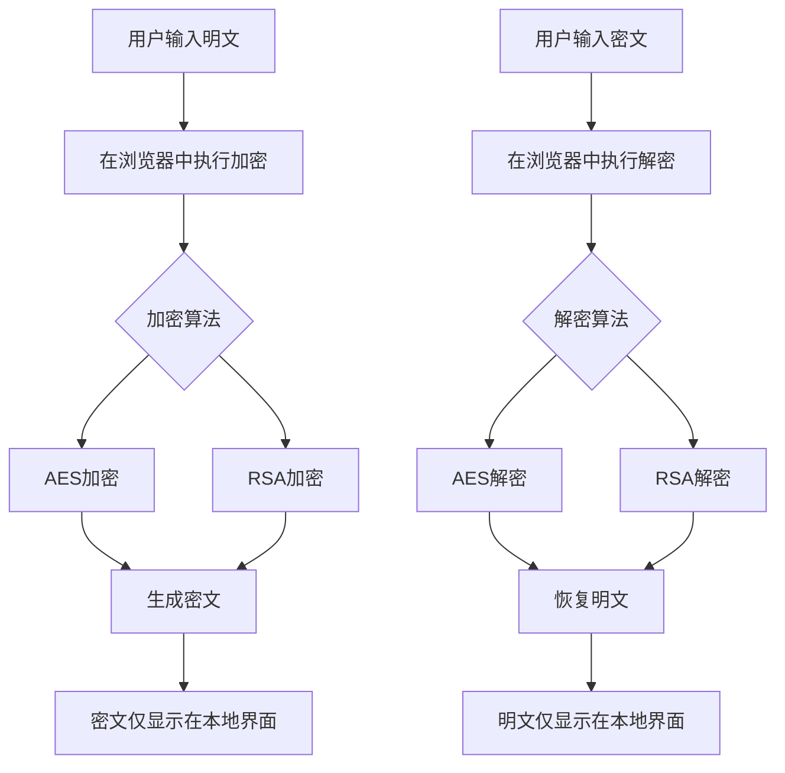
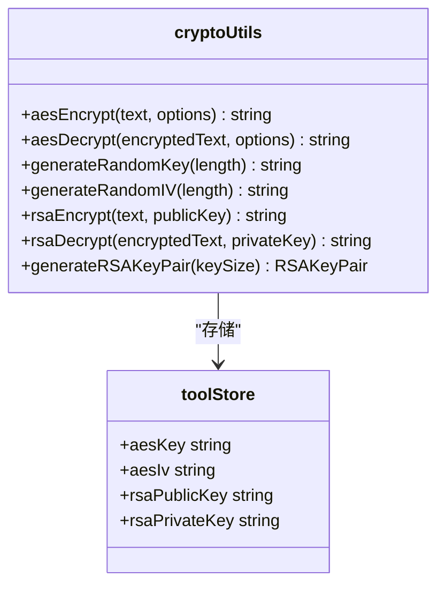
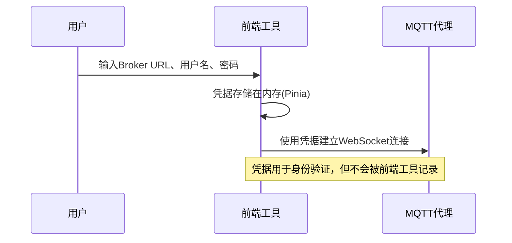

# 安全使用指南

<cite>
**本文档引用的文件**
- [SECURITY_GUIDE.md](file://SECURITY_GUIDE.md)
- [cryptoUtils.ts](file://src/utils/cryptoUtils.ts)
- [tool.ts](file://src/stores/tool.ts)
- [AESCrypto.vue](file://src/views/crypto/AESCrypto.vue)
- [RSACrypto.vue](file://src/views/crypto/RSACrypto.vue)
- [JwtDecoder.vue](file://src/views/jwt/JwtDecoder.vue)
- [MqttTool.vue](file://src/views/communication/MqttTool.vue)
- [mqttUtils.ts](file://src/utils/mqttUtils.ts)
- [package.json](file://package.json)
</cite>

## 目录
1. [引言](#引言)
2. [加解密操作安全规范](#加解密操作安全规范)
3. [密钥生成与存储机制](#密钥生成与存储机制)
4. [工具状态管理风险](#工具状态管理风险)
5. [历史记录清理建议](#历史记录清理建议)
6. [开发者安全实践](#开发者安全实践)
7. [最小权限原则应用](#最小权限原则应用)
8. [总结](#总结)

## 引言

本《安全使用指南》旨在为用户提供严格的安全规范，指导用户安全使用本工具中的敏感功能。基于项目中的`SECURITY_GUIDE.md`文档内容，本指南强调所有加解密操作均在客户端完成，确保敏感数据不会传输至服务器。通过详细说明AES/RSA密钥的本地生成与存储机制，警告用户切勿在不安全环境中处理重要密钥，并提供针对JWT令牌、MQTT凭据等工具状态的管理建议，帮助用户最大限度地降低信息泄露风险。

**Section sources**
- [SECURITY_GUIDE.md](file://SECURITY_GUIDE.md#L0-L239)

## 加解密操作安全规范

本工具的所有加解密操作均在用户的浏览器客户端本地完成，确保了最高的安全性。无论是AES对称加密还是RSA非对称加密，整个过程都不涉及任何网络传输，用户的原始文本和密钥始终保留在本地设备上。



**Diagram sources**
- [AESCrypto.vue](file://src/views/crypto/AESCrypto.vue#L0-L799)
- [RSACrypto.vue](file://src/views/crypto/RSACrypto.vue#L0-L739)
- [cryptoUtils.ts](file://src/utils/cryptoUtils.ts#L0-L268)

该设计从根本上杜绝了敏感数据被中间人截获或服务器端泄露的风险。用户可以完全信任，他们处理的任何机密信息都只存在于自己的计算设备之中。

**Section sources**
- [SECURITY_GUIDE.md](file://SECURITY_GUIDE.md#L0-L239)
- [cryptoUtils.ts](file://src/utils/cryptoUtils.ts#L0-L268)

## 密钥生成与存储机制

### AES/RSA密钥的本地生成

AES和RSA密钥的生成完全在用户的浏览器内存中进行。对于AES，用户可以手动输入密钥，也可以使用工具内置的“生成密钥”功能，该功能会根据用户选择的密钥长度（128、192或256位）生成一个随机的高强度密钥。对于RSA，点击“生成密钥对”按钮后，系统会调用`generateRSAKeyPair`函数，在本地创建一对公钥和私钥。



**Diagram sources**
- [cryptoUtils.ts](file://src/utils/cryptoUtils.ts#L0-L268)
- [tool.ts](file://src/stores/tool.ts#L0-L368)

### 密钥的存储与风险

生成的密钥默认仅存储在Pinia状态管理库的内存中。这意味着一旦用户关闭浏览器标签页或刷新页面，所有密钥将被永久清除。这是一种最安全的临时存储方式。

然而，为了方便用户重复使用，系统提供了可选的持久化存储功能。当用户选择保存配置时，密钥会被加密后存储在`localStorage`中。尽管采用了简单的加密保护，但必须明确指出：**`localStorage`并非安全的存储位置**。恶意的JavaScript代码（如网页上的广告脚本或浏览器插件）有可能访问并窃取这些数据。

因此，强烈警告用户：
- **切勿在公共计算机或不受信任的设备上启用密钥的本地持久化存储。**
- 对于极其重要的密钥，应始终保持其在内存中，避免任何形式的本地存储。

**Section sources**
- [SECURITY_GUIDE.md](file://SECURITY_GUIDE.md#L0-L239)
- [cryptoUtils.ts](file://src/utils/cryptoUtils.ts#L0-L268)
- [tool.ts](file://src/stores/tool.ts#L0-L368)

## 工具状态管理风险

除了加解密密钥，其他工具的状态信息同样存在潜在风险，需要用户谨慎对待。

### JWT令牌解析

JWT解析工具允许用户粘贴令牌以查看其Header和Payload内容。虽然此过程不涉及签名验证，且所有解析都在本地完成，但用户仍需注意：
- 解析后的JWT Payload可能包含敏感信息（如用户ID、邮箱、角色权限等）。
- 这些信息会以明文形式显示在界面上，并可能被缓存。

### MQTT连接凭据

MQTT测试工具要求用户输入代理服务器地址、用户名和密码。这些凭据是控制物联网设备的关键凭证。
- 用户名和密码在建立WebSocket连接时会发送到MQTT代理服务器，这是必要的通信流程。
- 但是，这些凭据本身会存储在浏览器的内存中。如果用户启用了配置持久化，它们也可能被加密后存入`localStorage`。



**Diagram sources**
- [MqttTool.vue](file://src/views/communication/MqttTool.vue#L0-L799)
- [mqttUtils.ts](file://src/utils/mqttUtils.ts#L0-L631)

**缓解措施**：
- 避免使用具有高权限的主账号凭据进行测试。
- 测试完成后，及时断开连接并清除相关配置。

**Section sources**
- [MqttTool.vue](file://src/views/communication/MqttTool.vue#L0-L799)
- [JwtDecoder.vue](file://src/views/jwt/JwtDecoder.vue#L0-L535)

## 历史记录清理建议

为了防止敏感信息的意外泄露，建议用户定期清理工具的历史记录。

- **主动清空**：每个工具都提供了“清空”或“清除”按钮（通常是一个垃圾桶图标🗑️）。在处理完敏感任务后，应立即点击此按钮，清除输入框和输出框中的所有内容。
- **清除所有数据**：部分工具（如JSON格式化工具）提供“清空所有”功能，可以一次性清除多个相关的输入输出区域。
- **定期维护**：养成良好的习惯，在每天工作结束或切换到不同项目时，主动检查并清理各个工具的残留数据。

**Section sources**
- [AESCrypto.vue](file://src/views/crypto/AESCrypto.vue#L0-L799)
- [RSACrypto.vue](file://src/views/crypto/RSACrypto.vue#L0-L739)
- [tool.ts](file://src/stores/tool.ts#L0-L368)

## 开发者安全实践

对于开发者而言，维护工具本身的安全性至关重要。

### 避免引入恶意第三方库

项目的`package.json`文件列出了所有依赖项。开发者在添加新功能时，必须严格审查每一个引入的第三方库。
- **来源可信**：优先选择知名、活跃维护的开源项目。
- **审计依赖**：定期使用`npm audit`等工具检查依赖链中的已知漏洞。
- **最小化依赖**：只引入真正必需的库，减少攻击面。

### 确保安全相关依赖的更新

本工具的核心加密功能依赖于`crypto-js`库。开发者有责任确保此类关键依赖保持最新。
- **版本监控**：关注`crypto-js`的官方发布动态，及时了解安全补丁。
- **及时升级**：一旦发现新版本修复了安全问题，应尽快升级并发布新版本的工具。

```json
// package.json 中的相关依赖
{
  "dependencies": {
    "crypto-js": "^4.2.0",
    "pinia": "^3.0.3",
    "vue": "^3.5.18"
  }
}
```

**Section sources**
- [package.json](file://package.json#L0-L54)
- [SECURITY_GUIDE.md](file://SECURITY_GUIDE.md#L0-L239)

## 最小权限原则应用

无论作为用户还是开发者，都应遵循最小权限原则。

- **用户角度**：在配置API密钥或MQTT凭据时，应使用权限最小的专用账户。例如，为AI对话工具创建一个仅能调用聊天接口的API密钥，而不是使用拥有全部权限的管理员密钥。
- **开发者角度**：在实现新功能时，应评估其所需的最低权限。例如，一个颜色转换工具不需要访问网络或文件系统，其权限应被严格限制。

**Section sources**
- [SECURITY_GUIDE.md](file://SECURITY_GUIDE.md#L0-L239)

## 总结

本工具通过将所有敏感操作（尤其是加解密）限定在客户端本地执行，为用户提供了坚实的安全基础。AES和RSA密钥在浏览器内存中生成和使用，有效防止了数据外泄。然而，安全是一个持续的过程，用户必须警惕`localStorage`的固有风险，避免在不安全的环境中存储重要密钥，并养成定期清理历史记录的良好习惯。同时，开发者也肩负着确保依赖库安全更新的责任。只有用户和开发者共同努力，遵循最小权限原则，才能最大化地保障本工具的安全使用。