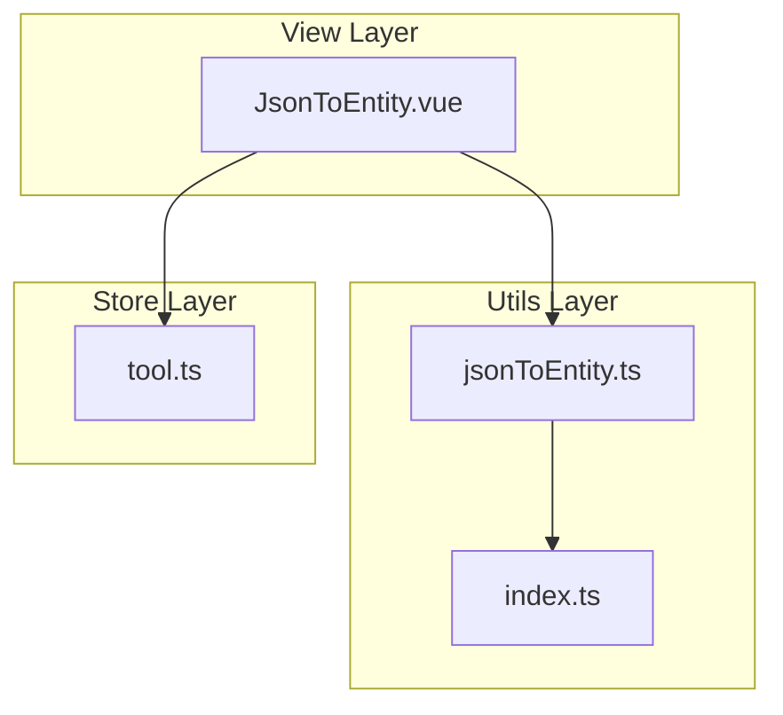
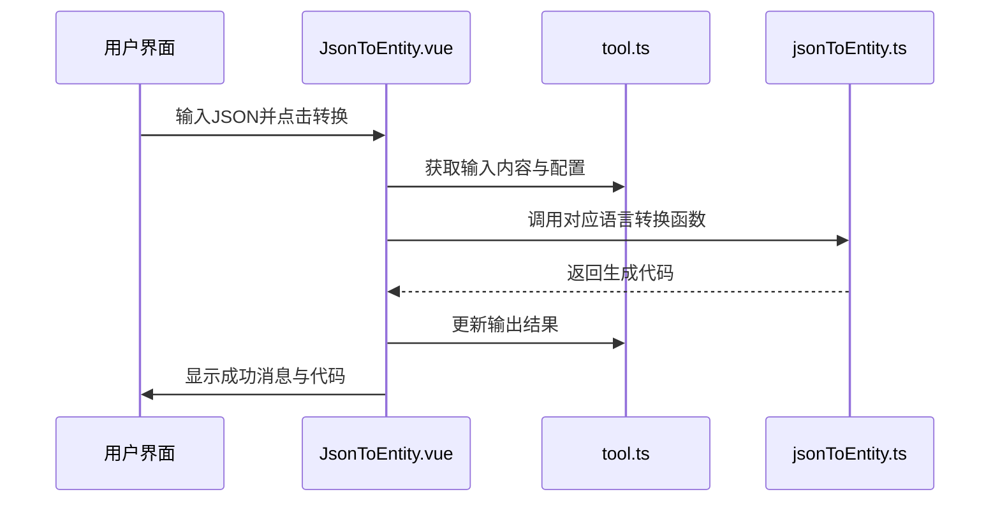
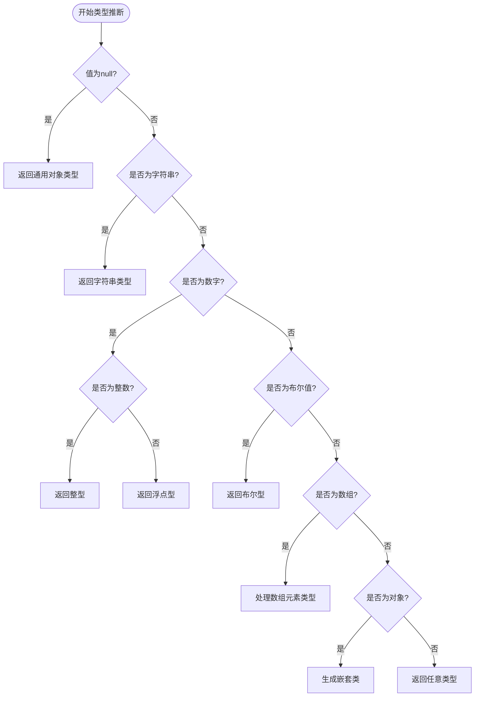
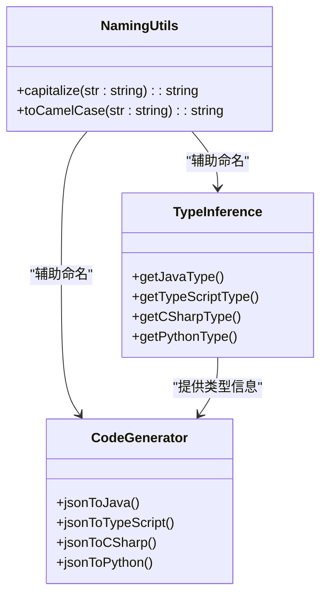
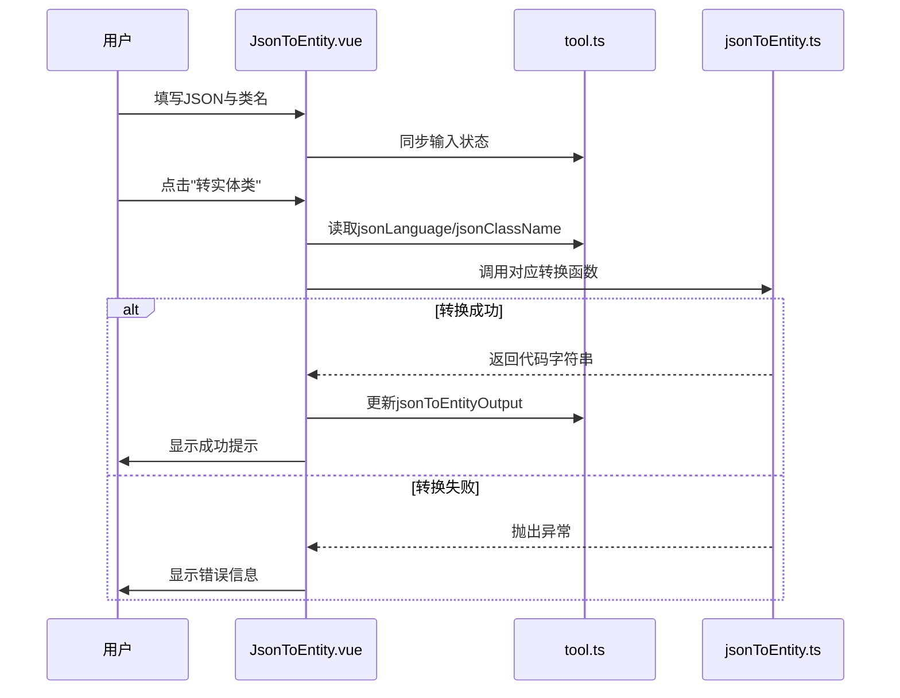

# JSON与实体类转换工具

<cite>
**本文档引用的文件**
- [jsonToEntity.ts](file://src/utils/jsonToEntity.ts)
- [JsonToEntity.vue](file://src/views/json/JsonToEntity.vue)
- [tool.ts](file://src/stores/tool.ts)
- [index.ts](file://src/utils/index.ts)
</cite>

## 目录
1. [简介](#简介)
2. [项目结构](#项目结构)
3. [核心组件](#核心组件)
4. [架构概述](#架构概述)
5. [详细组件分析](#详细组件分析)
6. [依赖分析](#依赖分析)
7. [性能考虑](#性能考虑)
8. [故障排除指南](#故障排除指南)
9. [结论](#结论)

## 简介
本系统提供一个将任意JSON结构解析为面向对象类定义的工具，支持Java、TypeScript、C#、Python等多种目标语言。该工具通过类型推断机制自动识别字段的基础类型（字符串、数字、布尔值），并处理嵌套对象和数组结构。用户可通过图形界面输入JSON数据，选择目标语言和类名，触发转换流程生成对应代码。

## 项目结构
系统采用模块化设计，主要分为视图层、工具函数层和状态管理三大部分。`JsonToEntity.vue`作为前端入口负责用户交互；`jsonToEntity.ts`实现核心转换逻辑；`tool.ts`集中管理应用状态；通用工具函数如JSON验证则封装在`index.ts`中。



**Diagram sources**
- [JsonToEntity.vue](file://src/views/json/JsonToEntity.vue)
- [jsonToEntity.ts](file://src/utils/jsonToEntity.ts)
- [tool.ts](file://src/stores/tool.ts)
- [index.ts](file://src/utils/index.ts)

**Section sources**
- [JsonToEntity.vue](file://src/views/json/JsonToEntity.vue)
- [jsonToEntity.ts](file://src/utils/jsonToEntity.ts)

## 核心组件
核心功能由`jsonToEntity.ts`中的四个导出函数构成：`jsonToJava`、`jsonToTypeScript`、`jsonToCSharp`、`jsonToPython`。这些函数接收JSON字符串和类名参数，返回对应语言的类代码字符串。类型推断基于值的实际类型动态判断，并递归处理复杂结构。

**Section sources**
- [jsonToEntity.ts](file://src/utils/jsonToEntity.ts#L223-L391)

## 架构概述
整个系统围绕“输入-处理-输出”模式构建。用户在UI中输入JSON后，点击按钮触发调用链，经由Pinia存储传递数据至工具函数进行转换，最终结果回显到输出区域。错误处理贯穿全流程，确保非法输入能被及时反馈。



**Diagram sources**
- [JsonToEntity.vue](file://src/views/json/JsonToEntity.vue#L194-L221)
- [jsonToEntity.ts](file://src/utils/jsonToEntity.ts#L223-L391)
- [tool.ts](file://src/stores/tool.ts#L14-L367)

## 详细组件分析

### 类型推断机制分析
系统根据JSON字段值自动推断目标语言类型。基础类型映射规则如下表所示：

| JSON类型 | Java | TypeScript | C# | Python |
|---------|------|------------|----|--------|
| string | String | string | string | str |
| integer | Integer | number | int | int |
| float | Double | number | double | float |
| boolean | Boolean | boolean | bool | bool |
| null | Object | any | object | Optional[Any] |

对于数组和对象，则进一步递归生成泛型或嵌套类。



**Diagram sources**
- [jsonToEntity.ts](file://src/utils/jsonToEntity.ts#L17-L116)

**Section sources**
- [jsonToEntity.ts](file://src/utils/jsonToEntity.ts#L17-L116)

### 代码生成模板与命名规范
各类语言遵循其编码规范生成代码：
- **Java**: 使用驼峰命名私有字段，生成getter/setter方法，符合JavaBean标准。
- **TypeScript**: 接口属性保持原始键名，支持可选属性。
- **C#**: 属性使用帕斯卡命名，包含get;set;访问器。
- **Python**: 字段转小写，使用dataclass装饰器和类型提示。

所有嵌套类名称均通过`toCamelCase`和`capitalize`函数从原键名转换而来，确保命名一致性。



**Diagram sources**
- [jsonToEntity.ts](file://src/utils/jsonToEntity.ts#L209-L218)

**Section sources**
- [jsonToEntity.ts](file://src/utils/jsonToEntity.ts#L17-L218)

### 用户交互流程分析
用户操作通过`JsonToEntity.vue`组件捕获，利用Vue的响应式系统绑定输入框与下拉菜单。当点击“转实体类”按钮时，执行`convertToEntity`方法，依据当前选择的语言调用相应转换函数。



**Diagram sources**
- [JsonToEntity.vue](file://src/views/json/JsonToEntity.vue#L194-L221)
- [tool.ts](file://src/stores/tool.ts#L14-L367)

**Section sources**
- [JsonToEntity.vue](file://src/views/json/JsonToEntity.vue#L149-L228)

## 依赖分析
各模块间依赖关系清晰，低耦合高内聚。前端组件依赖Pinia存储获取状态，工具函数独立无外部依赖，仅通过标准接口通信。`isValidJson`等通用函数从`index.ts`导入，避免重复实现。

```mermaid
dependency-graph
JsonToEntity.vue --> tool.ts
JsonToEntity.vue --> jsonToEntity.ts
JsonToEntity.vue --> index.ts
jsonToEntity.ts --> index.ts
```

**Diagram sources**
- [JsonToEntity.vue](file://src/views/json/JsonToEntity.vue#L149-L182)
- [jsonToEntity.ts](file://src/utils/jsonToEntity.ts#L0-L392)
- [index.ts](file://src/utils/index.ts#L0-L158)

**Section sources**
- [JsonToEntity.vue](file://src/views/json/JsonToEntity.vue#L149-L182)
- [jsonToEntity.ts](file://src/utils/jsonToEntity.ts)
- [index.ts](file://src/utils/index.ts)

## 性能考虑
为提升大型JSON结构处理效率，建议采取以下优化措施：
1. **限制最大深度**：防止无限递归导致栈溢出。
2. **缓存已生成类**：避免对相同结构重复解析。
3. **异步处理**：对超大JSON启用Web Worker避免阻塞UI。
4. **流式解析**：对于极大文件，考虑分块处理而非一次性加载。

目前系统已通过`sortClassesByComplexity`函数按属性数量排序输出类，有助于提高代码可读性。

**Section sources**
- [jsonToEntity.ts](file://src/utils/jsonToEntity.ts#L121-L140)

## 故障排除指南
常见问题及解决方案如下：

| 问题现象 | 可能原因 | 解决方案 |
|--------|--------|--------|
| 转换失败提示格式错误 | JSON语法不合法 | 使用内置验证功能定位具体位置 |
| 输出为空 | 输入为空或仅空白字符 | 检查输入是否有效 |
| 嵌套类未生成 | 循环引用或深层嵌套 | 检查是否存在自引用对象 |
| 类型推断不准 | 数组为空导致无法判断元素类型 | 提供示例数据或手动指定类型 |

错误处理机制统一捕获`JSON.parse`异常并抛出自定义消息，便于用户理解问题所在。

**Section sources**
- [jsonToEntity.ts](file://src/utils/jsonToEntity.ts#L223-L391)
- [index.ts](file://src/utils/index.ts#L42-L