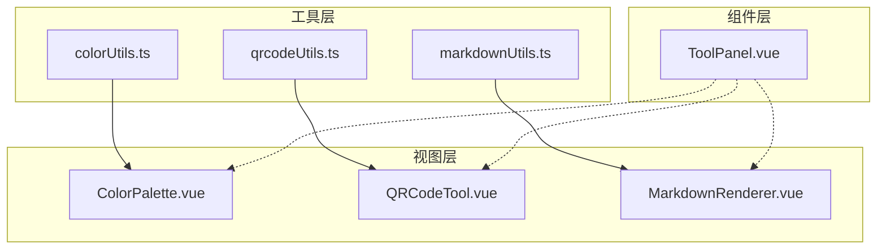
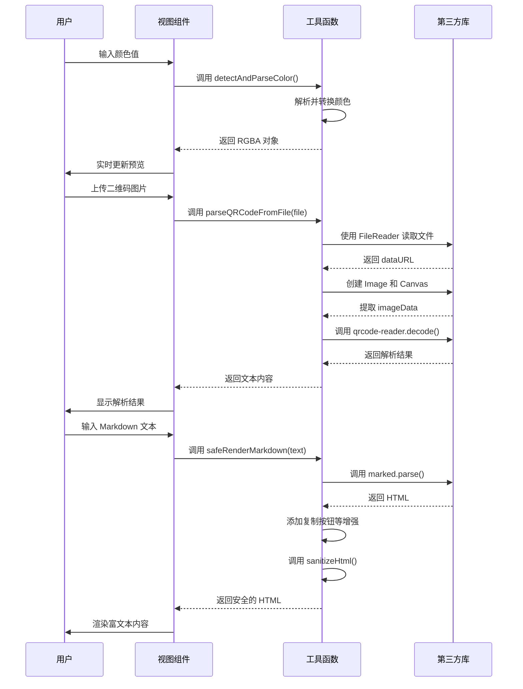

# UI辅助工具函数

<cite>
**本文档中引用的文件**
- [colorUtils.ts](file://src/utils/colorUtils.ts)
- [qrcodeUtils.ts](file://src/utils/qrcodeUtils.ts)
- [markdownUtils.ts](file://src/utils/markdownUtils.ts)
- [ColorPalette.vue](file://src/views/color/ColorPalette.vue)
- [QRCodeTool.vue](file://src/views/qrcode/QRCodeTool.vue)
</cite>

## 目录
1. [简介](#简介)
2. [项目结构](#项目结构)
3. [核心组件](#核心组件)
4. [架构概览](#架构概览)
5. [详细组件分析](#详细组件分析)
6. [依赖关系分析](#依赖关系分析)
7. [性能考量](#性能考量)
8. [故障排除指南](#故障排除指南)
9. [结论](#结论)

## 简介
本技术文档旨在全面阐述 `colorUtils.ts`、`qrcodeUtils.ts` 和 `markdownUtils.ts` 三个工具模块在用户界面（UI）层面的支持作用。这些工具类分别服务于颜色选择器、二维码生成与解析、以及 Markdown 文本渲染三大功能模块，通过封装底层逻辑，提升代码复用性与可维护性，同时优化用户体验。

`colorUtils.ts` 提供了完整的颜色格式转换能力，支持 HEX、RGB、HSL、HSV 四种主流颜色模型之间的相互转换，并实现了亮度计算、对比度检测等高级功能，为 `ColorPalette.vue` 组件提供数据处理支持。`qrcodeUtils.ts` 集成了 `qrcode.js` 库实现二维码生成，并结合浏览器原生 `FileReader API` 实现图像文件读取与二维码内容解析，支撑 `QRCodeTool.vue` 的核心功能。`markdownUtils.ts` 则基于 `marked` 和 `highlight.js` 实现 Markdown 到 HTML 的安全渲染，通过 DOMPurify 式清洗机制防止 XSS 攻击，确保内容展示的安全性。

本文档将深入分析各工具模块的技术实现路径、与视图组件的调用关系，并重点强调在生成速度、预览实时性、可访问性等方面所做的用户体验优化。

## 项目结构
项目采用标准的 Vue 3 + TypeScript 架构，遵循功能模块化组织原则。核心工具函数集中存放于 `src/utils` 目录下，按功能命名，便于维护和引用。视图组件则根据业务领域划分至 `src/views` 下的不同子目录中，如 `color`、`qrcode`、`markdown` 等，实现了清晰的关注点分离。

```
src/
├── utils/                  # 工具函数库
│   ├── colorUtils.ts       # 颜色处理工具
│   ├── qrcodeUtils.ts      # 二维码处理工具
│   └── markdownUtils.ts    # Markdown 渲染工具
├── views/
│   ├── color/
│   │   └── ColorPalette.vue # 调色盘视图
│   ├── qrcode/
│   │   └── QRCodeTool.vue   # 二维码工具视图
│   └── markdown/
│       └── MarkdownRenderer.vue # Markdown 渲染器（未找到）
└── components/
    └── ToolPanel.vue        # 通用工具面板
```

这种结构使得工具函数与视图组件解耦，提高了代码的可测试性和可重用性。



**图表来源**
- [colorUtils.ts](file://src/utils/colorUtils.ts)
- [qrcodeUtils.ts](file://src/utils/qrcodeUtils.ts)
- [markdownUtils.ts](file://src/utils/markdownUtils.ts)
- [ColorPalette.vue](file://src/views/color/ColorPalette.vue)
- [QRCodeTool.vue](file://src/views/qrcode/QRCodeTool.vue)

**章节来源**
- [src/utils](file://src/utils)
- [src/views](file://src/views)

## 核心组件
`colorUtils.ts`、`qrcodeUtils.ts` 和 `markdownUtils.ts` 是本系统中三个关键的工具模块，它们不直接参与 UI 渲染，而是作为“幕后英雄”为上层视图提供强大的功能支持。

`colorUtils.ts` 定义了 `RgbaColor`、`HslColor`、`HsvColor` 等接口，统一了颜色数据的表示方式。它提供了 `parseHex`、`parseRgb`、`parseHsl` 等解析函数，能够智能识别并转换不同格式的颜色输入。转换函数如 `rgbToHex`、`hslToRgb` 等实现了无损的色彩空间变换。`detectAndParseColor` 函数是核心入口，能够自动判断输入字符串的格式并返回标准化的 RGBA 对象。

`qrcodeUtils.ts` 封装了异步的 `generateQRCode` 和 `parseQRCodeFromFile` 函数，隐藏了 `qrcode.js` 和 `qrcode-reader` 库的复杂调用细节。它还提供了 `isValidColor` 和 `getErrorCorrectionDescription` 等辅助函数，增强了用户交互体验。

`markdownUtils.ts` 的 `safeRenderMarkdown` 函数是安全渲染的核心，它先通过 `renderMarkdown` 将 Markdown 转换为 HTML，再经 `sanitizeHtml` 过滤危险标签，最后由 `setupCodeCopyFunction` 注入全局的复制功能，形成了一条完整的、安全的内容处理流水线。

**章节来源**
- [colorUtils.ts](file://src/utils/colorUtils.ts#L1-L282)
- [qrcodeUtils.ts](file://src/utils/qrcodeUtils.ts#L1-L157)
- [markdownUtils.ts](file://src/utils/markdownUtils.ts#L1-L167)

## 架构概览
整个系统的架构呈现出清晰的分层模式：从底层的第三方库，到中间层的工具函数，再到上层的视图组件，每一层都职责明确。

在颜色处理方面，`ColorPalette.vue` 组件通过 `v-model` 双向绑定用户输入，并在 `@input` 事件触发时调用 `colorUtils.ts` 中的解析和转换函数，实现实时预览。所有颜色格式的同步逻辑都在 `syncFromRgba` 函数中完成，保证了数据的一致性。

在二维码处理方面，`QRCodeTool.vue` 组件通过 `FileReader` 读取用户上传的图片文件，然后将 `File` 对象传递给 `qrcodeUtils.ts` 的 `parseQRCodeFromFile` 函数。该函数内部创建 `Image` 元素和 `Canvas` 上下文，提取像素数据后交由 `qrcode-reader` 解码，最终将结果返回给视图层进行展示。

在 Markdown 渲染方面，虽然 `MarkdownRenderer.vue` 文件未找到，但从 `markdownUtils.ts` 的设计可以推断，其工作流程必然是调用 `safeRenderMarkdown` 函数。该函数链式调用 `renderMarkdown` 进行语法解析，添加代码块复制按钮等增强功能，再通过 `sanitizeHtml` 移除潜在的恶意脚本，最后将纯净的 HTML 插入到页面中。



**图表来源**
- [colorUtils.ts](file://src/utils/colorUtils.ts#L1-L282)
- [qrcodeUtils.ts](file://src/utils/qrcodeUtils.ts#L1-L157)
- [markdownUtils.ts](file://src/utils/markdownUtils.ts#L1-L167)
- [ColorPalette.vue](file://src/views/color/ColorPalette.vue#L1-L488)
- [QRCodeTool.vue](file://src/views/qrcode/QRCodeTool.vue#L1-L799)

## 详细组件分析

### 颜色工具组件分析
`colorUtils.ts` 模块为 `ColorPalette.vue` 提供了全方位的颜色处理支持。当用户在输入框中键入颜色值时，组件会立即调用 `detectAndParseColor` 函数。该函数依次尝试 `parseHex`、`parseRgb`、`parseHsl` 和 `parseHsv`，一旦成功解析即返回对应的 RGBA 对象。

颜色格式转换是该模块的核心功能