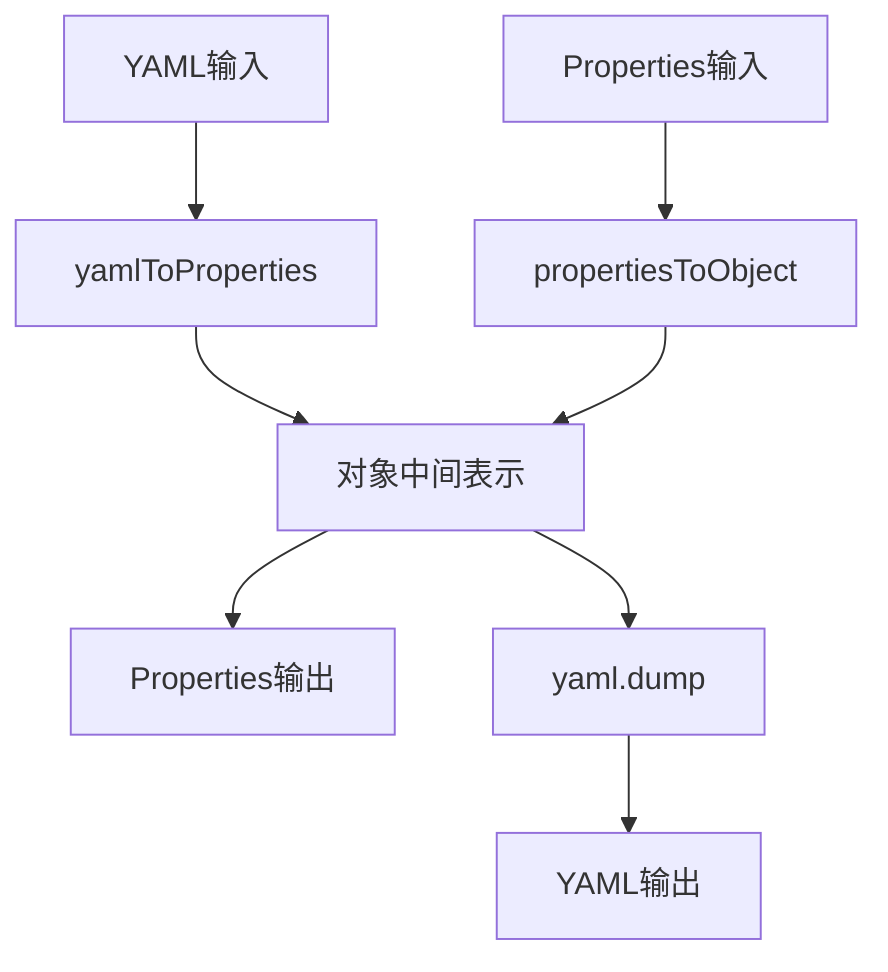
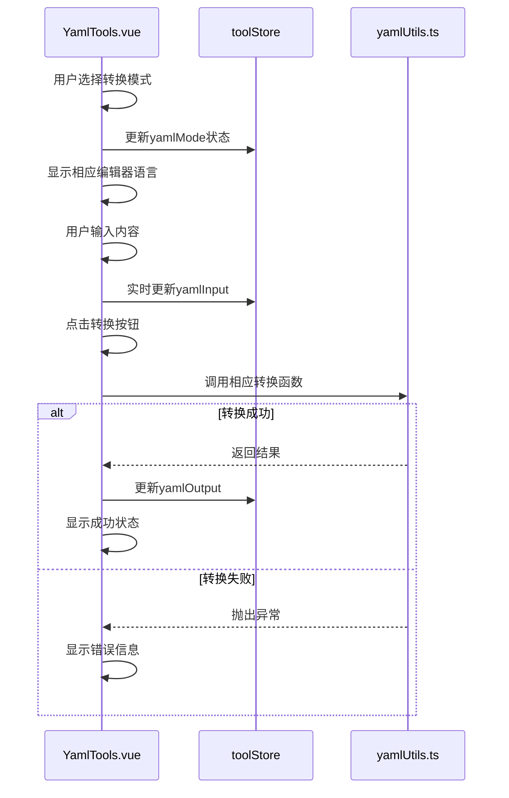

# YAML数据处理工具

<cite>
**Referenced Files in This Document**   
- [yamlUtils.ts](file://src/utils/yamlUtils.ts)
- [YamlTools.vue](file://src/views/yaml/YamlTools.vue)
- [package.json](file://package.json)
</cite>

## 目录
1. [简介](#简介)
2. [核心功能实现](#核心功能实现)
3. [安全转换机制](#安全转换机制)
4. [用户界面集成](#用户界面集成)
5. [复杂结构处理能力](#复杂结构处理能力)
6. [错误处理与性能优化](#错误处理与性能优化)

## 简介

本项目提供了一套完整的YAML配置文件处理解决方案，实现了YAML格式与Java Properties格式之间的双向转换功能。系统基于`js-yaml`库构建，通过`yamlUtils.ts`工具模块封装核心转换逻辑，并在`YamlTools.vue`组件中提供直观的用户界面。

该工具集主要服务于开发人员在不同配置格式间进行快速转换的需求，特别适用于微服务架构中配置文件的标准化处理。系统设计注重安全性、易用性和可靠性，确保在各种使用场景下都能稳定运行。

**Section sources**
- [yamlUtils.ts](file://src/utils/yamlUtils.ts#L0-L108)
- [YamlTools.vue](file://src/views/yaml/YamlTools.vue#L0-L428)

## 核心功能实现

### 双向转换架构



**Diagram sources**
- [yamlUtils.ts](file://src/utils/yamlUtils.ts#L7-L55)

### 转换流程分析

系统采用"解析-转换-序列化"三阶段模式：

1. **YAML转Properties流程**：
   - 使用`yaml.load()`将YAML字符串解析为JavaScript对象
   - 通过递归遍历对象结构生成扁平化的键值对
   - 按照Properties格式规范输出文本

2. **Properties转YAML流程**：
   - 解析Properties文本行，识别注释和有效配置项
   - 构建嵌套的对象结构（通过点号分隔的键名）
   - 使用`yaml.dump()`将对象序列化为YAML格式

**Section sources**
- [yamlUtils.ts](file://src/utils/yamlUtils.ts#L7-L55)

## 安全转换机制

### js-yaml库的安全特性

根据`package.json`文件显示，项目依赖`js-yaml@^4.1.0`版本，该版本默认使用安全的解析方法：

```json
{
  "dependencies": {
    "js-yaml": "^4.1.0"
  }
}
```

**Section sources**
- [package.json](file://package.json#L30-L31)

### 原型污染防护

尽管代码中直接调用了`yaml.load()`而非显式的`safeLoad`，但`js-yaml`库从v3.13.0开始已将`load()`作为`safeLoad()`的别名，两者行为完全相同。这意味着：

- 自动禁用危险的类型（如`!!js/function`、`!!js/regexp`等）
- 防止原型链污染攻击
- 不支持自定义类型构造函数

通过异常捕获机制，任何潜在的安全风险都会被及时发现并阻止：

```typescript
try {
  const obj = yaml.load(yamlString) as Record<string, unknown>
  return objectToProperties(obj)
} catch {
  throw new Error('Invalid YAML format')
}
```

**Section sources**
- [yamlUtils.ts](file://src/utils/yamlUtils.ts#L9-L13)

## 用户界面集成

### 组件交互模型



**Diagram sources**
- [YamlTools.vue](file://src/views/yaml/YamlTools.vue#L110-L140)
- [yamlUtils.ts](file://src/utils/yamlUtils.ts#L7-L55)

### 状态管理设计

系统利用Pinia存储库（toolStore）集中管理转换状态，实现以下优势：

- **状态持久化**：即使页面切换也不会丢失输入内容
- **响应式更新**：自动触发UI重渲染
- **跨组件共享**：便于未来扩展其他相关功能

关键状态变量包括：
- `yamlMode`：当前转换方向（toProperties/toYaml）
- `yamlInput`：用户输入的原始内容
- `yamlOutput`：转换后的结果内容

**Section sources**
- [YamlTools.vue](file://src/views/yaml/YamlTools.vue#L45-L47)

## 复杂结构处理能力

### 数据类型支持

| 数据类型 | 输入支持 | 输出支持 | 序列化规则 |
|--------|---------|---------|----------|
| 字符串 | ✓ | ✓ | 直接保留原值 |
| 整数 | ✓ | ✓ | 自动识别数字格式 |
| 浮点数 | ✓ | ✓ | 自动识别小数格式 |
| 布尔值 | ✓ | ✓ | true/false不带引号 |
| 对象嵌套 | ✓ | ✓ | 通过缩进表示层级 |
| 数组 | ✓ | ✓ | 使用短横线表示 |

**Section sources**
- [yamlUtils.ts](file://src/utils/yamlUtils.ts#L80-L100)

### 特殊结构处理

虽然当前实现未显式处理YAML锚点（&）、引用（*）和多文档流（---）等高级特性，但得益于`js-yaml`库的完整支持，这些复杂结构在基础解析层面是可处理的。建议在需要时通过配置`yaml.load()`的选项参数来启用特定功能。

对于嵌套对象的处理，系统通过递归算法完美支持任意深度的层级结构：

```typescript
const setNestedProperty = (obj: Record<string, unknown>, key: string, value: string): void => {
  const keys = key.split('.')
  let current = obj
  
  for (let i = 0; i < keys.length - 1; i++) {
    const k = keys[i]
    if (!(k in current) || typeof current[k] !== 'object') {
      current[k] = {}
    }
    current = current[k] as Record<string, unknown>
  }
  
  const lastKey = keys[keys.length - 1]
  current[lastKey] = parseValue(value)
}
```

**Section sources**
- [yamlUtils.ts](file://src/utils/yamlUtils.ts#L65-L80)

## 错误处理与性能优化

### 错误捕获机制

系统实现了全面的错误处理策略：

1. **语法验证**：通过try-catch捕获所有解析异常
2. **用户反馈**：将技术性错误转化为友好的提示信息
3. **状态清理**：确保错误不会影响后续操作

然而，当前实现存在改进空间——错误信息未能包含具体的行号定位。建议升级错误处理以提供更精确的调试信息：

```typescript
// 建议改进方案
try {
  const obj = yaml.load(yamlString, { filename: 'input.yaml' })
} catch (error: any) {
  if (error.mark && error.mark.line !== undefined) {
    throw new Error(`第${error.mark.line + 1}行出现语法错误: ${error.message}`)
  }
  throw error
}
```

**Section sources**
- [yamlUtils.ts](file://src/utils/yamlUtils.ts#L10-L13)

### 性能优化建议

#### 当前配置分析
```typescript
return yaml.dump(obj, { indent: 2 })
```

此配置已合理设置缩进为2个空格，符合大多数YAML风格指南。

#### 进一步优化建议

1. **禁用不需要的功能**：
```typescript
// 减少解析开销
yaml.load(yamlString, { 
  schema: yaml.JSON_SCHEMA // 仅支持JSON兼容类型
})
```

2. **大型文件处理**：
```typescript
// 对于大文件，考虑流式处理或分块解析
const options = {
  json: true, // 更快的JSON