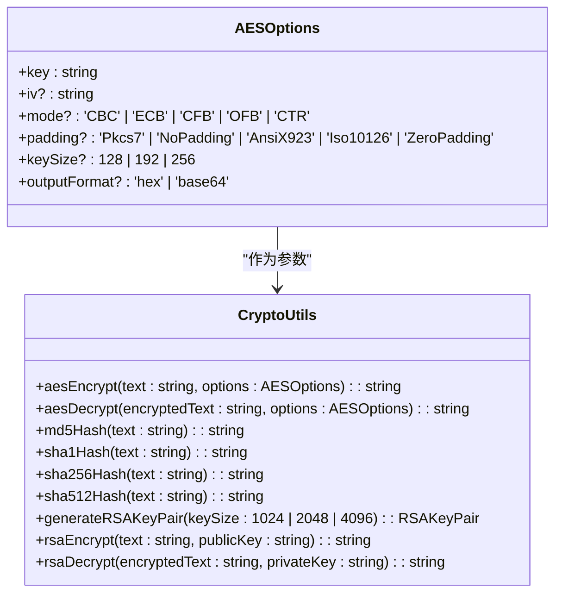
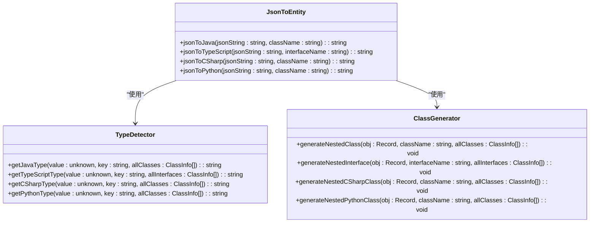
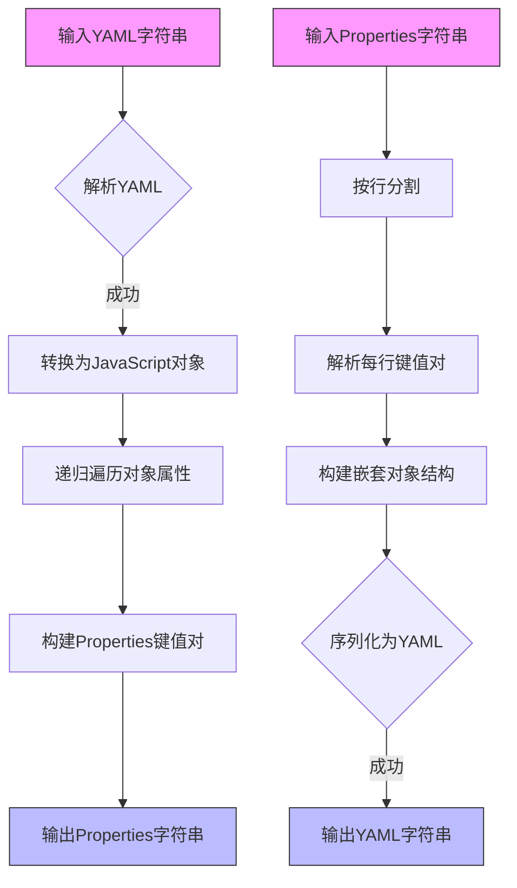

<cite>
**本文档中引用的文件**
- [index.ts](file://src/utils/index.ts)
- [cryptoUtils.ts](file://src/utils/cryptoUtils.ts)
- [jsonToEntity.ts](file://src/utils/jsonToEntity.ts)
- [yamlUtils.ts](file://src/utils/yamlUtils.ts)
- [websocketUtils.ts](file://src/utils/websocketUtils.ts)
- [mqttUtils.ts](file://src/utils/mqttUtils.ts)
- [types/index.ts](file://src/types/index.ts)
</cite>

## 目录
1. [工具函数库概述](#工具函数库概述)
2. [核心工具函数接口规范](#核心工具函数接口规范)
3. [加密算法封装与调用](#加密算法封装与调用)
4. [JSON结构映射为类定义](#json结构映射为类定义)
5. [YAML数据转换逻辑](#yaml数据转换逻辑)
6. [WebSocket通信协议抽象](#websocket通信协议抽象)
7. [MQTT通信协议抽象](#mqtt通信协议抽象)
8. [最佳实践示例](#最佳实践示例)

## 工具函数库概述

本项目`src/utils`目录下的工具函数库提供了一套完整的前端开发辅助功能，涵盖编码转换、加密解密、数据格式转换和网络通信等多个方面。通过`index.ts`文件的导出聚合模式，实现了对外部引用的简化，使得开发者可以通过单一入口导入所需的所有工具函数。

该工具库的设计遵循模块化原则，每个工具文件专注于特定领域的功能实现，如`cryptoUtils.ts`负责加密算法，`jsonToEntity.ts`处理JSON到实体类的转换等。这种设计不仅提高了代码的可维护性，也便于功能的扩展和测试。

**Section sources**
- [index.ts](file://src/utils/index.ts#L0-L158)

## 核心工具函数接口规范

### 通用工具函数

`index.ts`文件导出了多个通用工具函数，这些函数构成了基础工具集：

- `copyToClipboard(text: string): Promise<boolean>` - 将文本复制到剪贴板
- `formatJson(jsonString: string, indent: number = 2): string` - 格式化JSON字符串
- `compressJson(jsonString: string): string` - 压缩JSON字符串
- `isValidJson(jsonString: string): boolean` - 验证JSON格式有效性
- `validateJsonWithDetails(jsonString: string): { isValid: boolean; error?: string }` - 获取JSON验证的详细错误信息
- `urlEncode(text: string): string` 和 `urlDecode(text: string): string` - URL编码与解码
- `base64Encode(text: string): string` 和 `base64Decode(text: string): string` - Base64编码与解码
- `debounce<T extends (...args: unknown[]) => unknown>(func: T, wait: number): ((...args: Parameters<T>) => void)` - 防抖函数

这些函数均具有清晰的参数说明、返回值类型和异常处理策略，确保了使用的安全性和可靠性。

### 导出聚合模式

`index.ts`采用导出聚合模式，将分散在不同文件中的工具函数统一导出，简化了外部引用。这种模式的优势在于：
1. 提供单一导入入口，减少import语句的数量
2. 隐藏内部文件结构，提高API的稳定性
3. 便于版本管理和向后兼容

**Section sources**
- [index.ts](file://src/utils/index.ts#L0-L158)

## 加密算法封装与调用

### AES加密算法

`cryptoUtils.ts`文件提供了AES加密算法的完整封装，支持多种配置选项：

**Diagram sources**
- [cryptoUtils.ts](file://src/utils/cryptoUtils.ts#L25-L268)

#### 函数签名与参数说明

- `aesEncrypt(text: string, options: AESOptions): string`
  - 参数：待加密文本和加密选项
  - 返回值：加密后的字符串
  - 异常处理：密钥长度不匹配或加密失败时抛出错误

- `aesDecrypt(encryptedText: string, options: AESOptions): string`
  - 参数：已加密文本和解密选项
  - 返回值：解密后的原始文本
  - 异常处理：密钥不匹配、格式错误或解密失败时抛出错误

### RSA非对称加密

RSA加密采用公钥加密、私钥解密的模式，适用于安全通信场景：

- `generateRSAKeyPair(keySize: 1024 | 2048 | 4096 = 2048): RSAKeyPair` - 生成指定长度的密钥对
- `rsaEncrypt(text: string, publicKey: string): string` - 使用公钥加密
- `rsaDecrypt(encryptedText: string, privateKey: string): string` - 使用私钥解密

### 哈希算法

支持多种哈希算法，包括MD5、SHA1、SHA256、SHA512以及HMAC变体，满足不同的安全需求。

**Section sources**
- [cryptoUtils.ts](file://src/utils/cryptoUtils.ts#L0-L268)

## JSON结构映射为类定义

### 多语言支持

`jsonToEntity.ts`文件实现了将JSON结构映射为多种编程语言类定义的功能，目前支持Java、TypeScript、C#和Python四种语言。

**Diagram sources**
- [jsonToEntity.ts](file://src/utils/jsonToEntity.ts#L0-L392)

### 类型推断机制

系统通过递归分析JSON对象的属性值来推断对应的语言类型：

- 字符串 → Java: String, TypeScript: string, C#: string, Python: str
- 数字 → 整数/浮点数根据是否包含小数点判断
- 布尔值 → 对应语言的布尔类型
- 数组 → 泛型集合类型（如List<T>、T[]）
- 对象 → 嵌套类或接口

### 生成策略

1. 主类以用户指定的名称创建
2. 嵌套对象生成独立的类，并按复杂度排序
3. 属性名自动转换为驼峰命名
4. 自动生成getter/setter方法（Java/C#）或接口定义（TypeScript）

**Section sources**
- [jsonToEntity.ts](file://src/utils/jsonToEntity.ts#L0-L392)

## YAML数据转换逻辑

### 双向转换

`yamlUtils.ts`文件借助js-yaml库实现了YAML与Properties格式之间的双向转换：

**Diagram sources**
- [yamlUtils.ts](