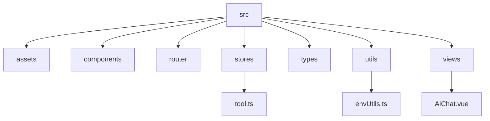
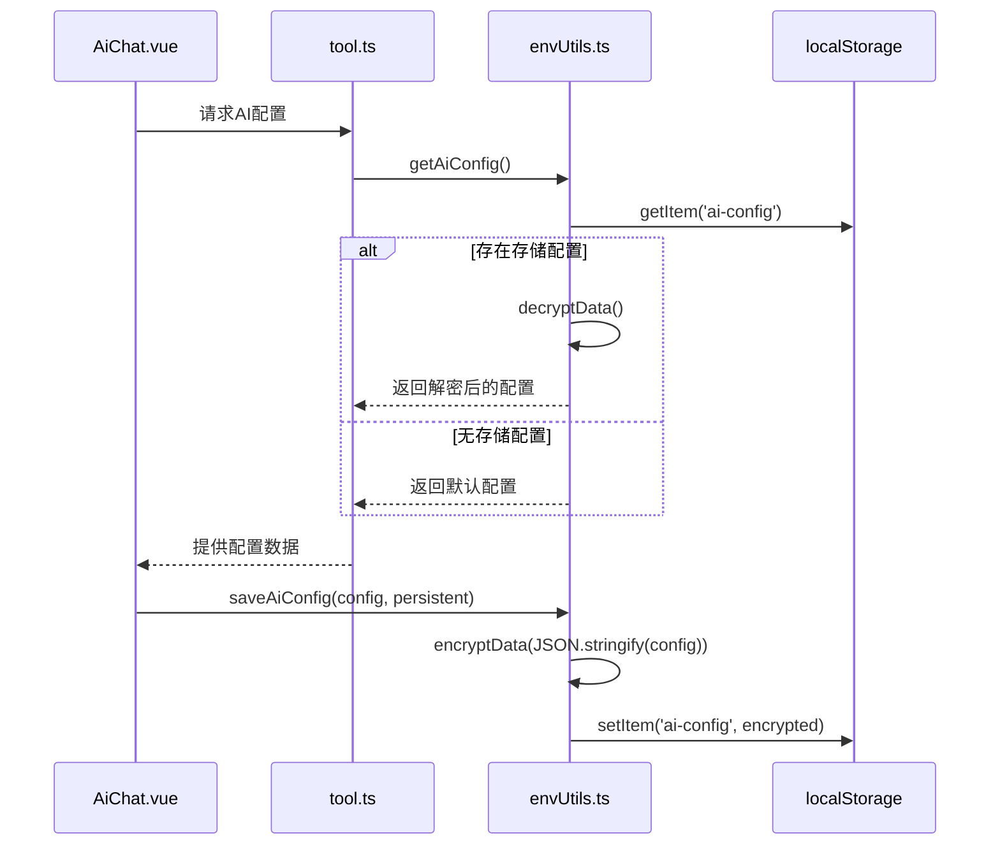
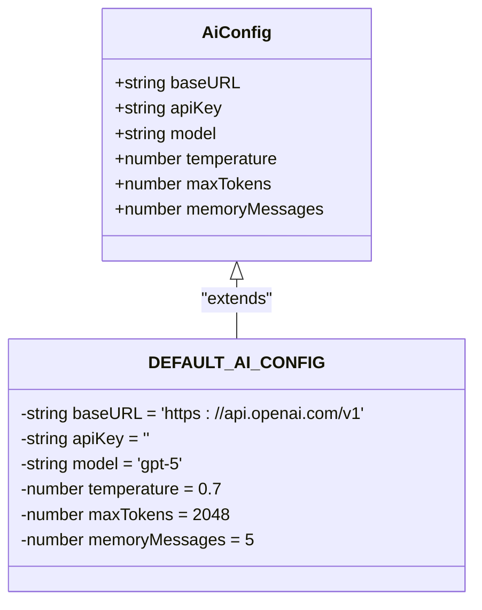
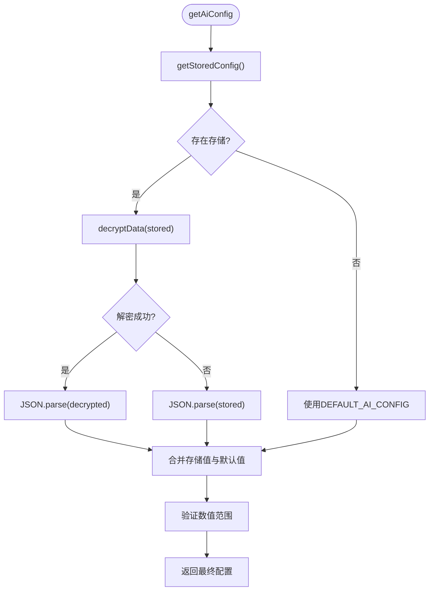
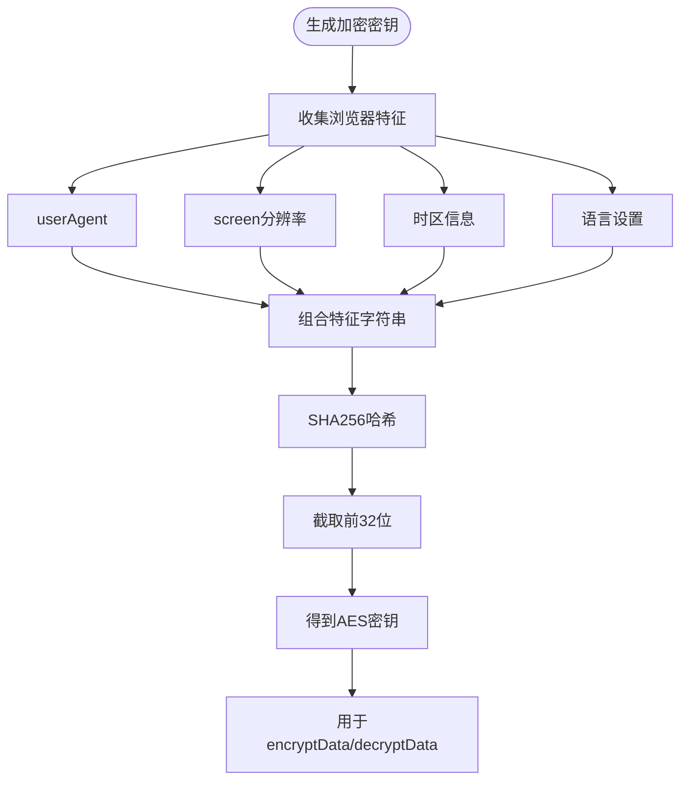
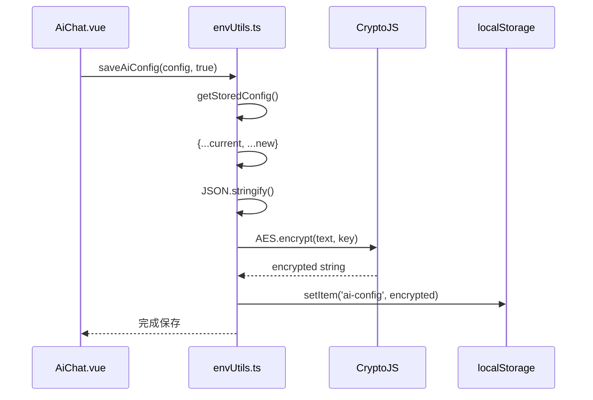
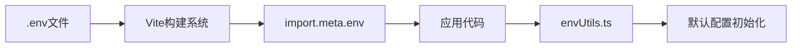

# 环境与配置工具

<cite>
**本文档引用文件**  
- [envUtils.ts](file://src/utils/envUtils.ts)
- [AiChat.vue](file://src/views/ai/AiChat.vue)
- [tool.ts](file://src/stores/tool.ts)
- [DEPLOY.md](file://DEPLOY.md)
- [vite.config.ts](file://vite.config.ts)
</cite>

## 目录
1. [简介](#简介)
2. [项目结构](#项目结构)
3. [核心组件](#核心组件)
4. [架构概述](#架构概述)
5. [详细组件分析](#详细组件分析)
6. [依赖分析](#依赖分析)
7. [性能考虑](#性能考虑)
8. [故障排除指南](#故障排除指南)
9. [结论](#结论)

## 简介
本项目是一个前端开发工具集，提供多种实用工具，包括AI对话、JSON处理、编码转换、加解密、通信测试等。`envUtils.ts` 是核心的环境变量管理模块，负责从Vite环境变量中提取并验证应用配置，并通过加密方式在本地存储用户设置。

## 项目结构
项目采用标准的Vue 3 + Vite架构，遵循模块化设计原则。主要目录包括：
- `src/assets`: 静态资源文件
- `src/components`: 可复用UI组件
- `src/router`: 路由配置
- `src/stores`: Pinia状态管理
- `src/types`: 类型定义
- `src/utils`: 工具函数集合
- `src/views`: 页面视图组件



**图表来源**
- [envUtils.ts](file://src/utils/envUtils.ts)
- [AiChat.vue](file://src/views/ai/AiChat.vue)
- [tool.ts](file://src/stores/tool.ts)

**章节来源**
- [envUtils.ts](file://src/utils/envUtils.ts)
- [project_structure]

## 核心组件
`envUtils.ts` 提供了完整的AI配置管理功能，包括获取、保存、验证和加密操作。它通过类型安全的方式封装环境变量，确保编译期检查和运行时验证。

**章节来源**
- [envUtils.ts](file://src/utils/envUtils.ts#L8-L15)

## 架构概述
系统采用分层架构，`envUtils.ts` 作为工具层服务于视图层和状态管理层。AI配置数据流如下：Vite环境变量 → `envUtils.ts` 解析验证 → Pinia store 状态管理 → Vue组件使用。



**图表来源**
- [envUtils.ts](file://src/utils/envUtils.ts#L31-L48)
- [AiChat.vue](file://src/views/ai/AiChat.vue#L100-L120)
- [tool.ts](file://src/stores/tool.ts#L14-L367)

## 详细组件分析

### AI配置管理分析
`envUtils.ts` 实现了完整的AI配置生命周期管理，包含类型定义、默认值设置、范围验证和加密存储。

#### 类型安全封装


**图表来源**
- [envUtils.ts](file://src/utils/envUtils.ts#L8-L15)

#### 配置获取流程


**图表来源**
- [envUtils.ts](file://src/utils/envUtils.ts#L31-L48)
- [envUtils.ts](file://src/utils/envUtils.ts#L90-L108)

#### 加密机制分析


**图表来源**
- [envUtils.ts](file://src/utils/envUtils.ts#L53-L63)

#### 配置保存流程


**图表来源**
- [envUtils.ts](file://src/utils/envUtils.ts#L115-L134)
- [AiChat.vue](file://src/views/ai/AiChat.vue#L150-L170)

### 环境变量关联机制
虽然当前实现主要依赖本地存储而非Vite环境变量，但可以通过`.env`文件进行初始配置。Vite会自动加载`.env`文件中的变量到`import.meta.env`。



**图表来源**
- [vite.config.ts](file://vite.config.ts)
- [env.d.ts](file://env.d.ts)

## 依赖分析
`envUtils.ts` 模块依赖关系清晰，仅引入必要的外部库和内部模块。

```mermaid
erDiagram
COMPONENT ||--o{ UTILS : "uses"
COMPONENT ||--o{ STORES : "reads/writes"
UTILS ||--o{ STORAGE : "localStorage"
UTILS ||--o{ CRYPTO : "CryptoJS"
STORES ||--o{ COMPONENT : "provides state"
class UTILS {
envUtils.ts
}
class STORAGE {
localStorage
}
class CRYPTO {
CryptoJS
}
class STORES {
tool.ts
}
class COMPONENT {
AiChat.vue
}
```

**图表来源**
- [package.json]
- [envUtils.ts](file://src/utils/envUtils.ts)
- [AiChat.vue](file://src/views/ai/AiChat.vue)
- [tool.ts](file://src/stores/tool.ts)

## 性能考虑
`envUtils.ts` 在性能方面做了合理优化：
- 使用防抖和节流避免频繁读写
- 数值范围验证防止无效配置
- 错误处理保证异常情况下的可用性
- 浏览器特征指纹确保密钥稳定性

## 故障排除指南
根据 `DEPLOY.md` 文档，部署时需注意以下几点：

**章节来源**
- [DEPLOY.md](file://DEPLOY.md#L0-L109)

### 常见问题及解决方案
1. **页面刷新404错误**
   - **原因**: 服务器未正确配置SPA路由回退
   - **解决**: 配置服务器将所有未匹配路由指向 `/tools/index.html`

2. **静态资源404**
   - **原因**: base路径配置不正确
   - **解决**: 确保Vite配置的base路径与服务器部署路径一致

3. **CSS/JS文件路径错误**
   - **原因**: 构建时未正确应用base路径
   - **解决**: 重新构建，确认 `vite.config.ts` 中的base配置正确

4. **配置无法持久化**
   - **原因**: 浏览器禁用了localStorage或处于隐私模式
   - **解决**: 提示用户检查浏览器设置，或使用其他设备

5. **加密密钥不稳定**
   - **原因**: 浏览器特征发生变化（如分辨率调整）
   - **解决**: 清除现有配置重新设置，或改进密钥生成算法

## 结论
`envUtils.ts` 模块通过类型安全的接口定义、合理的默认值设置、严格的范围验证和加密存储机制，为应用提供了可靠的配置管理方案。尽管当前实现侧重于客户端本地存储，但仍可通过`.env`文件与Vite环境变量集成，满足不同部署场景的需求。建议运维人员遵循 `DEPLOY.md` 指南进行部署，并注意敏感信息保护，避免API密钥等重要信息泄露。