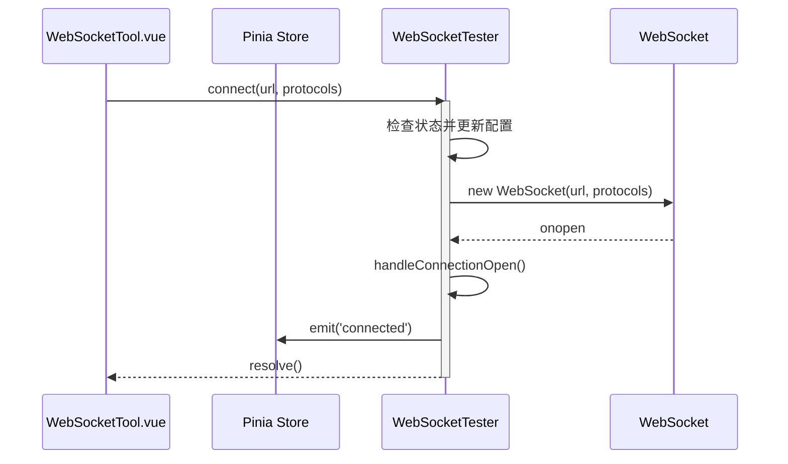
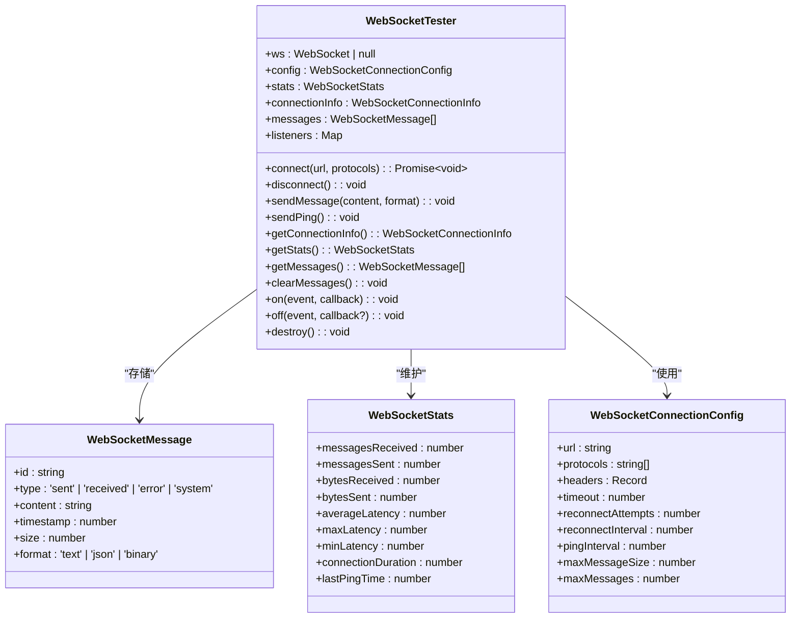

# 通信协议工具

<cite>
**本文档引用文件**   
- [websocketUtils.ts](file://src/utils/websocketUtils.ts)
- [mqttUtils.ts](file://src/utils/mqttUtils.ts)
- [WebSocketTool.vue](file://src/views/communication/WebSocketTool.vue)
- [MqttTool.vue](file://src/views/communication/MqttTool.vue)
- [index.ts](file://src/types/index.ts)
- [tool.ts](file://src/stores/tool.ts)
</cite>

## 目录
1. [引言](#引言)
2. [WebSocket 工具封装设计](#websocket-工具封装设计)
3. [MQTT 工具封装设计](#mqtt-工具封装设计)
4. [统一接口暴露与状态管理](#统一接口暴露与状态管理)
5. [异常处理策略](#异常处理策略)
6. [调试技巧与日志建议](#调试技巧与日志建议)

## 引言
本项目通过 `websocketUtils.ts` 和 `mqttUtils.ts` 两个核心工具模块，对 WebSocket 和 MQTT 实时通信协议进行了系统化封装。这些工具为前端组件 `WebSocketTool.vue` 和 `MqttTool.vue` 提供了简洁、一致的 API 接口，同时隐藏了底层复杂的事件监听、连接状态管理和错误处理逻辑。本文档将深入分析这两个工具的设计实现，涵盖连接建立、消息收发、心跳维持、重连机制等关键功能，并阐述其如何统一暴露接口以及在异常场景下的处理策略。

## WebSocket 工具封装设计

### 连接建立与配置管理
`WebSocketTester` 类负责管理 WebSocket 连接的全生命周期。其构造函数接收一个部分可选的 `WebSocketConnectionConfig` 配置对象，该对象定义了连接 URL、子协议、超时时间、重连次数、心跳间隔等参数。实例化时会合并默认配置，确保即使不传参也能正常工作。

连接通过 `connect(url, protocols)` 方法发起。该方法首先检查当前连接状态，防止重复连接。若目标 URL 发生变化，则清空历史消息和统计信息。随后创建原生 `WebSocket` 实例，并设置事件监听器（`onopen`, `onmessage`, `onclose`, `onerror`），同时引入连接超时机制，避免因网络问题导致长时间无响应。



**图示来源**
- [websocketUtils.ts](file://src/utils/websocketUtils.ts#L93-L151)
- [WebSocketTool.vue](file://src/views/communication/WebSocketTool.vue#L108-L137)

### 心跳维持与延迟检测
为了保持长连接活跃并检测网络连通性，`WebSocketTester` 实现了基于定时器的心跳机制。当连接成功后，`startPingTimer()` 方法会启动一个周期性任务，每隔 `pingInterval`（默认 60 秒）调用一次 `sendPing()` 方法。

`sendPing()` 并非使用 WebSocket 协议的 Ping/Pong 帧，而是发送一条包含时间戳的 JSON 消息（`{ type: 'ping', timestamp: ... }`）。当服务端回传 `{ type: 'pong' }` 消息时，`handleMessage()` 方法会解析此消息，并计算从发出 Ping 到收到 Pong 的时间差作为延迟（Latency），用于性能监控。

```mermaid
flowchart TD
A[连接成功] --> B[启动心跳定时器]
B --> C{是否到达 pingInterval?}
C -- 是 --> D[发送Ping消息<br/>{type: 'ping', timestamp}]
D --> E[等待Pong响应]
E --> F{收到Pong消息?}
F -- 是 --> G[计算延迟 = 当前时间 - 发送时间]
G --> H[更新统计信息 stats.lastPingTime]
F -- 否 --> I[延迟未知]
C -- 否 --> J[继续等待]
```

**图示来源**
- [websocketUtils.ts](file://src/utils/websocketUtils.ts#L156-L163)
- [websocketUtils.ts](file://src/utils/websocketUtils.ts#L284-L326)

### 消息收发与格式处理
消息发送由 `sendMessage(content, format)` 方法完成。它首先检查连接状态和消息大小（受 `maxMessageSize` 限制），然后根据指定的格式（文本、JSON、二进制）进行处理。对于二进制数据，使用 `TextEncoder` 编码后发送；其他格式则直接发送字符串。

消息接收由 `onmessage` 事件触发，`handleMessage(event)` 方法负责处理。它能自动识别 ArrayBuffer（标记为 binary）、纯字符串（text）和有效的 JSON 字符串（json）。对于 JSON 格式的消息，还会特别检查是否为 Pong 响应以计算延迟。



**图示来源**
- [websocketUtils.ts](file://src/utils/websocketUtils.ts#L115-L151)
- [websocketUtils.ts](file://src/utils/websocketUtils.ts#L284-L326)
- [index.ts](file://src/types/index.ts#L64-L74)

### 重连机制
当连接意外断开（`onclose` 事件触发）且非手动断开时，`handleConnectionClose(event)` 方法会启动重连流程。它会检查当前重连次数是否小于 `reconnectAttempts`，如果满足条件，则将状态置为 `reconnecting`，递增重连计数，并通过 `setTimeout` 在 `reconnectInterval` 毫秒后尝试重新连接。

此过程是递归的：每次重连失败都会再次触发 `handleConnectionClose`，直到达到最大重试次数或用户手动断开连接。这有效应对了短暂的网络中断。

**代码片段