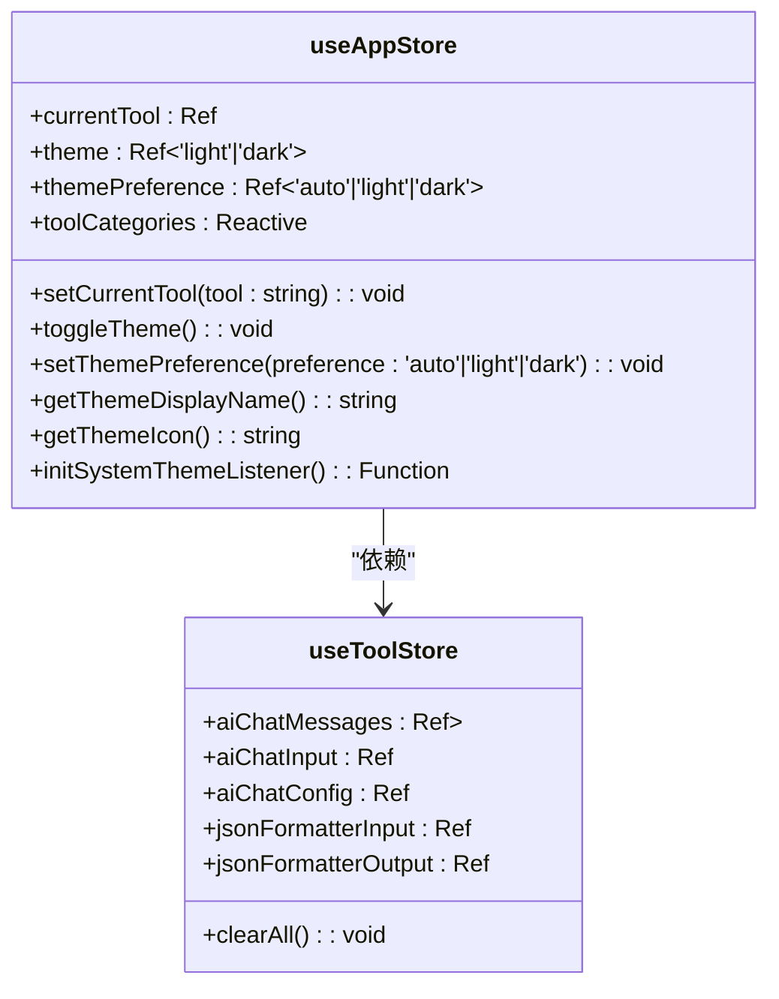
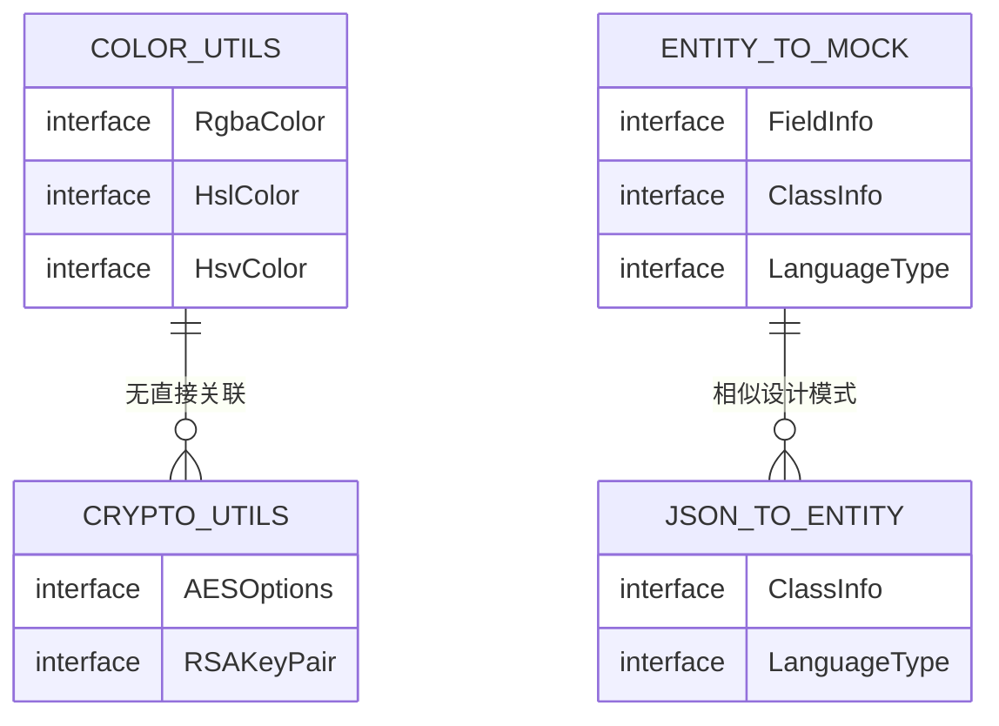
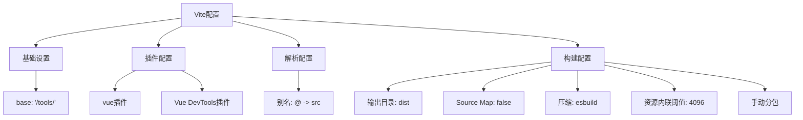
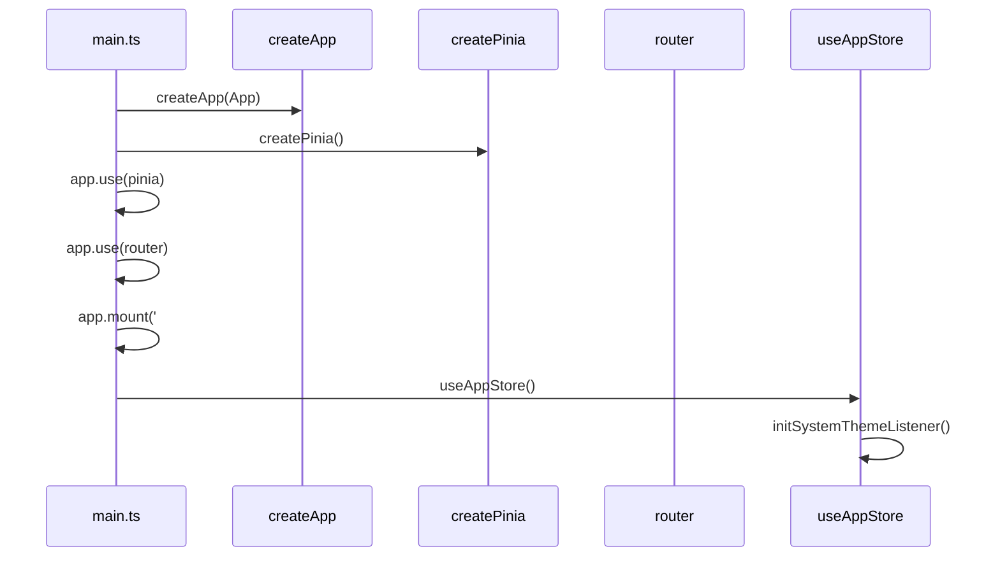

# 技术栈与架构

<cite>
**本文档引用的文件**
- [vite.config.ts](file://vite.config.ts)
- [main.ts](file://src/main.ts)
- [app.ts](file://src/stores/app.ts)
- [tool.ts](file://src/stores/tool.ts)
- [colorUtils.ts](file://src/utils/colorUtils.ts)
- [cryptoUtils.ts](file://src/utils/cryptoUtils.ts)
- [entityToMock.ts](file://src/utils/entityToMock.ts)
- [envUtils.ts](file://src/utils/envUtils.ts)
- [jsonToEntity.ts](file://src/utils/jsonToEntity.ts)
- [markdownUtils.ts](file://src/utils/markdownUtils.ts)
- [mqttUtils.ts](file://src/utils/mqttUtils.ts)
- [qrcodeUtils.ts](file://src/utils/qrcodeUtils.ts)
- [websocketUtils.ts](file://src/utils/websocketUtils.ts)
- [yamlUtils.ts](file://src/utils/yamlUtils.ts)
- [index.ts](file://src/types/index.ts)
</cite>

## 目录
1. [项目结构](#项目结构)
2. [核心框架分析](#核心框架分析)
3. [状态管理机制](#状态管理机制)
4. [类型安全体系](#类型安全体系)
5. [构建配置详解](#构建配置详解)
6. [应用初始化流程](#应用初始化流程)
7. [Vite创新优势](#vite创新优势)

## 项目结构

```mermaid
graph TD
A[src] --> B[assets]
A --> C[components]
A --> D[router]
A --> E[stores]
A --> F[types]
A --> G[utils]
A --> H[views]
A --> I[App.vue]
A --> J[main.ts]
B --> K[base.css]
B --> L[main.css]
C --> M[AppLayout.vue]
C --> N[CodeEditor.vue]
C --> O[ToolPanel.vue]
D --> P[index.ts]
E --> Q[app.ts]
E --> R[tool.ts]
F --> S[index.ts]
F --> T[qrcode-reader.d.ts]
G --> U[colorUtils.ts]
G --> V[cryptoUtils.ts]
G --> W[entityToMock.ts]
G --> X[envUtils.ts]
G --> Y[jsonToEntity.ts]
G --> Z[markdownUtils.ts]
G --> AA[mqttUtils.ts]
G --> AB[qrcodeUtils.ts]
G --> AC[websocketUtils.ts]
G --> AD[yamlUtils.ts]
H --> AE[ai]
H --> AF[color]
H --> AG[communication]
H --> AH[crypto]
H --> AI[encode]
H --> AJ[json]
H --> AK[jwt]
H --> AL[qrcode]
H --> AM[regex]
H --> AN[time]
H --> AO[yaml]
H --> AP[Home.vue]
```

**图示来源**
- [src](file://src)

**本节来源**
- [src](file://src)

## 核心框架分析

Vue 3的组合式API在本项目中得到了充分应用，显著提升了代码组织效率。通过`setup()`函数和Composition API，开发者能够将相关逻辑集中在一起，而不是分散在Options API的不同选项中。

在`src/stores/app.ts`和`src/stores/tool.ts`中，使用`defineStore`配合`ref`、`reactive`等响应式API创建了Pinia store。这种模式使得状态管理更加直观和类型安全。例如，在`app.ts`中，`currentTool`、`themePreference`等状态都使用`ref`进行声明，而`toolCategories`则使用`reactive`来管理复杂对象。

组合式API的优势体现在：
- **逻辑复用**：可以通过自定义Hook（如`useAppStore`）轻松复用逻辑
- **类型推断**：TypeScript能更好地推断组合式API中的类型
- **代码组织**：相关逻辑可以集中在一起，提高可读性
- **性能优化**：只有被使用的响应式数据才会被追踪

**本节来源**
- [app.ts](file://src/stores/app.ts#L1-L307)
- [tool.ts](file://src/stores/tool.ts#L1-L369)

## 状态管理机制

Pinia作为Vue生态系统推荐的状态管理库，在本项目中展现了其诸多优势。相比于Vuex，Pinia提供了更简洁的API、更好的TypeScript支持和更灵活的模块化设计。

### Pinia核心优势

1. **极简API设计**：无需mutations，actions可以直接修改state
2. **优秀的TypeScript集成**：自动类型推断，减少类型声明
3. **模块化架构**：每个store都是独立的，易于维护
4. **DevTools集成**：开箱即用的开发工具支持

在`src/stores/app.ts`中，`useAppStore`定义了应用级别的状态，包括当前工具选择、主题偏好和工具分类列表。这些状态通过`return`语句暴露给组件使用，实现了清晰的API边界。

**图示来源**
- [app.ts](file://src/stores/app.ts#L1-L307)
- [tool.ts](file://src/stores/tool.ts#L1-L369)

**本节来源**
- [app.ts](file://src/stores/app.ts#L1-L307)
- [tool.ts](file://src/stores/tool.ts#L1-L369)

## 类型安全体系

TypeScript在本项目中发挥了关键作用，为整个应用提供了强大的类型安全保障。通过静态类型检查，有效减少了运行时错误，提高了代码质量和开发效率。

### 工具函数中的类型应用

在`src/utils`目录下的各个工具函数中，TypeScript的应用尤为突出：

- `colorUtils.ts`：定义了`RgbaColor`、`HslColor`、`HsvColor`等接口，确保颜色操作的类型安全
- `cryptoUtils.ts`：使用`AESOptions`接口规范加密参数，避免错误配置
- `entityToMock.ts`：通过`FieldInfo`、`ClassInfo`等类型定义，保证实体类解析的准确性
- `jsonToEntity.ts`：利用泛型和联合类型处理多种编程语言的实体类生成

**图示来源**
- [colorUtils.ts](file://src/utils/colorUtils.ts#L1-L283)
- [cryptoUtils.ts](file://src/utils/cryptoUtils.ts#L1-L269)
- [entityToMock.ts](file://src/utils/entityToMock.ts#L1-L572)
- [jsonToEntity.ts](file://src/utils/jsonToEntity.ts#L1-L393)

**本节来源**
- [colorUtils.ts](file://src/utils/colorUtils.ts#L1-L283)
- [cryptoUtils.ts](file://src/utils/cryptoUtils.ts#L1-L269)
- [entityToMock.ts](file://src/utils/entityToMock.ts#L1-L572)
- [jsonToEntity.ts](file://src/utils/jsonToEntity.ts#L1-L393)

## 构建配置详解

`vite.config.ts`文件包含了项目的关键构建设置，这些配置直接影响开发体验和生产环境的性能表现。

### 核心配置项

1. **基础路径设置**：`base: '/tools/'`用于子路径部署
2. **别名配置**：`@`指向`src`目录，简化模块导入
3. **CSS处理**：默认支持现代CSS特性
4. **开发服务器代理**：虽然未在配置中显示，但Vite支持灵活的代理设置

**图示来源**
- [vite.config.ts](file://vite.config.ts#L1-L39)

**本节来源**
- [vite.config.ts](file://vite.config.ts#L1-L39)

## 应用初始化流程

`src/main.ts`文件是应用的入口点，负责初始化整个Vue应用并注入必要的插件和依赖。

### 初始化步骤

1. **导入依赖**：引入Vue核心、Pinia状态管理和路由
2. **创建应用实例**：使用`createApp`创建Vue应用
3. **创建Pinia实例**：使用`createPinia`创建状态管理器
4. **注册插件**：通过`app.use()`注册Pinia和路由
5. **挂载应用**：将应用挂载到DOM元素上
6. **初始化主题监听**：调用`initSystemThemeListener`设置主题变化监听

**图示来源**
- [main.ts](file://src/main.ts#L1-L21)
- [app.ts](file://src/stores/app.ts#L1-L307)

**本节来源**
- [main.ts](file://src/main.ts#L1-L21)
- [app.ts](file://src/stores/app.ts#L1-L307)

## Vite创新优势

相较于传统的Webpack方案，Vite带来了革命性的开发体验提升。其创新之处主要体现在以下几个方面：

### 开发服务器性能

- **基于ESM的原生支持**：利用浏览器对ES模块的原生支持，实现按需编译
- **冷启动速度**：无需打包，启动时间从分钟级降至秒级
- **热更新效率**：精确的模块热替换，更新速度更快

### 生产构建优化

- **Rollup基础**：生产构建基于Rollup，提供优秀的代码分割和tree-shaking
- **预打包依赖**：使用esbuild预打包依赖，速度比传统打包工具快10-100倍
- **智能分包**：在`vite.config.ts`中配置了手动分包策略，将vendor和monaco-editor分离

### 开发者体验

- **TypeScript开箱即用**：无需额外配置即可使用TypeScript
- **JSX/React支持**：同样适用于React项目
- **CSS Modules和PostCSS**：内置支持现代CSS工作流

Vite的这些创新使得开发者能够获得近乎即时的反馈循环，极大地提升了开发效率和体验。

**本节来源**
- [vite.config.ts](file://vite.config.ts#L1-L39)
- [package.json](file://package.json#L1-L20)