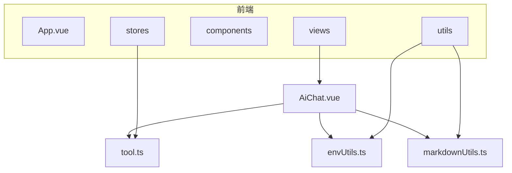

# AI工具

<cite>
**本文档引用文件**
- [AiChat.vue](file://src/views/ai/AiChat.vue)
- [envUtils.ts](file://src/utils/envUtils.ts)
- [markdownUtils.ts](file://src/utils/markdownUtils.ts)
- [tool.ts](file://src/stores/tool.ts)
- [AI_CHAT_GUIDE.md](file://AI_CHAT_GUIDE.md)
- [SECURITY_GUIDE.md](file://SECURITY_GUIDE.md)
</cite>

## 目录
1. [简介](#简介)
2. [项目结构](#项目结构)
3. [核心组件](#核心组件)
4. [架构概述](#架构概述)
5. [详细组件分析](#详细组件分析)
6. [依赖分析](#依赖分析)
7. [性能考虑](#性能考虑)
8. [故障排除指南](#故障排除指南)
9. [结论](#结论)

## 简介
本项目是一个功能丰富的开发者工具集，其中包含一个强大的AI对话助手。该助手支持与多种大语言模型进行交互，包括OpenAI、Claude、Gemini等主流服务。用户可以通过界面配置API信息，实现与AI的实时对话。系统采用流式响应技术，提供流畅的用户体验，并支持消息记忆、内容过滤和敏感信息拦截等安全特性。

## 项目结构
项目采用Vue 3框架构建，使用TypeScript作为主要开发语言。整体结构清晰，分为资产、组件、路由、状态管理、类型定义、工具函数、视图等多个模块。AI对话功能位于`src/views/ai/AiChat.vue`，通过Pinia进行状态管理，利用Vite进行构建。



**图表来源**
- [AiChat.vue](file://src/views/ai/AiChat.vue)
- [tool.ts](file://src/stores/tool.ts)
- [envUtils.ts](file://src/utils/envUtils.ts)
- [markdownUtils.ts](file://src/utils/markdownUtils.ts)

**章节来源**
- [AiChat.vue](file://src/views/ai/AiChat.vue)
- [tool.ts](file://src/stores/tool.ts)

## 核心组件
AI对话助手的核心是`AiChat.vue`组件，它负责处理用户输入、与后端AI服务通信、渲染响应内容以及管理对话历史。组件通过Pinia存储（`tool.ts`）维护对话消息、配置信息和加载状态。用户输入经过预处理后发送到指定的AI服务，响应以流式方式接收并实时渲染。

**章节来源**
- [AiChat.vue](file://src/views/ai/AiChat.vue)
- [tool.ts](file://src/stores/tool.ts)

## 架构概述
系统采用前后端分离架构，前端负责用户界面和交互逻辑，后端AI服务由第三方提供。`AiChat.vue`组件作为主要入口，通过HTTP请求与AI服务交互。配置信息通过`envUtils.ts`进行加密存储，确保安全性。Markdown内容通过`markdownUtils.ts`进行安全渲染，防止XSS攻击。

```mermaid
sequenceDiagram
    participant 用户 as "用户"
    participant 前端 as "AiChat.vue"
    participant 工具类 as "envUtils.ts"
    participant 渲染器 as "markdownUtils.ts"
    participant AI服务 as "第三方AI服务"

    用户->>前端: 输入问题并发送
    前端->>工具类: