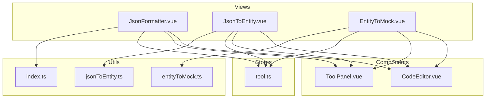
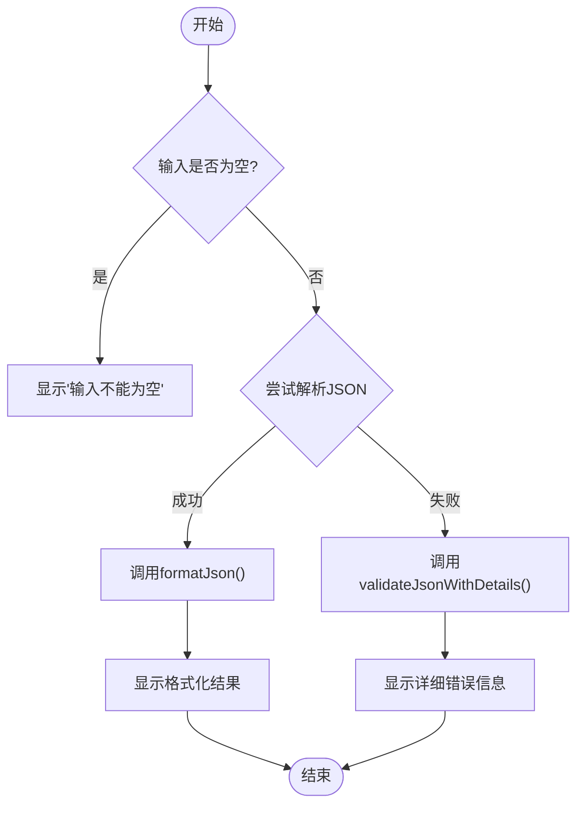
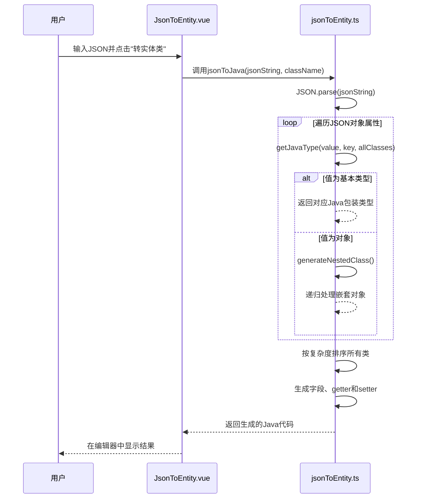
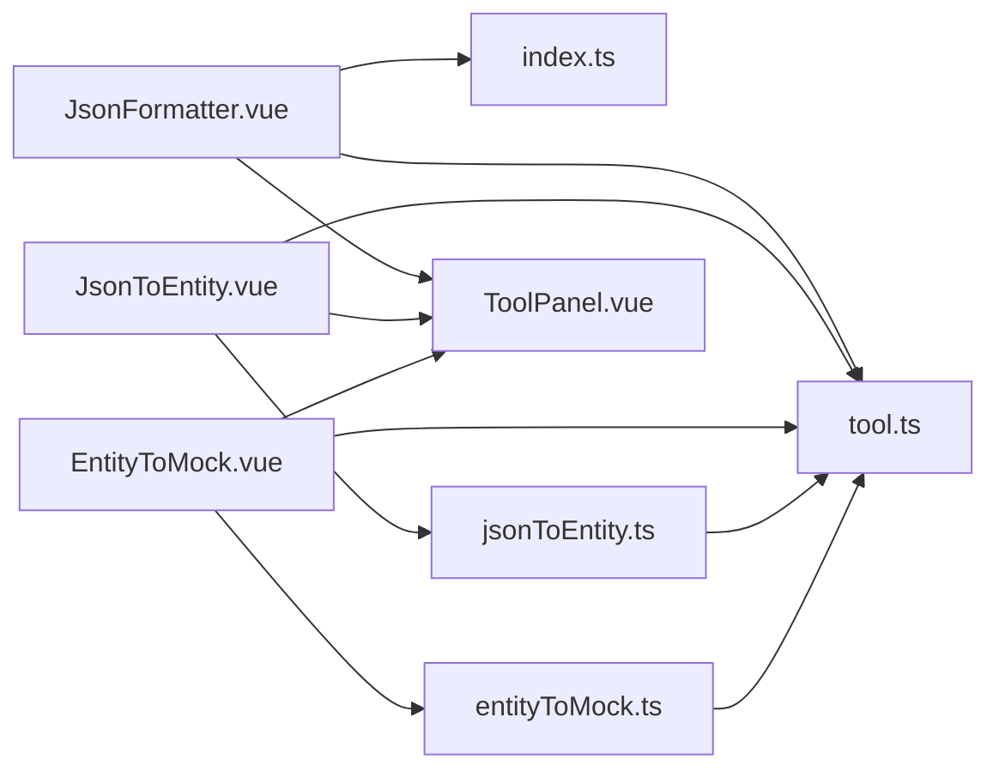

# JSON处理套件

<cite>
**本文档引用文件**
- [JsonFormatter.vue](file://src/views/json/JsonFormatter.vue)
- [JsonToEntity.vue](file://src/views/json/JsonToEntity.vue)
- [EntityToMock.vue](file://src/views/json/EntityToMock.vue)
- [jsonToEntity.ts](file://src/utils/jsonToEntity.ts)
- [entityToMock.ts](file://src/utils/entityToMock.ts)
- [index.ts](file://src/utils/index.ts)
- [tool.ts](file://src/stores/tool.ts)
</cite>

## 目录
1. [简介](#简介)
2. [项目结构](#项目结构)
3. [核心功能组件](#核心功能组件)
4. [架构概览](#架构概览)
5. [详细组件分析](#详细组件分析)
6. [依赖关系分析](#依赖关系分析)
7. [性能优化建议](#性能优化建议)
8. [故障排查指南](#故障排查指南)
9. [结论](#结论)

## 简介
本技术文档全面构建JSON工具集的技术说明，覆盖格式化、实体类转换和Mock数据生成三大核心功能。文档详细阐述了`JsonFormatter.vue`中美化算法的调用过程及语法高亮集成方式；解析了`JsonToEntity.vue`中的类型推断逻辑与多语言模板生成机制（支持Java、TypeScript、C#、Python）；阐明了`EntityToMock.vue`的数据模拟策略与随机值生成规则。同时提供各工具间的数据流转示例，展示从原始JSON到代码再到测试数据的完整工作流，并包含针对大文件处理和内存占用控制的性能优化建议。

## 项目结构
本项目采用基于Vue 3 + TypeScript的前端架构，遵循模块化设计原则，将不同功能的工具组件分离管理。核心JSON处理工具位于`src/views/json/`目录下，包括三个主要功能组件：`JsonFormatter.vue`（JSON格式化）、`JsonToEntity.vue`（JSON转实体类）和`EntityToMock.vue`（实体类转Mock数据）。这些组件通过Pinia状态管理库（`src/stores/tool.ts`）共享数据，并利用`src/utils/`目录下的工具函数实现具体业务逻辑。



**图表来源**
- [JsonFormatter.vue](file://src/views/json/JsonFormatter.vue)
- [JsonToEntity.vue](file://src/views/json/JsonToEntity.vue)
- [EntityToMock.vue](file://src/views/json/EntityToMock.vue)
- [jsonToEntity.ts](file://src/utils/jsonToEntity.ts)
- [entityToMock.ts](file://src/utils/entityToMock.ts)
- [index.ts](file://src/utils/index.ts)
- [tool.ts](file://src/stores/tool.ts)

**章节来源**
- [JsonFormatter.vue](file://src/views/json/JsonFormatter.vue)
- [JsonToEntity.vue](file://src/views/json/JsonToEntity.vue)
- [EntityToMock.vue](file://src/views/json/EntityToMock.vue)

## 核心功能组件
本工具集的核心由三大功能组件构成，分别负责JSON数据的格式化、实体类转换和Mock数据生成。这些组件均继承自通用的`ToolPanel`布局组件，并使用`CodeEditor`作为输入输出界面，确保了用户界面的一致性。所有组件的状态数据（如输入文本、输出结果、配置选项等）都集中存储在`useToolStore`中，实现了跨组件的数据共享和状态同步。

**章节来源**
- [JsonFormatter.vue](file://src/views/json/JsonFormatter.vue)
- [JsonToEntity.vue](file://src/views/json/JsonToEntity.vue)
- [EntityToMock.vue](file://src/views/json/EntityToMock.vue)
- [tool.ts](file://src/stores/tool.ts)

## 架构概览
整个JSON工具集的架构清晰地分为三层：视图层（View）、逻辑层（Logic）和工具层（Utility）。视图层由三个独立的Vue组件构成，负责用户交互和界面展示。逻辑层嵌入在每个组件的`<script setup>`中，处理用户操作事件并调用相应的工具函数。工具层则由`src/utils/`目录下的多个模块组成，提供了无副作用的纯函数来执行具体的转换和验证任务。这种分层架构使得代码职责分明，易于维护和扩展。

```mermaid
graph TD
A[视图层] --> B[逻辑层]
B --> C[工具层]
subgraph A
D[JsonFormatter.vue]
E[JsonToEntity.vue]
F[EntityToMock.vue]
end
subgraph B
G[formatJson()]
H[convertToEntity()]
I[generateJsonMock()]
end
subgraph C
J[formatJsonUtil]
K[jsonToJava, jsonToTypeScript...]
L[generateJsonBodyMockWithLanguage]
end
D --> G
E --> H
F --> I
G --> J
H --> K
I --> L
```

**图表来源**
- [JsonFormatter.vue](file://src/views/json/JsonFormatter.vue)
- [JsonToEntity.vue](file://src/views/json/JsonToEntity.vue)
- [EntityToMock.vue](file://src/views/json/EntityToMock.vue)
- [jsonToEntity.ts](file://src/utils/jsonToEntity.ts)
- [entityToMock.ts](file://src/utils/entityToMock.ts)
- [index.ts](file://src/utils/index.ts)

## 详细组件分析
本节对三个核心组件进行深入分析，揭示其内部实现机制和关键算法。

### JsonFormatter.vue 分析
`JsonFormatter.vue`组件为用户提供JSON格式化、压缩和验证的一站式服务。其核心是调用`utils/index.ts`中的工具函数来处理JSON字符串。

#### 功能流程图


**图表来源**
- [JsonFormatter.vue](file://src/views/json/JsonFormatter.vue#L152-L171)
- [index.ts](file://src/utils/index.ts#L18-L96)

**章节来源**
- [JsonFormatter.vue](file://src/views/json/JsonFormatter.vue)
- [index.ts](file://src/utils/index.ts)

### JsonToEntity.vue 分析
`JsonToEntity.vue`组件实现了将JSON数据自动转换为多种编程语言实体类的功能。其核心在于`utils/jsonToEntity.ts`模块中的类型推断和代码生成逻辑。

#### 类型推断与代码生成序列图


**图表来源**
- [JsonToEntity.vue](file://src/views/json/JsonToEntity.vue#L108-L148)
- [jsonToEntity.ts](file://src/utils/jsonToEntity.ts#L223-L391)

**章节来源**
- [JsonToEntity.vue](file://src/views/json/JsonToEntity.vue)
- [jsonToEntity.ts](file://src/utils/jsonToEntity.ts)

### EntityToMock.vue 分析
`EntityToMock.vue`组件能够将Java或Golang的实体类代码解析，并生成符合业务逻辑的Mock数据。其核心是`utils/entityToMock.ts`模块中的代码解析和智能值生成算法。

#### 数据模拟策略流程图
```mermaid
flowchart TD
A[开始] --> B{选择语言}
B --> |Java| C[调用parseJavaEntity()]
B --> |Golang| D[调用parseGolangStruct()]
C --> E[提取字段名和类型]
D --> E
E --> F{字段是否为自定义类型?}
F --> |是| G[递归生成嵌套对象]
F --> |否| H[调用generateMockValue()]
H --> I{根据字段名智能匹配}
I --> |name/email/id| J[返回预设值]
I --> |price/amount| K[返回数值]
I --> |active/enable| L[返回布尔值]
G --> M[组合成最终Mock对象]
J --> M
K --> M
L --> M
M --> N[JSON.stringify输出]
```

**图表来源**
- [EntityToMock.vue](file://src/views/json/EntityToMock.vue#L241-L275)
- [entityToMock.ts](file://src/utils/entityToMock.ts#L397-L570)

**章节来源**
- [EntityToMock.vue](file://src/views/json/EntityToMock.vue)
- [entityToMock.ts](file://src/utils/entityToMock.ts)

## 依赖关系分析
本工具集的依赖关系清晰且低耦合。三个主视图组件之间没有直接依赖，它们通过共享的`toolStore`进行间接通信。所有复杂的业务逻辑都被封装在`utils/`目录下的独立模块中，这些模块不依赖于Vue的响应式系统，可以作为纯函数被复用。`ToolPanel`和`CodeEditor`作为通用UI组件，被所有工具所依赖，保证了界面风格的统一。



**图表来源**
- [go.mod](file://package.json)
- [JsonFormatter.vue](file://src/views/json/JsonFormatter.vue)
- [JsonToEntity.vue](file://src/views/json/JsonToEntity.vue)
- [EntityToMock.vue](file://src/views/json/EntityToMock.vue)
- [jsonToEntity.ts](file://src/utils/jsonToEntity.ts)
- [entityToMock.ts](file://src/utils/entityToMock.ts)
- [tool.ts](file://src/stores/tool.ts)

**章节来源**
- [package.json](file://package.json)
- [JsonFormatter.vue](file://src/views/json/JsonFormatter.vue)
- [JsonToEntity.vue](file://src/views/json/JsonToEntity.vue)
- [EntityToMock.vue](file://src/views/json/EntityToMock.vue)

## 性能优化建议
尽管当前工具集已能满足大部分使用场景，但在处理超大JSON文件时仍可能面临性能瓶颈。以下是一些优化建议：

1.  **大文件分块处理**：对于巨大的JSON输入，应避免一次性加载和解析。可引入流式解析器（如Oboe.js），边接收数据边处理，减少内存峰值占用。
2.  **Web Worker异步处理**：将`JSON.parse()`、`JSON.stringify()`以及复杂的代码生成逻辑移至Web Worker中执行，防止阻塞主线程，确保UI的流畅响应。
3.  **内存占用控制**：在`entityToMock.ts`中，当检测到类的深度或广度过大时，应限制递归生成的层数或集合大小，避免因无限递归导致栈溢出或内存耗尽。
4.  **防抖输入**：在未来的版本中，若增加实时预览功能，应对输入事件进行防抖处理，避免过于频繁地触发昂贵的计算任务。

**章节来源**
- [JsonFormatter.vue](file://src/views/json/JsonFormatter.vue)
- [JsonToEntity.vue](file://src/views/json/JsonToEntity.vue)
- [EntityToMock.vue](file://src/views/json/EntityToMock.vue)

## 故障排查指南
本节提供常见问题的解决方案。

### JSON验证失败
*   **现象**：点击“验证”按钮后提示“JSON格式错误”。
*   **原因**：输入的字符串不符合JSON语法规则，如缺少引号、逗号或括号不匹配。
*   **解决**：检查`validateJsonWithDetails`函数返回的错误信息，它会精确指出错误发生的行和列，例如“第3行第15列：意外的字符 '}'”。

### 实体类转换无输出
*   **现象**：点击“转实体类”后无任何反应或报错。
*   **原因**：输入的JSON字符串无效，无法被`JSON.parse()`解析。
*   **解决**：首先使用“JSON验证”功能确认输入正确，再进行转换。

### Mock数据生成失败
*   **现象**：点击“生成JSON Mock数据”后提示“未找到有效的Java类定义”。
*   **原因**：输入的代码中缺少`public class`关键字，或代码格式混乱。
*   **解决**：确保输入的是一个完整的、格式正确的Java类或Golang结构体定义。

**章节来源**
- [JsonFormatter.vue](file://src/views/json/JsonFormatter.vue#L174-L182)
- [JsonToEntity.vue](file://src/views/json/JsonToEntity.vue#L108-L148)
- [EntityToMock.vue](file://src/views/json/EntityToMock.vue#L241-L275)

## 结论
本JSON处理套件通过精心设计的组件化架构，成功实现了JSON格式化、实体类转换和Mock数据生成三大核心功能。其模块化的代码结构和清晰的依赖关系，不仅保证了功能的稳定性和可靠性，也为未来的功能扩展和性能优化奠定了坚实的基础。通过本技术文档的详尽分析，开发者可以快速理解其内部工作原理，并在此基础上进行二次开发或集成应用。