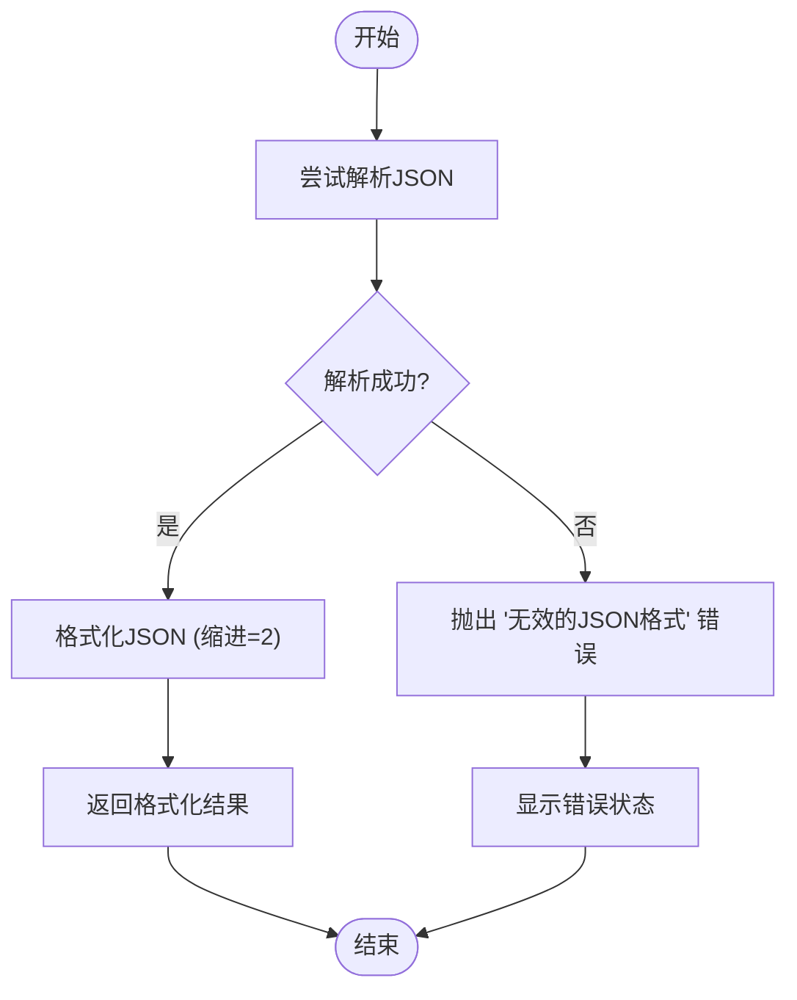
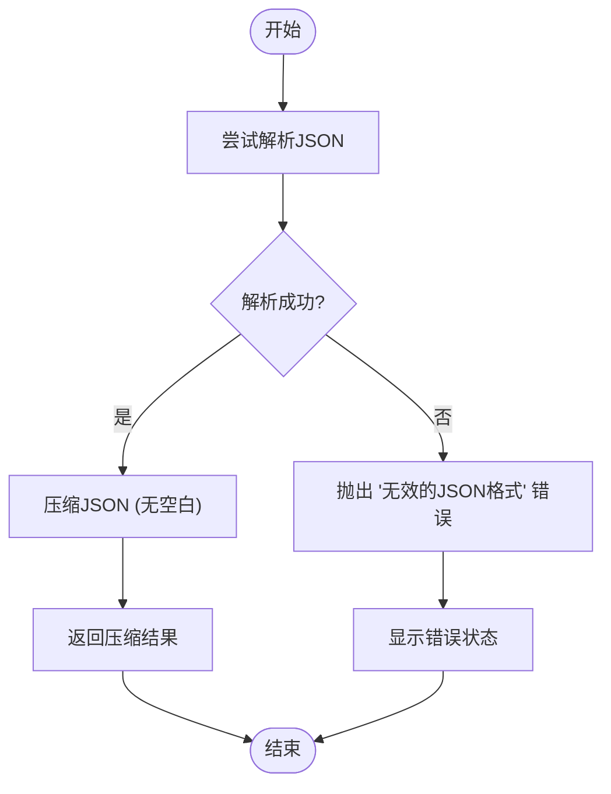
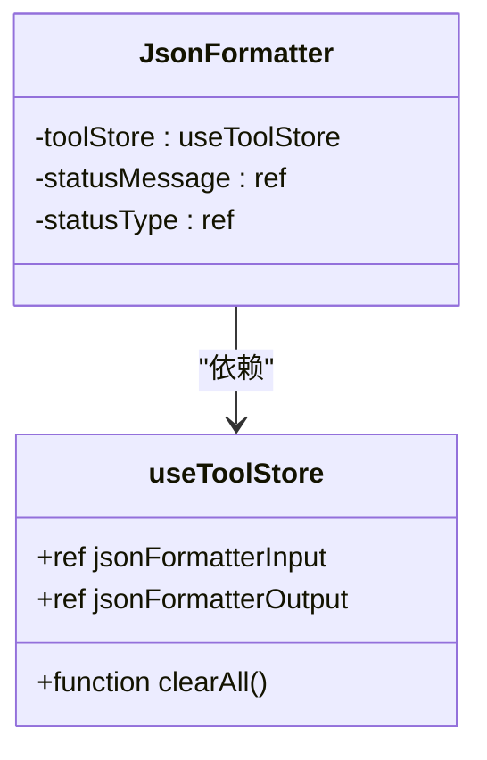
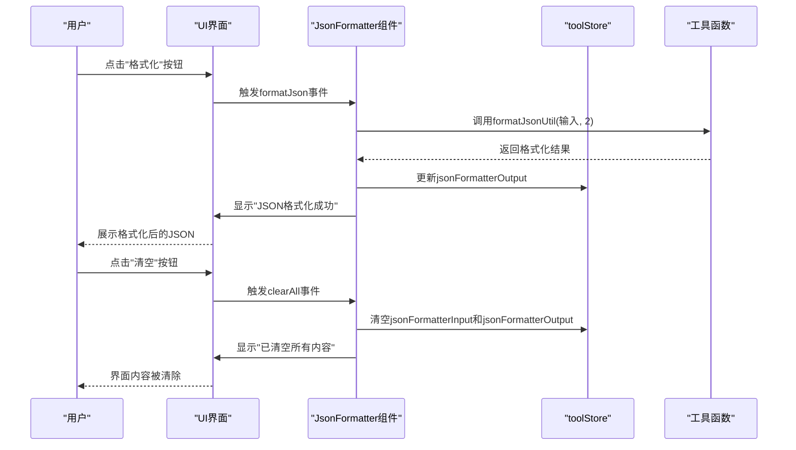

# JSON格式化工具

<cite>
**Referenced Files in This Document **  
- [JsonFormatter.vue](file://src/views/json/JsonFormatter.vue)
- [tool.ts](file://src/stores/tool.ts)
- [index.ts](file://src/utils/index.ts)
</cite>

## 目录
1. [简介](#简介)
2. [核心功能实现](#核心功能实现)
3. [辅助操作函数](#辅助操作函数)
4. [状态管理与数据绑定](#状态管理与数据绑定)
5. [用户交互流程](#用户交互流程)
6. [错误处理策略](#错误处理策略)
7. [使用示例](#使用示例)

## 简介

JSON格式化工具是程序开发中不可或缺的实用组件，主要用于对JSON数据进行格式化、压缩和验证。该工具通过提供直观的用户界面和高效的处理逻辑，帮助开发者快速美化或最小化JSON内容，同时确保数据的有效性。

本技术文档详细阐述了`formatJson`和`compressJson`两个核心函数的实现机制，分析了`clearAll`、`loadSimpleExample`、`loadComplexExample`和`loadErrorExample`四个辅助操作函数的作用与用户交互流程，并描述了`toolStore`中`jsonFormatterInput`和`jsonFormatterOutput`状态的双向绑定关系及其在组件间的共享机制。

**Section sources**
- [JsonFormatter.vue](file://src/views/json/JsonFormatter.vue#L1-L50)

## 核心功能实现

### formatJson函数

`formatJson`函数负责将输入的JSON字符串进行美化处理，使其具有良好的可读性。该函数调用`formatJsonUtil`工具函数，设置缩进为2个空格，从而生成结构清晰的格式化输出。

当解析失败时，统一捕获异常并提示"无效的JSON格式"。此函数首先尝试解析输入字符串，若成功则使用指定的缩进参数重新序列化对象；若解析失败，则抛出带有明确信息的错误。

**Diagram sources **
- [index.ts](file://src/utils/index.ts#L18-L25)

**Section sources**
- [index.ts](file://src/utils/index.ts#L18-L25)
- [JsonFormatter.vue](file://src/views/json/JsonFormatter.vue#L152-L160)

### compressJson函数

`compressJson`函数通过移除所有空白字符来实现JSON压缩，生成最小化的JSON字符串。该函数同样依赖于`compressJsonUtil`工具函数完成核心压缩逻辑。

与`formatJson`类似，`compressJson`也具备完善的错误处理机制。当输入内容无法被正确解析为JSON时，会统一捕获异常并向用户反馈"无效的JSON格式"的提示信息。

**Diagram sources **
- [index.ts](file://src/utils/index.ts#L30-L37)

**Section sources**
- [index.ts](file://src/utils/index.ts#L30-L37)
- [JsonFormatter.vue](file://src/views/json/JsonFormatter.vue#L163-L171)

## 辅助操作函数

### clearAll函数

`clearAll`函数用于清空JSON格式化工具中的所有内容，包括输入框和输出框的数据。执行该操作后，系统会显示"已清空所有内容"的状态提示，告知用户操作已完成。

该函数直接操作`toolStore`中的状态变量，将`jsonFormatterInput`和`jsonFormatterOutput`重置为空字符串，实现了界面内容的完全清除。

**Section sources**
- [JsonFormatter.vue](file://src/views/json/JsonFormatter.vue#L184-L188)

### loadSimpleExample函数

`loadSimpleExample`函数加载预设的简单JSON示例数据到输入区域。该示例包含基本的键值对结构，适用于演示基础的JSON格式化功能。

加载成功后，系统会显示"已加载简单JSON示例"的信息提示，引导用户进行后续操作。此函数通过将预定义的`simpleExample`字符串赋值给`toolStore.jsonFormatterInput`来实现数据填充。

**Section sources**
- [JsonFormatter.vue](file://src/views/json/JsonFormatter.vue#L191-L194)

### loadComplexExample函数

`loadComplexExample`函数加载预设的复杂JSON示例数据，该示例包含数组和嵌套对象结构，能够充分展示工具处理复杂数据的能力。

执行该函数后，会在界面上显示"已加载复杂JSON示例"的状态信息。与简单示例类似，它也是通过将`complexExample`常量赋值给输入状态变量来完成数据加载。

**Section sources**
- [JsonFormatter.vue](file://src/views/json/JsonFormatter.vue#L196-L199)

### loadErrorExample函数

`loadErrorExample`函数专门用于加载格式错误的JSON示例，该示例故意在末尾添加了多余的逗号，形成语法错误。此功能旨在帮助用户测试和理解JSON验证机制。

加载后会显示详细的提示信息："已加载错误格式JSON示例，请点击验证查看错误信息"，指导用户如何进行验证操作。

**Section sources**
- [JsonFormatter.vue](file://src/views/json/JsonFormatter.vue#L201-L208)

## 状态管理与数据绑定

### toolStore状态管理

工具的状态由Pinia存储库`useToolStore`统一管理。`toolStore`中定义了`jsonFormatterInput`和`jsonFormatterOutput`两个响应式状态变量，分别代表JSON格式化工具的输入和输出内容。

这些状态变量在整个应用中全局共享，允许多个组件访问和修改相同的数据源，确保了数据的一致性和同步性。

**Diagram sources **
- [tool.ts](file://src/stores/tool.ts#L14-L367)
- [JsonFormatter.vue](file://src/views/json/JsonFormatter.vue#L14-L15)

### 双向数据绑定

在`JsonFormatter.vue`组件中，通过Vue的`v-model`指令实现了`CodeEditor`组件与`toolStore`状态之间的双向绑定。当用户在输入编辑器中修改内容时，`toolStore.jsonFormatterInput`会自动更新；反之亦然。

这种双向绑定机制确保了视图与模型的实时同步，使得格式化结果能立即反映最新的输入变化。

**Section sources**
- [JsonFormatter.vue](file://src/views/json/JsonFormatter.vue#L25-L28)
- [tool.ts](file://src/stores/tool.ts#L54-L55)

## 用户交互流程

### 操作按钮工作流

用户可以通过界面上的操作按钮执行不同的JSON处理任务。每个按钮都绑定了相应的事件处理器：

- **格式化按钮**：触发`formatJson`函数，将输入的JSON美化后显示在输出区域
- **压缩按钮**：触发`compressJson`函数，生成紧凑的JSON字符串
- **验证按钮**：调用`validateJson`函数检查JSON有效性并显示详细结果
- **清空按钮**：执行`clearAll`函数，重置所有内容

**Diagram sources **
- [JsonFormatter.vue](file://src/views/json/JsonFormatter.vue#L65-L80)

**Section sources**
- [JsonFormatter.vue](file://src/views/json/JsonFormatter.vue#L65-L80)

## 错误处理策略

### 统一异常处理

系统采用统一的异常处理策略，在`formatJson`和`compressJson`等关键操作中使用try-catch块捕获可能发生的解析错误。一旦检测到无效的JSON格式，立即向用户显示"无效的JSON格式"的错误提示。

这种集中式的错误处理方式保证了用户体验的一致性，避免了未处理的异常导致应用崩溃。

### 用户反馈状态显示

通过`showStatus`函数实现用户反馈状态的显示逻辑。该函数接收消息文本和类型参数（success/error/info），在界面上展示相应级别的通知，并在3秒后自动消失。

错误信息不仅限于简单的"无效"提示，还通过`validateJsonWithDetails`函数提供具体的错误位置和原因，如"第X行第Y列：意外的字符'Z'"，极大提升了调试效率。

**Section sources**
- [JsonFormatter.vue](file://src/views/json/JsonFormatter.vue#L141-L149)
- [index.ts](file://src/utils/index.ts#L40-L58)

## 使用示例

### 完整工作流

以下是使用JSON格式化工具的完整工作流示例：

1. **加载示例数据**：点击"使用此示例"按钮加载预设的简单或复杂JSON数据
2. **执行格式化/压缩**：
   - 点击"格式化"按钮获得易读的缩进版本
   - 或点击"压缩"按钮获取最小化的JSON字符串
3. **查看结果**：处理结果自动显示在右侧输出区域
4. **清空内容**：随时点击"清空"按钮重置所有内容

### 实际应用场景

- **API开发调试**：将从接口获取的压缩JSON快速格式化以便阅读
- **配置文件编辑**：美化复杂的JSON配置文件提高可维护性
- **数据传输优化**：压缩JSON数据以减少网络传输量
- **教学演示**：展示JSON语法规范及常见错误类型

该工具的设计充分考虑了实际使用场景，提供了高效、可靠且易于使用的JSON处理解决方案。