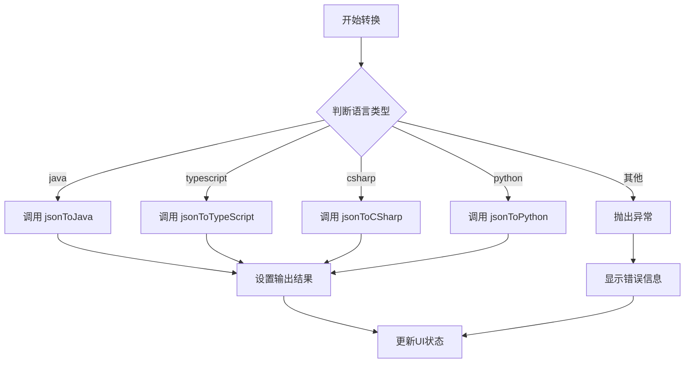
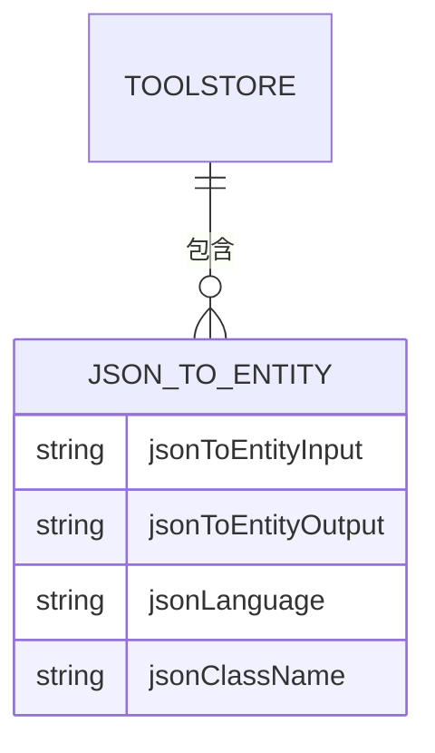
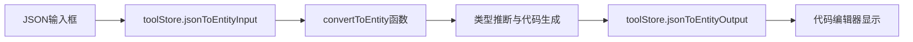
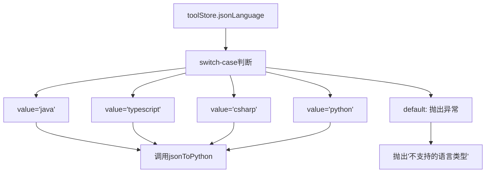
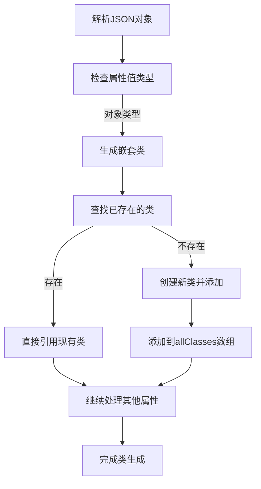
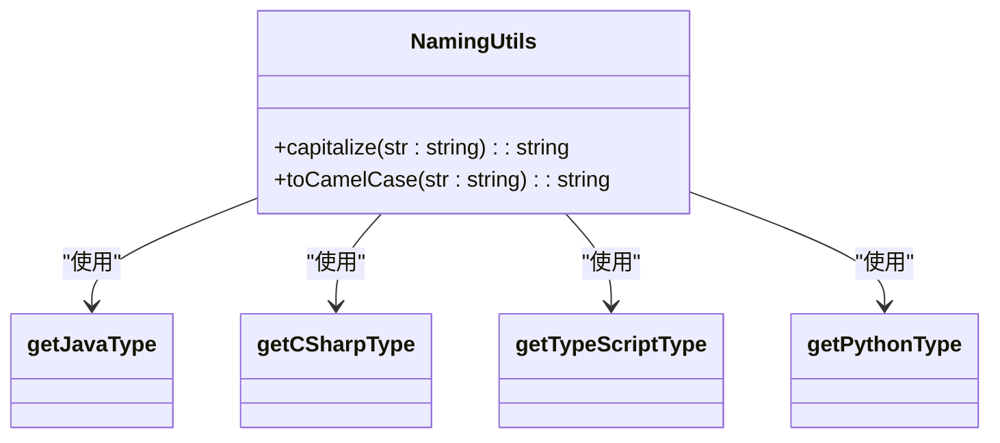

# JSON转实体类工具

<cite>
**本文档引用文件**
- [jsonToEntity.ts](file://src/utils/jsonToEntity.ts)
- [tool.ts](file://src/stores/tool.ts)
- [JsonToEntity.vue](file://src/views/json/JsonToEntity.vue)
</cite>

## 目录
1. [简介](#简介)
2. [核心组件分析](#核心组件分析)
3. [数据流与状态管理](#数据流与状态管理)
4. [多语言转换逻辑](#多语言转换逻辑)
5. [嵌套结构处理机制](#嵌套结构处理机制)
6. [类型推断规则](#类型推断规则)
7. [命名规范与代码生成](#命名规范与代码生成)
8. [错误处理与防御性编程](#错误处理与防御性编程)
9. [示例加载与初始化](#示例加载与初始化)

## 简介
JSON转实体类工具是一款将JSON数据自动转换为多种编程语言实体类代码的实用工具。该工具支持Java、TypeScript、C#和Python四种主流语言，能够根据输入的JSON结构智能推断字段类型，并生成符合各语言规范的强类型实体类代码。通过Pinia状态管理，工具实现了响应式的数据绑定和高效的UI更新。

## 核心组件分析

### 转换主函数 `convertToEntity`
`convertToEntity` 函数是整个工具的核心逻辑入口，负责根据用户选择的语言类型动态调用相应的底层转换函数。



**Diagram sources**
- [JsonToEntity.vue](file://src/views/json/JsonToEntity.vue#L178-L228)

**Section sources**
- [JsonToEntity.vue](file://src/views/json/JsonToEntity.vue#L178-L228)

## 数据流与状态管理

### 工具状态存储
工具使用Pinia进行全局状态管理，`toolStore` 中定义了所有与JSON转实体类功能相关的状态变量。



**Diagram sources**
- [tool.ts](file://src/stores/tool.ts#L30-L35)

**Section sources**
- [tool.ts](file://src/stores/tool.ts#L30-L35)

### 数据流路径
从原始JSON输入到生成实体类代码的完整数据流如下：



**Diagram sources**
- [JsonToEntity.vue](file://src/views/json/JsonToEntity.vue#L34-L78)
- [tool.ts](file://src/stores/tool.ts#L30-L35)

## 多语言转换逻辑

### 语言选择与分发机制
工具通过`switch-case`结构实现类型安全的语言分发，确保只支持预定义的语言类型。



**Diagram sources**
- [JsonToEntity.vue](file://src/views/json/JsonToEntity.vue#L178-L228)

**Section sources**
- [JsonToEntity.vue](file://src/views/json/JsonToEntity.vue#L178-L228)

## 嵌套结构处理机制

### 嵌套类生成流程
当JSON包含嵌套对象时，系统会递归生成对应的嵌套类结构。



**Diagram sources**
- [jsonToEntity.ts](file://src/utils/jsonToEntity.ts#L141-L204)

**Section sources**
- [jsonToEntity.ts](file://src/utils/jsonToEntity.ts#L141-L204)

## 类型推断规则

### 各语言类型映射表
不同编程语言对JSON类型的映射规则如下：

| JSON类型 | Java类型 | TypeScript类型 | C#类型 | Python类型 |
|---------|---------|---------------|-------|-----------|
| null | Object | any | object | Optional[Any] |
| string | String | string | string | str |
| integer | Integer | number | int | int |
| double | Double | number | double | float |
| boolean | Boolean | boolean | bool | bool |
| array | List<T> | T[] | List<T> | List[T] |

**Section sources**
- [jsonToEntity.ts](file://src/utils/jsonToEntity.ts#L17-L116)

### 数组类型处理
对于数组类型，系统会递归推断其元素类型并生成泛型声明。

```mermaid
flowchart TD
Array[数组类型] --> CheckLength[检查数组长度]
CheckLength --> |长度>0| Infer[推断第一个元素类型]
CheckLength --> |长度=0| Default[使用默认类型]
Infer --> Recursive[递归调用对应语言的类型推断函数]
Recursive --> Generic[生成泛型声明 List<T> 或 T[]]
Default --> Object[使用Object或any作为占位符]
```

**Diagram sources**
- [jsonToEntity.ts](file://src/utils/jsonToEntity.ts#L25-L38)
- [jsonToEntity.ts](file://src/utils/jsonToEntity.ts#L52-L64)

## 命名规范与代码生成

### 命名转换规则
系统实现了统一的命名转换策略，确保生成的代码符合各语言的命名规范。



**Diagram sources**
- [jsonToEntity.ts](file://src/utils/jsonToEntity.ts#L209-L218)

**Section sources**
- [jsonToEntity.ts](file://src/utils/jsonToEntity.ts#L209-L218)

### 代码生成模板
各语言的代码生成遵循特定的模板规范：

#### Java生成模板
```java
public class ClassName {
    private Type fieldName;
    
    public Type getFieldName() {
        return fieldName;
    }
    
    public void setFieldName(Type fieldName) {
        this.fieldName = fieldName;
    }
}
```

#### TypeScript生成模板
```typescript
interface InterfaceName {
  propertyName: propertyType;
}
```

#### C#生成模板
```csharp
public class ClassName
{
    public Type PropertyName { get; set; }
}
```

#### Python生成模板
```python
@dataclass
class ClassName:
    field_name: field_type
```

**Section sources**
- [jsonToEntity.ts](file://src/utils/jsonToEntity.ts#L223-L391)

## 错误处理与防御性编程

### 异常处理机制
系统采用了全面的防御性编程设计，确保在各种异常情况下都能提供友好的反馈。

```mermaid
sequenceDiagram
    participant UI as 用户界面
    participant Logic as 转换逻辑
    participant Error as 错误处理器
    
    UI->>Logic: 调用convertToEntity
    Logic->>Logic: try-catch包裹
    alt JSON格式正确
       