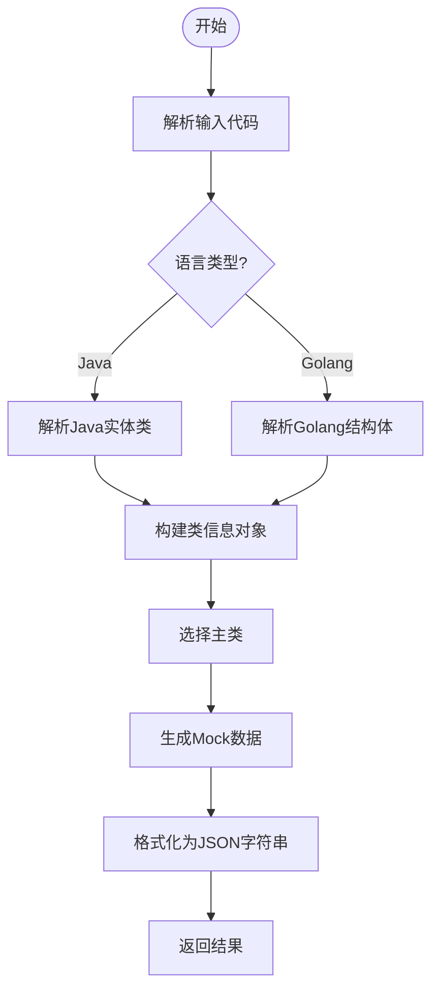
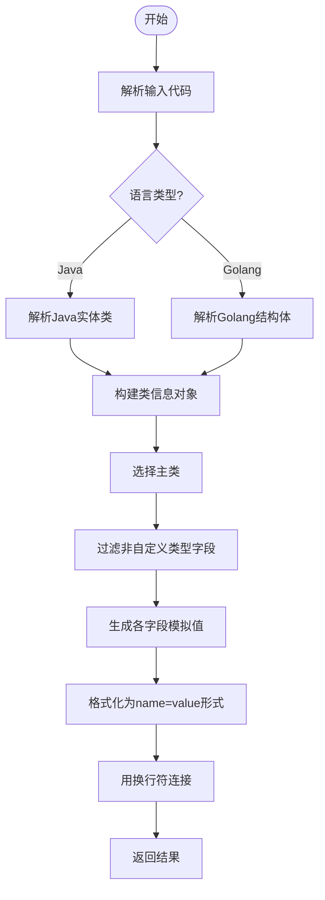
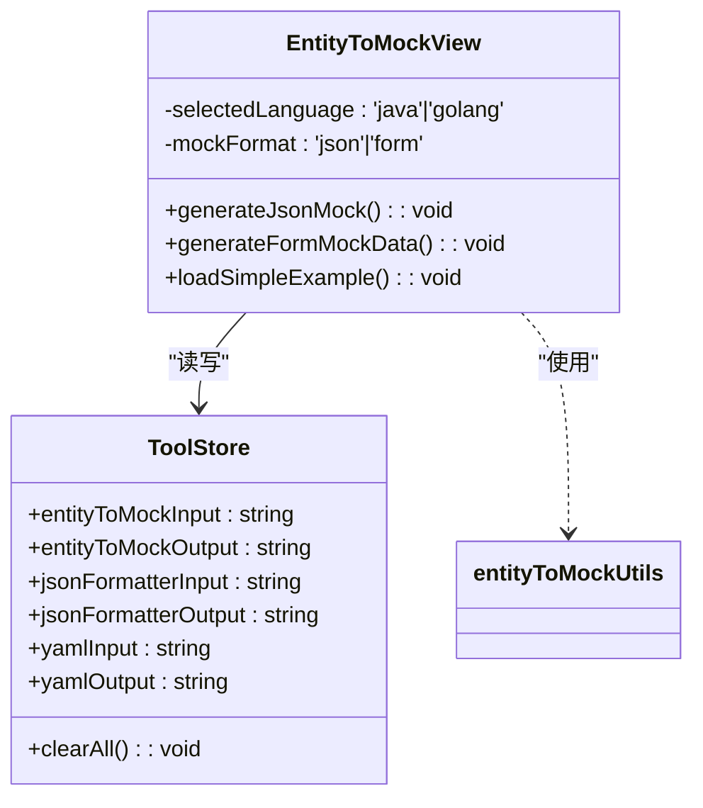
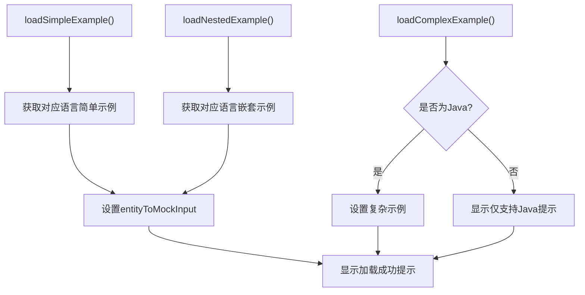

# 实体类Mock数据生成工具

<cite>
**Referenced Files in This Document **   
- [EntityToMock.vue](file://src/views/json/EntityToMock.vue)
- [entityToMock.ts](file://src/utils/entityToMock.ts)
- [tool.ts](file://src/stores/tool.ts)
</cite>

## 目录
1. [简介](#简介)
2. [核心功能分析](#核心功能分析)
3. [状态管理与数据流](#状态管理与数据流)
4. [示例加载机制](#示例加载机制)
5. [完整使用案例](#完整使用案例)
6. [架构概览](#架构概览)

## 简介
实体类Mock数据生成工具是一款用于将Java或Golang实体类定义转换为随机测试数据的前端工具。该工具支持JSON Body和Form Data两种输出格式，能够智能识别字段类型并生成符合业务场景的模拟值。通过响应式语言切换、嵌套对象检测和多层级示例系统，为开发者提供高效的API测试数据准备能力。

## 核心功能分析

### generateJsonMock函数工作机制
`generateJsonMock`函数是生成JSON格式模拟数据的核心入口。当用户点击"JSON Body"按钮时触发执行，其工作流程如下：首先调用`generateJsonBodyMockWithLanguage`工具函数，传入当前输入的实体类代码和选中的编程语言；然后将生成的结果赋值给`toolStore.entityToMockOutput`状态变量；接着将`mockFormat.value`设置为'json'以同步输出格式状态；最后显示成功提示信息。整个过程通过try-catch块进行异常捕获，确保用户体验的稳定性。

**Section sources**
- [EntityToMock.vue](file://src/views/json/EntityToMock.vue#L337-L349)

### generateFormMockData函数工作机制
`generateFormMockData`函数负责生成表单格式的模拟数据。与JSON生成类似，它调用`generateFormMockWithLanguage`工具函数处理输入的实体类代码，并将结果存储到输出状态中。关键区别在于，该函数会将`mockFormat.value`设置为'form'，从而更新界面显示和后续的数据处理逻辑。值得注意的是，当检测到嵌套对象时，此功能会被禁用，因为表单格式不支持复杂的数据结构。

**Section sources**
- [EntityToMock.vue](file://src/views/json/EntityToMock.vue#L352-L361)

### generateJsonBodyMockWithLanguage函数实现
位于`entityToMock.ts`工具模块中的`generateJsonBodyMockWithLanguage`函数是JSON数据生成的核心实现。该函数根据指定的语言类型（Java或Golang）选择相应的解析器：对于Java代码，使用正则表达式匹配类定义和字段声明；对于Golang代码，则解析结构体及其标签。解析完成后，构建类信息对象数组，并以第一个类作为主类递归生成包含嵌套对象的完整JSON数据结构。

**Diagram sources **
- [entityToMock.ts](file://src/utils/entityToMock.ts#L397-L429)

### generateFormMockWithLanguage函数实现
`generateFormMockWithLanguage`函数专为生成键值对形式的表单数据而设计。其处理流程与JSON生成相似，但在数据构造阶段有显著差异：仅处理非自定义类型的字段，忽略嵌套对象；对于基本类型字段，生成对应的模拟值并构造成"name=value"格式的字符串；数组类型字段会生成多个同名键值对以模拟多值情况。最终将所有键值对用换行符连接成纯文本输出。

**Diagram sources **
- [entityToMock.ts](file://src/utils/entityToMock.ts#L441-L488)

## 状态管理与数据流

### selectedLanguage响应式控制逻辑
`selectedLanguage.value`在不同语言示例切换中扮演着核心角色。该响应式变量通过Vue的ref函数创建，初始值设为'java'。当用户在下拉菜单中选择不同的编程语言时，`selectedLanguage`的值会实时更新，触发一系列依赖它的计算属性重新求值：`editorLanguage`决定代码编辑器的语法高亮模式；`currentSimpleExample`和`currentNestedExample`动态切换对应语言的示例代码；`loadSimpleExample`等函数根据当前语言加载正确的示例内容。这种响应式设计实现了无缝的语言切换体验。

**Section sources**
- [EntityToMock.vue](file://src/views/json/EntityToMock.vue#L173-L173)

### toolStore状态管理机制
工具的状态管理通过Pinia store集中实现。`toolStore.entityToMockInput`和`entityToMockOutput`分别管理输入的实体类代码和生成的模拟数据，这两个状态在整个应用生命周期内持久化，即使页面切换也不会丢失。状态存储在`tool.ts`文件中，采用模块化设计，为不同工具（如JWT解析、Base64编码等）提供独立的命名空间。通过`clearAll`方法可以一键重置所有相关状态，保证了操作的原子性和数据的一致性。

**Diagram sources **
- [tool.ts](file://src/stores/tool.ts#L0-L368)
- [EntityToMock.vue](file://src/views/json/EntityToMock.vue#L0-L649)

## 示例加载机制

### clearAll函数行为分析
`clearAll`函数实现了清空当前工具所有输入输出内容的功能。与其他工具中的同名函数不同，此版本专门针对实体类Mock工具，仅重置`entityToMockInput`和`entityToMockOutput`两个状态变量。执行后会显示"已清空所有内容"的信息提示，帮助用户确认操作结果。该函数被绑定到界面的"清空"按钮，提供快捷的内容清理方式。

**Section sources**
- [EntityToMock.vue](file://src/views/json/EntityToMock.vue#L364-L368)

### 示例加载函数行为差异
三个示例加载函数展示了不同的行为模式：
- `loadSimpleExample`：加载基础的单层实体类示例，适用于演示基本字段类型的处理。
- `loadNestedExample`：加载包含对象引用的嵌套示例，用于展示工具对复杂结构的支持能力。
- `loadComplexExample`：具有特殊限制的高级示例加载函数，通过条件判断确保只有在Java语言环境下才允许加载复杂业务实体类，否则显示"复杂示例目前仅支持Java"的提示信息，体现了对特定语言特性的适配考虑。

**Diagram sources **
- [EntityToMock.vue](file://src/views/json/EntityToMock.vue#L371-L401)

## 完整使用案例

### Java实体类到JSON数据生成流程
以一个简单的User实体类为例，展示从Java定义到JSON模拟数据的完整转换过程。工具首先解析`private Integer id; private String name;`等字段声明，识别出基本类型和包装类型。然后根据字段名智能推断合理值：包含"id"的字段赋予数字1，"name"字段赋予"