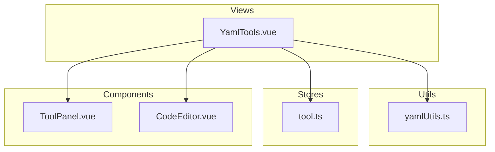
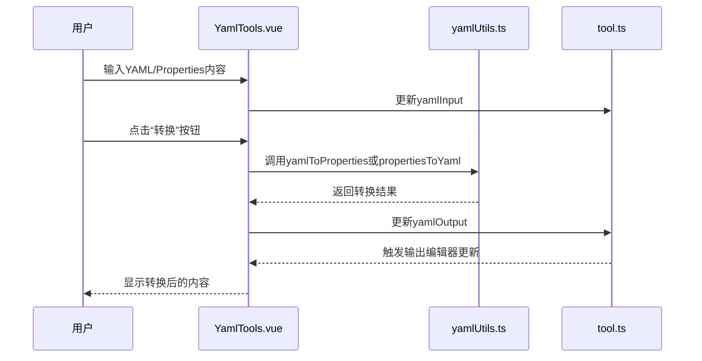
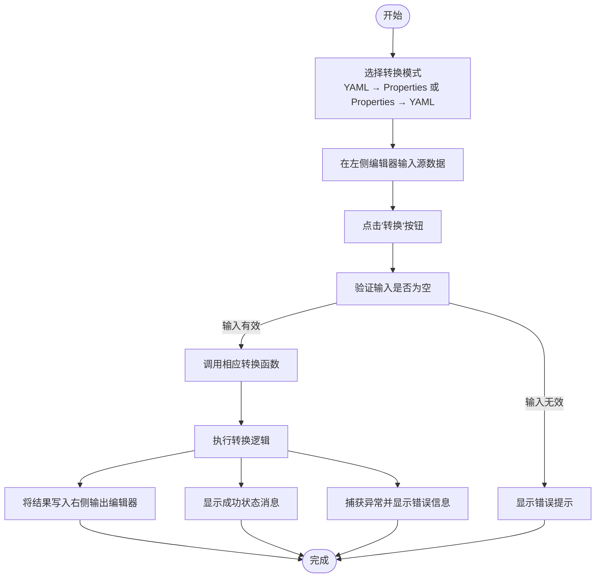
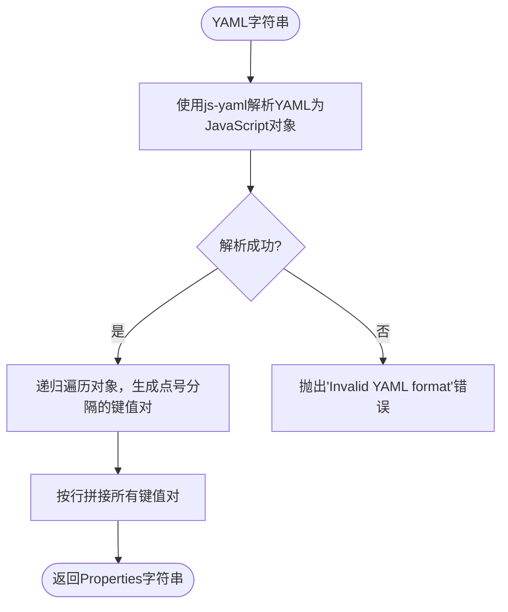
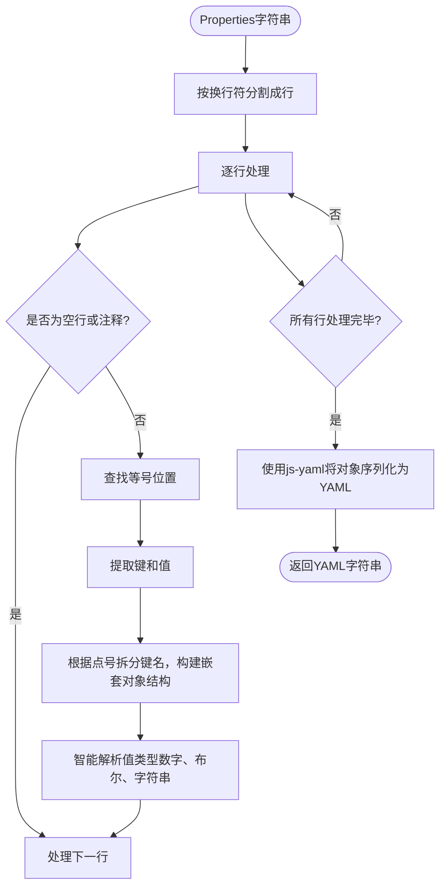

# YAML工具

<cite>
**本文档引用文件**  
- [YamlTools.vue](file://src/views/yaml/YamlTools.vue)
- [yamlUtils.ts](file://src/utils/yamlUtils.ts)
- [tool.ts](file://src/stores/tool.ts)
</cite>

## 目录
1. [简介](#简介)
2. [项目结构](#项目结构)
3. [核心组件](#核心组件)
4. [架构概述](#架构概述)
5. [详细组件分析](#详细组件分析)
6. [依赖分析](#依赖分析)
7. [性能考虑](#性能考虑)
8. [故障排除指南](#故障排除指南)
9. [结论](#结论)

## 简介
YAML工具是一个用于在YAML格式和Java Properties格式之间进行双向转换的Web应用组件。该工具提供直观的用户界面，支持语法验证、错误定位，并具备扩展性以支持新增转换格式和自定义解析选项。它特别适用于Spring Boot等Java项目的配置文件管理。

## 项目结构
YAML工具作为Vue.js单页应用的一部分，其结构遵循模块化设计原则。主要功能集中在`views/yaml/`目录下的`YamlTools.vue`组件中，相关业务逻辑封装于`utils/yamlUtils.ts`工具函数文件，状态管理通过Pinia存储在`stores/tool.ts`中。



**图示来源**
- [YamlTools.vue](file://src/views/yaml/YamlTools.vue)
- [yamlUtils.ts](file://src/utils/yamlUtils.ts)
- [tool.ts](file://src/stores/tool.ts)
- [ToolPanel.vue](file://src/components/ToolPanel.vue)
- [CodeEditor.vue](file://src/components/CodeEditor.vue)

## 核心组件
YAML工具的核心由三个关键部分构成：用户界面组件`YamlTools.vue`负责交互展示；工具函数`yamlUtils.ts`实现核心转换算法；状态存储`tool.ts`维护输入输出数据及操作模式。三者通过Vue的响应式系统紧密协作，确保数据一致性与界面同步更新。

**本节来源**
- [YamlTools.vue](file://src/views/yaml/YamlTools.vue)
- [yamlUtils.ts](file://src/utils/yamlUtils.ts)
- [tool.ts](file://src/stores/tool.ts)

## 架构概述
整个YAML工具采用分层架构设计，上层为UI展示层（`YamlTools.vue`），中间为业务逻辑层（`yamlUtils.ts`），底层为状态管理层（`tool.ts`）。当用户触发转换操作时，UI层调用工具函数执行转换，结果写入状态存储并自动反映到输出编辑器中，形成闭环的数据流。



**图示来源**
- [YamlTools.vue](file://src/views/yaml/YamlTools.vue#L176-L234)
- [yamlUtils.ts](file://src/utils/yamlUtils.ts#L6-L25)

## 详细组件分析

### YamlTools.vue 组件分析
`YamlTools.vue`是YAML工具的主要视图组件，使用Vue 3的组合式API构建。它提供了两个转换模式按钮（YAML→Properties 和 Properties→YAML）、双栏代码编辑区域以及示例加载功能。通过计算属性动态设置输入/输出语言、标题和占位符文本，确保界面随模式切换而自动适配。

#### 用户界面流程


**图示来源**
- [YamlTools.vue](file://src/views/yaml/YamlTools.vue#L0-L36)
- [YamlTools.vue](file://src/views/yaml/YamlTools.vue#L38-L88)

**本节来源**
- [YamlTools.vue](file://src/views/yaml/YamlTools.vue)

### 核心算法分析
YAML与Properties格式互转的核心算法基于`js-yaml`库实现，采用对象作为中间表示层完成格式映射。

#### YAML转Properties算法


**图示来源**
- [yamlUtils.ts](file://src/utils/yamlUtils.ts#L6-L13)

#### Properties转YAML算法


**图示来源**
- [yamlUtils.ts](file://src/utils/yamlUtils.ts#L18-L25)

**本节来源**
- [yamlUtils.ts](file://src/utils/yamlUtils.ts)

## 依赖分析
YAML工具的正常运行依赖多个内部和外部组件。外部依赖包括`js-yaml`库用于YAML解析与序列化；内部依赖涵盖`ToolPanel.vue`提供标准化面板容器、`CodeEditor.vue`提供富文本编辑能力、`tool.ts`提供全局状态管理。这些依赖关系构成了一个松耦合但高度协同的功能模块。

```mermaid
dependency-graph
js-yaml --> yamlUtils
yamlUtils --> YamlTools
tool --> YamlTools
ToolPanel --> YamlTools
CodeEditor --> YamlTools
```

**图示来源**
- [package.json](file://package.json)
- [yamlUtils.ts](file://src/utils/yamlUtils.ts#L1)
- [YamlTools.vue](file://src/views/yaml/YamlTools.vue#L90-L133)

**本节来源**
- [yamlUtils.ts](file://src/utils/yamlUtils.ts)
- [YamlTools.vue](file://src/views/yaml/YamlTools.vue)
- [tool.ts](file://src/stores/tool.ts)

## 性能考虑
YAML工具在性能方面进行了合理优化。利用`monaco-editor`实现高效的代码高亮与编辑体验，同时通过防抖机制避免频繁渲染。转换算法时间复杂度为O(n)，其中n为配置项数量，在常规使用场景下表现良好。对于超大配置文件，建议增加进度提示或异步处理机制以提升用户体验。

## 故障排除指南
当遇到转换失败时，应首先检查输入格式的正确性。YAML语法需注意缩进一致性，避免使用Tab字符；Properties格式需确保每行包含且仅包含一个等号。若出现"Invalid YAML format"错误，请验证YAML是否符合规范；若出现"Invalid Properties format"错误，请检查是否有未闭合的引号或多余的等号。此外，特殊字符如冒号、井号应在引号内正确转义。

**本节来源**
- [yamlUtils.ts](file://src/utils/yamlUtils.ts#L7-L13)
- [yamlUtils.ts](file://src/utils/yamlUtils.ts#L19-L25)

## 结论
YAML工具通过简洁明了的设计实现了YAML与Properties格式间的高效互转，不仅满足了开发者日常开发中的实际需求，还具备良好的可扩展性和用户体验。通过对核心算法的深入理解和对潜在问题的有效预防，该工具已成为项目中不可或缺的实用组件之一。