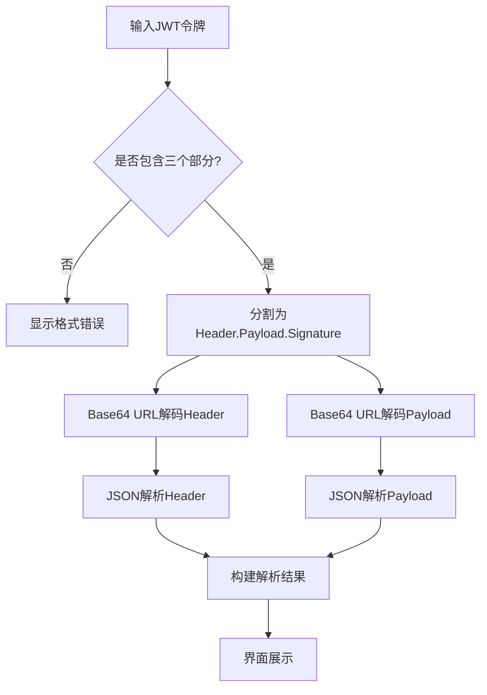
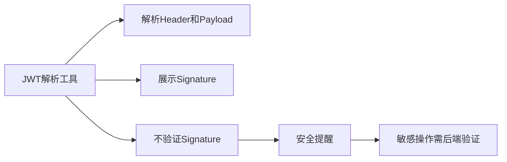

# JWT解析工具

<cite>
**本文档引用文件**   
- [JwtDecoder.vue](file://src/views/jwt/JwtDecoder.vue)
- [cryptoUtils.ts](file://src/utils/cryptoUtils.ts)
- [tool.ts](file://src/stores/tool.ts)
</cite>

## 目录
1. [简介](#简介)
2. [核心功能分析](#核心功能分析)
3. [JWT三段式结构解析原理](#jwt三段式结构解析原理)
4. [Base64解码实现与浏览器安全考量](#base64解码实现与浏览器安全考量)
5. [JSON载荷格式化与时间戳转换](#json载荷格式化与时间戳转换)
6. [签名部分展示设计决策](#签名部分展示设计决策)
7. [实际应用场景](#实际应用场景)
8. [与cryptoUtils.ts的集成扩展路径](#与cryptoutils.ts的集成扩展路径)

## 简介
JWT解析工具是一个用于解析和查看JWT（JSON Web Token）令牌内容的前端组件。该工具能够将JWT令牌分解为Header、Payload和Signature三个部分，并对前两部分进行Base64 URL解码和JSON格式化解析，便于用户直观地查看令牌中的声明信息。本技术文档详细阐述了其工作原理、实现细节以及使用注意事项。

## 核心功能分析

**Section sources**
- [JwtDecoder.vue](file://src/views/jwt/JwtDecoder.vue#L0-L535)

## JWT三段式结构解析原理
JWT令牌由三个用点号（.）分隔的部分组成：Header、Payload和Signature。`JwtDecoder.vue`通过以下步骤解析JWT：

1. **格式验证**：首先检查输入的JWT是否包含三个部分，若不符合则返回错误提示。
2. **分割处理**：使用`split('.')`方法将JWT字符串分割成headerB64、payloadB64和signature三个部分。
3. **解码解析**：
   - 调用`base64UrlDecode`函数对headerB64和payloadB64进行Base64 URL解码
   - 使用`JSON.parse()`将解码后的字符串转换为JavaScript对象
4. **结果展示**：将解析出的Header、Payload和原始Signature分别显示在界面的不同区域



**Diagram sources **
- [JwtDecoder.vue](file://src/views/jwt/JwtDecoder.vue#L167-L217)

## Base64解码实现与浏览器安全考量
`JwtDecoder.vue`实现了专门的Base64 URL解码函数，以适应JWT标准中使用的URL安全Base64编码。

### 解码实现方式
```typescript
const base64UrlDecode = (str: string): string => {
  // 替换URL安全字符
  str = str.replace(/-/g, '+').replace(/_/g, '/')
  
  // 添加填充
  while (str.length % 4) {
    str += '='
  }
  
  try {
    // 解码并转换为UTF-8
    return decodeURIComponent(
      atob(str)
        .split('')
        .map((c) => {
          return '%' + ('00' + c.charCodeAt(0).toString(16)).slice(-2)
        })
        .join(''),
    )
  } catch {
    throw new Error('无效的Base64编码')
  }
}
```

该函数执行以下操作：
1. 将JWT中使用的URL安全字符`-`和`_`替换为标准Base64字符`+`和`/`
2. 根据Base64规范添加必要的填充字符`=`
3. 使用浏览器内置的`atob()`函数进行Base64解码
4. 通过`decodeURIComponent`和十六进制转换确保正确处理UTF-8字符

### 浏览器环境安全考量
- **客户端解析**：所有解析操作都在浏览器端完成，不涉及网络请求，保护了用户的令牌隐私
- **无持久化存储**：解析过程不会将令牌内容存储到本地存储或cookie中
- **输入验证**：对输入进行严格验证，防止XSS等攻击
- **沙箱环境**：使用Vue的响应式系统隔离数据，避免全局污染

**Section sources**
- [JwtDecoder.vue](file://src/views/jwt/JwtDecoder.vue#L143-L165)

## JSON载荷格式化与时间戳转换
工具不仅解析JWT内容，还提供了人性化的数据显示方式。

### JSON格式化输出
使用`JSON.stringify(obj, null, 2)`对解析后的Header和Payload对象进行格式化，使其具有适当的缩进，便于阅读。

### 时间戳字段自动转换
对于常见的JWT时间戳字段（iat、exp、nbf），工具会自动将其从Unix时间戳转换为可读的日期时间格式：

```typescript
const timeFields = ['iat', 'exp', 'nbf']
timeFields.forEach((field) => {
  if (processedPayload[field]) {
    const timestamp = processedPayload[field] as number
    const date = new Date(timestamp * 1000)
    processedPayload[`${field}_readable`] = date.toLocaleString('zh-CN', {
      year: 'numeric',
      month: '2-digit',
      day: '2-digit',
      hour: '2-digit',
      minute: '2-digit',
      second: '2-digit',
    })
  }
})
```

此功能使得用户无需手动计算时间戳，可以直接看到"签发时间"、"过期时间"等信息的可读格式。

**Section sources**
- [JwtDecoder.vue](file://src/views/jwt/JwtDecoder.vue#L215-L264)

## 签名部分展示设计决策
工具对签名部分采取了仅展示而不验证的设计策略。

### 设计原因
1. **安全性考虑**：签名验证需要密钥，而在浏览器环境中存储密钥存在安全风险
2. **职责分离**：签名验证应由服务端完成，客户端工具不应承担此安全责任
3. **简化实现**：避免引入复杂的加密算法库和密钥管理机制

### 用户提醒
界面上明确提示："注意：签名验证需要密钥，此工具仅解析结构，不验证签名有效性"。这教育用户敏感操作必须在后端进行验证，防止用户误以为前端验证是安全的。



**Diagram sources **
- [JwtDecoder.vue](file://src/views/jwt/JwtDecoder.vue#L45-L76)

## 实际应用场景
### 调试OAuth2登录返回令牌
开发人员可以将OAuth2认证流程中获得的JWT令牌粘贴到工具中，快速查看：
- 访问令牌的过期时间（exp）
- 用户标识（sub）
- 授权范围（scope）
- 发行者（iss）和受众（aud）

### 分析权限声明（claims）内容
对于包含角色和权限信息的JWT，工具可以帮助：
- 查看用户的角色列表（roles）
- 检查具体的权限声明（permissions）
- 验证自定义声明是否正确设置
- 调试基于声明的访问控制逻辑

工具提供了两个预设示例，包括标准JWT和包含权限的JWT，方便用户快速上手测试。

**Section sources**
- [JwtDecoder.vue](file://src/views/jwt/JwtDecoder.vue#L78-L122)

## 与cryptoUtils.ts的集成扩展路径
虽然当前版本不进行签名验证，但可以通过`cryptoUtils.ts`实现更高级的功能。

### 可能的集成扩展
1. **HMAC验证**：利用`hmacSha256`函数实现HS256算法的签名验证
2. **RSA验证**：结合`rsaDecrypt`函数尝试RS256算法的验证逻辑
3. **加密辅助**：使用`generateRandomKey`生成测试用的密钥

### 扩展实现思路
```typescript
// 伪代码示例
import { hmacSha256 } from '@/utils/cryptoUtils'

const verifySignature = (headerB64, payloadB64, signature, secret) => {
  const signingInput = `${headerB64}.${payloadB64}`
  const expectedSignature = hmacSha256(signingInput, secret)
  return constantTimeEqual(signature, expectedSignature) // 防止时序攻击
}
```

这种扩展可以让工具在提供解析功能的同时，增加可选的验证模式，满足不同用户的需求。

**Section sources**
- [cryptoUtils.ts](file://src/utils/cryptoUtils.ts#L0-L268)
- [JwtDecoder.vue](file://src/views/jwt/JwtDecoder.vue#L0-L535)