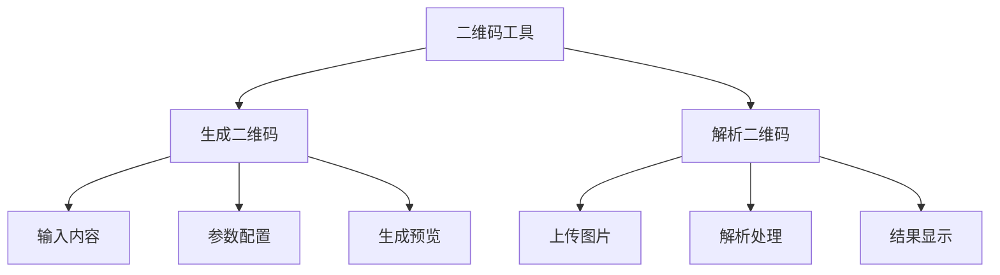
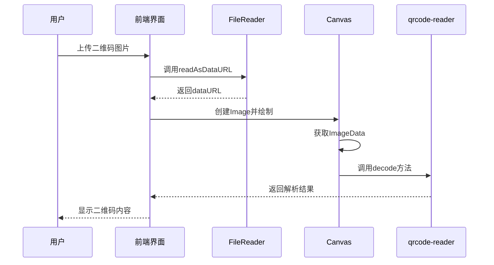

# 二维码生成与识别工具

<cite>
**本文档引用文件**   
- [QRCodeTool.vue](file://src/views/qrcode/QRCodeTool.vue)
- [qrcodeUtils.ts](file://src/utils/qrcodeUtils.ts)
- [qrcode-reader.d.ts](file://src/types/qrcode-reader.d.ts)
</cite>

## 目录
1. [简介](#简介)
2. [核心功能详解](#核心功能详解)
3. [二维码生成参数配置](#二维码生成参数配置)
4. [二维码解析技术实现](#二维码解析技术实现)
5. [核心依赖库调用方式](#核心依赖库调用方式)
6. [Canvas渲染与图像导出机制](#canvas渲染与图像导出机制)
7. [数据隐私与本地处理优势](#数据隐私与本地处理优势)
8. [典型应用场景实例](#典型应用场景实例)
9. [移动端兼容性与性能优化](#移动端兼容性与性能优化)

## 简介
二维码生成与识别工具是一款集成在开发者工具集中的多功能组件，提供完整的二维码生成和解析能力。该工具支持自定义颜色、容错级别等高级参数配置，并可通过摄像头或上传图片进行扫码识别。所有处理均在本地完成，确保用户数据隐私安全。工具采用Vue 3框架开发，结合`qrcode.js`和`qrcode-reader`库实现核心功能，为用户提供高效、便捷的二维码操作体验。

**Section sources**
- [QRCodeTool.vue](file://src/views/qrcode/QRCodeTool.vue#L0-L35)

## 核心功能详解
本工具提供两大核心功能：二维码生成和二维码解析。用户可通过选项卡在两个功能间自由切换。生成功能允许用户输入任意文本内容，通过丰富的参数配置生成高度定制化的二维码；解析功能则支持多种图片上传方式，包括拖拽、点击选择和粘贴，能够快速准确地识别二维码内容。工具界面设计直观，操作流程清晰，配合实时预览和结果展示，极大提升了用户体验。

**Diagram sources**
- [QRCodeTool.vue](file://src/views/qrcode/QRCodeTool.vue#L0-L35)

## 二维码生成参数配置
### 容错等级配置
工具提供四种容错等级（L/M/Q/H）供用户选择，对应不同的错误校正能力和数据容量：
- **L级 (~7%)**: 最低校正能力，但拥有最大数据容量
- **M级 (~15%)**: 中等校正能力，推荐日常使用
- **Q级 (~25%)**: 较高校正能力，适用于环境较嘈杂的场景
- **H级 (~30%)**: 最高校正能力，但数据容量最小

用户可根据实际需求选择合适的容错等级，平衡二维码的可读性和信息容量。

### 尺寸调节与Logo嵌入
工具支持四种标准尺寸（128px、256px、512px、1024px）的二维码生成，满足不同场景下的显示需求。虽然当前版本未直接提供Logo嵌入功能，但通过`qrcode.js`库的扩展能力，未来可轻松实现中心Logo嵌入功能。生成的二维码支持PNG、JPEG和WebP三种图片格式，用户可根据质量与文件大小的需求进行选择。

### 颜色与样式自定义
用户可自定义二维码的前景色和背景色，通过颜色选择器或手动输入十六进制颜色值实现个性化设计。同时提供边距设置选项，包括无边距、小边距、标准边距和大边距，以适应不同的排版需求。这些参数共同作用，使生成的二维码既美观又实用。

**Section sources**
- [QRCodeTool.vue](file://src/views/qrcode/QRCodeTool.vue#L37-L97)
- [qrcodeUtils.ts](file://src/utils/qrcodeUtils.ts#L0-L60)

## 二维码解析技术实现
### 图片上传与处理
解析功能支持多种图片上传方式：用户可拖拽图片到指定区域、点击按钮选择文件，或直接使用Ctrl+V粘贴剪贴板中的图片。上传区域具有视觉反馈，当图片被拖入时会高亮显示。系统自动验证文件类型，仅接受PNG、JPG和WebP格式的图片文件，确保解析过程的稳定性。

### 摄像头扫码实现
虽然当前代码未直接实现摄像头扫码功能，但通过浏览器的MediaDevices API可以轻松扩展此功能。用户授权后，可调用设备摄像头实时扫描二维码，将视频流逐帧分析，实现即时识别。这种方案特别适合移动设备上的快速扫码需求。

### 解析流程与错误处理
解析流程首先将上传的图片文件转换为DataURL，然后通过`FileReader`读取文件内容。系统创建Image对象加载图片，再利用Canvas获取图像像素数据，最后交由`qrcode-reader`库进行解码。整个过程包含完善的错误处理机制，对图像加载失败、格式不支持、无法识别等情况提供明确的用户提示。

**Diagram sources**
- [QRCodeTool.vue](file://src/views/qrcode/QRCodeTool.vue#L152-L188)
- [qrcodeUtils.ts](file://src/utils/qrcodeUtils.ts#L62-L111)

## 核心依赖库调用方式
### qrcode.js库集成
工具通过`qrcode.js`库实现二维码生成功能。核心调用方式为`QRCode.toDataURL(text, options)`方法，将文本内容和配置选项作为参数传入，返回一个Promise，解析后得到包含二维码图像的dataURL。配置选项包括尺寸、颜色、容错级别、图片格式等，完全覆盖了用户界面中的所有可配置参数。

### qrcode-reader库应用
对于二维码解析功能，工具采用`qrcode-reader`库。通过创建`QrReader`实例，设置回调函数处理解析结果或错误，然后调用`decode(imageData)`方法开始解码过程。`imageData`来自Canvas的`getImageData()`方法，包含了图片的完整像素信息。这种基于Canvas的解析方式确保了跨平台兼容性和解析准确性。

### 类型定义与接口规范
项目中定义了`QRCodeOptions`接口来规范生成参数的结构，确保类型安全。同时，在`qrcode-reader.d.ts`文件中声明了第三方库的类型定义，为`QrReader`类提供了完整的TypeScript支持，包括构造函数、回调函数和解码方法的类型签名，提升了代码的可维护性和开发效率。

**Section sources**
- [qrcodeUtils.ts](file://src/utils/qrcodeUtils.ts#L0-L60)
- [qrcode-reader.d.ts](file://src/types/qrcode-reader.d.ts#L0-L16)

## Canvas渲染与图像导出机制
### Canvas渲染流程
二维码生成过程中，`qrcode.js`库内部使用Canvas进行渲染。首先根据配置创建指定尺寸的Canvas元素，然后计算二维码模块的布局，使用fillRect等绘图方法绘制黑色模块，最后将整个Canvas内容转换为指定格式的dataURL。这一过程完全在内存中完成，无需DOM插入，保证了高性能和低延迟。

### PNG图像导出实现
图像导出功能通过创建下载链接实现。当用户点击"下载"按钮时，系统动态创建一个`<a>`元素，将其`href`属性设置为生成的dataURL，`download`属性设置为带时间戳的文件名，然后模拟点击触发浏览器下载行为。这种方式简单高效，无需服务器参与，完全在客户端完成。

### 复制到剪贴板功能
除了下载，工具还提供复制到剪贴板功能。通过`navigator.clipboard.write()`API，将二维码图像作为Blob写入剪贴板。系统首先通过fetch获取dataURL对应的Blob对象，然后创建`ClipboardItem`，最后调用write方法完成复制。此功能要求HTTPS环境或localhost，以确保安全性。

**Section sources**
- [QRCodeTool.vue](file://src/views/qrcode/QRCodeTool.vue#L126-L150)
- [qrcodeUtils.ts](file://src/utils/qrcodeUtils.ts#L0-L60)

## 数据隐私与本地处理优势
本工具最大的优势在于所有处理均在用户本地浏览器中完成，无需将任何数据发送到服务器。无论是二维码生成还是解析，所有计算和图像处理都在客户端执行，确保了用户数据的绝对隐私。这对于处理敏感信息（如支付链接、Wi-Fi密码、联系人信息）尤为重要，避免了数据泄露的风险。

此外，本地处理还带来了更快的响应速度和离线可用性。用户无需担心网络连接问题，即使在没有互联网的环境下也能正常使用工具的所有功能。这种设计符合现代Web应用的安全最佳实践，为用户提供了安心、可靠的服务体验。

**Section sources**
- [QRCodeTool.vue](file://src/views/qrcode/QRCodeTool.vue#L265-L322)

## 典型应用场景实例
### 生成小程序码
用户可输入小程序的跳转链接，配置合适的尺寸和容错级别，生成用于线下推广的小程序码。例如，输入`https://example.com/miniprogram`，选择H级容错和1024px尺寸，即可生成高质量的小程序入口二维码，即使部分区域被遮挡也能正常扫描。

### 解析支付链接
对于支付宝或微信支付的二维码，工具能够准确解析出其中的支付链接，如`alipayqr://platformapi/startapp?saId=10000007&clientVersion=3.7.0.0718&qrcode=https%3A%2F%2Fqr.alipay.com%2Ffkx09890`。用户可快速查看支付详情，确认收款方信息，提高交易安全性。

### 快速示例功能
工具内置多个实用示例，包括网址链接、vCard联系人、Wi-Fi配置和纯文本。用户点击"使用此示例"按钮即可快速填充示例内容，立即生成相应的二维码。这不仅降低了使用门槛，也为用户提供了灵感和参考，展示了二维码的多样化应用可能。

**Section sources**
- [QRCodeTool.vue](file://src/views/qrcode/QRCodeTool.vue#L231-L263)
- [QRCodeTool.vue](file://src/views/qrcode/QRCodeTool.vue#L495-L544)

## 移动端兼容性与性能优化
### 移动端适配注意事项
在移动端使用时，需注意以下几点：首先，确保页面视口设置正确，使用viewport meta标签适配不同屏幕尺寸；其次，触摸事件的处理要优化，增加点击区域的大小，提升