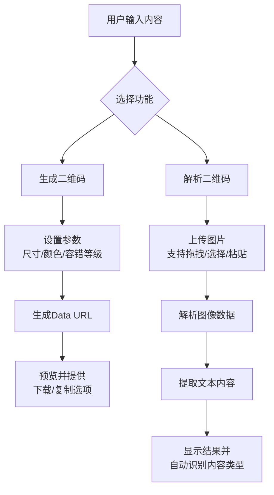
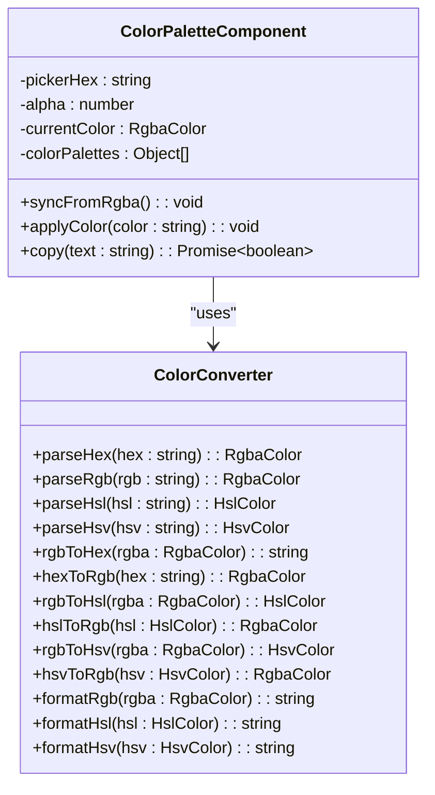

# 其他实用工具

<cite>
**本文档引用文件**  
- [RegexTools.vue](file://src/views/regex/RegexTools.vue)
- [JwtDecoder.vue](file://src/views/jwt/JwtDecoder.vue)
- [QRCodeTool.vue](file://src/views/qrcode/QRCodeTool.vue)
- [TimestampTool.vue](file://src/views/time/TimestampTool.vue)
- [ColorPalette.vue](file://src/views/color/ColorPalette.vue)
- [qrcodeUtils.ts](file://src/utils/qrcodeUtils.ts)
- [colorUtils.ts](file://src/utils/colorUtils.ts)
</cite>

## 目录
1. [引言](#引言)
2. [正则表达式测试工具](#正则表达式测试工具)
3. [JWT解析工具](#jwt解析工具)
4. [二维码生成与识别工具](#二维码生成与识别工具)
5. [时间戳转换工具](#时间戳转换工具)
6. [调色板功能](#调色板功能)
7. [组合使用建议](#组合使用建议)
8. [总结](#总结)

## 引言
本项目提供了一系列辅助性开发工具，旨在提升日常开发效率。这些工具覆盖了常见的数据处理、格式转换和调试需求，包括正则表达式测试、JWT解析、二维码生成与识别、时间戳转换以及调色板功能。每个工具都具备直观的用户界面和强大的功能特性，能够帮助开发者快速完成特定任务。

**Section sources**
- [app.ts](file://src/stores/app.ts#L1-L307)
- [tool.ts](file://src/stores/tool.ts#L1-L369)

## 正则表达式测试工具
`RegexTools.vue` 提供了一个完整的正则表达式在线测试环境，支持实时匹配高亮显示和捕获组分析。用户可以在输入框中编写正则表达式，并立即看到对测试文本的匹配结果。

该工具的核心价值在于其即时反馈机制：当用户修改正则表达式或测试文本时，系统会自动执行匹配并高亮显示所有匹配项。同时，它还提供了常用标志（如全局匹配g、忽略大小写i等）的快捷选择按钮，简化了复杂模式的构建过程。

此外，工具内置了多个常见场景的正则表达式示例，如邮箱地址、手机号码、URL链接等，方便用户快速参考和复用。通过分组结果显示功能，开发者可以清晰地查看每个捕获组的内容，这对于调试复杂的正则表达式尤为重要。

**Section sources**
- [RegexTools.vue](file://src/views/regex/RegexTools.vue#L1-L571)

## JWT解析工具
`JwtDecoder.vue` 是一个专门用于解析JWT令牌的工具，能够将JWT字符串分解为Header、Payload和Signature三个部分，并以结构化的方式展示其中的信息。

该工具的主要优势体现在其详细的解析能力上。对于Header部分，它可以显示使用的加密算法和令牌类型；对于Payload部分，除了原始数据外，还能自动识别并转换时间戳字段（如iat、exp），将其转换为可读性强的日期时间格式。虽然该工具不进行签名验证（需要密钥才能完成），但它明确提示了这一点，避免用户产生误解。

为了提高用户体验，工具提供了两个典型JWT示例供用户加载测试：一个是包含基本用户信息的标准JWT，另一个是带有角色权限的复杂JWT。这使得开发者可以快速了解不同场景下的JWT结构差异。

**Section sources**
- [JwtDecoder.vue](file://src/views/jwt/JwtDecoder.vue#L1-L536)

## 二维码生成与识别工具
`QRCodeTool.vue` 实现了双向二维码处理功能，既可以从文本内容生成二维码图像，也可以从图片中解析出隐藏的信息。

在生成方面，工具允许用户自定义多种参数，包括尺寸、容错级别（L/M/Q/H）、前景色和背景色等。较高的容错级别意味着即使二维码部分受损也能被正确读取，适用于打印质量较差或容易磨损的场景。生成后的二维码可以直接下载保存或复制到剪贴板，便于后续使用。

在识别方面，工具支持通过拖拽上传、点击选择或粘贴三种方式导入图片。一旦成功解析，内容会显示在编辑器中，并自动判断其类型（如URL链接、Wi-Fi配置、联系人信息等）。这种智能化的内容识别大大提升了用户的操作效率。

**Diagram sources**
- [QRCodeTool.vue](file://src/views/qrcode/QRCodeTool.vue#L1-L1165)
- [qrcodeUtils.ts](file://src/utils/qrcodeUtils.ts#L1-L158)

## 时间戳转换工具
`TimestampTool.vue` 提供了秒级和毫秒级时间戳与标准日期时间之间的双向转换功能，并支持按指定时区显示结果。

该工具解决了跨时区开发中的常见问题。例如，在处理国际业务时，服务器可能使用UTC时间戳，而前端需要显示本地时间。通过这个工具，开发者可以轻松地在不同时间表示形式之间切换，并准确预览目标时区的时间效果。

界面设计上分为两个主要区域：上方用于将时间戳转换为日期时间，下方则相反。两者均支持手动输入和"现在"按钮快速填充当前时间。转换结果会同时显示短横线分隔和斜杠分隔两种格式，满足不同系统的兼容性要求。

**Section sources**
- [TimestampTool.vue](file://src/views/time/TimestampTool.vue#L1-L539)

## 调色板功能
`ColorPalette.vue` 不仅是一个简单的颜色选择器，更是一个全面的颜色管理工具，支持HEX、RGB、HSL、HSV等多种格式的相互转换。

用户可以通过顶部的颜色拾取器直观地选择基础色调，然后调整透明度滑块来控制Alpha通道。下方的四个输入框分别对应不同的颜色表示法，任一格式的更改都会实时同步到其他格式，确保一致性。

特别值得一提的是，工具集成了多组精心设计的色彩搭配方案，涵盖警告红、莫兰迪色系、马卡龙色系等多个主题。点击任意色块即可应用整套配色，极大地方便了UI设计师快速构建和谐的视觉风格。

**Diagram sources**
- [ColorPalette.vue](file://src/views/color/ColorPalette.vue#L1-L489)
- [colorUtils.ts](file://src/utils/colorUtils.ts#L1-L283)

## 组合使用建议
这些工具不仅可以独立使用，还可以结合形成高效的工作流。以下是一些推荐的组合应用场景：

1. **API调试流程**：先使用`正则表达式测试工具`验证请求