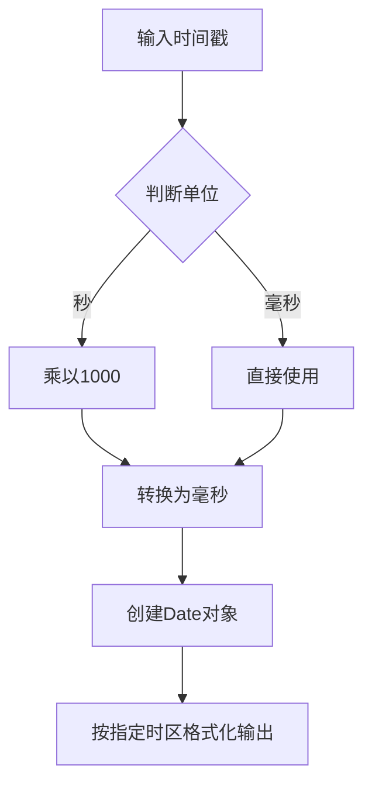
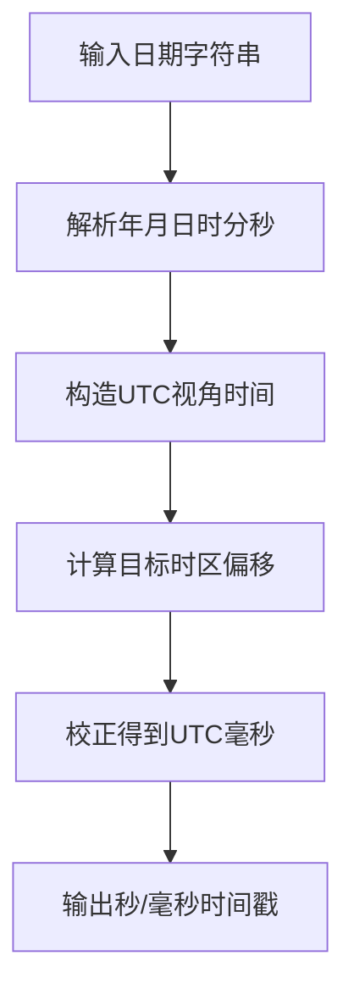

# 时间戳转换工具

<cite>
**本文档引用文件**   
- [TimestampTool.vue](file://src/views/time/TimestampTool.vue)
</cite>

## 目录
1. [简介](#简介)
2. [功能特性](#功能特性)
3. [时间戳与日期格式双向转换](#时间戳与日期格式双向转换)
4. [时区处理机制](#时区处理机制)
5. [界面交互说明](#界面交互说明)
6. [典型应用场景](#典型应用场景)
7. [代码解析最佳实践](#代码解析最佳实践)

## 简介
`TimestampTool.vue` 是一个基于 Vue 3 的前端组件，提供秒级和毫秒级 Unix 时间戳与 ISO 8601 标准时间格式之间的双向转换功能。该工具支持多种时区显示，并通过 JavaScript `Date` 对象实现精确的本地时间与 UTC 时间映射，适用于开发调试、日志分析等多种场景。

**Section sources**
- [TimestampTool.vue](file://src/views/time/TimestampTool.vue#L0-L30)

## 功能特性
- 支持秒级（10位）和毫秒级（13位）Unix 时间戳输入
- 双向转换：时间戳 ↔ ISO 8601 日期时间格式
- 多时区支持：包括亚洲、欧洲、美洲等常见时区
- 自动检测输入精度并高亮对应时间段
- 提供“现在”按钮快速填充当前时间
- 结果可一键复制到剪贴板
- 响应式设计适配移动端

**Section sources**
- [TimestampTool.vue](file://src/views/time/TimestampTool.vue#L0-L538)

## 时间戳与日期格式双向转换
### 时间戳转日期时间
用户可在输入框中输入时间戳数值，选择单位为“秒”或“毫秒”，系统将自动解析并在所选时区下展示对应的日期时间。支持 `-` 和 `/` 两种分隔符格式输出。



**Diagram sources**
- [TimestampTool.vue](file://src/views/time/TimestampTool.vue#L147-L206)

### 日期时间转时间戳
用户输入符合 `YYYY-MM-DD HH:mm:ss` 或 `YYYY/MM/DD HH:mm:ss` 格式的日期时间字符串，选择源时区后，系统将其解析为对应的 UTC 毫秒时间戳，并提供秒级和毫秒级两种输出形式。



**Diagram sources**
- [TimestampTool.vue](file://src/views/time/TimestampTool.vue#L283-L362)

## 时区处理机制
组件内部利用 `Intl.DateTimeFormat` API 实现跨时区正确映射：

1. **获取本地时区**：通过 `Intl.DateTimeFormat().resolvedOptions().timeZone` 获取浏览器所在时区。
2. **格式化输出**：使用 `formatToParts()` 方法将时间戳按指定时区分解为年、月、日、时、分、秒等部分，确保显示准确。
3. **偏移量计算**：对于“本地时间→时间戳”转换，采用迭代法计算目标时区相对于 UTC 的分钟偏移量，避免夏令时边界误差。

```typescript
const getTzOffsetMinutes = (utcMs: number, tz: string): number => {
  const parts = new Intl.DateTimeFormat('en-CA', {
    timeZone: tz,
    year: 'numeric',
    month: '2-digit',
    day: '2-digit',
    hour: '2-digit',
    minute: '2-digit',
    second: '2-digit'
  }).formatToParts(new Date(utcMs))
  
  const y = get('year'), m = get('month'), d = get('day')
  const hh = get('hour'), mi = get('minute'), ss = get('second')
  
  const localMs = Date.UTC(y, m - 1, d, hh, mi, ss)
  return Math.round((localMs - utcMs) / 60000)
}
```

**Section sources**
-