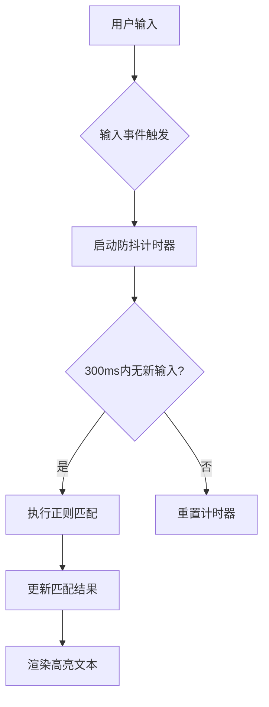
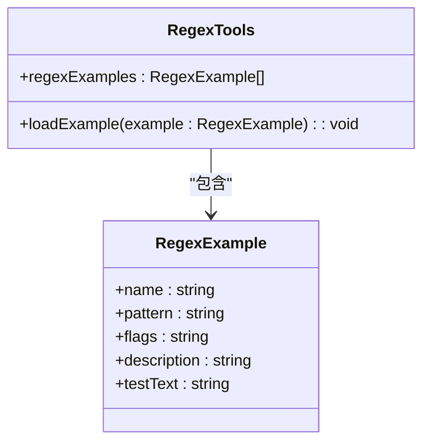
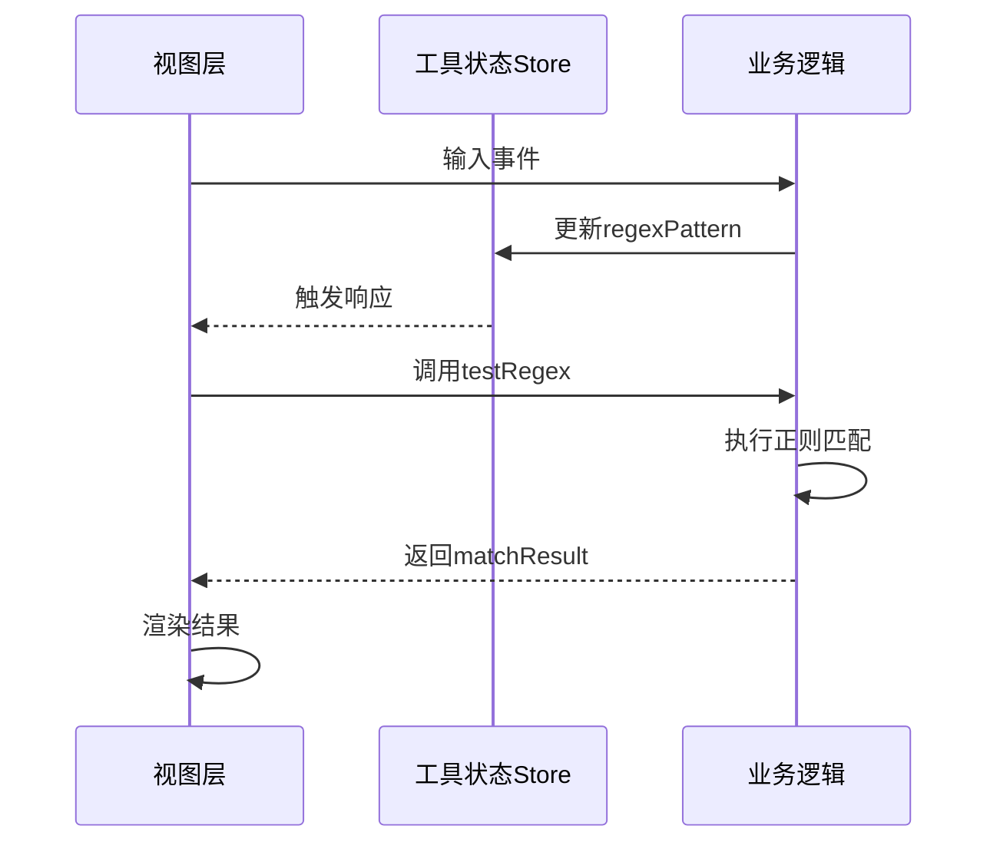
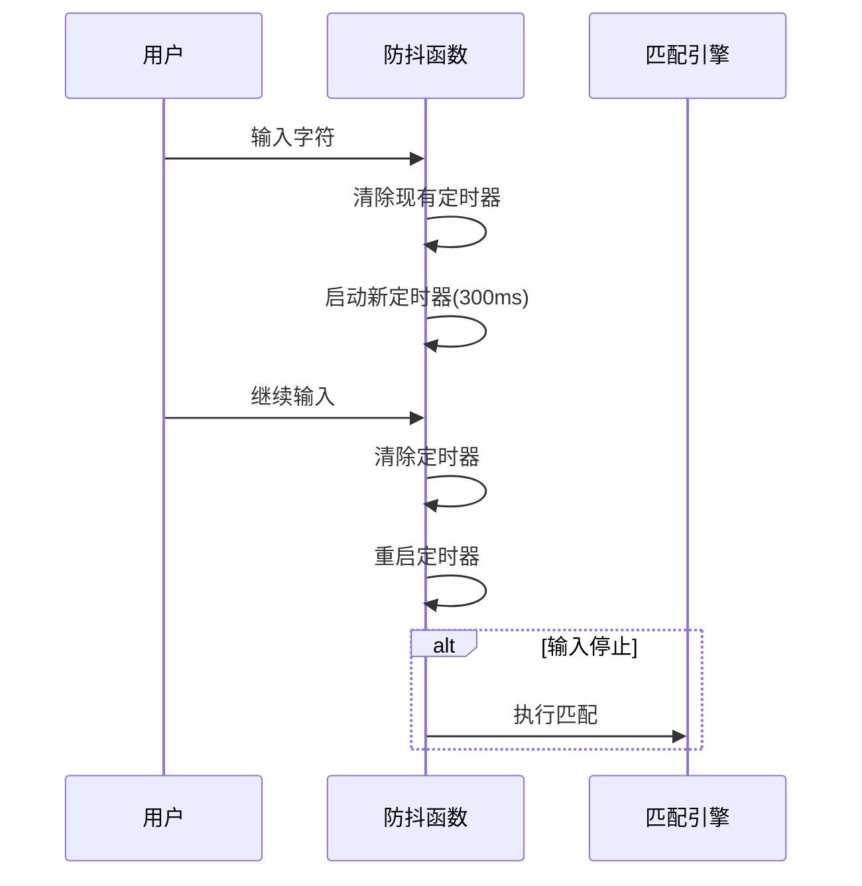

# 正则表达式测试工具

<cite>
**Referenced Files in This Document**  
- [RegexTools.vue](file://src/views/regex/RegexTools.vue)
- [ToolPanel.vue](file://src/components/ToolPanel.vue)
- [tool.ts](file://src/stores/tool.ts)
- [index.ts](file://src/utils/index.ts)
</cite>

## 目录
1. [简介](#简介)
2. [核心功能详解](#核心功能详解)
3. [组合式API实现机制](#组合式api实现机制)
4. [安全校验与错误处理](#安全校验与错误处理)
5. [典型使用场景](#典型使用场景)
6. [常见陷阱与性能优化](#常见陷阱与性能优化)
7. [布局一致性设计](#布局一致性设计)

## 简介

正则表达式测试工具是一个基于Vue 3组合式API构建的交互式开发辅助组件，旨在为开发者提供一个直观、高效的正则表达式调试环境。该工具通过实时匹配、捕获组高亮和测试用例管理等功能，帮助用户快速验证和优化正则表达式模式。

作为程序工具套件的一部分，`RegexTools.vue` 组件与其他工具共享统一的UI框架和状态管理模式，确保了用户体验的一致性。其核心价值在于将复杂的正则表达式逻辑可视化，降低学习曲线，并提高开发效率。

**Section sources**
- [RegexTools.vue](file://src/views/regex/RegexTools.vue#L1-L50)

## 核心功能详解

### 实时正则匹配

正则表达式测试工具实现了毫秒级响应的实时匹配功能。当用户在输入框中修改正则模式或测试文本时，系统会立即执行匹配操作并更新结果展示。

该功能的核心是`testRegex`方法，它通过监听用户输入事件触发匹配流程。为了平衡响应速度与性能消耗，系统采用了防抖技术（debounce），将匹配操作延迟300毫秒执行，避免在用户连续输入过程中产生过多不必要的计算。



**Diagram sources**
- [RegexTools.vue](file://src/views/regex/RegexTools.vue#L180-L200)

### 捕获组高亮显示

捕获组高亮功能能够清晰地展示正则表达式中各个分组的匹配结果。系统通过`exec`方法获取完整的匹配信息，包括主匹配和所有捕获组内容。

当存在捕获组时，工具会在"分组结果"区域以结构化的方式展示每个分组的索引和对应内容。这种可视化呈现方式有助于开发者理解复杂正则表达式的匹配行为，特别是嵌套分组和条件分组的情况。

**Section sources**
- [RegexTools.vue](file://src/views/regex/RegexTools.vue#L250-L270)

### 测试用例管理

工具内置了多个常用正则表达式的预设示例，涵盖邮箱地址、手机号码、URL链接等常见场景。这些示例不仅提供了即用的正则模式，还附带了典型的测试文本，形成了完整的测试用例。

用户可以通过点击示例卡片一键加载对应的正则模式、标志位和测试文本，快速开始调试工作。这种设计大大降低了初学者的学习门槛，同时也为经验丰富的开发者提供了便捷的参考模板。



**Diagram sources**
- [RegexTools.vue](file://src/views/regex/RegexTools.vue#L90-L150)

## 组合式API实现机制

### 响应式数据绑定

正则表达式测试工具充分利用了Vue 3的响应式系统，通过`ref`和`computed`创建了高效的数据流。关键状态如正则模式、测试文本和匹配结果都被声明为响应式引用。

工具状态存储于Pinia store中，通过`useToolStore`进行集中管理。这种方式实现了组件间的状态共享，使得用户在不同会话中的配置得以持久化保存。



**Diagram sources**
- [RegexTools.vue](file://src/views/regex/RegexTools.vue#L60-L80)
- [tool.ts](file://src/stores/tool.ts#L14-L367)

### 错误提示逻辑

系统的错误处理机制采用预防性设计原则。当用户输入的正则表达式存在语法错误时，系统会捕获`RegExp`构造函数抛出的异常，并在界面显眼位置显示具体的错误信息。

错误提示采用友好的用户界面设计，使用醒目的颜色和图标吸引注意力，同时保持简洁明了的文案说明。这种即时反馈机制帮助用户快速定位和修正问题，提升了调试效率。

**Section sources**
- [RegexTools.vue](file://src/views/regex/RegexTools.vue#L220-L240)

## 安全校验与错误处理

### JavaScript原生RegExp对象的安全使用

正则表达式测试工具直接利用JavaScript原生的`RegExp`对象进行模式编译和匹配操作。这种做法既保证了与标准的兼容性，又避免了引入第三方库可能带来的安全风险。

系统通过严格的异常处理机制来防范潜在的正则注入攻击。所有用户输入都经过沙箱环境执行，即使恶意构造的正则表达式也无法影响应用程序的整体稳定性。

```mermaid
flowchart TD
A[用户输入正则模式] --> B[尝试new RegExp()]
B --> C{语法正确?}
C --> |是| D[执行匹配操作]
C --> |否| E[捕获SyntaxError]
E --> F[显示友好错误提示]
D --> G[返回安全的结果]
```

**Diagram sources**
- [RegexTools.vue](file://src/views/regex/RegexTools.vue#L210-L230)

### 防抖机制实现

为了优化性能并提升用户体验，系统实现了防抖功能。`debounce`函数位于工具函数库中，采用泛型编程确保类型安全。

防抖机制的核心是定时器控制：每次用户输入都会重置计时器，只有当输入暂停超过设定阈值（300ms）后才会真正执行匹配操作。这种方法有效减少了CPU密集型的正则运算次数。



**Diagram sources**
- [index.ts](file://src/utils/index.ts#L109-L157)
- [RegexTools.vue](file://src/views/regex/RegexTools.vue#L180-L200)

## 典型使用场景

### 表单验证模式编写

在Web开发中，表单验证是最常见的正则应用场景之一。开发者可以使用本工具快速构建和测试各种输入验证规则，如邮箱格式、密码强度、电话号码等。

通过反复调整正则模式并观察实时匹配结果，开发者能够精确控制验证的严格程度，避免过于宽松或过于严格的验证逻辑。

### 日志提取规则调试

系统日志分析常常需要从大量文本中提取特定信息。本工具可以帮助运维人员构建复杂的日志解析规则，例如提取IP地址、时间戳、错误代码等关键字段。

利用多行模式（m标志）和全局匹配（g标志），用户可以轻松处理跨行的日志条目，并通过捕获组分离不同的数据元素。

**Section sources**
- [RegexTools.vue](file://src/views/regex/RegexTools.vue#L150-L180)

## 常见陷阱与性能优化

### 贪婪匹配误用

贪婪匹配是正则表达式中最容易被误解的概念之一。默认情况下，量词（*、+、?、{}）都是贪婪的，会尽可能多地匹配字符。

新手开发者常犯的错误是未意识到贪婪匹配可能导致意外的结果截断。建议在需要精确控制匹配范围时使用非贪婪模式（在量词后添加?符号），或通过更精确的字符类定义来限制匹配范围。

### 性能退化问题

某些正则表达式模式可能导致严重的性能问题，特别是涉及回溯的复杂模式。当面对长文本时，不良的正则设计可能引发指数级的时间复杂度增长。

优化建议包括：
- 避免嵌套量词
- 使用原子组减少回溯
- 优先使用锚点定位
- 对大型文本分块处理

**Section sources**
- [RegexTools.vue](file://src/views/regex/RegexTools.vue#L200-L210)

## 布局一致性设计

### ToolPanel布局共享

正则表达式测试工具遵循统一的设计语言，继承自`ToolPanel`基础组件。这种设计确保了所有工具页面在视觉风格和交互模式上保持一致。

`ToolPanel`提供了标准化的页眉、内容区域和装饰元素，使用户能够在不同工具间无缝切换而无需重新学习界面操作。标题栏的渐变效果和动态圆点装饰增强了产品的专业感和现代感。

```mermaid
classDiagram
    class Tool