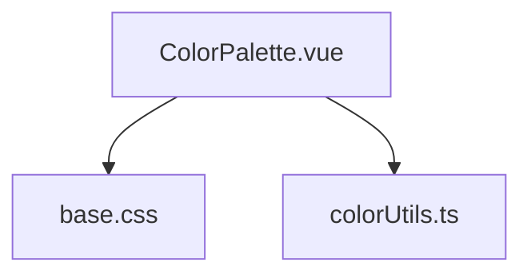

# 调色板工具

<cite>
**本文档引用文件**  
- [ColorPalette.vue](file://src/views/color/ColorPalette.vue)
- [base.css](file://src/assets/base.css)
- [colorUtils.ts](file://src/utils/colorUtils.ts)
</cite>

## 目录
1. [简介](#简介)
2. [项目结构](#项目结构)
3. [核心组件](#核心组件)
4. [架构概述](#架构概述)
5. [详细组件分析](#详细组件分析)
6. [依赖分析](#依赖分析)
7. [性能考虑](#性能考虑)
8. [故障排除指南](#故障排除指南)
9. [结论](#结论)

## 简介
调色板工具是一个功能丰富的颜色选择器组件，支持HEX、RGB、HSL和HSV等多种颜色格式的实时转换与预览。该组件利用CSS变量和动态样式绑定实现即时视觉反馈，并提供多种预设色彩搭配方案，帮助用户快速选择协调的颜色组合。通过集成项目中的`base.css`变量体系，确保了UI的一致性和可维护性。

## 项目结构
调色板工具位于项目的`src/views/color/`目录下，主要由`ColorPalette.vue`单文件组件构成。该组件依赖于全局样式文件`base.css`和工具函数`colorUtils.ts`，实现了完整的颜色处理逻辑。

**Diagram sources**
- [ColorPalette.vue](