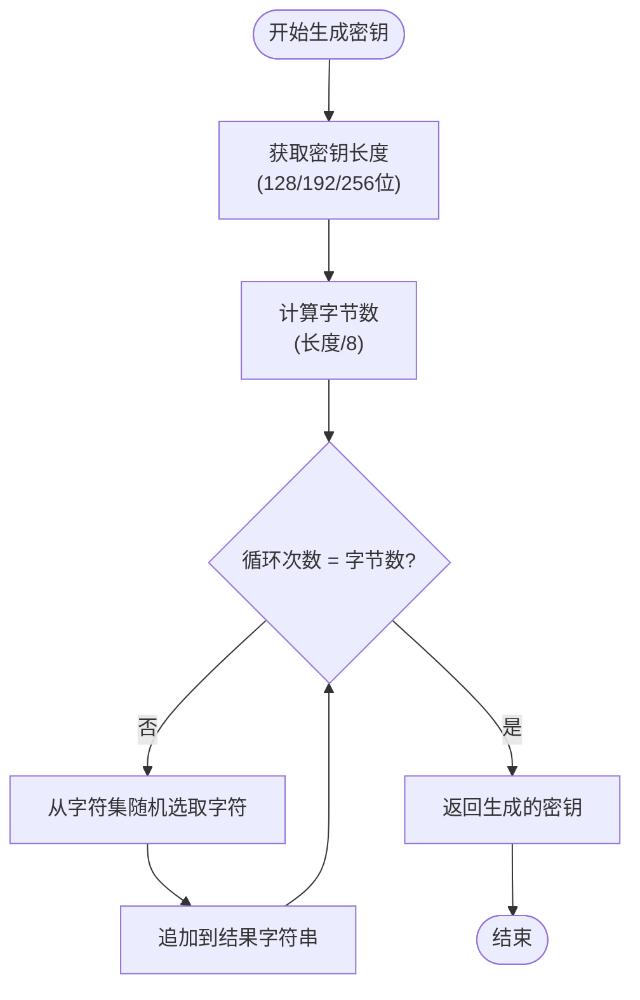
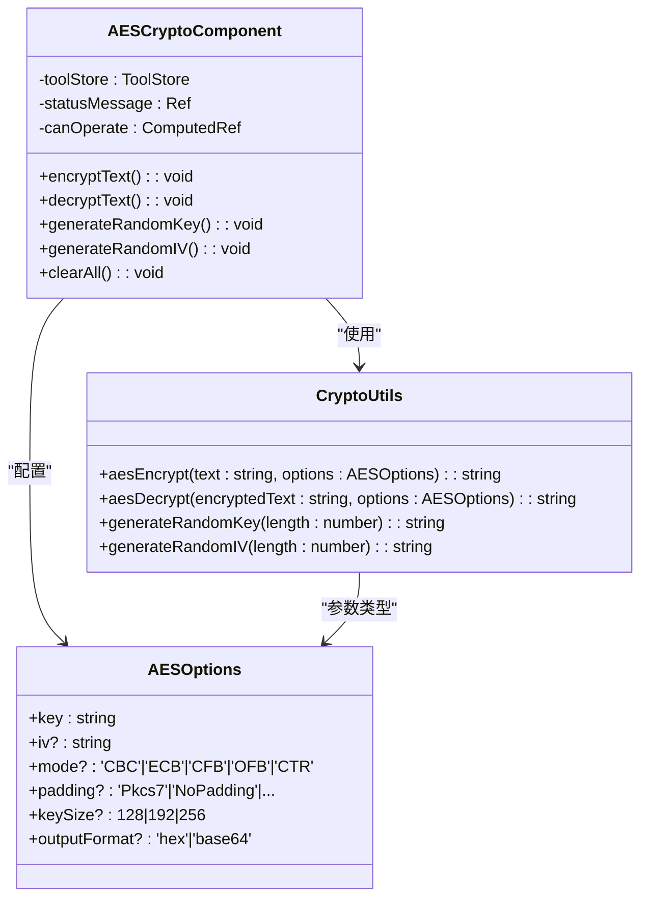
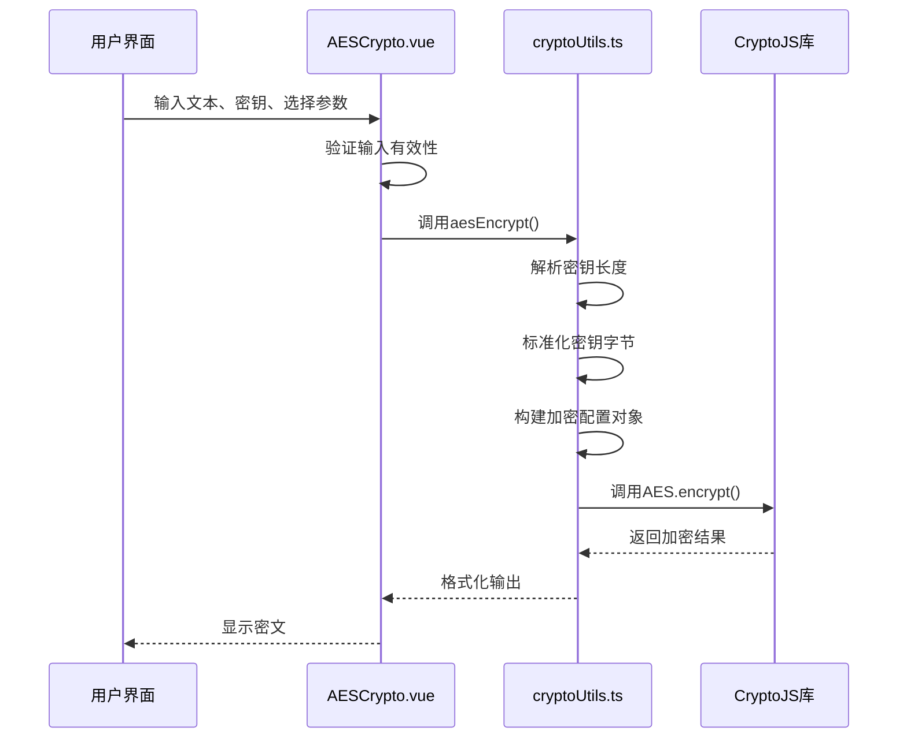

# AES对称加密

<cite>
**Referenced Files in This Document **   
- [AESCrypto.vue](file://src/views/crypto/AESCrypto.vue)
- [cryptoUtils.ts](file://src/utils/cryptoUtils.ts)
</cite>

## 目录
1. [简介](#简介)
2. [密钥派生与管理](#密钥派生与管理)
3. [初始化向量（IV）生成策略](#初始化向量iv-生成策略)
4. [加密模式与填充方式](#加密模式与填充方式)
5. [底层加密流程分析](#底层加密流程分析)
6. [代码示例与测试验证](#代码示例与测试验证)
7. [安全性建议](#安全性建议)

## 简介

本文档深入解析前端AES对称加密功能的实现机制，重点阐述`AESCrypto.vue`组件与`cryptoUtils.ts`工具模块协同工作的完整流程。系统采用CryptoJS库在浏览器端执行本地加密操作，确保用户数据全程不离开客户端，有效保障隐私安全。

该实现支持多种配置选项：
- 密钥长度：128、192、256位
- 加密模式：CBC、ECB、CFB、OFB、CTR
- 填充方式：PKCS7、ANSI X9.23、ISO 10126等
- 输出格式：十六进制或Base64编码

所有计算均在用户设备上完成，无需服务器参与，从根本上杜绝了敏感信息泄露风险。

**Section sources**
- [AESCrypto.vue](file://src/views/crypto/AESCrypto.vue#L1-L826)
- [cryptoUtils.ts](file://src/utils/cryptoUtils.ts#L1-L269)

## 密钥派生与管理

系统提供两种密钥管理方式：手动输入和随机生成。

### 手动密钥输入
用户可直接在界面输入任意字符串作为密钥。系统通过UTF-8编码将其转换为字节序列，并根据选定的密钥长度（128/192/256位）进行标准化处理：

- 若密钥过长，则截取前N个字节
- 若密钥过短，则用零字节填充至目标长度

此方法适用于需要固定密钥的场景，但要求用户严格遵守密码复杂度规范。

### 随机密钥生成
当用户点击"生成密钥"按钮时，系统调用`generateRandomKey()`函数创建高强度随机密钥。该函数使用JavaScript原生`Math.random()`结合大小写字母及数字字符集生成指定长度的密码学强度较低的随机字符串。



**Diagram sources **
- [cryptoUtils.ts](file://src/utils/cryptoUtils.ts#L255-L262)
- [AESCrypto.vue](file://src/views/crypto/AESCrypto.vue#L388-L392)

**Section sources**
- [cryptoUtils.ts](file://src/utils/cryptoUtils.ts#L255-L262)
- [AESCrypto.vue](file://src/views/crypto/AESCrypto.vue#L388-L392)

## 初始化向量（IV）生成策略

初始化向量（IV）是确保相同明文每次加密产生不同密文的关键要素，尤其对于CBC等反馈模式至关重要。

### IV生成机制
系统通过`generateRandomIV()`函数生成16字节（128位）的随机IV值。该函数本质上是对`generateRandomKey(16)`的封装调用，利用相同的伪随机数生成器创建符合AES标准的初始向量。

### 安全性注意事项
- **唯一性原则**：每次加密操作应使用不同的随机IV
- **非保密性**：IV无需保密，通常与密文一同传输
- **模式依赖**：仅在CBC、CFB、OFB、CTR模式下需要IV；ECB模式不需要

前端组件会在非ECB模式下强制要求用户提供或生成IV，否则禁用加密功能，确保配置完整性。



**Diagram sources **
- [cryptoUtils.ts](file://src/utils/cryptoUtils.ts#L23-L30)
- [AESCrypto.vue](file://src/views/crypto/AESCrypto.vue#L1-L826)

**Section sources**
- [cryptoUtils.ts](file://src/utils/cryptoUtils.ts#L265-L267)
- [AESCrypto.vue](file://src/views/crypto/AESCrypto.vue#L395-L398)

## 加密模式与填充方式

系统支持多种AES加密模式和填充方案，以适应不同应用场景的安全需求。

### 支持的加密模式
| 模式 | 全称 | 特点 | 是否需要IV |
|------|------|------|-----------|
| CBC | 密码块链接模式 | 安全性高，推荐使用 | 是 |
| ECB | 电子密码本模式 | 存在模式泄露风险 | 否 |
| CFB | 密码反馈模式 | 可处理流数据 | 是 |
| OFB | 输出反馈模式 | 适合实时通信 | 是 |
| CTR | 计数器模式 | 支持并行处理 | 是 |

### 推荐配置组合
- **最高安全性**：CBC模式 + PKCS7填充 + 随机IV
- **兼容性优先**：CBC模式 + ZeroPadding填充
- **流式传输**：CTR模式 + NoPadding填充

ECB模式虽被支持，但因其无法隐藏数据模式，在实际应用中应避免使用。

**Section sources**
- [AESCrypto.vue](file://src/views/crypto/AESCrypto.vue#L1-L826)

## 底层加密流程分析

前端AES加密的核心逻辑由`cryptoUtils.ts`中的`aesEncrypt`和`aesDecrypt`函数实现，基于CryptoJS库构建。

### 加密执行流程


### 关键处理步骤
1. **密钥标准化**：将输入密钥转换为指定长度的WordArray对象
2. **配置构建**：根据选项设置加密模式、填充方式和IV
3. **核心加密**：调用CryptoJS.AES.encrypt执行实际加密
4. **结果格式化**：按需转换为Hex或Base64字符串

解密过程遵循类似流程，但需正确匹配加密时使用的各项参数才能成功还原原文。

**Diagram sources **
- [cryptoUtils.ts](file://src/utils/cryptoUtils.ts#L33-L81)
- [cryptoUtils.ts](file://src/utils/cryptoUtils.ts#L84-L145)

**Section sources**
- [cryptoUtils.ts](file://src/utils/cryptoUtils.ts#L33-L145)

## 代码示例与测试验证

### 文本加密示例
```typescript
// 加密操作
const encrypted = aesEncrypt('Hello World', {
  key: 'mySecretKey123456789012345678',
  iv: '1234567890123456',
  mode: 'CBC',
  padding: 'Pkcs7',
  keySize: 256,
  outputFormat: 'hex'
});

console.log(encrypted); // 输出十六进制密文
```

### 文件加密示意
虽然当前实现主要针对文本，但可通过FileReader读取文件内容后进行加密：
```javascript
const reader = new FileReader();
reader.onload = function(e) {
  const fileContent = e.target.result;
  const encrypted = aesEncrypt(fileContent, options);
  // 保存加密后的内容
};
