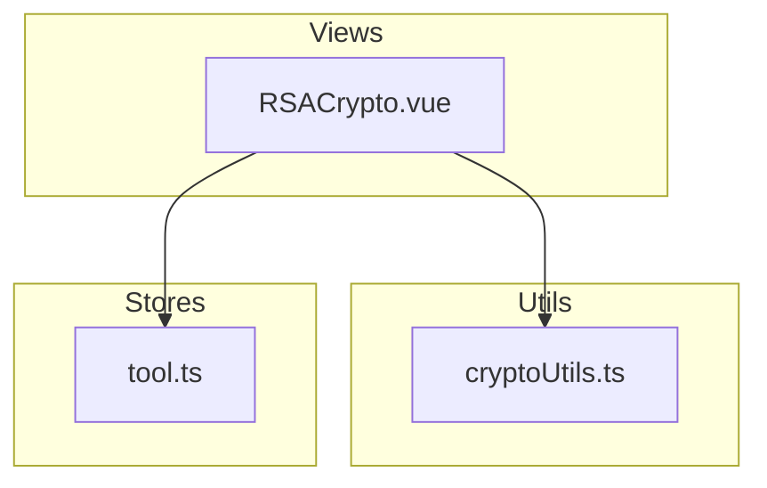
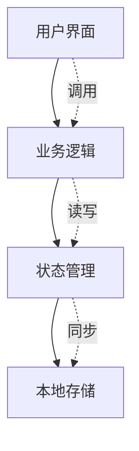
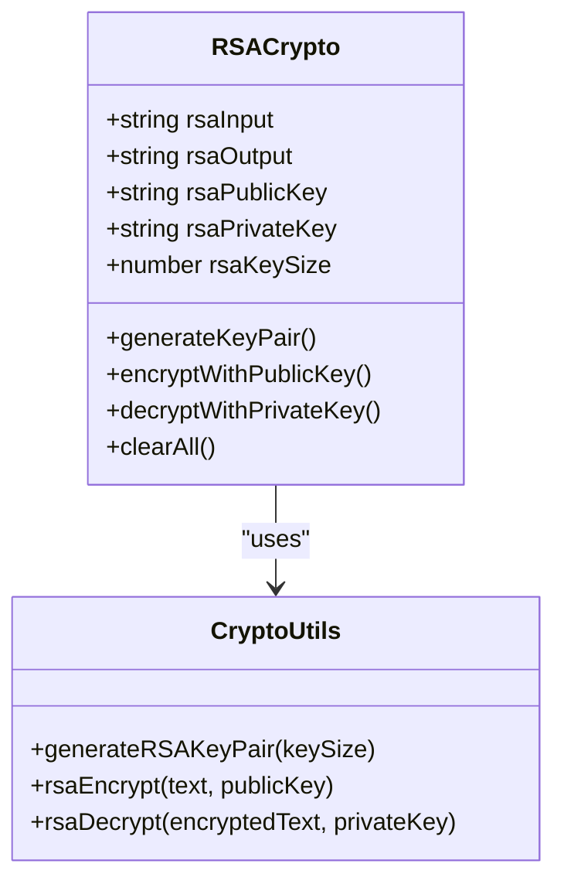
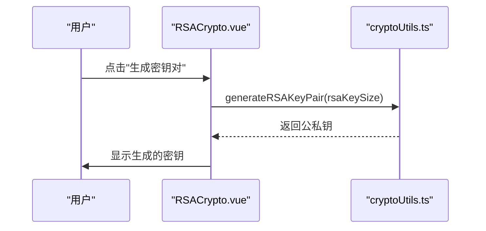
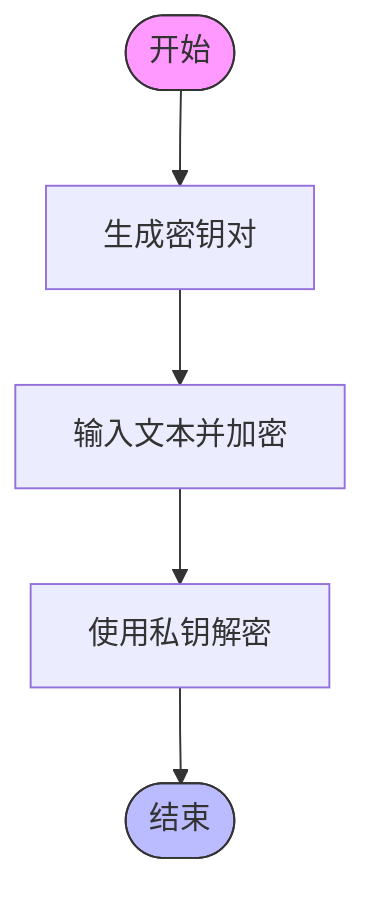
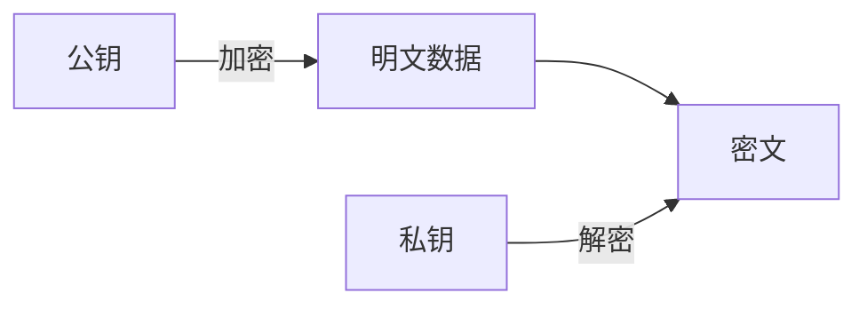
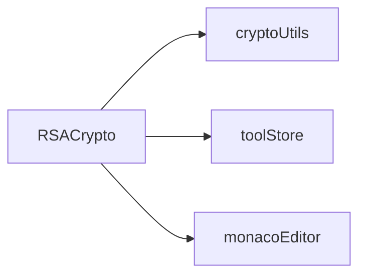

# RSA非对称加密

<cite>
**本文档引用文件**
- [RSACrypto.vue](file://src/views/crypto/RSACrypto.vue)
- [cryptoUtils.ts](file://src/utils/cryptoUtils.ts)
- [tool.ts](file://src/stores/tool.ts)
</cite>

## 目录
1. [简介](#简介)
2. [项目结构](#项目结构)
3. [核心组件](#核心组件)
4. [架构概述](#架构概述)
5. [详细组件分析](#详细组件分析)
6. [依赖分析](#依赖分析)
7. [性能考虑](#性能考虑)
8. [故障排除指南](#故障排除指南)
9. [结论](#结论)

## 简介
本工具提供RSA非对称加密和解密功能，支持密钥对生成、公私钥加解密。RSA是一种基于大整数分解难题的非对称加密算法，使用一对密钥：公钥用于加密，私钥用于解密。该工具允许用户选择1024、2048或4096位的密钥长度，并提供了直观的界面来执行加密和解密操作。

## 项目结构
该项目是一个Vue.js应用，包含多个视图和工具模块。`RSACrypto.vue`位于`src/views/crypto/`目录下，是实现RSA加解密功能的主要组件。相关的工具函数定义在`src/utils/cryptoUtils.ts`中，而状态管理则通过Pinia存储于`src/stores/tool.ts`。

**图表来源**
- [RSACrypto.vue](file://src/views/crypto/RSACrypto.vue)
- [cryptoUtils.ts](file://src/utils/cryptoUtils.ts)
- [tool.ts](file://src/stores/tool.ts)

## 核心组件
`RSACrypto.vue`组件实现了RSA加解密的核心逻辑，包括密钥对生成、公钥加密和私钥解密等功能。它利用了`cryptoUtils.ts`中的`generateRSAKeyPair`、`rsaEncrypt`和`rsaDecrypt`函数来完成具体的加密运算，并通过`tool.ts`中的store进行数据持久化。

**章节来源**
- [RSACrypto.vue](file://src/views/crypto/RSACrypto.vue#L1-L740)
- [cryptoUtils.ts](file://src/utils/cryptoUtils.ts#L1-L269)
- [tool.ts](file://src/stores/tool.ts#L1-L369)

## 架构概述
整个系统采用分层架构设计，前端界面由Vue组件构成，业务逻辑封装在独立的工具类中，状态管理借助Pinia实现。这种分离使得代码更易于维护和测试。

**图表来源**
- [RSACrypto.vue](file://src/views/crypto/RSACrypto.vue#L1-L740)
- [cryptoUtils.ts](file://src/utils/cryptoUtils.ts#L1-L269)
- [tool.ts](file://src/stores/tool.ts#L1-L369)

## 详细组件分析
### RSACrypto.vue 组件分析
此组件负责展示RSA加解密的用户界面，并处理用户的交互请求。当用户点击“生成密钥对”按钮时，会触发`generateKeyPair`方法，该方法调用`cryptoUtils.ts`中的`generateRSAKeyPair`函数以指定的密钥长度创建新的密钥对。

#### 对象导向组件：

**图表来源**
- [RSACrypto.vue](file://src/views/crypto/RSACrypto.vue#L1-L740)
- [cryptoUtils.ts](file://src/utils/cryptoUtils.ts#L1-L269)

#### API/服务组件：

**图表来源**
- [RSACrypto.vue](file://src/views/crypto/RSACrypto.vue#L1-L740)
- [cryptoUtils.ts](file://src/utils/cryptoUtils.ts#L1-L269)

#### 复杂逻辑组件：

**图表来源**
- [RSACrypto.vue](file://src/views/crypto/RSACrypto.vue#L1-L740)
- [cryptoUtils.ts](file://src/utils/cryptoUtils.ts#L1-L269)

**章节来源**
- [RSACrypto.vue](file://src/views/crypto/RSACrypto.vue#L1-L740)
- [cryptoUtils.ts](file://src/utils/cryptoUtils.ts#L1-L269)

### 概念概述
虽然本节不直接涉及具体文件，但理解RSA算法的基本原理对于正确使用该工具有着重要意义。RSA的安全性依赖于大整数因式分解的难度，因此推荐使用至少2048位的密钥长度以确保足够的安全性。

[无来源，因为此图表显示的是概念工作流，而非实际代码结构]

[无来源，因为此部分未分析特定源文件]

## 依赖分析
`RSACrypto.vue`组件依赖于`cryptoUtils.ts`提供的加密算法实现以及`tool.ts`中的状态管理机制。此外，还引入了第三方库如`monaco-editor`用于代码编辑器的功能增强。

**图表来源**
- [RSACrypto.vue](file://src/views/crypto/RSACrypto.vue#L1-L740)
- [cryptoUtils.ts](file://src/utils/cryptoUtils.ts#L1-L269)
- [tool.ts](file://src/stores/tool.ts#L1-L369)

**章节来源**
- [RSACrypto.vue](file://src/views/crypto/RSACrypto.vue#L1-L740)
- [cryptoUtils.ts](file://src/utils/cryptoUtils.ts#L1-L269)
- [tool.ts](file://src/stores/tool.ts#L1-L369)

## 性能考虑
尽管RSA提供了强大的安全保障，但由于其计算复杂度较高，在处理大量数据时可能会遇到性能瓶颈。建议仅将RSA用于加密少量关键信息（例如会话密钥），然后结合对称加密算法（如AES）来进行大规模数据传输。

[无来源，因为此部分提供一般性指导]

## 故障排除指南
如果遇到密钥生成失败的问题，请检查浏览器是否支持必要的Web Crypto API；若出现加密/解密错误，则需确认所使用的公私钥匹配且格式正确。另外，注意不要尝试加密超过密钥长度限制的数据。

**章节来源**
- [RSACrypto.vue](file://src/views/crypto/RSACrypto.vue#L1-L740)
- [cryptoUtils.ts](file://src/utils/cryptoUtils.ts#L1-L269)

## 结论
综上所述，`RSACrypto.vue`组件为用户提供了一个简单易用的RSA加解密解决方案。通过合理地组织代码结构与外部依赖关系，保证了系统的可扩展性和可维护性。然而需要注意的是，当前实现仅为演示目的，生产环境中应采用更加安全可靠的密码学库。

[无来源，因为此部分总结而不分析特定源文件]