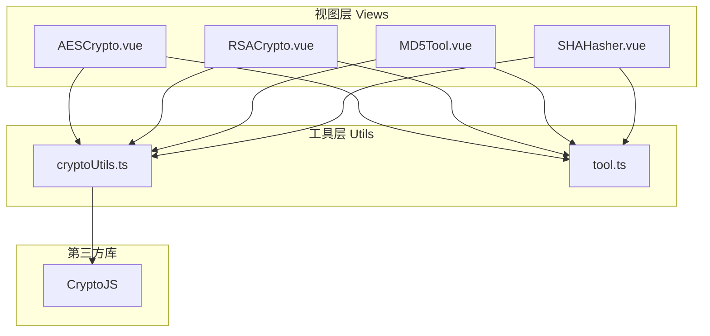
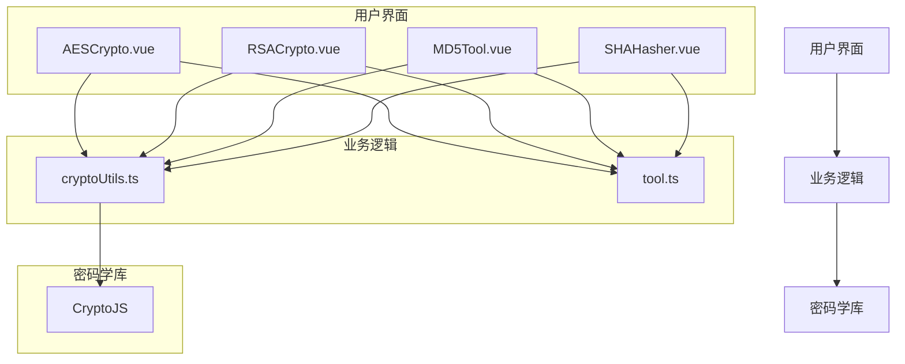
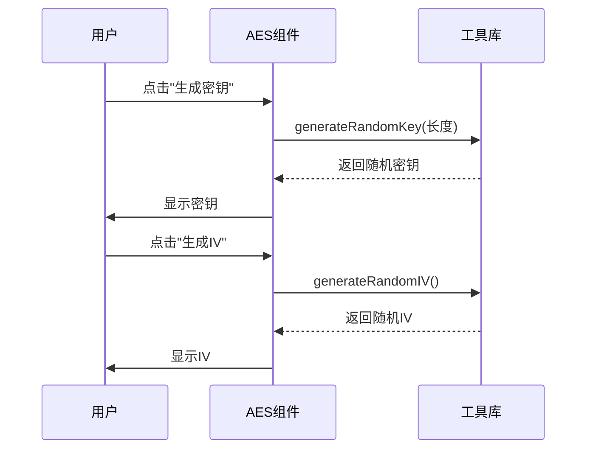
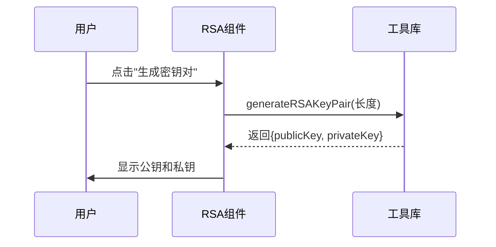
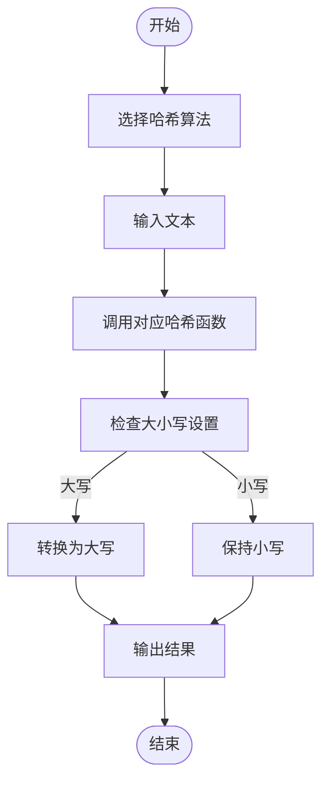

# 加解密工具

<cite>
**本文档引用文件**  
- [cryptoUtils.ts](file://src/utils/cryptoUtils.ts)
- [AESCrypto.vue](file://src/views/crypto/AESCrypto.vue)
- [RSACrypto.vue](file://src/views/crypto/RSACrypto.vue)
- [MD5Tool.vue](file://src/views/crypto/MD5Tool.vue)
- [SHAHasher.vue](file://src/views/crypto/SHAHasher.vue)
- [tool.ts](file://src/stores/tool.ts)
</cite>

## 目录
1. [简介](#简介)
2. [项目结构](#项目结构)
3. [核心组件](#核心组件)
4. [架构概述](#架构概述)
5. [详细组件分析](#详细组件分析)
6. [依赖分析](#依赖分析)
7. [性能考虑](#性能考虑)
8. [故障排除指南](#故障排除指南)
9. [结论](#结论)

## 简介
本工具模块提供全面的加解密功能，涵盖对称加密（AES）、非对称加密（RSA）以及哈希算法（MD5、SHA系列）。所有计算均在前端本地完成，确保敏感数据不离开用户设备。通过`cryptoUtils.ts`工具库封装底层加密逻辑，各Vue组件实现具体功能界面与交互流程。

## 项目结构
加解密工具位于`src/views/crypto`目录下，包含多个独立的Vue组件，每个组件负责特定的加密或哈希功能。核心逻辑由`src/utils/cryptoUtils.ts`统一提供，状态管理则通过Pinia存储在`src/stores/tool.ts`中。



**图表来源**
- [AESCrypto.vue](file://src/views/crypto/AESCrypto.vue)
- [RSACrypto.vue](file://src/views/crypto/RSACrypto.vue)
- [MD5Tool.vue](file://src/views/crypto/MD5Tool.vue)
- [SHAHasher.vue](file://src/views/crypto/SHAHasher.vue)
- [cryptoUtils.ts](file://src/utils/cryptoUtils.ts)
- [tool.ts](file://src/stores/tool.ts)

**章节来源**
- [AESCrypto.vue](file://src/views/crypto/AESCrypto.vue)
- [RSACrypto.vue](file://src/views/crypto/RSACrypto.vue)
- [MD5Tool.vue](file://src/views/crypto/MD5Tool.vue)
- [SHAHasher.vue](file://src/views/crypto/SHAHasher.vue)

## 核心组件
本模块的核心是`cryptoUtils.ts`，它封装了所有加密、解密和哈希算法的具体实现。`AESCrypto.vue`和`RSACrypto.vue`分别实现了对称和非对称加密的完整工作流，而`MD5Tool.vue`和`SHAHasher.vue`提供了多种哈希算法的计算功能。

**章节来源**
- [cryptoUtils.ts](file://src/utils/cryptoUtils.ts)
- [AESCrypto.vue](file://src/views/crypto/AESCrypto.vue)
- [RSACrypto.vue](file://src/views/crypto/RSACrypto.vue)

## 架构概述
系统采用分层架构，上层为Vue组件负责用户交互，中层为工具函数库处理业务逻辑，底层依赖CryptoJS进行实际的密码学运算。状态管理使用Pinia，确保各组件间的数据同步。



**图表来源**
- [AESCrypto.vue](file://src/views/crypto/AESCrypto.vue)
- [RSACrypto.vue](file://src/views/crypto/RSACrypto.vue)
- [MD5Tool.vue](file://src/views/crypto/MD5Tool.vue)
- [SHAHasher.vue](file://src/views/crypto/SHAHasher.vue)
- [cryptoUtils.ts](file://src/utils/cryptoUtils.ts)
- [tool.ts](file://src/stores/tool.ts)

## 详细组件分析

### AES加密组件分析
`AESCrypto.vue`实现了完整的AES加解密功能，支持多种模式和填充方式。

#### 密钥派生与IV管理
该组件通过`generateRandomKey`和`generateRandomIV`函数生成随机密钥和初始向量，并在UI中提供一键生成按钮。密钥长度根据用户选择自动调整。



**图表来源**
- [AESCrypto.vue](file://src/views/crypto/AESCrypto.vue#L270-L385)
- [cryptoUtils.ts](file://src/utils/cryptoUtils.ts#L250-L267)

**章节来源**
- [AESCrypto.vue](file://src/views/crypto/AESCrypto.vue)
- [cryptoUtils.ts](file://src/utils/cryptoUtils.ts)

### RSA加密组件分析
`RSACrypto.vue`实现了非对称加密功能，包括密钥对生成、公钥加密和私钥解密。

#### 公私钥生成与安全存储
该组件调用`generateRSAKeyPair`函数生成模拟的RSA密钥对，并将公钥和私钥分别显示在文本区域中，供用户复制使用。



**图表来源**
- [RSACrypto.vue](file://src/views/crypto/RSACrypto.vue#L254-L300)
- [cryptoUtils.ts](file://src/utils/cryptoUtils.ts#L154-L168)

**章节来源**
- [RSACrypto.vue](file://src/views/crypto/RSACrypto.vue)
- [cryptoUtils.ts](file://src/utils/cryptoUtils.ts)

### 哈希算法组件分析
`MD5Tool.vue`和`SHAHasher.vue`提供了多种哈希算法的计算功能。

#### 哈希算法实现
这些组件调用`cryptoUtils.ts`中的相应函数来计算哈希值，并支持大小写输出切换。



**图表来源**
- [MD5Tool.vue](file://src/views/crypto/MD5Tool.vue#L234-L291)
- [SHAHasher.vue](file://src/views/crypto/SHAHasher.vue#L294-L351)
- [cryptoUtils.ts](file://src/utils/cryptoUtils.ts#L3-L15)

**章节来源**
- [MD5Tool.vue](file://src/views/crypto/MD5Tool.vue)
- [SHAHasher.vue](file://src/views/crypto/SHAHasher.vue)
- [cryptoUtils.ts](file://src/utils/cryptoUtils.ts)

## 依赖分析
本模块主要依赖于CryptoJS库进行底层密码学运算，通过`cryptoUtils.ts`进行封装后供各Vue组件调用。状态管理依赖Pinia，确保跨组件的状态同步。

```mermaid
graph LR
    A[cryptoUtils.ts] --> B[CryptoJS]
    C[AESCrypto.vue] --> A
    D[RSACrypto.vue] --> A
    E[MD5Tool.vue] --> A
    F[SHAHasher.vue] --> A
    C --> G[tool.ts]
    D --> G
