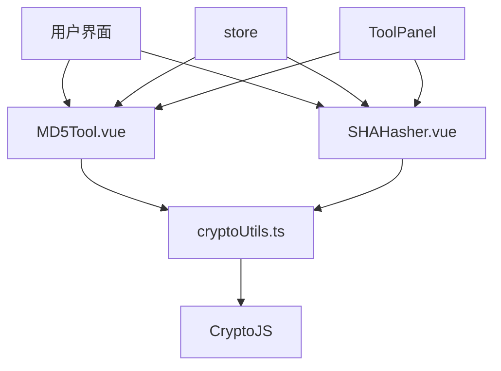
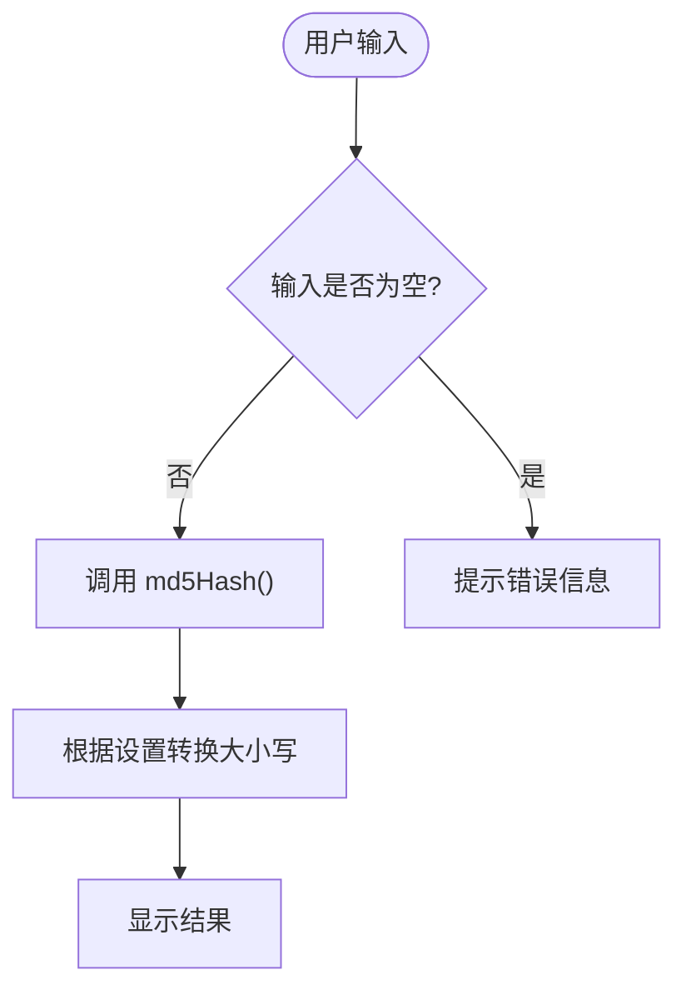
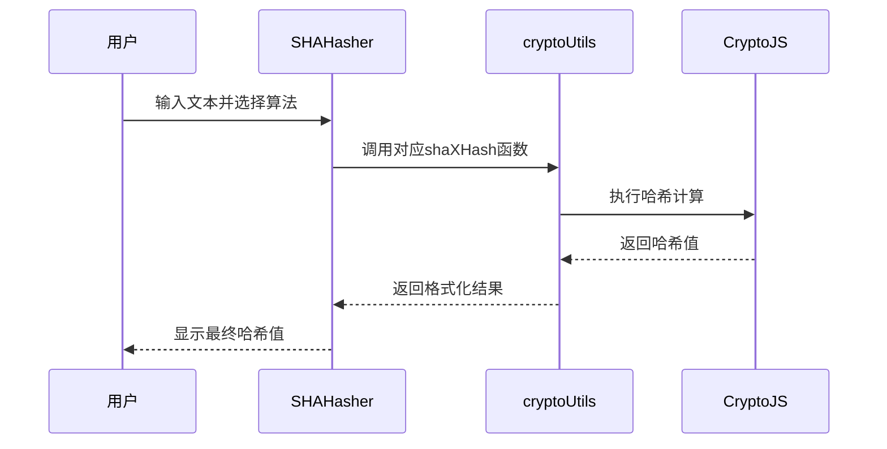
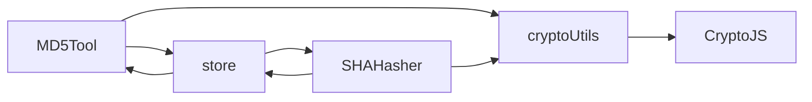

# 哈希算法工具

<cite>
**本文档引用文件**   
- [MD5Tool.vue](file://src/views/crypto/MD5Tool.vue)
- [SHAHasher.vue](file://src/views/crypto/SHAHasher.vue)
- [cryptoUtils.ts](file://src/utils/cryptoUtils.ts)
- [tool.ts](file://src/stores/tool.ts)
</cite>

## 目录
1. [简介](#简介)
2. [项目结构](#项目结构)
3. [核心组件](#核心组件)
4. [架构概述](#架构概述)
5. [详细组件分析](#详细组件分析)
6. [依赖分析](#依赖分析)
7. [性能考虑](#性能考虑)
8. [故障排除指南](#故障排除指南)
9. [结论](#结论)

## 简介
本系统提供基于客户端的哈希计算功能，包含 `MD5Tool.vue` 和 `SHAHasher.vue` 两个核心组件，支持 MD5、SHA-1、SHA-256 和 SHA-512 多种摘要算法。所有哈希运算均在前端完成，确保用户数据不会外泄。通过封装 CryptoJS 库实现高效的消息摘要计算，并提供标准测试向量验证结果准确性。

## 项目结构
```
.
├── src
│   ├── views
│   │   └── crypto
│   │       ├── MD5Tool.vue          # MD5哈希工具界面
│   │       ├── SHAHasher.vue        # SHA系列哈希工具界面
│   │       └── AESCrypto.vue
│   ├── utils
│   │   └── cryptoUtils.ts           # 哈希与加密函数封装
│   ├── stores
│   │   └── tool.ts                  # 全局状态管理
│   └── components
│       ├── ToolPanel.vue            # 工具面板容器
│       └── CodeEditor.vue           # 代码编辑器组件
└── ...
```

**Diagram sources**
- [MD5Tool.vue](file://src/views/crypto/MD5Tool.vue)
- [SHAHasher.vue](file://src/views/crypto/SHAHasher.vue)
- [cryptoUtils.ts](file://src/utils/cryptoUtils.ts)

**Section sources**
- [MD5Tool.vue](file://src/views/crypto/MD5Tool.vue)
- [SHAHasher.vue](file://src/views/crypto/SHAHasher.vue)

## 核心组件

### MD5 哈希功能
`MD5Tool.vue` 组件实现了完整的 MD5 哈希计算功能，支持输入文本处理、大小写输出切换和清空操作。该组件使用 `cryptoUtils.ts` 中的 `md5Hash` 函数进行实际计算。

### SHA 系列哈希功能
`SHAHasher.vue` 组件提供了对 SHA-1、SHA-256 和 SHA-512 三种算法的支持，用户可通过下拉菜单选择所需算法类型，并支持大写输出格式切换。

**Section sources**
- [MD5Tool.vue](file://src/views/crypto/MD5Tool.vue#L1-L603)
- [SHAHasher.vue](file://src/views/crypto/SHAHasher.vue#L1-L741)

## 架构概述



**Diagram sources**
- [MD5Tool.vue](file://src/views/crypto/MD5Tool.vue)
- [SHAHasher.vue](file://src/views/crypto/SHAHasher.vue)
- [cryptoUtils.ts](file://src/utils/cryptoUtils.ts)

## 详细组件分析

### MD5Tool.vue 分析
该组件为用户提供简洁的 MD5 计算界面，包含输入区、操作按钮和输出区三部分布局。

#### 功能特性
- 支持实时计算 MD5 摘要
- 可切换十六进制输出大小写
- 内置多个测试用例（英文、中文、数字、空字符串）
- 提供状态提示信息反馈

#### 数据流


**Diagram sources**
- [MD5Tool.vue](file://src/views/crypto/MD5Tool.vue#L234-L291)

**Section sources**
- [MD5Tool.vue](file://src/views/crypto/MD5Tool.vue#L1-L603)

### SHAHasher.vue 分析
此组件扩展了对多种 SHA 算法的支持，允许用户动态选择不同的哈希算法。

#### 算法对比表
| 算法 | 输出长度 | 安全强度 | 推荐用途 |
|------|----------|----------|----------|
| SHA-1 | 160位 (40字符) | 低 | 非安全场景校验 |
| SHA-256 | 256位 (64字符) | 高 | 通用安全应用 |
| SHA-512 | 512位 (128字符) | 极高 | 高安全需求 |

#### 交互逻辑


**Diagram sources**
- [SHAHasher.vue](file://src/views/crypto/SHAHasher.vue#L294-L351)
- [cryptoUtils.ts](file://src/utils/cryptoUtils.ts#L3-L20)

**Section sources**
- [SHAHasher.vue](file://src/views/crypto/SHAHasher.vue#L1-L741)

### cryptoUtils.ts 封装分析
该工具文件对 CryptoJS 进行了轻量级封装，提供统一的哈希接口。

#### 哈希函数定义
```typescript
export const md5Hash = (text: string): string => {
  return CryptoJS.MD5(text).toString()
}

export const sha1Hash = (text: string): string => {
  return CryptoJS.SHA1(text).toString()
}

export const sha256Hash = (text: string): string => {
  return CryptoJS.SHA256(text).toString()
}

export const sha512Hash = (text: string): string => {
  return CryptoJS.SHA512(text).toString()
}
```

[SPEC SYMBOL](file://src/utils/cryptoUtils.ts#L3-L20)

#### 大小写转换辅助函数
```typescript
export const toUpperCase = (text: string): string => {
  return text.toUpperCase()
}

export const toLowerCase = (text: string): string => {
  return text.toLowerCase()
}
```

[SPEC SYMBOL](file://src/utils/cryptoUtils.ts#L232-L237)

**Section sources**
- [cryptoUtils.ts](file://src/utils/cryptoUtils.ts#L1-L269)

## 依赖分析



**Diagram sources**
- [cryptoUtils.ts](file://src/utils/cryptoUtils.ts)
- [tool.ts](file://src/stores/tool.ts)

## 性能考虑
- 所有哈希运算在客户端执行，不依赖服务器资源
- 使用成熟的 CryptoJS 库保证计算效率
- 对于大文本建议分块处理以避免阻塞主线程
- 不同算法性能排序：SHA1 > SHA256 > SHA512
- 现代浏览器对 SHA256 有硬件优化支持

## 故障排除指南
- **计算失败**：检查输入是否为空或包含非法字符
- **结果不符**：确认编码方式一致（推荐 UTF-8）
- **界面无响应**：避免一次性处理过长文本
- **大小写未生效**：确认 store 中的 upperCase 标志正确同步

**Section sources**
- [MD5Tool.vue](file://src/views/crypto/MD5Tool.vue#L234-L291)
- [SHAHasher.vue](file://src/views/crypto/SHAHasher.vue#L294-L351)

## 结论
本系统成功实现了客户端侧的多种哈希算法工具，具备以下优势：
- **安全性**：所有数据处理均在本地