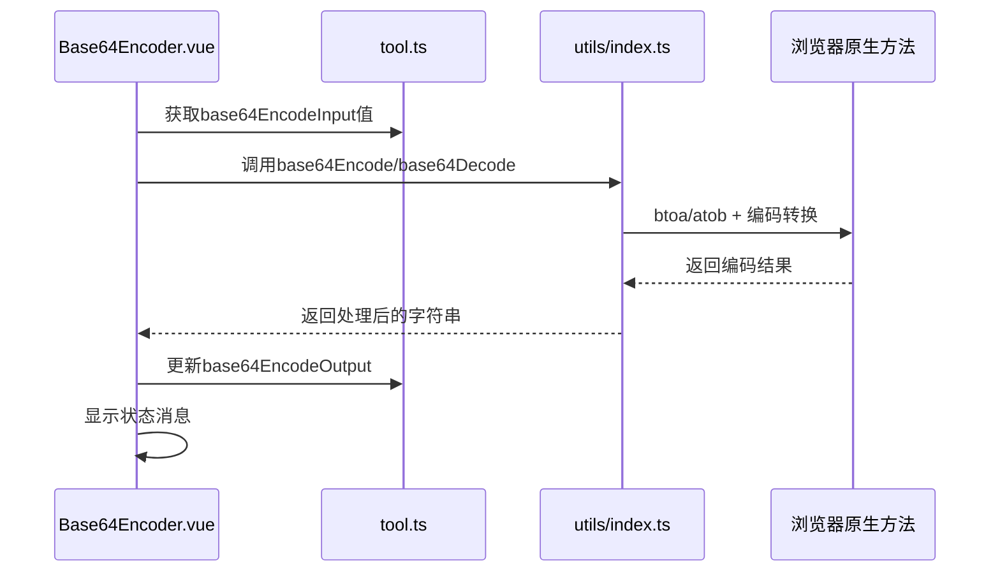
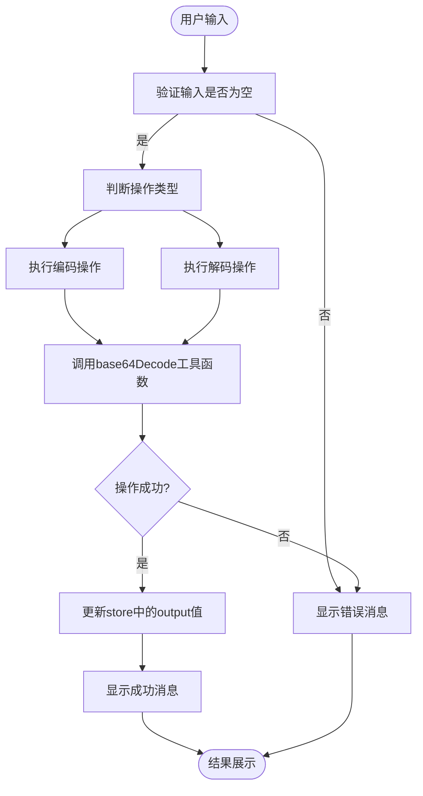
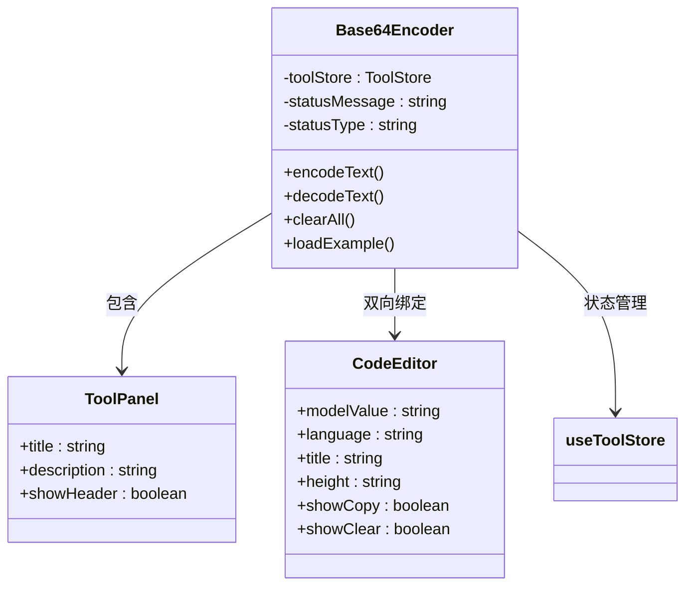

# Base64编解码工具

<cite>
**Referenced Files in This Document **  
- [Base64Encoder.vue](file://src/views/encode/Base64Encoder.vue)
- [index.ts](file://src/utils/index.ts)
- [ToolPanel.vue](file://src/components/ToolPanel.vue)
- [CodeEditor.vue](file://src/components/CodeEditor.vue)
- [tool.ts](file://src/stores/tool.ts)
</cite>

## 目录
1. [简介](#简介)
2. [项目结构](#项目结构)
3. [核心组件](#核心组件)
4. [架构概览](#架构概览)
5. [详细组件分析](#详细组件分析)
6. [依赖关系分析](#依赖关系分析)
7. [性能考量](#性能考量)
8. [故障排除指南](#故障排除指南)
9. [结论](#结论)

## 简介

Base64编解码工具是程序开发中常用的数据转换工具，用于在文本环境安全地传输二进制数据。本工具实现了完整的Base64编码与解码功能，支持任意文本和二进制数据的处理，并通过现代化的用户界面提供直观的操作体验。

该工具的核心价值在于将复杂的Base64算法封装为简单易用的界面，使开发者能够快速进行数据编码和解码操作，而无需关注底层实现细节。它广泛应用于Web开发、API通信、配置管理等多个场景，是现代开发工作流中的重要组成部分。

## 项目结构

```mermaid
graph TB
subgraph "Views"
B64[Base64Encoder.vue]
B64File[Base64FileConverter.vue]
Byte[ByteConverter.vue]
URL[UrlEncoder.vue]
end
subgraph "Components"
ToolPanel[ToolPanel.vue]
CodeEditor[CodeEditor.vue]
end
subgraph "Utils"
Utils[index.ts]
end
subgraph "Stores"
Store[tool.ts]
end
B64 --> ToolPanel
B64 --> CodeEditor
B64 --> Utils
B64 --> Store
```

**Diagram sources**
- [Base64Encoder.vue](file://src/views/encode/Base64Encoder.vue)
- [ToolPanel.vue](file://src/components/ToolPanel.vue)
- [CodeEditor.vue](file://src/components/CodeEditor.vue)
- [index.ts](file://src/utils/index.ts)
- [tool.ts](file://src/stores/tool.ts)

**Section sources**
- [Base64Encoder.vue](file://src/views/encode/Base64Encoder.vue)
- [tool.ts](file://src/stores/tool.ts)

## 核心组件

Base64编解码工具的核心由多个协同工作的组件构成，包括UI容器组件`ToolPanel`、输入输出组件`CodeEditor`以及业务逻辑处理模块。这些组件通过状态管理(store)进行数据共享，形成了一个完整且响应式的用户体验。

工具的主要功能流程为：用户在左侧编辑器输入原始文本 → 点击"Base64编码"或"Base64解码"按钮 → 执行相应的编码/解码操作 → 将结果展示在右侧编辑器中。整个过程伴随着清晰的状态反馈和错误处理机制。

**Section sources**
- [Base64Encoder.vue](file://src/views/encode/Base64Encoder.vue#L1-L420)
- [tool.ts](file://src/stores/tool.ts#L14-L367)

## 架构概览



**Diagram sources**
- [Base64Encoder.vue](file://src/views/encode/Base64Encoder.vue#L200-L250)
- [index.ts](file://src/utils/index.ts#L130-L143)

## 详细组件分析

### Base64编码器分析

#### 组件交互流程


**Diagram sources**
- [Base64Encoder.vue](file://src/views/encode/Base64Encoder.vue#L200-L250)
- [index.ts](file://src/utils/index.ts#L130-L143)

#### 功能特性说明

Base64编码器提供了以下核心功能：

- **双向转换**：支持文本到Base64的编码和Base64到原文的解码
- **实时反馈**：操作完成后立即显示成功或失败的状态提示
- **示例引导**：内置常见使用场景的示例数据，便于快速上手
- **清空功能**：一键清除输入输出内容，方便重复使用
- **响应式设计**：适配桌面和移动设备的不同屏幕尺寸

**Section sources**
- [Base64Encoder.vue](file://src/views/encode/Base64Encoder.vue#L1-L420)

### 工具函数实现机制

#### UTF-8兼容性处理
```mermaid
classDiagram
class base64Encode {
+string text
+string result
+return string
}
class base64Decode {
+string text
+string result
+return string
}
note right of base64Encode
实现原理：
1. encodeURIComponent处理非ASCII字符
2. unescape转换为二进制字符串
3. btoa进行Base64编码
end note
note left of base64Decode
实现原理：
1. atob解码Base64字符串
2. escape转换为UTF-8编码
3. decodeURIComponent还原原始字符
end note
base64Encode --> base64Decode : 互为逆运算
```

**Diagram sources**
- [index.ts](file://src/utils/index.ts#L130-L143)

Base64工具函数的关键创新在于解决了浏览器原生`btoa`和`atob`方法对非ASCII字符（如中文）的支持问题。通过组合使用`encodeURIComponent`/`decodeURIComponent`和`escape`/`unescape`等编码转换函数，实现了完整的UTF-8字符集支持。

具体实现方式如下：
- **编码过程**：`text → encodeURIComponent → unescape → btoa → result`
- **解码过程**：`text → atob → escape → decodeURIComponent → result`

这种链式处理确保了包含中文、特殊符号等Unicode字符的文本能够正确进行Base64转换。

**Section sources**
- [index.ts](file://src/utils/index.ts#L130-L143)

### UI组件集成分析

#### 组件层级关系


**Diagram sources**
- [Base64Encoder.vue](file://src/views/encode/Base64Encoder.vue)
- [ToolPanel.vue](file://src/components/ToolPanel.vue)
- [CodeEditor.vue](file://src/components/CodeEditor.vue)
- [tool.ts](file://src/stores/tool.ts)

Base64编码器通过合理利用现有UI组件库，实现了高效且一致的用户界面。`ToolPanel`作为通用容器组件提供了统一的视觉风格和布局结构，`CodeEditor`则负责具体的输入输出交互。

关键集成点包括：
- 使用`v-model`双向绑定`toolStore`中的状态变量
- 通过`@click`事件监听器连接按钮与处理函数
- 利用`ref`实现组件间的状态管理和消息传递
- 响应式更新机制确保界面与数据同步

**Section sources**
- [Base64Encoder.vue](file://src/views/encode/Base64Encoder.vue)
- [ToolPanel.vue](file://src/components/ToolPanel.vue)
- [CodeEditor.vue](file://src/components/CodeEditor.vue)

## 依赖关系分析

```mermaid
graph LR
    A[Base64Encoder.vue] --> B[ToolPanel.vue]
    A --> C[CodeEditor.vue]
    A --> D[useToolStore]
    A --> E[base64Encode]
    A --> F[base64Decode]
    D --> G[tool.ts]
    E --> H[index.ts]
    F --> H
    C --> I[monaco-editor