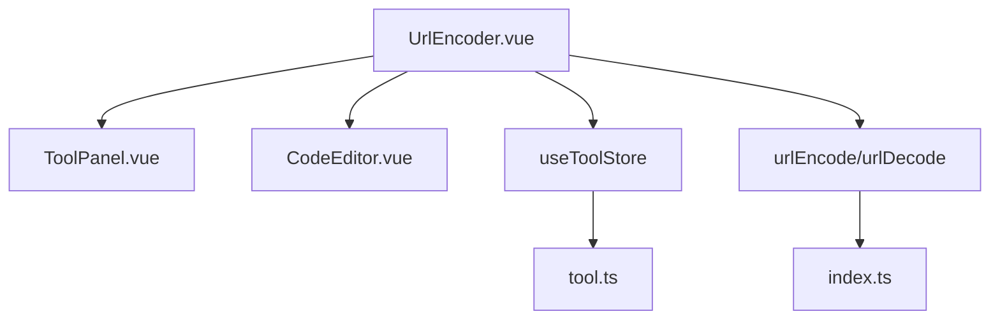
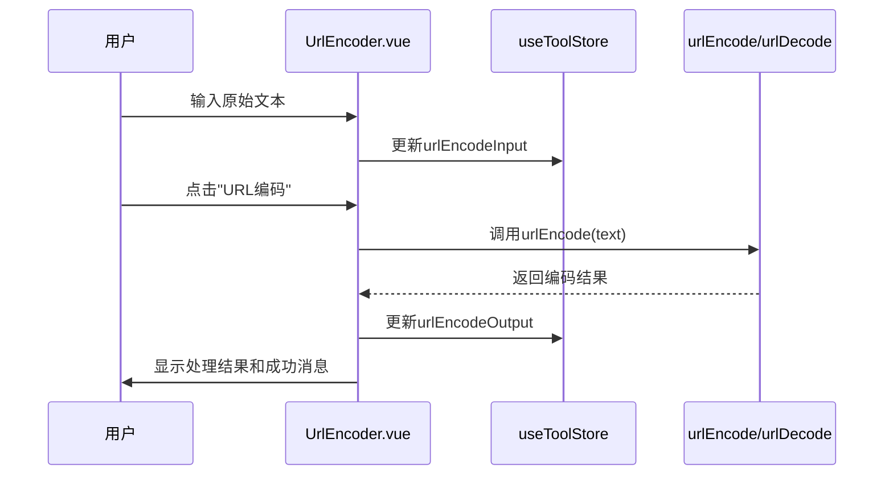
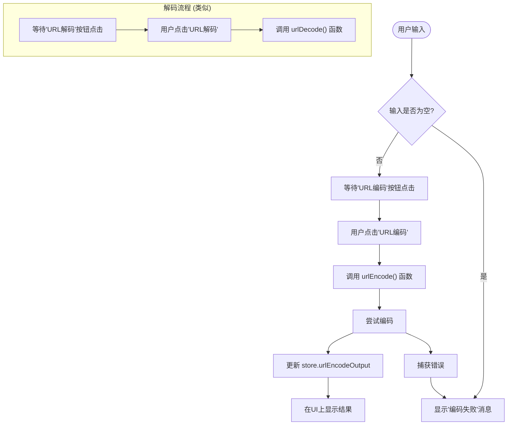
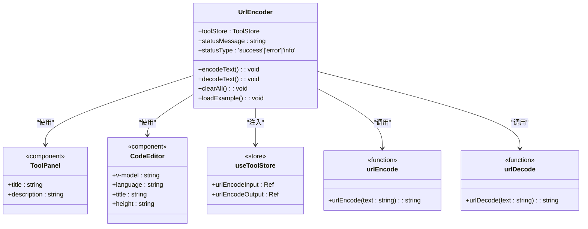

# URL编解码工具

<cite>
**本文档引用文件**  
- [UrlEncoder.vue](file://src/views/encode/UrlEncoder.vue)
- [index.ts](file://src/utils/index.ts)
- [tool.ts](file://src/stores/tool.ts)
</cite>

## 目录
1. [简介](#简介)
2. [项目结构](#项目结构)
3. [核心组件](#核心组件)
4. [架构概述](#架构概述)
5. [详细组件分析](#详细组件分析)
6. [依赖分析](#依赖分析)
7. [性能考虑](#性能考虑)
8. [故障排除指南](#故障排除指南)
9. [结论](#结论)

## 简介
本技术文档深入阐述了基于 `UrlEncoder.vue` 组件实现的URL编解码工具。该工具严格遵循RFC 3986标准，提供可靠的URL编码（Percent Encoding）与解码功能，特别针对中文等多字节字符进行正确处理。文档将解析其封装 `encodeURIComponent` 和 `decodeURIComponent` 的机制、实时预览的响应式设计、常见使用场景及安全最佳实践。

## 项目结构
该项目是一个Vue 3单页应用，采用模块化设计。`UrlEncoder.vue` 位于 `/src/views/encode/` 目录下，是URL编解码功能的独立视图组件。它通过Pinia状态管理库与全局状态交互，并利用 `utils/index.ts` 中的纯函数进行核心编解码操作。

**图表来源**
- [UrlEncoder.vue](file://src/views/encode/UrlEncoder.vue)
- [tool.ts](file://src/stores/tool.ts)
- [index.ts](file://src/utils/index.ts)

**章节来源**
- [UrlEncoder.vue](file://src/views/encode/UrlEncoder.vue)
- [tool.ts](file://src/stores/tool.ts)

## 核心组件
`UrlEncoder.vue` 是一个功能完整的单文件组件（SFC），集成了用户界面、业务逻辑和样式。其核心功能围绕两个按钮“URL编码”和“URL解码”展开，通过调用工具函数对输入文本进行转换，并将结果显示在输出区域。组件还内置了示例、状态提示和清空功能，提升了用户体验。

**章节来源**
- [UrlEncoder.vue](file://src/views/encode/UrlEncoder.vue#L1-L408)

## 架构概述
该组件的架构清晰地分离了关注点：UI由模板定义，状态由Pinia存储管理，核心逻辑由可复用的工具函数实现。

**图表来源**
- [UrlEncoder.vue](file://src/views/encode/UrlEncoder.vue#L1-L408)
- [index.ts](file://src/utils/index.ts#L112-L125)
- [tool.ts](file://src/stores/tool.ts#L14-L367)

## 详细组件分析

### 组件分析
`UrlEncoder.vue` 组件实现了双向转换的实时预览功能。其关键在于使用 `v-model` 双向绑定 `toolStore.urlEncodeInput` 和 `toolStore.urlEncodeOutput`，这两个状态变量由Pinia store统一管理。当用户在左侧编辑器输入时，`urlEncodeInput` 实时更新；点击“编码”或“解码”按钮后，相应的函数被触发，计算结果并更新 `urlEncodeOutput`，从而驱动右侧编辑器的显示。

#### 对于API/服务组件：

**图表来源**
- [UrlEncoder.vue](file://src/views/encode/UrlEncoder.vue#L1-L408)
- [index.ts](file://src/utils/index.ts#L112-L125)

**章节来源**
- [UrlEncoder.vue](file://src/views/encode/UrlEncoder.vue#L1-L408)

### 概念性概述
URL编码（也称为百分号编码）是一种根据RFC 3986规范，将URI中不允许的字符或具有特殊含义的字符转换为 `%` 后跟两位十六进制数的形式的过程。这确保了包含空格、中文、`&`、`=` 等字符的字符串能够安全地作为URL的一部分传输，而不会破坏URI的语法结构。

## 依赖分析
`UrlEncoder.vue` 组件的依赖关系明确且低耦合。

**图表来源**
- [UrlEncoder.vue](file://src/views/encode/UrlEncoder.vue)
- [tool.ts](file://src/stores/tool.ts)
- [index.ts](file://src/utils/index.ts)

**章节来源**
- [UrlEncoder.vue](file://src/views/encode/UrlEncoder.vue)
- [tool.ts](file://src/stores/tool.ts)
- [index.ts](file://src/utils/index.ts)

## 性能考虑
该组件的性能表现优异。核心的 `encodeURIComponent` 和 `decodeURIComponent` 是浏览器原生函数，执行效率极高。组件本身没有复杂的计算或循环，主要开销在于Vue的响应式系统更新DOM。对于大文本量的编解码，可能会有轻微延迟，但通常在可接受范围内。防抖等优化在此简单场景下非必需。

## 故障排除指南
本组件已内置基本的错误处理机制。

**章节来源**
- [UrlEncoder.vue](file://src/views/encode/UrlEncoder.vue#L60-L75)
- [index.ts](file://src/utils/index.ts#L119-L125)

### 常见问题
1.  **编码失败**：当输入的待解码字符串格式不正确（如无效的十六进制序列 `%GG`）时，`decodeURIComponent` 会抛出异常。组件会捕获此异常并通过 `showStatus` 方法显示“解码失败”的错误消息。
2.  **重复编码问题**：这是常见的边缘情况。如果一个已经编码过的字符串（如 `Hello%20World`）再次被编码，会得到 `Hello%2520World`（`%` 被编码为 `%25`）。解决方案是在编码前检查输入是否已经是编码格式，但这可能很复杂。最佳实践是开发者应明确知道数据的状态，避免不必要的重复编码。
3.  **中文乱码**：本工具强制使用UTF-8编码，因此只要接收端也使用UTF-8解码，就不会出现乱码。问题通常出在服务器或接收程序的编码配置上。

### 安全最佳实践
在构建安全链接时，仅靠URL编码不足以防范所有攻击。
-   **防范XSS**：URL编码不能阻止跨站脚本（XSS）攻击。在将用户输入插入到HTML页面中时，必须进行HTML实体编码或使用安全的DOM操作API。
-   **防范路径遍历**：URL编码可以绕过简单的路径黑名单（如将 `../` 编码为 `%2e%2e%2f`）。服务器端必须进行严格的路径规范化和白名单校验，而不是依赖客户端的编码。

## 结论
`UrlEncoder.vue` 组件是一个设计良好、功能实用的工具。它通过简洁的UI和可靠的底层函数，有效地解决了URL编解码的需求。其