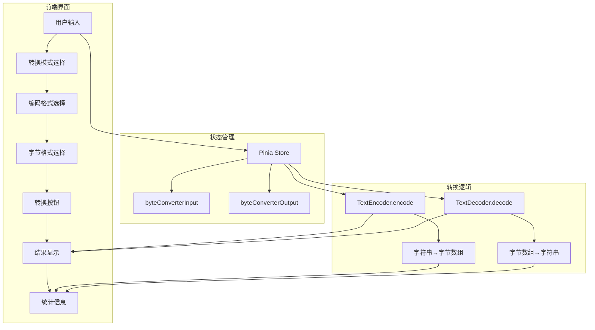
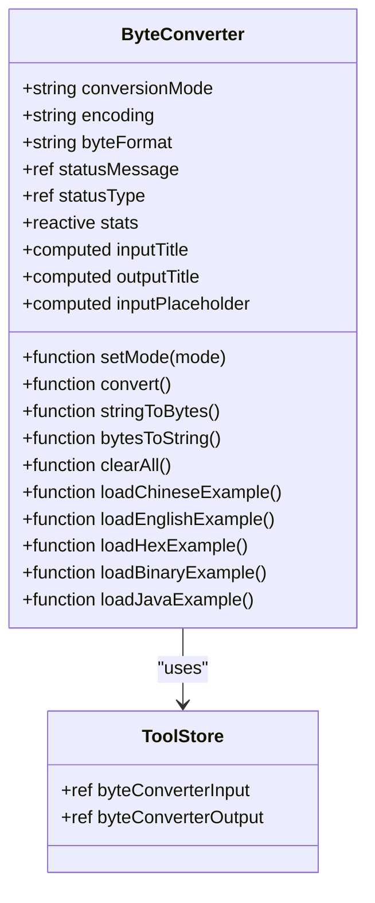
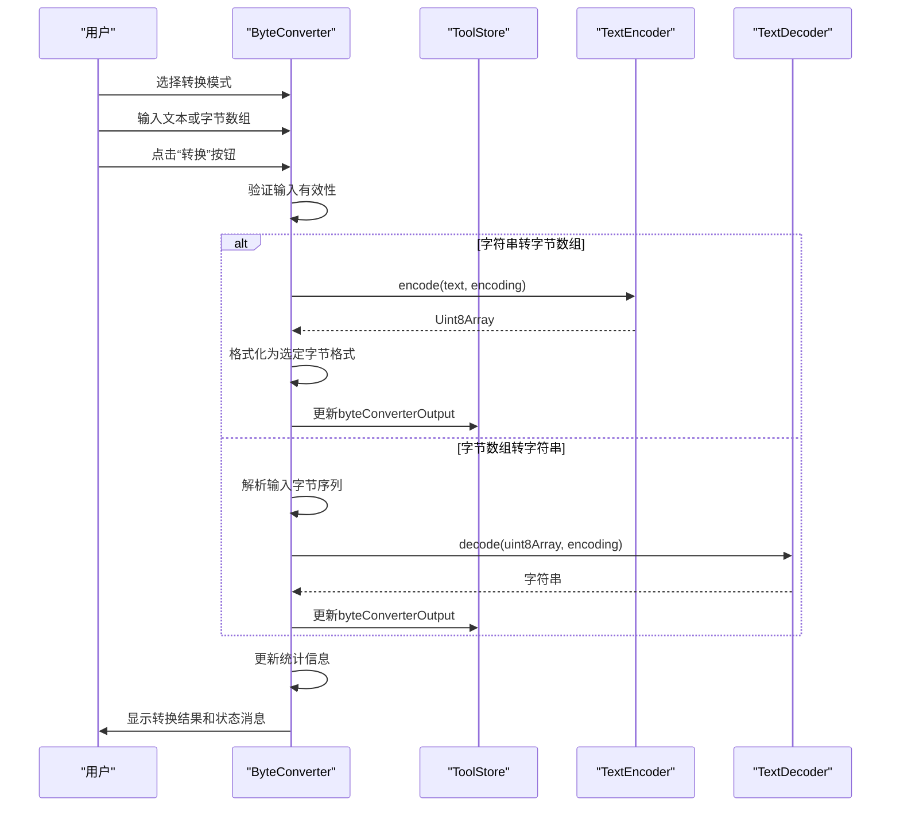
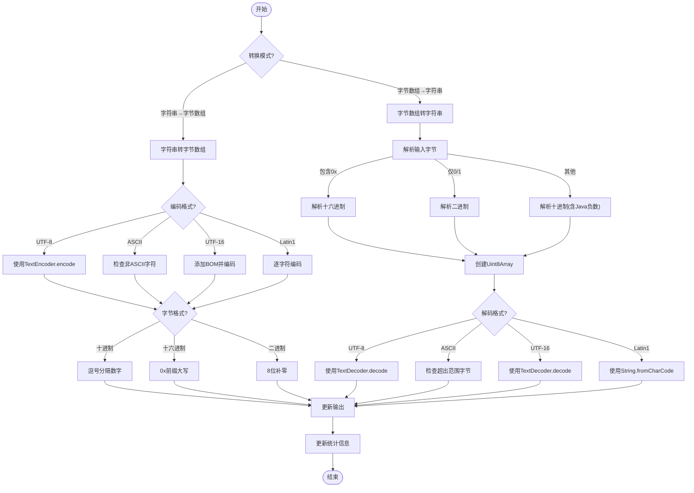
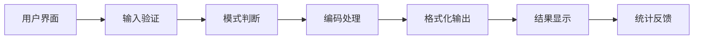
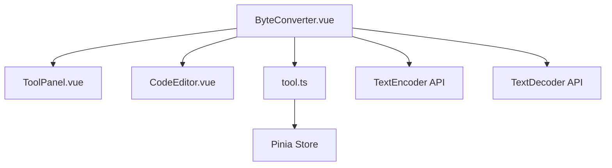

# 字节单位换算工具

<cite>
**Referenced Files in This Document **  
- [ByteConverter.vue](file://src/views/encode/ByteConverter.vue)
- [tool.ts](file://src/stores/tool.ts)
</cite>

## 目录
1. [简介](#简介)  
2. [项目结构](#项目结构)  
3. [核心组件](#核心组件)  
4. [架构概述](#架构概述)  
5. [详细组件分析](#详细组件分析)  
6. [依赖分析](#依赖分析)  
7. [性能考虑](#性能考虑)  
8. [故障排除指南](#故障排除指南)  
9. [结论](#结论)

## 简介

字节单位换算工具是一个用于在字符串与字节数组之间进行相互转换的实用程序，支持多种编码格式和显示方式。该工具能够处理UTF-8、ASCII、UTF-16和Latin1等常见字符编码，并提供十进制、十六进制和二进制三种字节表示形式。用户可以通过直观的界面输入文本或字节数组，实时查看转换结果，同时获取详细的统计信息如字符数、字节数和所用编码格式。

本工具特别适用于网络传输协议开发、文件内容分析、编码问题调试以及加密解密过程中的数据格式验证等场景。通过内置的示例功能，用户可以快速了解如何使用不同编码格式处理中文、英文及特殊字符，包括Java有符号字节数组的解析。

## 项目结构

```
.
├── src
│   ├── views
│   │   └── encode
│   │       └── ByteConverter.vue
│   ├── stores
│   │   └── tool.ts
│   └── components
│       ├── ToolPanel.vue
│       └── CodeEditor.vue
└── ...
```

**Diagram sources **  
- [ByteConverter.vue](file://src/views/encode/ByteConverter.vue)  
- [tool.ts](file://src/stores/tool.ts)

**Section sources**  
- [ByteConverter.vue](file://src/views/encode/ByteConverter.vue)  
- [tool.ts](file://src/stores/tool.ts)

## 核心组件

`ByteConverter.vue` 是实现字节转换功能的核心组件，它提供了双向转换能力：将字符串转换为字节数组，或将字节数组还原为字符串。组件采用响应式设计，用户选择不同的编码格式（UTF-8、ASCII、UTF-16、Latin1）和字节显示格式（十进制、十六进制、二进制）时，输出会立即更新。此外，组件还集成了状态提示、统计信息展示和多个实用示例，帮助用户理解和使用各种转换模式。

**Section sources**  
- [ByteConverter.vue](file://src/views/encode/ByteConverter.vue#L1-L50)

## 架构概述



**Diagram sources **  
- [ByteConverter.vue](file://src/views/encode/ByteConverter.vue)  
- [tool.ts](file://src/stores/tool.ts)

## 详细组件分析

### 组件A分析

`ByteConverter.vue` 组件实现了完整的字符串与字节数组之间的双向转换流程。当用户选择“字符串 → 字节数组”模式时，系统使用 `TextEncoder` 将输入的文本按照指定编码格式转换为字节数组；而在“字节数组 → 字符串”模式下，则利用 `TextDecoder` 将输入的字节序列解码回可读文本。整个过程支持多种编码格式和字节表示方法，确保了广泛的适用性。

#### 对于对象导向组件：


**Diagram sources **  
- [ByteConverter.vue](file://src/views/encode/ByteConverter.vue#L14-L552)

#### 对于API/服务组件：


**Diagram sources **  
- [ByteConverter.vue](file://src/views/encode/ByteConverter.vue#L281-L552)

#### 对于复杂逻辑组件：


**Diagram sources **  
- [ByteConverter.vue](file://src/views/encode/ByteConverter.vue#L281-L552)

**Section sources**  
- [ByteConverter.vue](file://src/views/encode/ByteConverter.vue#L1-L552)

### 概念概述

该工具的设计理念是为开发者提供一个简单易用但功能强大的字节级数据转换解决方案。通过统一的界面整合了多种常见的编码需求，避免了在不同工具间切换的麻烦。其模块化设计使得未来可以轻松扩展更多编码格式或增加新的转换功能。



## 依赖分析



**Diagram sources **  
- [ByteConverter.vue](file://src/views/encode/ByteConverter.vue)  
- [tool.ts](file://src/stores/tool.ts)

**Section sources**  
- [ByteConverter.vue](file://src/views/encode/ByteConverter.vue)  
- [tool.ts](file://src/stores/tool.ts)

## 性能考虑

由于字节转换操作主要依赖浏览器原生的 `TextEncoder` 和 `TextDecoder` API，因此具有很高的执行效率。对于大多数常规文本处理任务，转换延迟几乎不可察觉。然而，在处理非常大的文本块时，可能会出现短暂的UI冻结现象。建议对超过几MB的数据进行分块处理以保持界面响应性。此外，频繁的状态更新可能影响性能，应合理控制状态变更频率。

## 故障排除指南

当遇到转换失败时，请首先检查输入是否符合所选格式的要求。例如，在使用ASCII编码时，确保不包含中文或其他非ASCII字符；在解析十六进制字节时，确认每个值都以"0x"开头且为有效十六进制数。如果收到“无效字节值”错误，可能是输入中包含了非法字符或超出了字节的有效范围（0-255）。对于Java有符号字节输入，注意负数会被自动转换为其对应的无符号表示。

**Section sources**  
- [ByteConverter.vue](file://src/views/encode/ByteConverter.vue#L326-L552)

## 结论

字节单位换算工具通过集成多种编码格式和灵活的显示选项，为开发者提供了一个全面而高效的字节级数据处理方案。其基于Pinia的状态管理和Vue 3的响应式系统确保了良好的用户体验和代码可维护性。通过对标准Web API的充分利用，实现了跨平台兼容性和高性能表现。未来可通过增加更多编码格式支持、优化大数据处理能力和增强错误提示来进一步提升其实用价值。