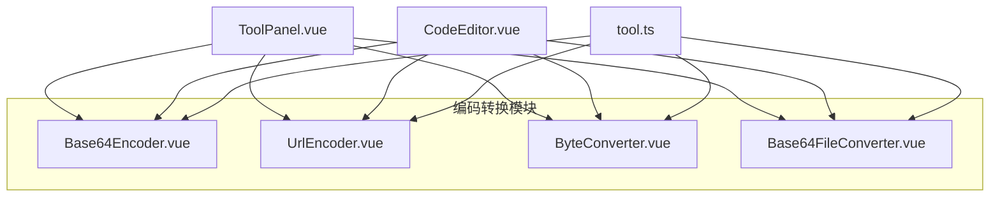
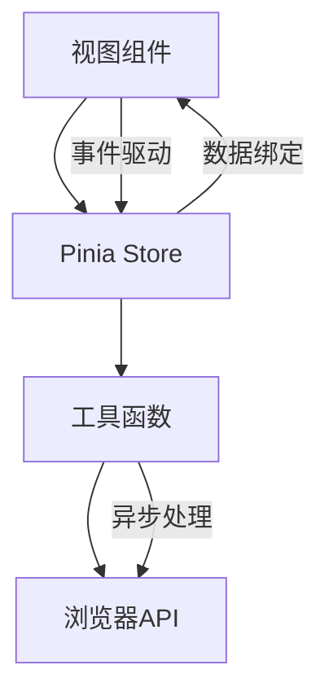
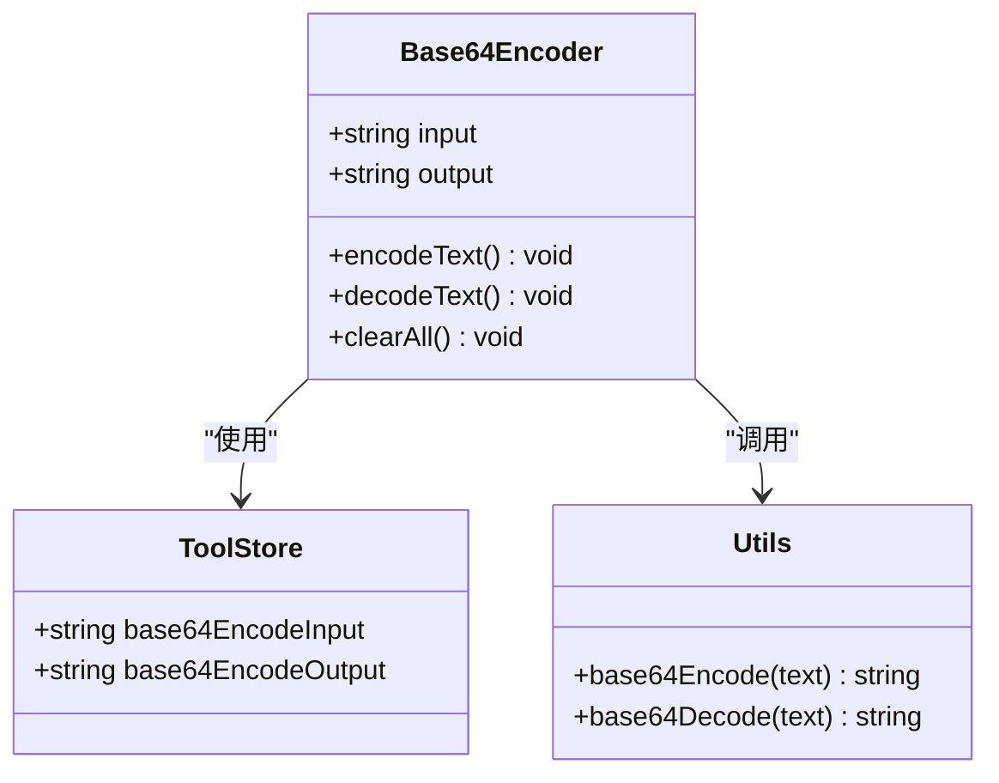
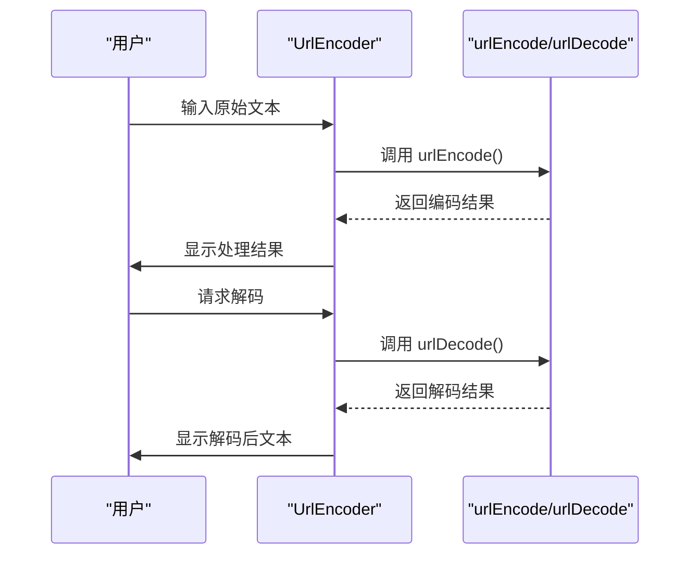
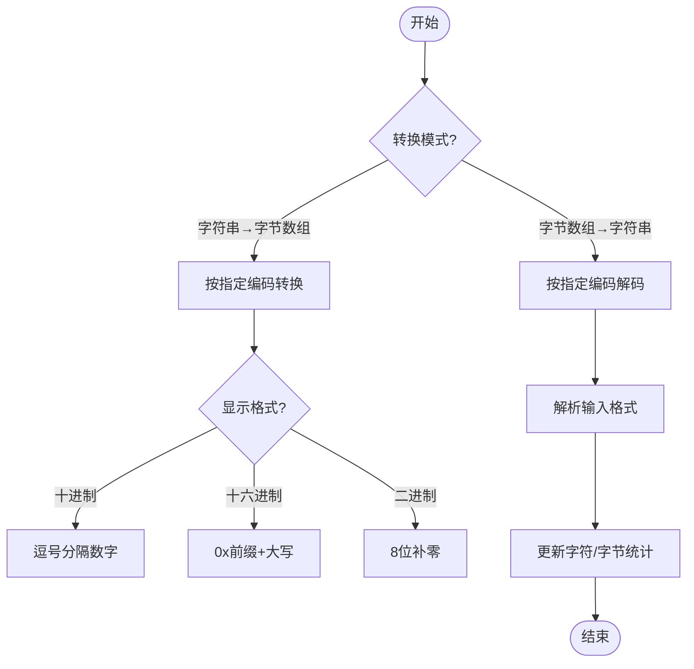

# 编码转换工具

<cite>
**本文档引用文件**  
- [Base64Encoder.vue](file://src/views/encode/Base64Encoder.vue)
- [UrlEncoder.vue](file://src/views/encode/UrlEncoder.vue)
- [ByteConverter.vue](file://src/views/encode/ByteConverter.vue)
- [Base64FileConverter.vue](file://src/views/encode/Base64FileConverter.vue)
- [index.ts](file://src/utils/index.ts)
- [tool.ts](file://src/stores/tool.ts)
</cite>

## 目录
1. [简介](#简介)
2. [项目结构](#项目结构)
3. [核心组件](#核心组件)
4. [架构概述](#架构概述)
5. [详细组件分析](#详细组件分析)
6. [依赖分析](#依赖分析)
7. [性能考虑](#性能考虑)
8. [故障排除指南](#故障排除指南)
9. [结论](#结论)

## 简介
本系统化文档全面整理了编码转换系列工具的技术实现，涵盖 Base64 编解码、URL 编解码、字节单位换算及文件 Base64 转换四大功能。基于各视图组件源码，说明不同编码算法的应用场景与限制条件。重点描述 `Base64FileConverter.vue` 中文件读取流式处理机制与进度反馈实现。提供跨工具协作示例，如先进行 URL 编码再执行 Base64 加密的链式操作。强调安全注意事项，防止因编码不当导致注入攻击或数据损坏。

## 项目结构
编码转换工具位于 `/src/views/encode` 目录下，包含四个主要功能模块：`Base64Encoder.vue`（文本 Base64 编解码）、`UrlEncoder.vue`（URL 编解码）、`ByteConverter.vue`（字符串与字节数组转换）和 `Base64FileConverter.vue`（文件与 Base64 格式互转）。这些组件共享统一的 UI 风格和状态管理机制，通过 `ToolPanel` 组件封装通用布局，并使用 `CodeEditor` 组件提供代码编辑功能。所有工具的状态由 `tool.ts` 中的 Pinia store 统一管理，确保数据一致性。



**图表来源**
- [Base64Encoder.vue](file://src/views/encode/Base64Encoder.vue)
- [UrlEncoder.vue](file://src/views/encode/UrlEncoder.vue)
- [ByteConverter.vue](file://src/views/encode/ByteConverter.vue)
- [Base64FileConverter.vue](file://src/views/encode/Base64FileConverter.vue)
- [tool.ts](file://src/stores/tool.ts)

## 核心组件
编码转换工具的核心组件包括四种编码转换器：Base64 文本编解码器、URL 编解码器、字节单位转换器和文件 Base64 转换器。每个组件都实现了双向转换功能，支持输入验证、错误处理和用户友好的界面交互。它们共享相同的工具面板设计模式，通过响应式数据绑定实现即时预览和结果展示。所有组件均集成到统一的工具存储中，便于状态管理和跨工具协作。

**章节来源**
- [Base64Encoder.vue](file://src/views/encode/Base64Encoder.vue)
- [UrlEncoder.vue](file://src/views/encode/UrlEncoder.vue)
- [ByteConverter.vue](file://src/views/encode/ByteConverter.vue)
- [Base64FileConverter.vue](file://src/views/encode/Base64FileConverter.vue)

## 架构概述
编码转换工具采用分层架构设计，上层为视图组件，中层为业务逻辑，底层为工具函数库。视图组件负责用户界面展示和交互，通过 Pinia store 管理应用状态。业务逻辑封装在各个视图组件的脚本部分，调用底层工具函数完成具体编码转换任务。工具函数库提供通用的编码解码功能，被多个组件复用。这种架构实现了关注点分离，提高了代码的可维护性和可扩展性。



**图表来源**
- [Base64Encoder.vue](file://src/views/encode/Base64Encoder.vue)
- [UrlEncoder.vue](file://src/views/encode/UrlEncoder.vue)
- [tool.ts](file://src/stores/tool.ts)
- [index.ts](file://src/utils/index.ts)

## 详细组件分析

### Base64 编解码器分析
`Base64Encoder.vue` 组件提供了文本数据的 Base64 编码和解码功能。该组件支持任意二进制数据的处理，通过 `base64Encode` 和 `base64Decode` 工具函数实现核心转换逻辑。编码过程遵循标准规则：每 3 个字节转换为 4 个 Base64 字符，不足时用 '=' 符号补齐。解码时自动忽略空白字符并验证字符合法性。应用场景包括邮件附件编码、HTTP Basic 认证和 Data URL 中的图片数据嵌入。

#### 对象导向组件


**图表来源**
- [Base64Encoder.vue](file://src/views/encode/Base64Encoder.vue#L1-L420)
- [tool.ts](file://src/stores/tool.ts#L14-L367)
- [index.ts](file://src/utils/index.ts#L130-L143)

**章节来源**
- [Base64Encoder.vue](file://src/views/encode/Base64Encoder.vue#L1-L420)

### URL 编解码器分析
`UrlEncoder.vue` 组件实现了 URL 编码和解码功能，专门用于处理特殊字符和中文字符。编码过程将非 ASCII 字符转换为 %XX 格式，确保数据在 HTTP 传输中的正确性。常见编码包括空格→%20、@→%40、&→%26 等。解码功能用于解析 URL 参数或处理已编码的 URL 字符串。该组件使用 UTF-8 字符集进行编码，适用于 API 参数解析、表单数据处理等场景。

#### API/服务组件


**图表来源**
- [UrlEncoder.vue](file://src/views/encode/UrlEncoder.vue#L1-L408)
- [index.ts](file://src/utils/index.ts#L112-L125)

**章节来源**
- [UrlEncoder.vue](file://src/views/encode/UrlEncoder.vue#L1-L408)

### 字节单位转换器分析
`ByteConverter.vue` 组件提供字符串与字节数组之间的相互转换功能，支持多种编码格式（UTF-8、ASCII、UTF-16、Latin1）和显示格式（十进制、十六进制、二进制）。该组件能够自动统计字符数和字节数，帮助开发者理解不同编码方式对数据大小的影响。特别支持 Java 有符号字节的处理，将 -128 到 -1 的值转换为 128 到 255 的无符号表示。应用场景包括网络协议开发、二进制文件分析和加密解密过程中的数据调试。

#### 复杂逻辑组件


**图表来源**
- [ByteConverter.vue](file://src/views/encode/ByteConverter.vue#L1-L859)

**章节来源**
- [ByteConverter.vue](file://src/views/encode/ByteConverter.vue#L1-L859)

### 文件 Base64 转换器分析
`Base64FileConverter.vue` 组件支持图片和音频文件与 Base64 格式的相互转换。该组件实现了完整的文件读取流式处理机制，利用 `FileReader` API 异步读取文件内容，避免阻塞主线程。当用户选择文件后，系统会验证文件类型和大小（限制 10MB），然后通过 `readAsDataURL` 方法读取文件并提取 Base64 数据部分。对于反向转换，组件能自动识别 Data URL 格式或纯 Base64 字符串，并通过文件头检测确定 MIME 类型。

#### 对象导向组件
```mermaid
classDiagram
    class Base64FileConverter {
        +File selectedFile
        +string base64Result
        +conversionMode enum
        +convertFileToBase64() void
        +parseBase64() void
        +downloadFile() void
    }
    
    class FileReader {
        +onload event
        +onerror event
        +readAsDataURL(file) void
    }
    
    class Blob {
        +constructor