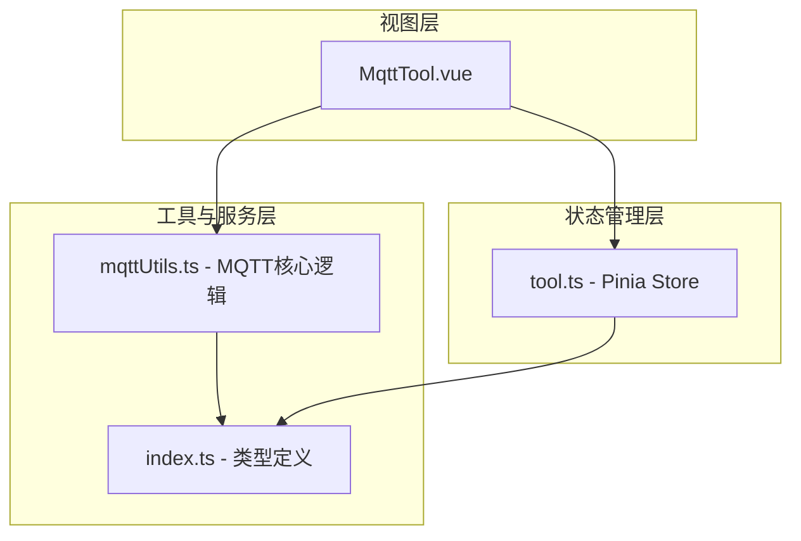
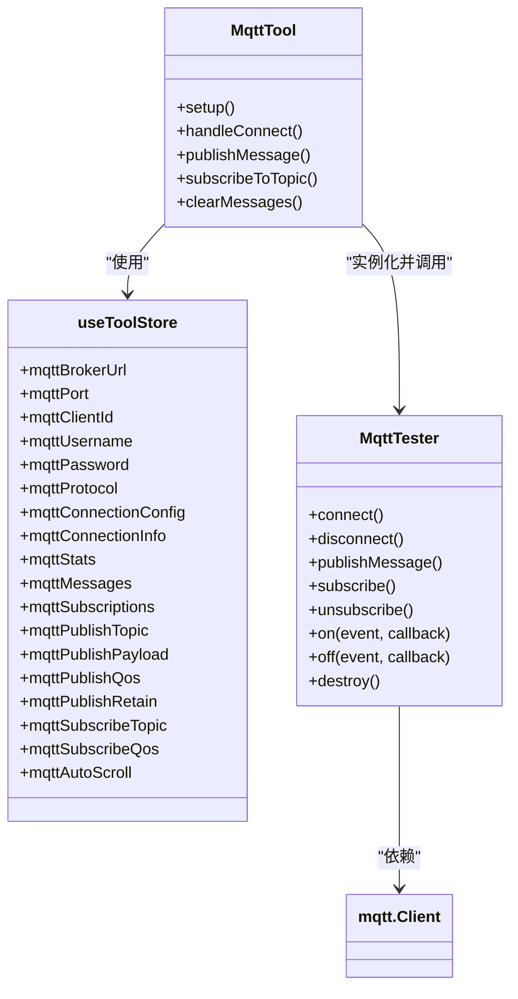
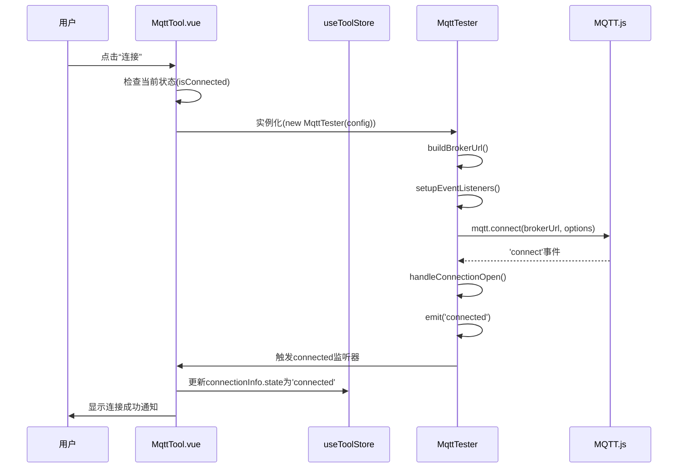
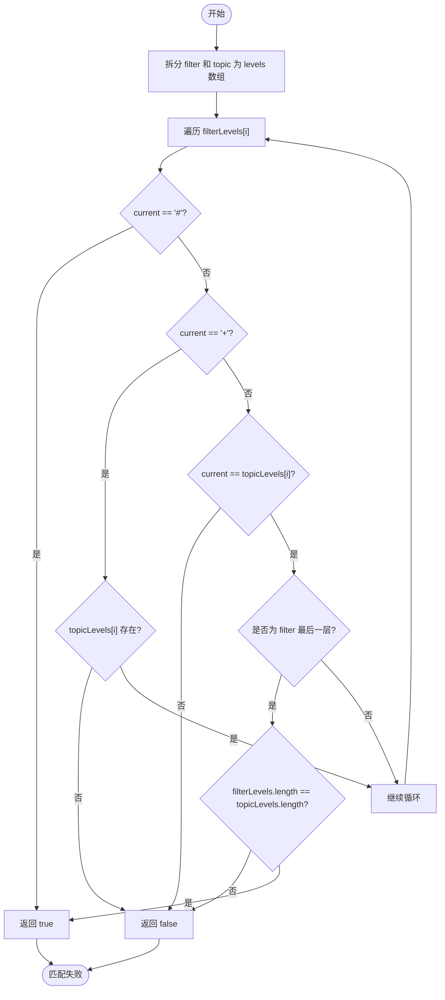
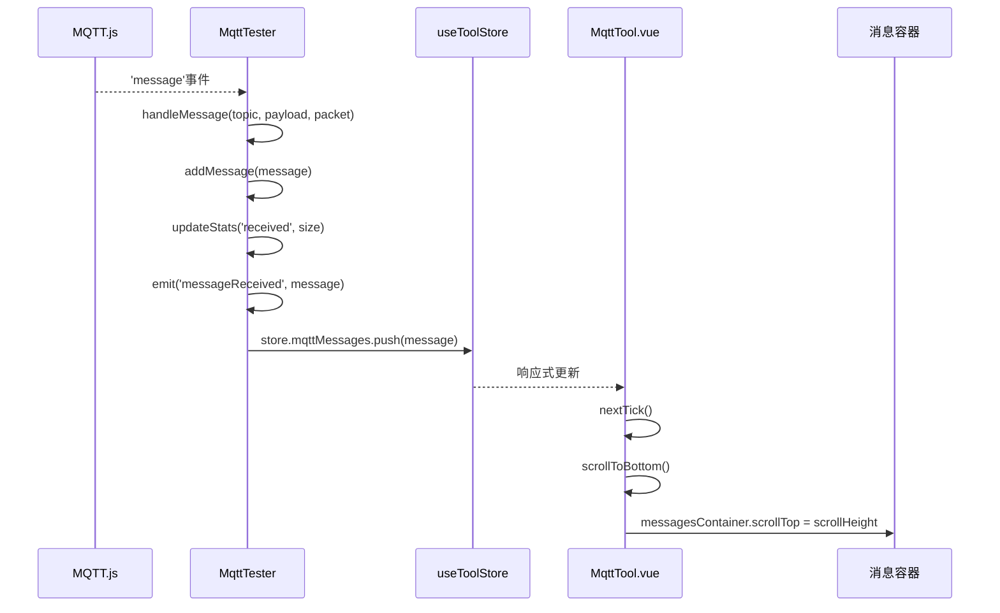
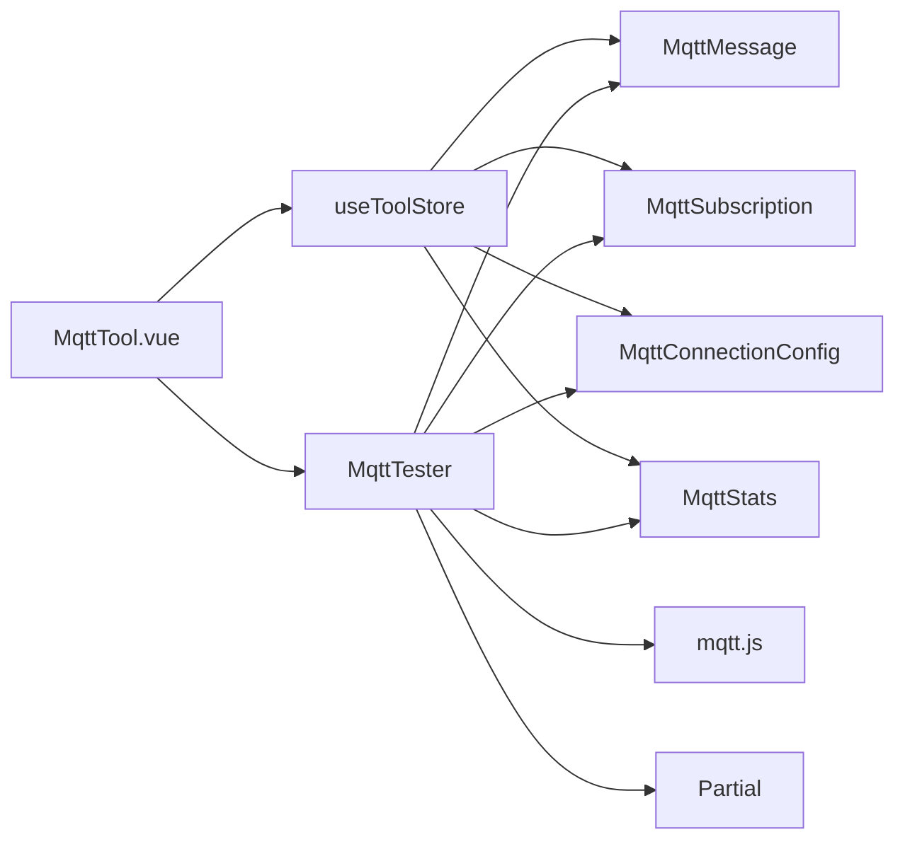

# MQTT测试工具

<cite>
**本文档引用文件**  
- [MqttTool.vue](file://src/views/communication/MqttTool.vue)
- [mqttUtils.ts](file://src/utils/mqttUtils.ts)
- [tool.ts](file://src/stores/tool.ts)
- [index.ts](file://src/types/index.ts)
</cite>

## 目录
1. [简介](#简介)
2. [项目结构](#项目结构)
3. [核心组件](#核心组件)
4. [架构概览](#架构概览)
5. [详细组件分析](#详细组件分析)
6. [依赖分析](#依赖分析)
7. [性能考量](#性能考量)
8. [故障排除指南](#故障排除指南)
9. [结论](#结论)

## 简介
本技术文档全面解析MQTT测试工具的实现机制，涵盖连接配置、主题订阅、QoS服务质量等级、消息日志展示等核心功能。该工具基于Vue 3与Pinia状态管理，结合Paho-MQTT或MQTT.js库实现完整的MQTT客户端能力，支持WebSocket协议在浏览器环境下的通信调试。

## 项目结构
MQTT测试工具位于`src/views/communication/MqttTool.vue`，作为独立视图组件集成于整体工具平台中。其功能依赖于`src/utils/mqttUtils.ts`提供的底层MQTT操作封装，并通过`src/stores/tool.ts`中的Pinia store进行全局状态管理。类型定义统一存放于`src/types/index.ts`。

**图表来源**  
- [MqttTool.vue](file://src/views/communication/MqttTool.vue#L0-L50)
- [tool.ts](file://src/stores/tool.ts#L0-L50)
- [mqttUtils.ts](file://src/utils/mqttUtils.ts#L0-L50)
- [index.ts](file://src/types/index.ts#L0-L50)

**章节来源**  
- [MqttTool.vue](file://src/views/communication/MqttTool.vue#L0-L1820)
- [project_structure](file://)

## 核心组件
`MqttTool.vue`是MQTT测试功能的核心UI组件，负责呈现连接配置、发布/订阅操作界面及消息历史记录。它通过Pinia store (`useToolStore`) 与 `MqttTester` 工具类交互，实现用户操作与底层MQTT协议的桥接。

**章节来源**  
- [MqttTool.vue](file://src/views/communication/MqttTool.vue#L0-L1820)
- [tool.ts](file://src/stores/tool.ts#L200-L300)

## 架构概览
系统采用分层架构设计，自上而下分为视图层、状态管理层和工具服务层。视图层处理用户交互；状态管理层（Pinia）集中管理所有可响应状态；工具服务层（`MqttTester`）封装了与MQTT.js库的直接交互，提供连接、发布、订阅等原子化方法。

**图表来源**  
- [MqttTool.vue](file://src/views/communication/MqttTool.vue#L0-L1820)
- [tool.ts](file://src/stores/tool.ts#L200-L300)
- [mqttUtils.ts](file://src/utils/mqttUtils.ts#L15-L582)

## 详细组件分析

### 连接配置与持久化机制
`MqttTool.vue`通过绑定`store.mqtt*`系列字段，实现了对Broker地址、端口、clientId、认证凭据及SSL/TLS选项（通过ws/wss协议选择）的表单化配置。所有配置项均存储于Pinia store中，实现了跨会话的持久化。表单验证通过计算属性`isValidConfig`实现，确保代理服务器地址非空方可发起连接。

#### 连接建立流程

**图表来源**  
- [MqttTool.vue](file://src/views/communication/MqttTool.vue#L200-L300)
- [mqttUtils.ts](file://src/utils/mqttUtils.ts#L63-L112)
- [mqttUtils.ts](file://src/utils/mqttUtils.ts#L287-L317)
- [mqttUtils.ts](file://src/utils/mqttUtils.ts#L319-L354)

**章节来源**  
- [MqttTool.vue](file://src/views/communication/MqttTool.vue#L200-L300)
- [mqttUtils.ts](file://src/utils/mqttUtils.ts#L63-L112)

### 主题订阅模式匹配算法
前端实现了标准的MQTT主题通配符匹配算法，支持单层通配符`+`和多层通配符`#`。该算法在`MqttTester`类的私有方法`topicMatches(filter, topic)`中实现，通过将主题字符串按`/`分割成层级数组，逐级比对。

#### 匹配逻辑流程图

**图表来源**  
- [mqttUtils.ts](file://src/utils/mqttUtils.ts#L495-L518)

**章节来源**  
- [mqttUtils.ts](file://src/utils/mqttUtils.ts#L495-L518)

### QoS服务质量等级行为差异
在消息发布时，用户可通过下拉菜单选择QoS 0、1、2三个等级。`MqttTester.publishMessage()`方法将此参数透传给MQTT.js库的`publish`函数。不同QoS等级的行为由底层库根据MQTT协议规范自动处理：
- **QoS 0 (最多一次)**：消息发送后不等待确认，可能丢失。
- **QoS 1 (至少一次)**：保证消息到达，但可能重复。
- **QoS 2 (仅一次)**：保证消息精确送达一次，开销最大。

**章节来源**  
- [MqttTool.vue](file://src/views/communication/MqttTool.vue#L400-L450)
- [mqttUtils.ts](file://src/utils/mqttUtils.ts#L117-L142)

### 消息日志面板优化策略
实时消息日志面板具备以下优化特性：
- **时间戳标记**：每条消息显示`formatTimestamp(message.timestamp)`格式化的时间。
- **消息分类着色**：通过CSS类`.message-item.system`, `.message-item.received`, `.message-item.published`, `.message-item.error`实现不同类型消息的颜色区分。
- **滚动定位优化**：当`store.mqttAutoScroll`为true时，在添加新消息后通过`nextTick(() => scrollToBottom())`异步滚动到底部，避免频繁DOM操作影响性能。

**图表来源**  
- [mqttUtils.ts](file://src/utils/mqttUtils.ts#L369-L395)
- [mqttUtils.ts](file://src/utils/mqttUtils.ts#L471-L478)
- [MqttTool.vue](file://src/views/communication/MqttTool.vue#L500-L550)

**章节来源**  
- [MqttTool.vue](file://src/views/communication/MqttTool.vue#L500-L550)
- [mqttUtils.ts](file://src/utils/mqttUtils.ts#L369-L395)

## 依赖分析
MQTT测试工具的核心依赖关系清晰，形成了低耦合、高内聚的设计。

**图表来源**  
- [MqttTool.vue](file://src/views/communication/MqttTool.vue#L10-L50)
- [tool.ts](file://src/stores/tool.ts#L200-L300)
- [mqttUtils.ts](file://src/utils/mqttUtils.ts#L1-L50)
- [index.ts](file://src/types/index.ts#L113-L125)

**章节来源**  
- [MqttTool.vue](file://src/views/communication/MqttTool.vue#L10-L50)
- [tool.ts](file://src/stores/tool.ts#L200-L300)
- [mqttUtils.ts](file://src/utils/mqttUtils.ts#L1-L50)

## 性能考量
系统在性能方面进行了多项优化：
- **内存管理**：`MqttTester`内部限制`messages`数组最大长度为1000条，超出时从头部删除旧消息，防止内存泄漏。
- **事件解耦**：通过`on/off/emit`模式实现观察者模式，使`MqttTester`与UI组件松耦合。
- **连接恢复**：断线重连后自动调用`resubscribeAll()`恢复原有订阅，提升用户体验。
- **异步滚动**：利用`nextTick`延迟执行滚动操作，避免阻塞主线程。

**章节来源**  
- [mqttUtils.ts](file://src/utils/mqttUtils.ts#L471-L478)
- [mqttUtils.ts](file://src/utils/mqttUtils.ts#L481-L492)
- [MqttTool.vue](file://src/views/communication/MqttTool.vue#L500-L550)

## 故障排除指南
常见问题及解决方案：
- **连接超时**：检查`brokerUrl`格式是否正确，端口是否开放，网络是否可达。
- **认证失败**：确认用户名密码正确，`rejectUnauthorized: false`允许自签名证书。
- **无法接收消息**：检查订阅主题的通配符使用是否正确，QoS等级是否匹配。
- **重连失败**：达到`maxReconnectTimes`上限后，需手动点击重新连接。

**章节来源**  
- [mqttUtils.ts](file://src/utils/mqttUtils.ts#L426-L433)
- [mqttUtils.ts](file://src/utils/mqttUtils.ts#L435-L454)
- [MqttTool.vue](file://src/views/communication/MqttTool.vue#L300-L350)

## 结论
MQTT测试工具通过合理的分层架构和模块化设计，实现了功能完整且易于维护的MQTT客户端。其核心在于`MqttTester`类对MQTT.js库的优雅封装，以及Pinia store对复杂状态的有效管理。该工具不仅适用于IoT设备通信调试，也支持遗嘱消息（Will Message）、保留消息（Retained Message）等高级特性的测试，是一个实用且高效的开发辅助工具。