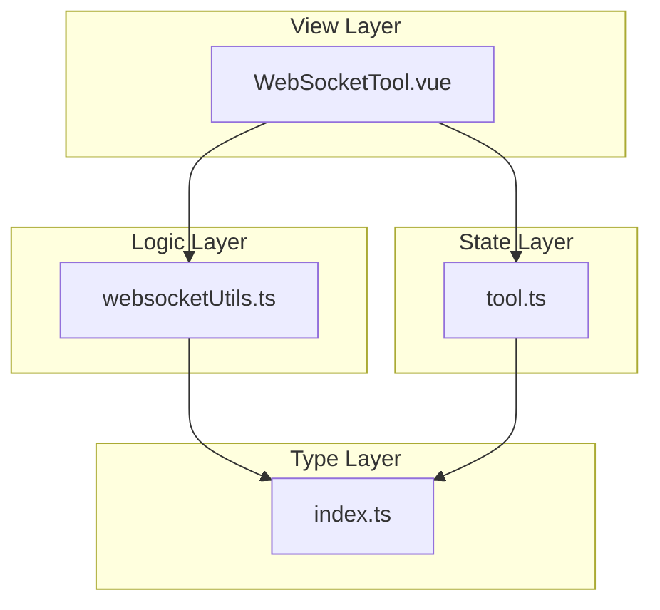
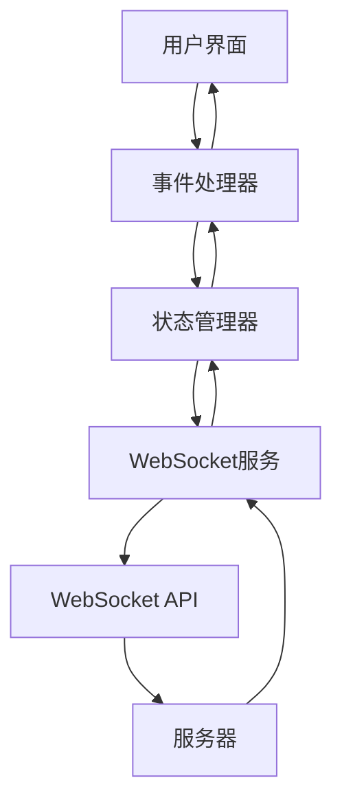
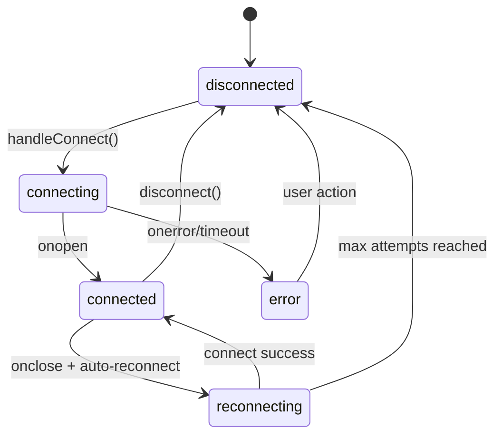
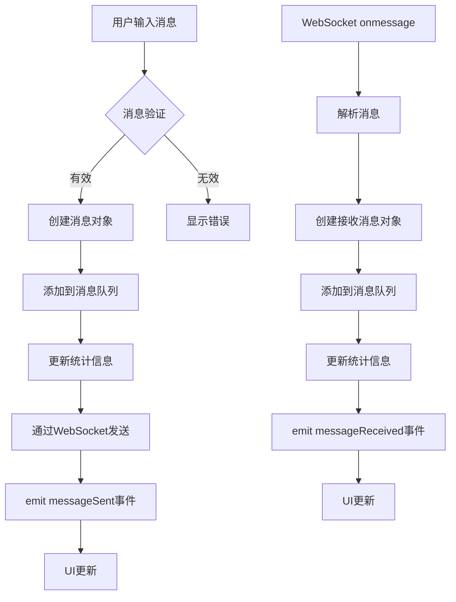
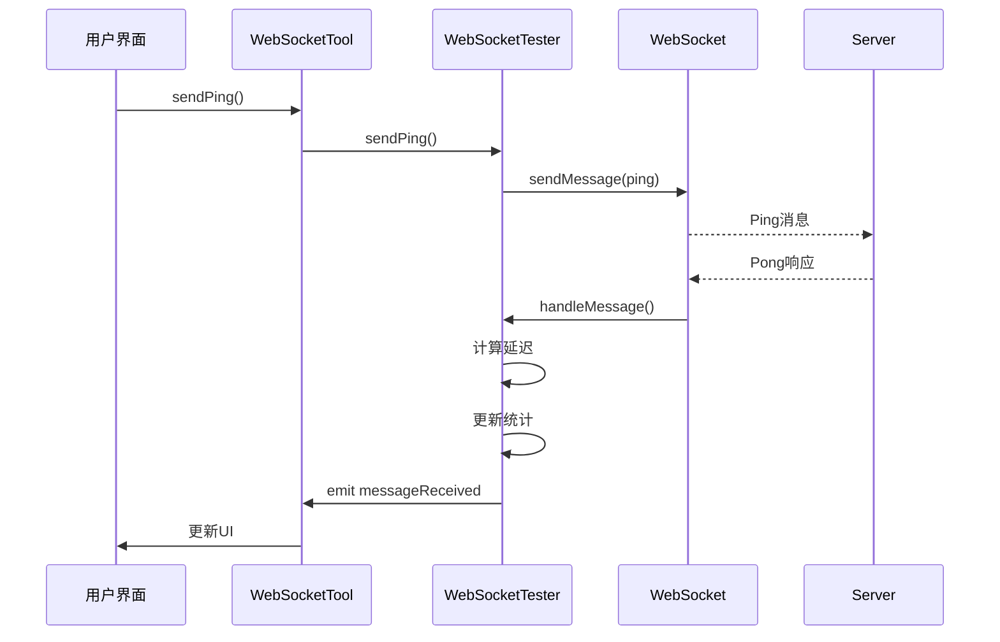
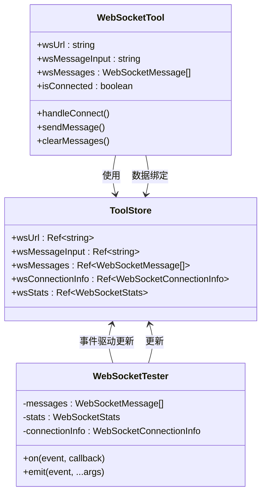

# WebSocket测试工具

<cite>
**Referenced Files in This Document **   
- [WebSocketTool.vue](file://src/views/communication/WebSocketTool.vue)
- [websocketUtils.ts](file://src/utils/websocketUtils.ts)
- [tool.ts](file://src/stores/tool.ts)
- [index.ts](file://src/types/index.ts)
</cite>

## 目录
1. [简介](#简介)
2. [项目结构](#项目结构)
3. [核心组件](#核心组件)
4. [架构概述](#架构概述)
5. [详细组件分析](#详细组件分析)
6. [依赖分析](#依赖分析)
7. [性能考虑](#性能考虑)
8. [故障排除指南](#故障排除指南)
9. [结论](#结论)

## 简介
WebSocket测试工具是一个功能完整的Vue.js应用组件，用于测试WebSocket连接、发送和接收消息以及监控连接性能。该工具提供了直观的用户界面，支持多种消息格式（文本、JSON、二进制），并实现了完善的连接状态管理、心跳保活机制和自动重连策略。

本文档深入解析`WebSocketTool.vue`组件的实现机制，重点阐述其连接状态机设计、基于缓冲队列的消息收发处理流程，以及心跳保活机制的定时检测与自动重连策略。同时，详细说明用户界面中URL输入、消息发送框、日志输出面板之间的响应式数据绑定逻辑，并结合`websocketUtils.ts`中的底层封装函数，展示如何通过WebSocket原生API实现异常捕获、二进制数据支持与跨域安全控制。

## 项目结构
WebSocket测试工具位于项目的通信模块中，与其他工具组件并列组织。该工具由视图层、业务逻辑层和类型定义层构成清晰的分层架构：

- **视图层**: `src/views/communication/WebSocketTool.vue` - 负责UI渲染和用户交互
- **业务逻辑层**: `src/utils/websocketUtils.ts` - 封装WebSocket核心功能
- **状态管理层**: `src/stores/tool.ts` - 管理全局共享状态
- **类型定义层**: `src/types/index.ts` - 定义所有相关接口和类型

这种分层设计确保了关注点分离，使代码更易于维护和扩展。

**Diagram sources**
- [WebSocketTool.vue](file://src/views/communication/WebSocketTool.vue)
- [websocketUtils.ts](file://src/utils/websocketUtils.ts)
- [tool.ts](file://src/stores/tool.ts)
- [index.ts](file://src/types/index.ts)

**Section sources**
- [WebSocketTool.vue](file://src/views/communication/WebSocketTool.vue)
- [websocketUtils.ts](file://src/utils/websocketUtils.ts)

## 核心组件
WebSocket测试工具的核心由三个主要部分组成：UI组件、状态管理器和WebSocket服务类。这些组件协同工作，提供完整的WebSocket测试功能。

UI组件负责呈现用户界面并与用户交互，状态管理器在不同组件间共享数据，而WebSocket服务类则处理底层连接逻辑。这种架构模式遵循MVVM（Model-View-ViewModel）设计原则，确保了数据流的单向性和可预测性。

**Section sources**
- [WebSocketTool.vue](file://src/views/communication/WebSocketTool.vue#L0-L799)
- [tool.ts](file://src/stores/tool.ts#L0-L368)
- [websocketUtils.ts](file://src/utils/websocketUtils.ts#L0-L541)

## 架构概述
WebSocket测试工具采用分层架构设计，各层职责分明且相互协作。顶层是Vue组件，负责UI展示和用户交互；中间层是Pinia状态管理器，协调数据流动；底层是WebSocket工具类，处理网络通信细节。

**Diagram sources**
- [WebSocketTool.vue](file://src/views/communication/WebSocketTool.vue)
- [tool.ts](file://src/stores/tool.ts)
- [websocketUtils.ts](file://src/utils/websocketUtils.ts)

## 详细组件分析

### 连接状态机设计
WebSocket测试工具实现了精细的状态机设计，准确反映WebSocket连接的生命周期。状态机包含五种状态：断开连接(disconnected)、连接中(connecting)、已连接(connected)、重连中(reconnecting)和错误(error)。

**Diagram sources**
- [websocketUtils.ts](file://src/utils/websocketUtils.ts#L12-L479)
- [WebSocketTool.vue](file://src/views/communication/WebSocketTool.vue#L0-L799)

#### 状态流转机制
状态流转通过事件驱动的方式实现。当用户点击"连接"按钮时，触发`handleConnect`方法，将状态从"disconnected"变为"connecting"。WebSocket原生API的`onopen`、`onclose`和`onerror`事件分别处理成功连接、正常关闭和错误情况，相应地更新状态。

自动重连机制在连接意外断开时启动。如果未达到最大重试次数且不是手动断开，则状态变为"reconnecting"，并在指定间隔后尝试重新连接。这种设计提高了工具的健壮性，能够在网络不稳定的情况下保持连接。

**Section sources**
- [websocketUtils.ts](file://src/utils/websocketUtils.ts#L12-L479)
- [WebSocketTool.vue](file://src/views/communication/WebSocketTool.vue#L0-L799)

### 消息收发处理流程
消息处理流程采用缓冲队列机制，确保消息的有序传递和高效处理。发送和接收的消息都被存储在环形缓冲区中，当达到最大容量时，最旧的消息会被自动清除。

**Diagram sources**
- [websocketUtils.ts](file://src/utils/websocketUtils.ts#L12-L479)
- [WebSocketTool.vue](file://src/views/communication/WebSocketTool.vue#L0-L799)

#### 缓冲队列实现
缓冲队列的实现考虑了内存管理和性能优化。消息队列的最大长度由配置决定，默认为1000条消息。当新消息加入导致队列超限时，使用数组的`splice`方法移除最旧的消息，保持队列大小在合理范围内。

每条消息都包含丰富的元数据，包括唯一ID、时间戳、大小、格式和类型（发送、接收、系统、错误）。这些信息不仅用于UI展示，还支持后续的分析和调试。

**Section sources**
- [websocketUtils.ts](file://src/utils/websocketUtils.ts#L12-L479)
- [index.ts](file://src/types/index.ts#L64-L74)

### 心跳保活与自动重连
心跳保活机制通过定期发送Ping消息来维持连接活跃，防止因长时间无数据传输而导致连接被中间代理或防火墙关闭。同时，该机制也用于测量网络延迟，提供连接质量的实时反馈。

**Diagram sources**
- [websocketUtils.ts](file://src/utils/websocketUtils.ts#L12-L479)
- [WebSocketTool.vue](file://src/views/communication/WebSocketTool.vue#L0-L799)

#### 心跳机制实现
心跳机制由`sendPing`方法和定时器共同实现。当连接建立后，启动一个间隔为`pingInterval`（默认5分钟）的定时器，定期调用`sendPing`方法。该方法发送包含时间戳的JSON格式Ping消息，当收到服务器返回的Pong响应时，计算往返时间并更新延迟统计。

自动重连策略在连接意外关闭时激活。通过`reconnectAttempts`和`reconnectInterval`配置参数，可以控制最大重试次数和重试间隔。重连过程完全自动化，无需用户干预，大大提升了用户体验。

**Section sources**
- [websocketUtils.ts](file://src/utils/websocketUtils.ts#L12-L479)
- [tool.ts](file://src/stores/tool.ts#L0-L368)

### 响应式数据绑定
用户界面元素与底层数据模型之间建立了完整的响应式绑定关系。Vue的响应式系统确保了数据变化能够自动反映到UI上，反之亦然。

**Diagram sources**
