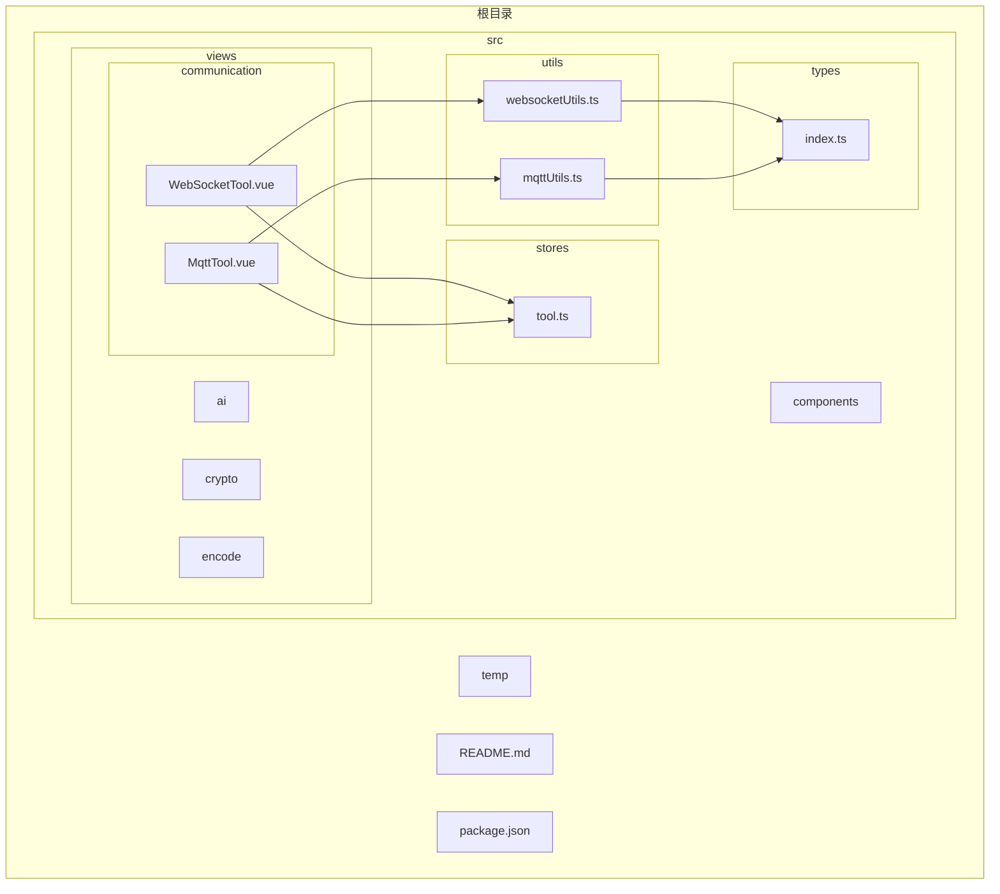
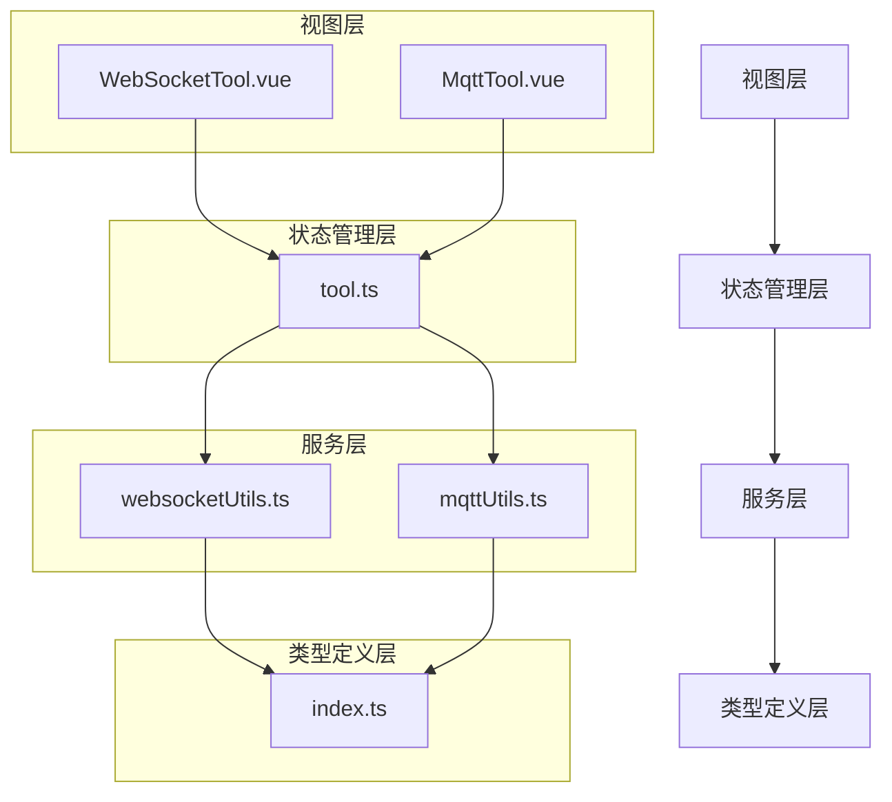
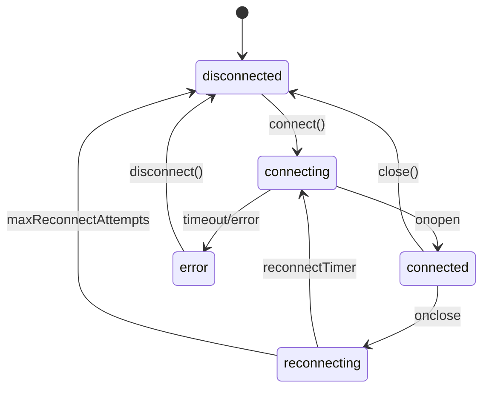
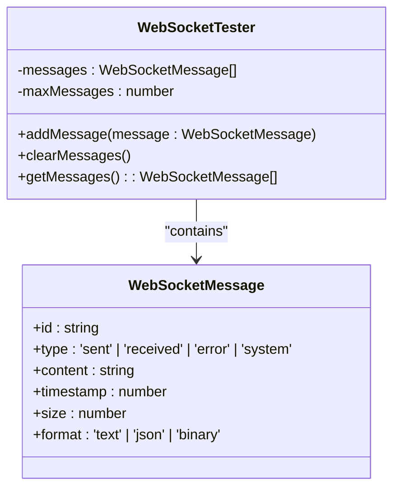
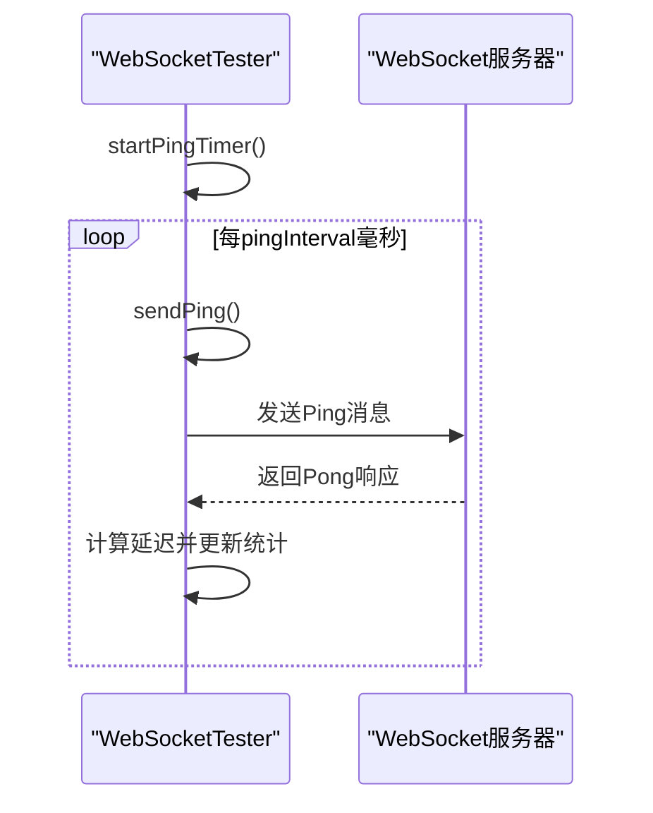

# 通信测试工具

<cite>
**Referenced Files in This Document **   
- [WebSocketTool.vue](file://src/views/communication/WebSocketTool.vue)
- [MqttTool.vue](file://src/views/communication/MqttTool.vue)
- [websocketUtils.ts](file://src/utils/websocketUtils.ts)
- [mqttUtils.ts](file://src/utils/mqttUtils.ts)
- [tool.ts](file://src/stores/tool.ts)
- [index.ts](file://src/types/index.ts)
</cite>

## 目录
1. [引言](#引言)
2. [项目结构](#项目结构)
3. [核心组件](#核心组件)
4. [架构概述](#架构概述)
5. [详细组件分析](#详细组件分析)
6. [依赖分析](#依赖分析)
7. [性能考虑](#性能考虑)
8. [故障排除指南](#故障排除指南)
9. [结论](#结论)

## 引言

通信测试工具是一款功能全面的开发辅助应用，专注于提供WebSocket和MQTT协议的测试能力。该工具为开发者提供了直观的界面来建立连接、发送消息、监控性能以及调试通信问题。通过集成实时消息日志面板和性能统计功能，用户可以深入分析通信行为并优化系统表现。

本技术文档旨在全面解析通信测试工具的技术实现，重点阐述WebSocket客户端和MQTT协议测试两大核心功能。文档将详细说明连接状态机管理、消息收发缓冲机制、心跳保活实现等关键技术点，并展示实时消息日志面板的设计思路与性能优化手段。此外，还将提供典型调试场景案例，帮助用户更好地理解和使用该工具。

## 项目结构

通信测试工具的项目结构遵循Vue.js标准组织方式，采用模块化设计以提高代码可维护性。主要目录包括`assets`（静态资源）、`components`（通用组件）、`router`（路由配置）、`stores`（状态管理）和`utils`（工具函数）。通信相关的核心功能位于`views/communication`目录下，包含WebSocket和MQTT两个独立的测试工具组件。



**Diagram sources **
- [WebSocketTool.vue](file://src/views/communication/WebSocketTool.vue)
- [MqttTool.vue](file://src/views/communication/MqttTool.vue)
- [websocketUtils.ts](file://src/utils/websocketUtils.ts)
- [mqttUtils.ts](file://src/utils/mqttUtils.ts)
- [tool.ts](file://src/stores/tool.ts)
- [index.ts](file://src/types/index.ts)

**Section sources**
- [WebSocketTool.vue](file://src/views/communication/WebSocketTool.vue)
- [MqttTool.vue](file://src/views/communication/MqttTool.vue)
- [websocketUtils.ts](file://src/utils/websocketUtils.ts)
- [mqttUtils.ts](file://src/utils/mqttUtils.ts)
- [tool.ts](file://src/stores/tool.ts)
- [index.ts](file://src/types/index.ts)

## 核心组件

通信测试工具的核心组件主要包括WebSocket测试工具和MQTT测试工具，分别对应`WebSocketTool.vue`和`MqttTool.vue`两个视图组件。这两个组件通过Pinia状态管理库共享全局状态，并利用独立的工具类进行底层通信处理。

WebSocket测试工具实现了完整的WebSocket客户端功能，支持连接管理、消息收发、性能监控和自动重连。它采用事件驱动架构，通过WebSocketTester类封装了所有底层操作，确保了高内聚低耦合的设计原则。

MQTT测试工具则提供了对MQTT协议的全面支持，包括broker连接参数配置、主题订阅模式匹配与QoS等级控制。基于`mqtt.js`库构建的MqttTester类负责处理所有MQTT相关的通信逻辑，保证了稳定可靠的连接体验。

两种工具都集成了实时消息日志面板，能够显示详细的通信历史记录，包括发送、接收、错误和系统消息。性能统计模块持续跟踪关键指标如消息数量、流量大小和延迟时间，为用户提供全面的通信质量评估。

**Section sources**
- [WebSocketTool.vue](file://src/views/communication/WebSocketTool.vue)
- [MqttTool.vue](file://src/views/communication/MqttTool.vue)
- [websocketUtils.ts](file://src/utils/websocketUtils.ts)
- [mqttUtils.ts](file://src/utils/mqttUtils.ts)

## 架构概述

通信测试工具采用分层架构设计，将UI展示、状态管理和业务逻辑分离，提高了代码的可维护性和可扩展性。整体架构分为四层：视图层、状态管理层、服务层和类型定义层。



**Diagram sources **
- [WebSocketTool.vue](file://src/views/communication/WebSocketTool.vue)
- [MqttTool.vue](file://src/views/communication/MqttTool.vue)
- [tool.ts](file://src/stores/tool.ts)
- [websocketUtils.ts](file://src/utils/websocketUtils.ts)
- [mqttUtils.ts](file://src/utils/mqttUtils.ts)
- [index.ts](file://src/types/index.ts)

在这一架构中，视图层负责用户界面的渲染和交互；状态管理层使用Pinia存储全局状态，实现跨组件的状态共享；服务层包含具体的业务逻辑实现，如WebSocket和MQTT通信处理；类型定义层提供统一的接口和类型声明，确保类型安全。

这种分层设计使得各部分职责清晰，便于团队协作开发和后期维护。同时，通过依赖注入的方式，降低了模块间的耦合度，增强了系统的灵活性和可测试性。

## 详细组件分析

### WebSocket工具分析

WebSocket工具的核心是WebSocketTester类，它实现了完整的WebSocket客户端功能。该类采用状态机模式管理连接生命周期，支持断线重连和心跳保活机制。

#### 连接状态机管理


**Diagram sources **
- [websocketUtils.ts](file://src/utils/websocketUtils.ts#L12-L479)

WebSocketTester通过`connectionInfo.state`属性维护当前连接状态，包括`disconnected`、`connecting`、`connected`、`reconnecting`和`error`五种状态。状态转换由WebSocket原生事件触发，如`onopen`、`onclose`和`onerror`。

当连接意外断开时，如果未达到最大重连次数且非手动断开，则进入`reconnecting`状态并启动重连定时器。每次重连尝试都会递增`reconnectCount`计数器，直到成功连接或达到最大重连次数。

#### 消息收发缓冲机制


**Diagram sources **
- [websocketUtils.ts](file://src/utils/websocketUtils.ts#L12-L479)
- [index.ts](file://src/types/index.ts#L76-L80)

WebSocketTester内部维护一个固定长度的消息缓冲区，用于存储最近的通信记录。通过`maxMessages`配置项限制缓冲区大小，默认为1000条消息。当新消息到达时，调用`addMessage()`方法将其添加到缓冲区末尾；若超出容量，则从头部移除最旧的消息。

这种FIFO（先进先出）策略有效防止了内存泄漏，同时保证了用户能看到最新的通信历史。`clearMessages()`方法允许清空整个缓冲区，而`getMessages()`返回当前所有消息的副本，避免直接暴露内部数据。

#### 心跳保活实现


**Diagram sources **
- [websocketUtils.ts](file://src/utils/websocketUtils.ts#L420-L435)

心跳保活通过`startPingTimer()`方法实现，该方法根据`pingInterval`配置创建一个定时器，周期性地发送Ping消息。Ping消息包含时间戳，服务器响应Pong消息后，客户端计算往返时间作为延迟指标。

延迟统计采用简单移动平均算法，动态更新`averageLatency`值。同时记录最小和最大延迟，为用户提供更全面的网络质量评估。此机制不仅用于检测连接活性，还能反映网络状况变化趋势。

**Section sources**
- [WebSocketTool.vue](file://src/views/communication/WebSocketTool.vue)
- [websocketUtils.ts](file://src/utils/websocketUtils.ts#L12-L479)
- [index.ts](file://src/types/index.ts#L76-L80)

### MQTT工具分析

MQTT工具的核心是MqttTester类，它封装了`mqtt.js`库的所有功能，提供了简洁易用的API接口。

#### Broker连接参数配置
```mermaid
classDiagram
    class MqttConnectionConfig {
        +brokerUrl: string
        +port: number