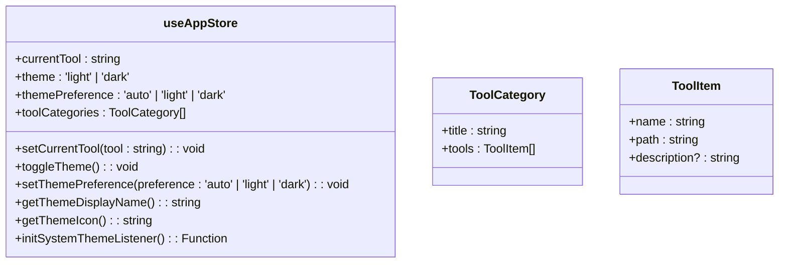
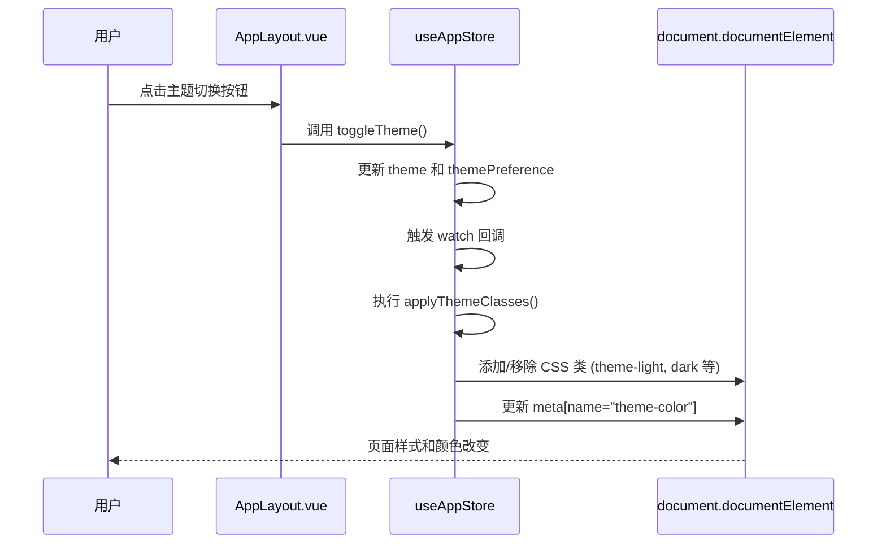

# AppStore - 全局应用状态管理

<cite>
**本文档引用文件**  
- [app.ts](file://src/stores/app.ts)
- [AppLayout.vue](file://src/components/AppLayout.vue)
- [main.ts](file://src/main.ts)
- [index.ts](file://src/types/index.ts)
</cite>

## 目录
1. [简介](#简介)
2. [核心状态结构与初始化](#核心状态结构与初始化)
3. [状态持久化机制](#状态持久化机制)
4. [主题切换与CSS类响应](#主题切换与css类响应)
5. [状态、动作与获取器实现](#状态动作与获取器实现)
6. [单一职责与共享机制](#单一职责与共享机制)

## 简介
AppStore 是本应用的核心全局状态容器，采用 Pinia 实现集中式状态管理。它负责维护应用级状态，如当前主题模式、活跃工具标识和用户偏好设置，并确保这些状态在页面刷新后能够恢复。通过 `localStorage` 实现关键状态的持久化存储，AppStore 在整个应用中作为单一数据源，被多个组件共享和订阅。

**Section sources**
- [app.ts](file://src/stores/app.ts#L0-L307)

## 核心状态结构与初始化
AppStore 定义了应用的核心状态变量，包括 `currentTool`（当前选中的工具）、`themePreference`（用户主题偏好）和 `theme`（实际主题）。这些状态在 `useAppStore` 函数中通过 `ref` 和 `reactive` 进行声明和初始化。`toolCategories` 存储了所有工具的分类和列表信息，为侧边栏导航提供数据支持。



**Diagram sources**
- [app.ts](file://src/stores/app.ts#L91-L305)
- [index.ts](file://src/types/index.ts#L9-L12)

**Section sources**
- [app.ts](file://src/stores/app.ts#L91-L305)

## 状态持久化机制
为了确保用户偏好在页面刷新后不丢失，AppStore 利用 `localStorage` 实现状态持久化。`THEME_STORAGE_KEY` 和 `THEME_PREFERENCE_KEY` 分别用于存储实际主题和用户主题偏好。`saveTheme` 和 `saveThemePreference` 函数封装了对 `localStorage` 的写入操作，并包含错误处理以应对隐私模式等限制。通过 `watch` 监听器，当 `themePreference` 或 `theme` 发生变化时，会自动触发相应的保存逻辑。

```mermaid
flowchart TD
A[状态变更] --> B{是否需要持久化?}
B --> |是| C[调用 saveTheme / saveThemePreference]
C --> D[尝试 localStorage.setItem]
D --> E{操作成功?}
E --> |是| F[状态已保存]
E --> |否| G[忽略错误 (如隐私模式)]
B --> |否| H[仅更新内存状态]
```

**Diagram sources**
- [app.ts](file://src/stores/app.ts#L38-L55)
- [app.ts](file://src/stores/app.ts#L280-L305)

**Section sources**
- [app.ts](file://src/stores/app.ts#L38-L55)
- [app.ts](file://src/stores/app.ts#L280-L305)

## 主题切换与CSS类响应
AppStore 通过 `applyThemeClasses` 函数将主题状态映射到 DOM 元素的 CSS 类上。该函数根据用户的 `themePreference` 和计算出的实际 `theme`，动态地向 `document.documentElement` 添加或移除 `theme-light`、`theme-dark` 和 `dark` 类。`AppLayout.vue` 组件通过 `useAppStore()` 订阅这些状态变化，从而实现界面样式的实时响应。此外，`updateThemeColor` 函数还负责更新 `<meta name="theme-color">` 标签，影响浏览器地址栏的颜色。



**Diagram sources**
- [app.ts](file://src/stores/app.ts#L57-L99)
- [AppLayout.vue](file://src/components/AppLayout.vue#L67)
- [main.ts](file://src/main.ts#L16)

**Section sources**
- [app.ts](file://src/stores/app.ts#L57-L99)
- [AppLayout.vue](file://src/components/AppLayout.vue#L67)

## 状态、动作与获取器实现
AppStore 提供了清晰的 API 来管理状态：
- **State (状态)**: `currentTool`, `theme`, `themePreference`, `toolCategories`。
- **Actions (动作)**: `setCurrentTool` 用于更新当前工具；`toggleTheme` 实现主题循环切换（auto -> light -> dark -> auto）；`setThemePreference` 设置用户偏好并同步更新实际主题。
- **Getters (获取器)**: `getThemeDisplayName` 返回当前主题偏好的中文名称（如“浅色模式”）；`getThemeIcon` 返回对应的主题图标（如 ☀️）。

这些功能都在 `defineStore` 的返回对象中定义，遵循了清晰的单一职责原则。

**Section sources**
- [app.ts](file://src/stores/app.ts#L210-L252)

## 单一职责与共享机制
AppStore 遵循单一职责原则，专注于管理应用的全局 UI 状态和配置。它通过 `export const useAppStore = defineStore(...)` 暴露一个可组合的函数。任何需要访问全局状态的组件都可以通过 `import { useAppStore } from '@/stores/app'` 导入并在 `setup` 函数中调用 `const appStore = useAppStore()` 来获取 store 实例，从而实现状态的跨组件共享。`main.ts` 文件在应用启动时调用 `appStore.initSystemThemeListener()` 来初始化系统主题监听器，确保开箱即用。

**Section sources**
- [app.ts](file://src/stores/app.ts#L91-L305)
- [main.ts](file://src/main.ts#L16)