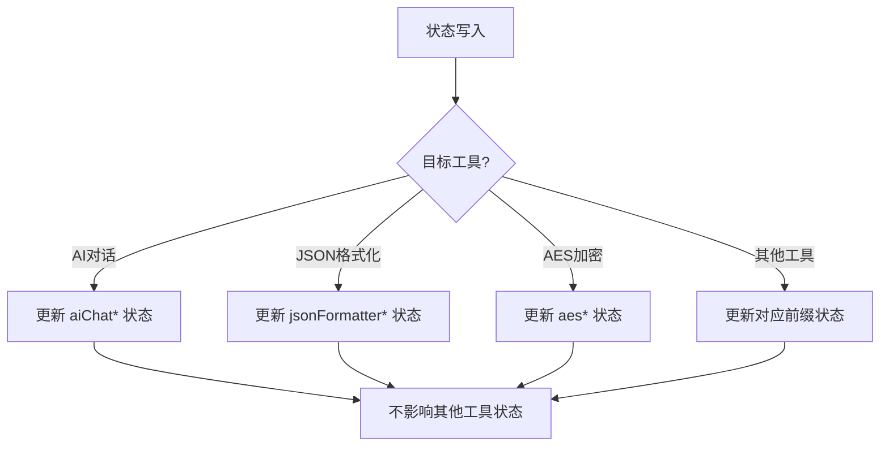
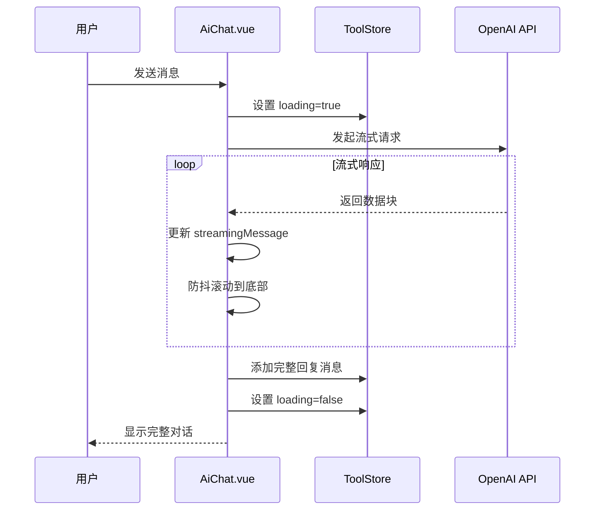

# ToolStore - 工具模块状态管理

<cite>
**Referenced Files in This Document**   
- [tool.ts](file://src/stores/tool.ts)
- [AiChat.vue](file://src/views/ai/AiChat.vue)
</cite>

## Table of Contents
1. [ToolStore 概述](#toolstore-概述)
2. [状态域组织与模块化命名空间](#状态域组织与模块化命名空间)
3. [状态隔离与数据污染防护](#状态隔离与数据污染防护)
4. [跨工具通用配置共享](#跨工具通用配置共享)
5. [视图组件中的状态读取](#视图组件中的状态读取)
6. [状态变更提交机制](#状态变更提交机制)
7. [状态重置最佳实践](#状态重置最佳实践)
8. [历史记录管理](#历史记录管理)
9. [异步操作处理](#异步操作处理)

## ToolStore 概述

ToolStore 是整个程序工具集的核心状态管理中心，采用 Pinia 状态管理库实现。它作为单一的全局状态仓库，集中管理所有独立工具模块的状态数据，为各视图组件提供统一的状态访问接口。

该状态管理器通过 `defineStore` 函数创建，命名为 'tool'，并导出为 `useToolStore` 函数供其他组件调用。其设计目标是解决多工具并存场景下的状态管理复杂性，确保各工具状态既相互隔离又可协调工作。

**Section sources**
- [tool.ts](file://src/stores/tool.ts#L1-L368)

## 状态域组织与模块化命名空间

ToolStore 采用清晰的模块化方式组织不同工具的状态域，每个工具拥有独立且语义明确的状态变量，形成天然的命名空间隔离。

### AI对话工具状态域
AI对话工具的状态域包含完整的对话生命周期管理所需的所有状态：
- `aiChatMessages`: 存储对话历史消息数组，每条消息包含ID、角色、内容和时间戳
- `aiChatInput`: 当前用户输入框的内容
- `aiChatConfig`: API连接配置，包括Base URL、API Key、模型选择等
- `aiChatLoading`: 对话加载状态标识
- `aiChatSystemPrompt`: 系统提示词配置
- `aiChatPersistent`: 配置持久化开关

### 数据格式化工具状态域
JSON相关工具的状态域专注于数据转换功能：
- `jsonFormatterInput` 和 `jsonFormatterOutput`: JSON格式化的输入输出
- `jsonToEntityInput` 和 `jsonToEntityOutput`: JSON转实体类的输入输出
- `jsonLanguage` 和 `jsonClassName`: 转换参数配置

### 加密算法参数状态域
加密工具的状态域包含各类加解密操作所需的参数：
- AES加解密：`aesInput`, `aesOutput`, `aesKey`, `aesIv`, `aesMode` 等
- RSA加解密：`rsaInput`, `rsaOutput`, `rsaPublicKey`, `rsaPrivateKey` 等
- 哈希算法：`shaInput`, `shaOutput`, `shaType`, `md5Input`, `md5Output` 等

### 其他工具状态域
还包括二维码生成、WebSocket通信、MQTT协议、URL编码等多种工具的状态管理，每个工具都有其专属的状态变量前缀，如 `qrCodeInput`, `wsUrl`, `mqttBrokerUrl` 等。

这种基于功能模块的命名空间划分，使得状态管理具有良好的可维护性和扩展性。

**Section sources**
- [tool.ts](file://src/stores/tool.ts#L14-L367)

## 状态隔离与数据污染防护

ToolStore 通过严格的命名约定和作用域隔离，有效避免了工具间的数据污染问题。

### 命名空间隔离
每个工具的状态变量都采用统一的前缀命名规则，如 `aiChat*`, `json*`, `aes*`, `rsa*` 等。这种命名模式创建了逻辑上的命名空间，即使在同一个 store 中也能保证状态的独立性。

### 引用类型隔离
对于复杂对象状态，ToolStore 使用 Vue 的 `ref` 函数进行响应式包装，确保每个状态变量都是独立的引用。例如，`aiChatConfig` 是一个包含多个配置项的对象，但它是作为一个整体被 ref 包装的，与其他工具的配置完全隔离。

### 清除操作的精确控制
`clearAll` 方法展示了精心设计的状态隔离策略。该方法有选择地清除特定工具的状态，而保留可能正在使用的状态（如WebSocket连接状态）。这种精细化的控制避免了不必要的状态重置，防止了因全局清除导致的功能中断。



**Diagram sources**
- [tool.ts](file://src/stores/tool.ts#L14-L367)

## 跨工具通用配置共享

尽管强调状态隔离，ToolStore 也支持必要的跨工具通用配置共享，体现了灵活性与实用性的平衡。

### 全局配置共享
虽然当前实现中各工具主要保持独立，但通过将 `useToolStore` 实例暴露给所有组件，任何组件都可以访问到全局状态。这为未来实现跨工具功能（如统一的主题设置、全局快捷键配置）提供了基础架构。

### 配置持久化机制
`aiChatPersistent` 状态展示了配置持久化的概念，这种机制可以扩展到其他工具，实现用户偏好的跨会话保存。通过 localStorage 等浏览器存储机制，可以在不污染状态管理的情况下实现配置的持久化。

## 视图组件中的状态读取

以 AiChat.vue 组件为例，演示了如何从 ToolStore 读取状态。

### 状态读取流程
1. 导入 `useToolStore` 函数
2. 在组件中调用 `useToolStore()` 获取 store 实例
3. 通过实例属性直接访问状态

### 具体应用示例
在 AiChat.vue 中，多种状态读取方式被灵活运用：

#### 模板中直接绑定
```vue
<div v-for="message in toolStore.aiChatMessages" :key="message.id">
```
直接在模板中遍历对话消息列表。

#### 表单双向绑定
```vue
<textarea v-model="toolStore.aiChatInput"></textarea>
```
使用 v-model 实现输入框与状态的双向绑定。

#### 条件渲染
```vue
<div v-if="toolStore.aiChatMessages.length === 0" class="empty-state">
```
根据消息数量判断是否显示空状态。

#### 计算属性依赖
```typescript
const canSend = computed(() => {
  return !toolStore.aiChatLoading && toolStore.aiChatInput.trim().length > 0
})
```
在计算属性中引用 store 状态，实现动态逻辑判断。

**Section sources**
- [AiChat.vue](file://src/views/ai/AiChat.vue#L242-L280)

## 状态变更提交机制

ToolStore 通过直接修改状态属性的方式实现状态变更，这是 Pinia 的核心特性之一。

### 直接状态修改
与 Vuex 的 mutation 概念不同，Pinia 允许直接修改状态。在 AiChat.vue 中可以看到：
```typescript
toolStore.aiChatMessages.push(userMessage)
toolStore.aiChatInput = ''
toolStore.aiChatLoading = true
```
这些直接赋值操作会自动触发响应式更新。

### 配置更新模式
对于对象类型的配置，采用解构赋值的方式更新：
```typescript
toolStore.aiChatConfig = { ...localConfig.value }
```
这种模式确保了不可变性原则，同时实现了状态更新。

### 批量操作
在发送消息时，连续修改多个相关状态：
```typescript
toolStore.aiChatMessages.push(userMessage)
toolStore.aiChatInput = ''
toolStore.aiChatLoading = true
```
这些操作会被 Vue 的响应式系统批量处理，确保视图更新的高效性。

**Section sources**
- [AiChat.vue](file://src/views/ai/AiChat.vue#L509-L514)

## 状态重置最佳实践

ToolStore 提供了 `clearAll` 方法作为状态重置的最佳实践范例。

### 选择性清除
该方法并非简单地将所有状态重置为空，而是有选择地清除特定工具的状态，同时保留可能正在使用的状态（如WebSocket连接状态）。

### 用户确认机制
在实际应用中，如 `clearChat` 方法所示，敏感操作需要用户确认：
```typescript
function clearChat() {
  if (confirm('确定要清空所有对话记录吗？')) {
    toolStore.aiChatMessages.splice(0)
  }
}
```
这种设计模式保护了用户数据，防止误操作。

### 局部重置
除了全局清除，还支持局部状态重置，如清除配置：
```typescript
function clearConfig() {
  // ... 重置配置
  toolStore.aiChatPersistent = false
}
```

**Section sources**
- [tool.ts](file://src/stores/tool.ts#L300-L367)
- [AiChat.vue](file://src/views/ai/AiChat.vue#L759-L763)

## 历史记录管理

AI对话工具展示了完整的历史记录管理机制。

### 消息存储结构
每条消息包含完整元数据：
- `id`: 唯一标识符
- `role`: 角色标识（用户或助手）
- `content`: 消息内容
- `timestamp`: 时间戳

### 内存限制策略
通过 `memoryMessages` 配置项实现记忆限制：
```typescript
const recentMessages = localConfig.value.memoryMessages > 0 
  ? allMessages.slice(-localConfig.value.memoryMessages) 
  : allMessages
```
这种滑动窗口机制控制了上下文长度，平衡了功能需求与性能消耗。

### 动态计算上下文
`calculateContextTokens` 函数实现了智能的上下文计算，考虑系统提示和最近消息，为API调用提供准确的token估算。

**Section sources**
- [tool.ts](file://src/stores/tool.ts#L14-L30)
- [AiChat.vue](file://src/views/ai/AiChat.vue#L714-L759)

## 异步操作处理

AI对话功能完整展示了异步操作的处理模式。

### 流式响应处理
通过 Fetch API 的流式响应处理大语言模型的逐字回复：
```typescript
const reader = response.body?.getReader()
// 逐块处理流式数据
while (true) {
  const { done, value } = await reader.read()
  // 处理每个数据块
}
```

### 加载状态管理
使用 `aiChatLoading` 状态控制UI的加载指示：
```typescript
toolStore.aiChatLoading = true
// ... 异步操作
toolStore.aiChatLoading = false
```

### 错误处理
完善的 try-catch 机制捕获网络请求异常，并向用户展示友好的错误信息。

### 防抖滚动优化
`debouncedScrollToBottom` 函数实现了防抖滚动，避免在快速接收消息时频繁触发滚动操作，提升用户体验。



**Diagram sources**
- [AiChat.vue](file://src/views/ai/AiChat.vue#L532-L576)