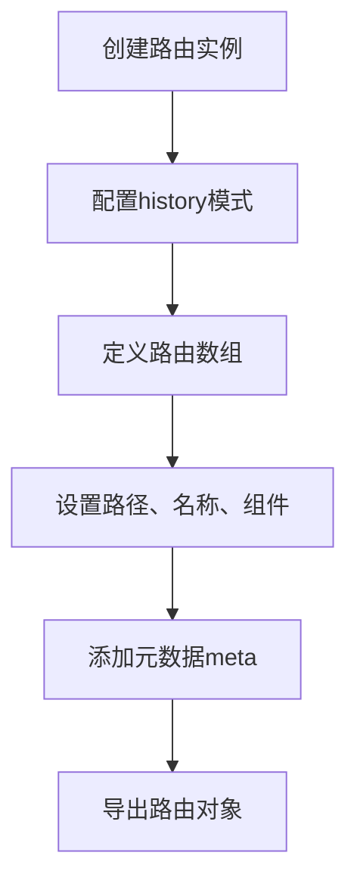
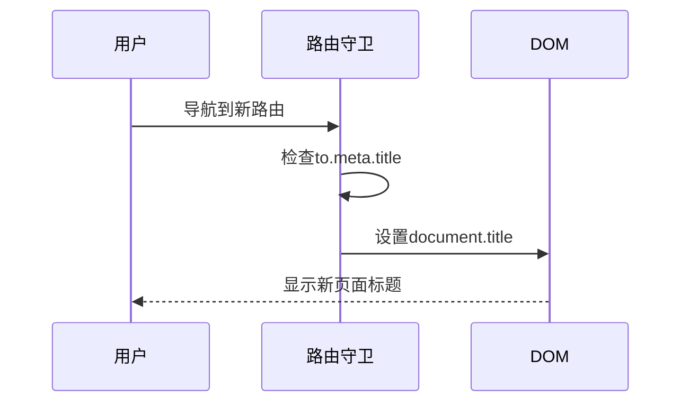
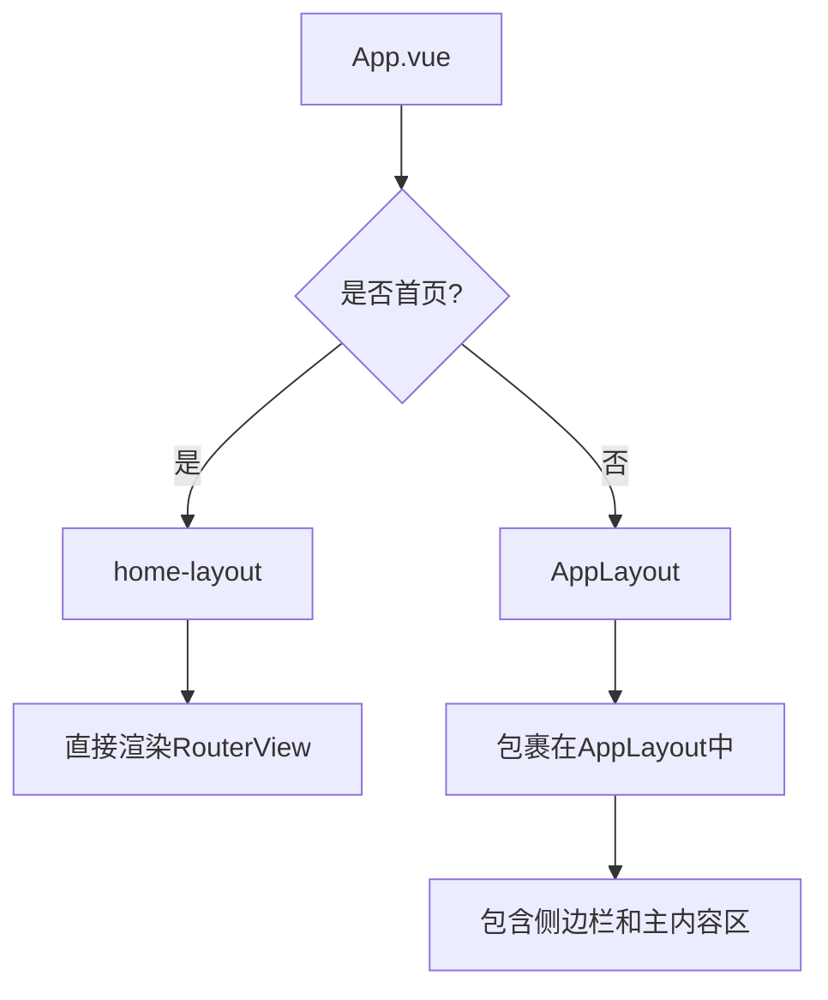
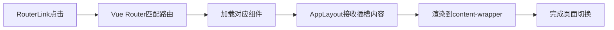

# 路由与导航系统

<cite>
**本文档引用的文件**
- [index.ts](file://src/router/index.ts)
- [AppLayout.vue](file://src/components/AppLayout.vue)
- [App.vue](file://src/App.vue)
- [app.ts](file://src/stores/app.ts)
</cite>

## 目录
1. [项目结构](#项目结构)
2. [路由配置解析](#路由配置解析)
3. [代码分割与懒加载机制](#代码分割与懒加载机制)
4. [路由守卫应用](#路由守卫应用)
5. [嵌套路由与布局](#嵌套路由与布局)
6. [路径别名与命名策略](#路径别名与命名策略)
7. [页面切换与组件渲染](#页面切换与组件渲染)
8. [完整路由映射表](#完整路由映射表)
9. [新工具页面注册规范](#新工具页面注册规范)

## 项目结构

本项目采用模块化组织方式，路由系统位于 `src/router/` 目录下，视图组件按功能分类存放在 `src/views/` 目录中。主要目录结构如下：

```
src/
├── views/                    # 所有视图组件
│   ├── ai/                   # AI相关工具
│   ├── json/                 # JSON处理工具
│   ├── crypto/               # 加解密工具
│   ├── encode/               # 编码转换工具
│   └── ...                   # 其他功能分类
├── router/                   # 路由配置
│   └── index.ts              # 主路由配置文件
└── components/               # 公共组件
    └── AppLayout.vue         # 主布局组件
```

**Section sources**
- [index.ts](file://src/router/index.ts)
- [AppLayout.vue](file://src/components/AppLayout.vue)

## 路由配置解析

路由配置文件 `src/router/index.ts` 定义了所有可用的导航路径。系统使用 Vue Router 的 history 模式，通过 `createWebHistory` 创建基于 HTML5 History API 的路由。



**Diagram sources**
- [index.ts](file://src/router/index.ts#L1-L10)

**Section sources**
- [index.ts](file://src/router/index.ts#L1-L20)

## 代码分割与懒加载机制

系统通过动态导入（`import()`）实现代码分割与懒加载，每个路由组件在首次访问时才被加载，有效减少初始包体积。

```typescript
component: () => import('../views/json/JsonFormatter.vue')
```

这种语法会创建一个异步组件，Webpack 将自动将该组件打包为独立的 chunk 文件，在用户导航到对应路由时按需加载，显著提升首屏加载性能。

**Section sources**
- [index.ts](file://src/router/index.ts#L15-L20)

## 路由守卫应用

系统实现了全局前置路由守卫 `beforeEach`，用于在路由切换时动态更新页面标题：



**Diagram sources**
- [index.ts](file://src/router/index.ts#L140-L148)

**Section sources**
- [index.ts](file://src/router/index.ts#L140-L148)

## 嵌套路由与布局

系统采用条件布局策略，在 `src/App.vue` 中根据当前路径决定使用何种布局：



**Diagram sources**
- [App.vue](file://src/App.vue#L1-L35)

**Section sources**
- [App.vue](file://src/App.vue#L1-L35)

## 路径别名与命名策略

路由系统采用了统一的命名约定：
- **路径格式**: 使用连字符分隔的语义化路径（如 `/json-formatter`）
- **名称属性**: 与路径保持一致的小写命名（如 `json-formatter`）
- **分类层级**: 通过路径前缀体现功能分类（如 `/crypto/`, `/encode/`）

这种命名策略确保了路由的一致性和可维护性。

**Section sources**
- [index.ts](file://src/router/index.ts#L10-L140)

## 页面切换与组件渲染

`AppLayout.vue` 组件中的 `<slot />` 接收来自父组件的内容，结合 `RouterView` 实现页面切换：



侧边栏导航通过 Pinia store 中的 `toolCategories` 数据驱动，确保路由路径与菜单项同步。

**Diagram sources**
- [AppLayout.vue](file://src/components/AppLayout.vue#L36-L86)
- [app.ts](file://src/stores/app.ts#L91-L305)

**Section sources**
- [AppLayout.vue](file://src/components/AppLayout.vue#L36-L86)
- [app.ts](file://src/stores/app.ts#L91-L305)

## 完整路由映射表

| 路径 | 名称 | 视图组件 | 功能描述 |
|------|------|----------|----------|
| / | home | Home.vue | 首页 |
| /ai-chat | ai-chat | AiChat.vue | AI对话助手 |
| /timestamp-tool | timestamp-tool | TimestampTool.vue | 时间戳工具 |
| /json-formatter | json-formatter | JsonFormatter.vue | JSON格式化 |
| /json-to-entity | json-to-entity | JsonToEntity.vue | JSON转实体类 |
| /entity-to-mock | entity-to-mock | EntityToMock.vue | 实体类Mock数据 |
| /yaml | yaml | YamlTools.vue | YAML工具 |
| /url-encoder | url-encoder | UrlEncoder.vue | URL编解码 |
| /base64-encoder | base64-encoder | Base64Encoder.vue | Base64编解码 |
| /base64-file-converter | base64-file-converter | Base64FileConverter.vue | Base64文件转换 |
| /byte-converter | byte-converter | ByteConverter.vue | Byte字节转换 |
| /regex | regex | RegexTools.vue | 正则表达式测试 |
| /jwt-decoder | jwt-decoder | JwtDecoder.vue | JWT解析工具 |
| /md5-hasher | md5-hasher | MD5Tool.vue | MD5哈希工具 |
| /sha-hasher | sha-hasher | SHAHasher.vue | SHA哈希工具 |
| /aes-crypto | aes-crypto | AESCrypto.vue | AES加解密工具 |
| /rsa-crypto | rsa-crypto | RSACrypto.vue | RSA加解密工具 |
| /qrcode-tool | qrcode-tool | QRCodeTool.vue | 二维码工具 |
| /websocket-tool | websocket-tool | WebSocketTool.vue | WebSocket测试工具 |
| /mqtt-tool | mqtt-tool | MqttTool.vue | MQTT测试工具 |
| /color-palette | color-palette | ColorPalette.vue | 调色盘 |

**Section sources**
- [index.ts](file://src/router/index.ts#L10-L140)
- [app.ts](file://src/stores/app.ts#L91-L305)

## 新工具页面注册规范

添加新工具页面时，请遵循以下规范：

1. **文件位置**: 将新组件放入对应的功能目录下（如 `src/views/crypto/`）
2. **命名约定**: 使用 PascalCase 命名组件文件（如 `NewTool.vue`）
3. **路由注册**: 在 `src/router/index.ts` 中添加路由配置：
   ```typescript
   {
     path: '/new-tool',
     name: 'new-tool',
     component: () => import('../views/category/NewTool.vue'),
     meta: { title: '工具名称 - 开发者工具集' },
   }
   ```
4. **菜单集成**: 在 `src/stores/app.ts` 的对应分类中添加工具信息
5. **路径规则**: 使用小写字母和连字符的语义化路径
6. **分类层级**: 根据功能选择合适的分类目录存放组件

遵循此规范可确保路由系统的整洁性和可维护性。

**Section sources**
- [index.ts](file://src/router/index.ts#L10-L140)
- [app.ts](file://src/stores/app.ts#L91-L305)