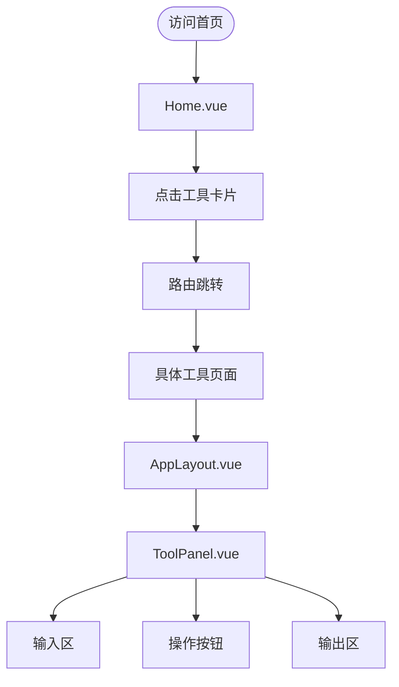

# 项目概述

<cite>
**本文档引用文件**  
- [main.ts](file://src/main.ts)
- [App.vue](file://src/App.vue)
- [index.ts](file://src/router/index.ts)
- [app.ts](file://src/stores/app.ts)
- [tool.ts](file://src/stores/tool.ts)
- [ToolPanel.vue](file://src/components/ToolPanel.vue)
- [AppLayout.vue](file://src/components/AppLayout.vue)
- [Home.vue](file://src/views/Home.vue)
- [JwtDecoder.vue](file://src/views/jwt/JwtDecoder.vue)
- [WebSocketTool.vue](file://src/views/communication/WebSocketTool.vue)
- [websocketUtils.ts](file://src/utils/websocketUtils.ts)
- [cryptoUtils.ts](file://src/utils/cryptoUtils.ts)
- [index.ts](file://src/types/index.ts)
</cite>

## 目录
1. [项目简介](#项目简介)
2. [技术架构与运行机制](#技术架构与运行机制)
3. [用户体验流程](#用户体验流程)
4. [核心目录结构与职责](#核心目录结构与职责)
5. [系统可扩展性设计](#系统可扩展性设计)
6. [实际使用示例](#实际使用示例)

## 项目简介

“开发者工具集”是一个集成化的在线工具平台，专为开发人员打造，旨在提供一站式、高频使用的开发辅助功能。该项目由AI全程辅助开发完成，展示了现代前端工程中AI的强大能力。平台涵盖AI对话、数据格式转换（JSON/YAML/Base64）、加解密（AES/RSA/MD5/SHA）、通信测试（WebSocket/MQTT）、时间戳处理、JWT解析、二维码生成与识别等多种实用工具。

所有工具均在浏览器本地执行，确保用户数据安全，不上传至服务器，并支持PWA离线使用。界面采用现代化设计，支持深色/浅色主题切换，具备响应式布局，完美适配桌面端和移动端设备。通过Vue 3 + TypeScript + Vite的技术栈，项目实现了高性能、高可维护性的单页应用（SPA）体验。

**Section sources**
- [README.md](file://README.md#L0-L521)

## 技术架构与运行机制

本项目采用当前主流的前端技术栈构建，其核心架构基于 **Vue 3** 的组合式API（Composition API），结合 **TypeScript** 提供严格的类型检查，确保代码质量和开发效率。构建工具选用 **Vite**，利用其基于ES模块的快速冷启动和热更新特性，极大提升了开发体验。

作为单页应用（SPA），项目的运行机制依赖于客户端路由。`src/router/index.ts` 文件定义了所有页面的路由规则，通过 `vue-router` 实现无刷新的页面跳转。应用入口 `src/main.ts` 负责创建Vue实例，挂载Pinia状态管理器和路由器，并初始化全局主题监听器。

```mermaid
graph TB
A[main.ts] --> B[createApp(App)]
A --> C[createPinia()]
A --> D[use(router)]
A --> E[use(pinia)]
A --> F[app.mount('#app')]
F --> G[App.vue]
G --> H[RouterView]
H --> I[具体视图组件]
```

**Diagram sources**
- [main.ts](file://src/main.ts#L1-L20)
- [App.vue](file://src/App.vue#L1-L35)

## 用户体验流程

用户的典型使用流程始于首页 (`Home.vue`)。首页以精美的3D卡片形式展示所有可用工具，按类别分组，如“AI工具”、“JSON工具”、“加解密工具”等。用户点击任一工具卡片后，将通过路由导航至对应的工具页面。

除首页外，其他所有工具页面均采用统一的布局组件 `AppLayout.vue`。该组件包含一个侧边栏，其中列出了所有工具分类和链接，方便用户在不同工具间快速切换。主内容区域则由 `ToolPanel.vue` 组件构成，它为每个工具提供了标准化的标题、描述和操作空间，保证了整体UI的一致性和专业感。

当用户访问某个具体工具时，例如JWT解析器，`ToolPanel` 会显示该工具的名称和功能描述，下方是具体的交互界面，通常包括输入区、操作按钮和输出区。这种清晰、一致的交互模式降低了用户的学习成本，提升了使用效率。



**Diagram sources**
- [Home.vue](file://src/views/Home.vue#L1-L661)
- [AppLayout.vue](file://src/components/AppLayout.vue#L1-L544)
- [ToolPanel.vue](file://src/components/ToolPanel.vue#L1-L195)

**Section sources**
- [Home.vue](file://src/views/Home.vue#L1-L661)
- [AppLayout.vue](file://src/components/AppLayout.vue#L1-L544)
- [ToolPanel.vue](file://src/components/ToolPanel.vue#L1-L195)

## 核心目录结构与职责

项目遵循清晰的模块化目录结构，便于维护和扩展。

- **`src/assets`**: 存放静态资源，如CSS样式文件。
- **`src/components`**: 公共UI组件库。`AppLayout.vue` 定义了主应用布局，`ToolPanel.vue` 是所有工具页面的通用面板，`CodeEditor.vue` 集成了Monaco Editor提供专业的代码编辑体验。
- **`src/router`**: 路由配置中心，`index.ts` 文件集中管理所有页面的路由。
- **`src/stores`**: 状态管理中心，使用Pinia实现。`app.ts` 管理应用级状态（如当前选中的工具、主题偏好、工具分类列表），`tool.ts` 管理各个工具的具体数据状态（如输入框内容、配置选项）。
- **`src/types`**: TypeScript类型定义。`index.ts` 文件导出所有工具相关的接口，如 `ToolCategory`, `WebSocketMessage`, `MqttConnectionConfig` 等，增强了代码的健壮性。
- **`src/utils`**: 工具函数集合。包含了各种业务逻辑的纯函数，如 `jsonToEntity.ts` (JSON转实体类), `yamlUtils.ts` (YAML处理), `cryptoUtils.ts` (加密解密算法) 等，实现了功能的复用。
- **`src/views`**: 页面视图组件。每个子目录对应一类工具，如 `ai/`, `crypto/`, `communication/` 等，内部的 `.vue` 文件即为具体的工具页面。
- **`src/App.vue` 和 `src/main.ts`**: 应用的根组件和入口文件。

这种分层架构使得各部分职责分明，有利于团队协作和长期维护。

**Section sources**
- [README.md](file://README.md#L287-L328)

## 系统可扩展性设计

本项目在设计上充分考虑了未来的可扩展性。

首先，工具的组织方式是模块化的。新增一个工具只需在 `src/views` 下创建新的目录和Vue组件，然后在 `src/router/index.ts` 中添加一条路由记录即可。同时，在 `src/stores/app.ts` 的 `toolCategories` 数组中注册该工具，使其自动出现在侧边栏和首页中。这种低耦合的设计使得功能扩展变得非常简单。

其次，状态管理采用了分层的Pinia Store机制。`app.ts` 负责全局状态，而 `tool.ts` 则集中管理所有工具的数据。这种分离避免了状态的过度集中，使得每个Store的职责更加单一。未来如果某个工具的状态变得异常复杂，可以轻松地将其拆分为独立的Store模块。

此外，`src/utils` 目录下的工具函数都是独立的、可复用的模块。例如，`websocketUtils.ts` 封装了一个完整的 `WebSocketTester` 类，提供了连接、发送、接收、统计等完整功能，不仅被WebSocket工具页面使用，也为未来可能的其他网络工具提供了基础。

```mermaid
classDiagram
class WebSocketTester {
-ws : WebSocket
-config : WebSocketConnectionConfig
-stats : WebSocketStats
-messages : WebSocketMessage[]
+connect(url, protocols) : Promise~void~
+disconnect() : void
+sendMessage(content, format) : void
+sendPing() : void
+clearMessages() : void
+on(event, callback) : void
+off(event, callback) : void
+destroy() : void
}
class WebSocketTool {
-store : useToolStore()
-wsTester : WebSocketTester
+handleConnect() : void
+sendMessage() : void
+clearMessages() : void
}
WebSocketTool --> WebSocketTester : "uses"
WebSocketTester --> "WebSocketConnectionConfig" : "has"
WebSocketTester --> "WebSocketStats" : "has"
WebSocketTester --> "WebSocketMessage" : "has"
```

**Diagram sources**
- [websocketUtils.ts](file://src/utils/websocketUtils.ts#L1-L541)
- [WebSocketTool.vue](file://src/views/communication/WebSocketTool.vue#L1-L799)

**Section sources**
- [app.ts](file://src/stores/app.ts#L1-L306)
- [tool.ts](file://src/stores/tool.ts#L1-L368)
- [index.ts](file://src/types/index.ts#L1-L154)

## 实际使用示例

### 快速访问JWT解析器

1.  打开应用首页。
2.  在“其他工具”分类下，找到并点击“JWT解析工具”卡片。
3.  或者，直接在浏览器地址栏输入 `https://www.flobby.top/tools/jwt-decoder` 访问。
4.  在输入框中粘贴您的JWT令牌。
5.  点击“解析JWT”按钮，即可在下方看到Header、Payload和Signature的详细信息，包括对时间戳字段的友好化显示。

### 启动WebSocket测试连接

1.  导航至“通信测试” -> “WebSocket测试工具”。
2.  在“连接配置”区域的URL输入框中，填入目标WebSocket服务的地址（如 `ws://localhost:8080`）。
3.  点击“连接”按钮。连接成功后，状态指示灯变为绿色，“已连接”。
4.  在“发送消息”区域，选择消息格式（文本/JSON/二进制），输入消息内容。
5.  点击“发送消息”按钮或使用快捷键 `Ctrl+Enter` 发送。
6.  消息历史区域会实时显示发送和接收到的消息，性能统计面板会更新流量和延迟数据。

这些示例体现了平台操作的直观性和高效性。

**Section sources**
- [JwtDecoder.vue](file://src/views/jwt/JwtDecoder.vue#L1-L535)
- [WebSocketTool.vue](file://src/views/communication/WebSocketTool.vue#L1-L799)